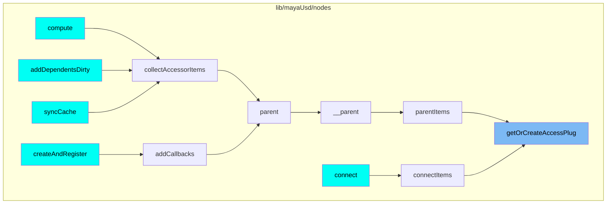
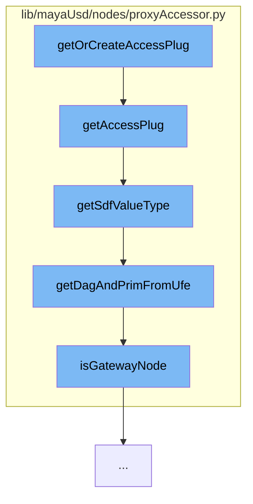

This document will cover the process of accessing or creating a plug in the Maya USD plugin, which includes:

1. Getting or creating an access plug
2. Getting the Sdf value type
3. Getting the Dag and Prim from UFE
4. Checking if a node is a gateway node.

## Where is this flow used?

The flow starts with the function `getOrCreateAccessPlug`. It is called from multiple entry points as represented in the following diagram: (Note - these are only some of the entry points of this flow)



## The flow itself



<SwmSnippet path="/lib/mayaUsd/nodes/proxyAccessor.py" line="174">

---

# Getting or Creating an Access Plug

The function `getOrCreateAccessPlug` is the entry point for this flow. It checks if an access plug exists for the given UFE object and USD attribute name. If it doesn't exist, it returns None.

```python
def getAccessPlug(ufeObject, usdAttrName, sdfValueType=Sdf.ValueTypeNames.Matrix4d):
    selectedDagPath, selectedPrimPath = getDagAndPrimFromUfe(ufeObject)

    if selectedDagPath == None or selectedPrimPath == None:
        return None

    sdfPath = Sdf.Path(selectedPrimPath)

    if not usdAttrName == "":
        sdfPath = getPrimAttrPath(sdfPath, selectedPrimPath, usdAttrName)
        sdfValueType = getSdfValueType(ufeObject,usdAttrName)

    plugNameValueAttr = getAccessPlugName(sdfPath)

    exists = cmds.attributeQuery(plugNameValueAttr, node=selectedDagPath, exists=True)
    if not exists:
        return None

    return plugNameValueAttr
```

---

</SwmSnippet>

<SwmSnippet path="/lib/mayaUsd/nodes/proxyAccessor.py" line="146">

---

# Getting the Sdf Value Type

The function `getSdfValueType` is called within `getOrCreateAccessPlug` to determine the type of the USD attribute. This is necessary to correctly handle the attribute's value.

```python
def getSdfValueType(ufeObject, usdAttrName):
    # 'combinedVisibility' is not a usd prim property, so we define its type manually
    if usdAttrName == 'combinedVisibility':
        return Sdf.ValueTypeNames.Int

    proxyDagPath, usdPrimPath = getDagAndPrimFromUfe(ufeObject)

    stage = mayaUsdLib.GetPrim(proxyDagPath).GetStage()

    primPath = Sdf.Path(usdPrimPath)
    prim = stage.GetPrimAtPath(primPath)

    usdAttribute = prim.GetAttribute(usdAttrName)
    if usdAttribute.IsDefined():
        return usdAttribute.GetTypeName()
    else:
        return None
```

---

</SwmSnippet>

<SwmSnippet path="/lib/mayaUsd/nodes/proxyAccessor.py" line="44">

---

# Getting the Dag and Prim from UFE

The function `getDagAndPrimFromUfe` is used to extract the Dag path and Prim path from the UFE object. These paths are used to locate the USD attribute in the scene graph.

```python
def getDagAndPrimFromUfe(ufeObject):
    if ufeObject == None:
        return None, None

    segmentCount = len(ufeObject.path().segments)
    if segmentCount == 0:
        return None, None

    dagPath = str(ufeObject.path().segments[0])[6:]

    if segmentCount == 1:
        if isGatewayNode(dagPath):
            return dagPath, Sdf.Path.absoluteRootPath
        else:
            return dagPath, None

    primPath = str(ufeObject.path().segments[1])

    return dagPath, primPath
```

---

</SwmSnippet>

<SwmSnippet path="/lib/mayaUsd/nodes/proxyAccessor.py" line="34">

---

# Checking if a Node is a Gateway Node

The function `isGatewayNode` is used to check if a node is a gateway node. This is used to determine if the Dag path should be returned as the root path.

```python
def isGatewayNode(dagPath):
    baseProxyShape = 'mayaUsdProxyShapeBase'
    return baseProxyShape in cmds.nodeType(dagPath, inherited=True)
```

---

</SwmSnippet>

&nbsp;

_This is an auto-generated document by Swimm AI 🌊 and has not yet been verified by a human_

<SwmMeta version="3.0.0" repo-id="Z2l0aHViJTNBJTNBbWF5YS11c2QlM0ElM0FnaWxhZG5hdm90" repo-name="maya-usd"><sup>Powered by [Swimm](/)</sup></SwmMeta>
