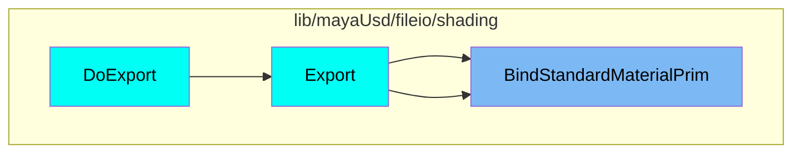
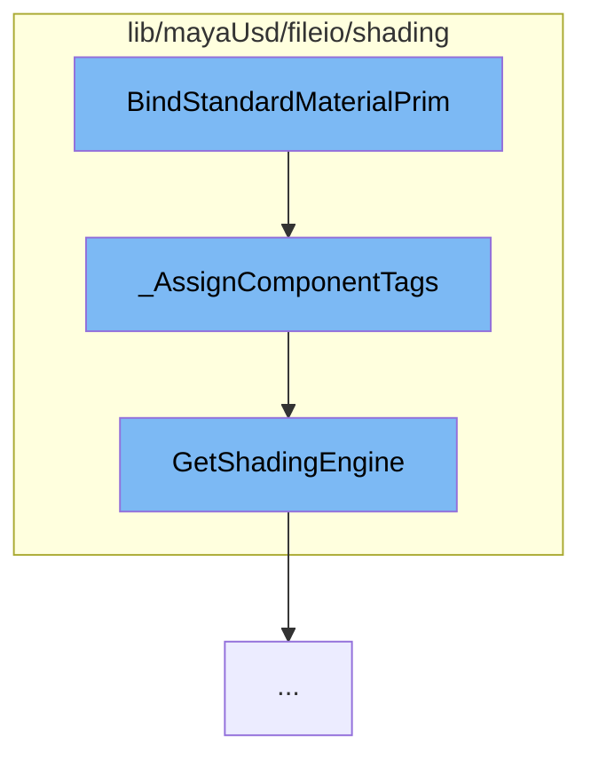

This document will cover the process of binding standard material primitives in the Maya-USD plugin. The process includes:

1. Assigning component tags
2. Retrieving the shading engine

## Where is this flow used?

The flow starts with the function `BindStandardMaterialPrim`. It is called from multiple entry points as represented in the following diagram:



## The flow itself



<SwmSnippet path="/lib/mayaUsd/fileio/shading/shadingModeExporterContext.cpp" line="844">

---

# Assigning Component Tags

The function `_AssignComponentTags` is used to assign component tags to a set of faces. It checks if there are any component tags that have roundtrip data that covers this set of faces. If there are, it assigns them to those tags and returns the remaining unhandled faces. If there are no component tags or the set of faces is empty, it returns the original set of faces.

```c++
/// We might have one or more component tags that have roundtrip data that covers this
// set of faces. Assign them to those tags and return the remaining unhandled faces.
VtIntArray _AssignComponentTags(
    const UsdMayaShadingModeExportContext* ctx,
    const UsdShadeMaterial&                materialToBind,
    const MObjectHandle&                   geomHandle,
    const std::vector<UsdGeomSubset>&      currentGeomSubsets,
    const VtIntArray&                      faceIndices,
    SdfPathSet* const                      boundPrimPaths)
{
    if (currentGeomSubsets.empty() || faceIndices.empty() || !geomHandle.isValid()) {
        return faceIndices;
    }

    JsValue info;
    if (UsdMayaMeshReadUtils::getGeomSubsetInfo(geomHandle.object(), info) && info) {
        auto subsetInfoDict = info.GetJsObject();

        std::set<VtIntArray::ElementType> faceSet, handledSet;
        faceSet.insert(faceIndices.cbegin(), faceIndices.cend());

```

---

</SwmSnippet>

<SwmSnippet path="/lib/mayaUsd/fileio/shading/shadingModeExporterContext.h" line="42">

---

# Retrieving the Shading Engine

The function `GetShadingEngine` is used to retrieve the shading engine. This shading engine is used in the `_AssignComponentTags` function to get the shading group UUID.

```c
public:
    void    SetShadingEngine(const MObject& shadingEngine) { _shadingEngine = shadingEngine; }
    MObject GetShadingEngine() const { return _shadingEngine; }

    const UsdStageRefPtr& GetUsdStage() const { return _stage; }
```

---

</SwmSnippet>

&nbsp;

_This is an auto-generated document by Swimm AI 🌊 and has not yet been verified by a human_

<SwmMeta version="3.0.0" repo-id="Z2l0aHViJTNBJTNBbWF5YS11c2QlM0ElM0FnaWxhZG5hdm90" repo-name="maya-usd"><sup>Powered by [Swimm](/)</sup></SwmMeta>
