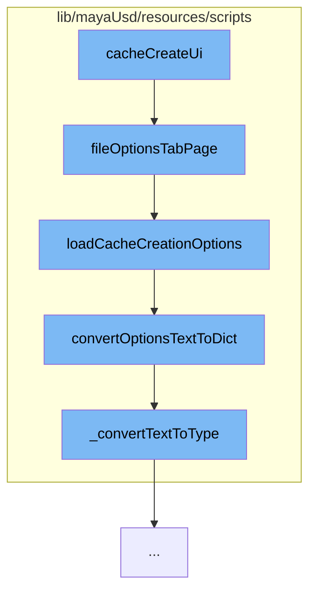

This document will cover the process of creating a user interface for cache creation in Maya USD, which includes:

1. Creating the UI element of the file dialog options tab.
2. Loading the cache-to-USD options from the option var and returning them as a dictionary.
3. Converting options from text with column-separated key/value pairs to a dict.
4. Ensuring the value has the correct expected type by converting it.



<SwmSnippet path="/lib/mayaUsd/resources/scripts/mayaUsdCacheMayaReference.py" line="173">

---

# Creating the UI element of the file dialog options tab

The function `fileOptionsTabPage` is used to create the UI element of the file dialog options tab. It sets up the layout and populates it with the necessary fields and options.

```python
# Adapted from fileOptions.mel:fileOptionsTabPage().
def fileOptionsTabPage(tabLayout):
    """
    Creates the UI element of the file dialog options tab.
    """
    mayaRefUtils.pushOptionsUITemplate()

    cmds.setParent(tabLayout)

    # See fileOptions.mel:fileOptionsTabPage() comments.  Contrary to that
    # code, we are not keeping 'optionsBoxForm' as a global MEL variable.  We
    # assume that we don't need to reference this directly to hide UI
    # temporarily.
    optBoxForm = cmds.formLayout('optionsBoxForm')

    topFrame = cmds.frameLayout(
        'optionsBoxFrame', collapsable=False, labelVisible=False,
        marginWidth=10, borderVisible=False)
    cmds.formLayout(optBoxForm, edit=True, af=[(topFrame, 'left', 0),
                    (topFrame, 'top', 0), (topFrame, 'right', 0),
                    (topFrame, 'bottom', 0)])
```

---

</SwmSnippet>

<SwmSnippet path="/lib/mayaUsd/resources/scripts/cacheToUsd.py" line="83">

---

# Loading the cache-to-USD options

The function `loadCacheCreationOptions` is used to load the cache-to-USD options from the option var and return them as a dictionary.

```python
def loadCacheCreationOptions():
    """
    Loads the cache-to-USD options from the option var and returns them as a dictionary.
    """
    optionsText = mayaUsdOptions.getOptionsText(_getVarName(), getDefaultExportOptions())
    return mayaUsdOptions.convertOptionsTextToDict(optionsText, getDefaultCacheCreationOptions())
```

---

</SwmSnippet>

<SwmSnippet path="/lib/mayaUsd/resources/scripts/mayaUsdOptions.py" line="123">

---

# Converting options from text to a dict

The function `convertOptionsTextToDict` is used to convert options from text with column-separated key/value pairs to a dict.

```python
def convertOptionsTextToDict(optionsText, defaultOptionsDict):
    """
    Converts options from text with column-separated key/value pairs to a dict.
    """
    # Initialize the result dict with the defaults, making a copy to avoid modifying
    # the given default dict.
    optionsDict = defaultOptionsDict.copy()

    # Parse each key/value pair that were extracted by splitting at columns.
    for opt in optionsText.split(';'):
        if '=' in opt:
            key, value = opt.split('=')
        else:
            key, value = opt, ""

        # Use the guide values to try to convert the saved value to the correct type.
        if key in optionsDict:
            optionsDict[key] = _convertTextToType(value, optionsDict[key])
        else:
            optionsDict[key] = value

```

---

</SwmSnippet>

<SwmSnippet path="/lib/mayaUsd/resources/scripts/mayaUsdOptions.py" line="147">

---

# Ensuring the value has the correct expected type

The function `_convertTextToType` is used to ensure the value has the correct expected type by converting it. If the value cannot be converted, it uses the default value.

```python
def _convertTextToType(valueToConvert, defaultValue, desiredType=None):
    """
    Ensure the value has the correct expected type by converting it.
    Since the values are extracted from text, it is normal that they
    don't have the expected type right away.

    If the value cannot be converted, use the default value. This could
    happen if the optionVar got corrupted, for example from corrupted user
    prefs.
    """
    if not desiredType:
        desiredType = type(defaultValue)
    if isinstance(valueToConvert, desiredType):
        return valueToConvert
    # Try to convert the value to the desired type.
    # We only support a subset of types to avoid problems,
    # for example trying to convert text to a list would
    # create a list of single letters.
    try:
        textConvertibleTypes = [str, int, float]
        if desiredType in textConvertibleTypes:
```

---

</SwmSnippet>

&nbsp;

_This is an auto-generated document by Swimm AI 🌊 and has not yet been verified by a human_

<SwmMeta version="3.0.0" repo-id="Z2l0aHViJTNBJTNBbWF5YS11c2QlM0ElM0FnaWxhZG5hdm90" repo-name="maya-usd"><sup>Powered by [Swimm](/)</sup></SwmMeta>
