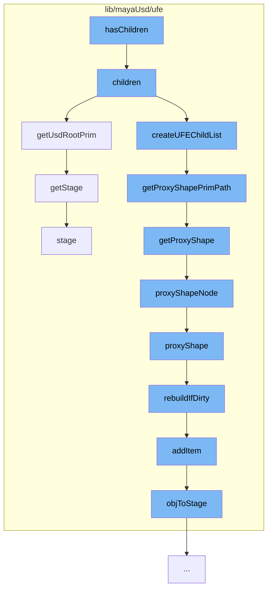

This document will explain the code flow starting with the function `hasChildren::lib/mayaUsd/ufe/ProxyShapeHierarchy.cpp`. The flow involves the following steps:

1.  Checking if a node has children
2.  Retrieving the children of a node
3.  Getting the USD root prim
4.  Creating a UFE child list
5.  Getting the proxy shape prim path
6.  Getting the proxy shape
7.  Getting the proxy shape node
8.  Rebuilding the stage map if it's dirty
9.  Adding an item to the stage map
10. Getting the stage.



<SwmSnippet path="/lib/mayaUsd/ufe/ProxyShapeHierarchy.cpp" line="172">

---

# Checking if a node has children

The `hasChildren` function initiates the flow. It checks if a node has children by calling the `children` function.

```c++
Ufe::SceneItemList ProxyShapeHierarchy::children() const
{
    // Return children of the USD root.
    const UsdPrim& rootPrim = getUsdRootPrim();
    if (!rootPrim.IsValid())
        return Ufe::SceneItemList();

    return createUFEChildList(getUSDFilteredChildren(rootPrim), true /*filterInactive*/);
}
```

---

</SwmSnippet>

<SwmSnippet path="/lib/mayaUsd/ufe/ProxyShapeHierarchy.cpp" line="172">

---

# Retrieving the children of a node

The `children` function retrieves the children of a node. It calls `getUsdRootPrim` to get the USD root prim and `createUFEChildList` to create a UFE child list.

```c++
Ufe::SceneItemList ProxyShapeHierarchy::children() const
{
    // Return children of the USD root.
    const UsdPrim& rootPrim = getUsdRootPrim();
    if (!rootPrim.IsValid())
        return Ufe::SceneItemList();

    return createUFEChildList(getUSDFilteredChildren(rootPrim), true /*filterInactive*/);
}
```

---

</SwmSnippet>

<SwmSnippet path="/lib/mayaUsd/ufe/ProxyShapeHierarchy.cpp" line="110">

---

# Getting the USD root prim

The `getUsdRootPrim` function retrieves the USD root prim. If the USD root prim is not valid, it calls `getStage` to get the stage.

```c++
const UsdPrim& ProxyShapeHierarchy::getUsdRootPrim() const
{
    if (!_usdRootPrim.IsValid()) {
        // FIXME During AL_usdmaya_ProxyShapeImport, nodes (both Maya
        // and USD) are being added (e.g. the proxy shape itself), but
        // there is no stage yet, and there is no way to detect that a
        // proxy shape import command is under way.  PPT, 28-Sep-2018.
        UsdStageWeakPtr stage = getStage(_item->path());
        if (stage) {
            _usdRootPrim = stage->GetPseudoRoot();
        }
    }
    return _usdRootPrim;
}
```

---

</SwmSnippet>

<SwmSnippet path="/lib/mayaUsd/ufe/ProxyShapeHierarchy.cpp" line="172">

---

# Creating a UFE child list

The `createUFEChildList` function creates a UFE child list. It calls `getProxyShapePrimPath` to get the proxy shape prim path.

```c++
Ufe::SceneItemList ProxyShapeHierarchy::children() const
{
    // Return children of the USD root.
    const UsdPrim& rootPrim = getUsdRootPrim();
    if (!rootPrim.IsValid())
        return Ufe::SceneItemList();

    return createUFEChildList(getUSDFilteredChildren(rootPrim), true /*filterInactive*/);
}
```

---

</SwmSnippet>

<SwmSnippet path="/lib/mayaUsd/ufe/Utils.cpp" line="273">

---

# Getting the proxy shape prim path

The `getProxyShapePrimPath` function retrieves the proxy shape prim path. It calls `getProxyShape` to get the proxy shape.

```c++
SdfPath getProxyShapePrimPath(const Ufe::Path& path)
{
    if (auto proxyShape = getProxyShape(path)) {
        return proxyShape->getPrimPath();
    }
    // No proxy shape.  Just default to the empty path.
    return SdfPath::AbsoluteRootPath();
}
```

---

</SwmSnippet>

<SwmSnippet path="/lib/mayaUsd/ufe/Utils.cpp" line="263">

---

# Getting the proxy shape

The `getProxyShape` function retrieves the proxy shape. It calls `proxyShapeNode` to get the proxy shape node.

```c++
MayaUsdProxyShapeBase* getProxyShape(const Ufe::Path& path)
{
    // Path should not be empty.
    if (!TF_VERIFY(!path.empty())) {
        return nullptr;
    }

    return UsdStageMap::getInstance().proxyShapeNode(path);
}
```

---

</SwmSnippet>

<SwmSnippet path="/lib/mayaUsd/ufe/UsdStageMap.cpp" line="235">

---

# Getting the proxy shape node

The `proxyShapeNode` function retrieves the proxy shape node. It calls `proxyShape` to get the proxy shape.

```c++
MayaUsdProxyShapeBase* UsdStageMap::proxyShapeNode(const Ufe::Path& path, bool rebuildCacheIfNeeded)
{
    auto obj = proxyShape(path, rebuildCacheIfNeeded);
    if (obj.isNull()) {
        return nullptr;
    }

    return objToProxyShape(obj);
}
```

---

</SwmSnippet>

<SwmSnippet path="/lib/mayaUsd/ufe/UsdStageMap.cpp" line="286">

---

# Rebuilding the stage map if it's dirty

The `rebuildIfDirty` function rebuilds the stage map if it's dirty. It calls `addItem` to add an item to the stage map.

```c++
bool UsdStageMap::rebuildIfDirty()
{
    if (!_dirty)
        return false;

    for (const auto& psn : ProxyShapeHandler::getAllNames()) {
        addItem(toPath(psn));
    }

    TF_DEBUG(MAYAUSD_STAGEMAP)
        .Msg("Rebuilt stage map, found %d proxy shapes\n", int(_stageToObject.size()));
    _dirty = false;
    return true;
}
```

---

</SwmSnippet>

<SwmSnippet path="/lib/mayaUsd/ufe/UsdStageMap.cpp" line="133">

---

# Adding an item to the stage map

The `addItem` function adds an item to the stage map. It calls `objToStage` to convert the object to a stage.

```c++
void UsdStageMap::addItem(const Ufe::Path& path)
{
    // We expect a path to the proxy shape node, therefore a single segment.
    auto nbSegments = path.nbSegments();
    if (nbSegments != 1) {
        TF_CODING_ERROR(
            "A proxy shape node path can have only one segment, path '%s' has %lu",
            path.string().c_str(),
            nbSegments);
        return;
    }

    // Convert the UFE path to an MObjectHandle.
    auto proxyShape = nameLookup(path);
    if (!proxyShape.isValid()) {
        return;
    }

    // If a proxy shape doesn't yet have a stage, don't add it.
    // We will add it later, when the stage is initialized
    auto obj = proxyShape.object();
```

---

</SwmSnippet>

<SwmSnippet path="/lib/mayaUsd/ufe/Utils.cpp" line="90">

---

# Getting the stage

The `getStage` function retrieves the stage. It calls `stage` to get the stage.

```c++
//------------------------------------------------------------------------------
// Utility Functions
//------------------------------------------------------------------------------

UsdStageWeakPtr getStage(const Ufe::Path& path, bool rebuildCacheIfNeeded)
{
    return UsdStageMap::getInstance().stage(path, rebuildCacheIfNeeded);
}
```

---

</SwmSnippet>

&nbsp;

_This is an auto-generated document by Swimm AI 🌊 and has not yet been verified by a human_

<SwmMeta version="3.0.0" repo-id="Z2l0aHViJTNBJTNBbWF5YS11c2QlM0ElM0FnaWxhZG5hdm90" repo-name="maya-usd"><sup>Powered by [Swimm](/)</sup></SwmMeta>
