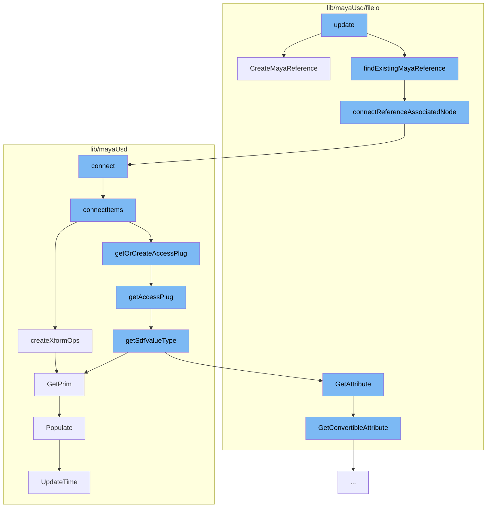

This document will cover the process of creating a Maya reference in the Maya-USD plugin, which includes:

1. Creating a new Maya reference
2. Connecting the reference to an associated node
3. Connecting items in the proxy accessor
4. Creating transform operations for the USD object
5. Getting or creating an access plug for the USD attribute
6. Getting the Sdf value type of the USD attribute
7. Getting the prim from the scene index
8. Populating the scene index
9. Updating the time in the scene index.



<SwmSnippet path="/lib/mayaUsd/fileio/translators/translatorMayaReference.cpp" line="294">

---

# Creating a new Maya reference

The function `CreateMayaReference` is used to create a new Maya reference. It takes a USD prim and creates a new reference node for it in Maya. The reference node is initially unloaded and is given a unique name to ensure that edits to each copy of an asset are preserved separately.

```c++
MStatus UsdMayaTranslatorMayaReference::CreateMayaReference(
    const UsdPrim& prim,
    MObject&       parent,
    MString&       mayaReferencePath,
    MString&       rigNamespaceM,
    bool           mergeNamespacesOnClash)
{
    TF_DEBUG(PXRUSDMAYA_TRANSLATORS)
        .Msg("MayaReferenceLogic::CreateMayaReference prim=%s\n", prim.GetPath().GetText());
    MStatus status;

    MFnDagNode parentDag(parent, &status);
    CHECK_MSTATUS_AND_RETURN_IT(status);

    // Need to create new reference (initially unloaded).
    //
    // When we create reference nodes, we want a separate reference node to be
    // created for each proxy, even proxies that are duplicates of each other.
    // This is to ensure that edits to each copy of an asset are preserved
    // separately.  To this end, we must create a unique name for each proxy's
    // reference node.  Simply including namespace information (if any) from the
```

---

</SwmSnippet>

<SwmSnippet path="/lib/mayaUsd/fileio/translators/translatorMayaReference.cpp" line="413">

---

# Connecting the reference to an associated node

The function `connectReferenceAssociatedNode` is used to connect the reference node to an associated node. This ensures that the referenced nodes end up under the prim transform when loaded.

```c++
static MStatus connectReferenceAssociatedNode(MFnDagNode& dagNode, MFnReference& refNode)
{
    MPlug srcPlug(dagNode.object(), getMessageAttr());
    /*
       From the Maya docs:
       > This message attribute is used to connect specific nodes that may be
       > associated with this reference (i.e. group, locator, annotation). Use of
       > this connection indicates that the associated nodes have the same
       > lifespan as the reference, and will be deleted along with the reference
       > if it is removed.
     */
    MStatus      result;
    MPlug        destArrayPlug(refNode.object(), getAssociatedNodeAttr());
    bool         wasConnected = false;
    unsigned int destIndex = 0;
    result = connectedOrFirstAvailableIndex(srcPlug, destArrayPlug, destIndex, wasConnected);
    CHECK_MSTATUS_AND_RETURN_IT(result);
    if (wasConnected) {
        // If it's already connected, abort, we're done
        return result;
    }
```

---

</SwmSnippet>

<SwmSnippet path="/lib/mayaUsd/nodes/proxyAccessor.py" line="326">

---

# Connecting items in the proxy accessor

The function `connect` is used to connect items in the proxy accessor. It takes a list of attributes to connect and connects them between two selected objects.

```python
def connect(attrToConnect=[('translate','xformOp:translate'), ('rotate','xformOp:rotateXYZ')]):
    ufeSelection = ufe.GlobalSelection.get()
    if len(ufeSelection) != 2:
        print('Must select exactly two objects to connect')
        return

    ufeSelectionIter = iter(ufeSelection)

    ufeObjectSrc = next(ufeSelectionIter)
    ufeObjectDst = next(ufeSelectionIter)

    ufeSelectionIter = None

    connectItems(ufeObjectSrc,ufeObjectDst,attrToConnect)
```

---

</SwmSnippet>

<SwmSnippet path="/lib/mayaUsd/nodes/proxyAccessor.py" line="89">

---

# Creating transform operations for the USD object

The function `createXformOps` is used to create transform operations for the USD object. It creates a common transform API for the USD prim and sets the default values for the transform operations.

```python
def createXformOps(ufeObject):
    selDag, selPrim = getDagAndPrimFromUfe(ufeObject)
    stage = mayaUsdLib.GetPrim(selDag).GetStage()

    primPath = Sdf.Path(selPrim)
    prim = stage.GetPrimAtPath(primPath)

    xformAPI = UsdGeom.XformCommonAPI(prim)
    t, p, r, s, pInv = xformAPI.CreateXformOps(
                UsdGeom.XformCommonAPI.OpTranslate,
                UsdGeom.XformCommonAPI.OpRotate,
                UsdGeom.XformCommonAPI.OpScale)

    if not t.GetAttr().HasAuthoredValue():
        t.GetAttr().Set(Gf.Vec3d(0,0,0))
    if not r.GetAttr().HasAuthoredValue():
        r.GetAttr().Set(Gf.Vec3f(0,0,0))
    if not s.GetAttr().HasAuthoredValue():
        s.GetAttr().Set(Gf.Vec3f(1,1,1))
```

---

</SwmSnippet>

<SwmSnippet path="/lib/mayaUsd/nodes/proxyAccessor.py" line="174">

---

# Getting or creating an access plug for the USD attribute

The function `getAccessPlug` is used to get or create an access plug for the USD attribute. If the attribute does not exist, it returns None.

```python
def getAccessPlug(ufeObject, usdAttrName, sdfValueType=Sdf.ValueTypeNames.Matrix4d):
    selectedDagPath, selectedPrimPath = getDagAndPrimFromUfe(ufeObject)

    if selectedDagPath == None or selectedPrimPath == None:
        return None

    sdfPath = Sdf.Path(selectedPrimPath)

    if not usdAttrName == "":
        sdfPath = getPrimAttrPath(sdfPath, selectedPrimPath, usdAttrName)
        sdfValueType = getSdfValueType(ufeObject,usdAttrName)

    plugNameValueAttr = getAccessPlugName(sdfPath)

    exists = cmds.attributeQuery(plugNameValueAttr, node=selectedDagPath, exists=True)
    if not exists:
        return None

    return plugNameValueAttr
```

---

</SwmSnippet>

<SwmSnippet path="/lib/mayaUsd/nodes/proxyAccessor.py" line="146">

---

# Getting the Sdf value type of the USD attribute

The function `getSdfValueType` is used to get the Sdf value type of the USD attribute. If the attribute is not defined, it returns None.

```python
def getSdfValueType(ufeObject, usdAttrName):
    # 'combinedVisibility' is not a usd prim property, so we define its type manually
    if usdAttrName == 'combinedVisibility':
        return Sdf.ValueTypeNames.Int

    proxyDagPath, usdPrimPath = getDagAndPrimFromUfe(ufeObject)

    stage = mayaUsdLib.GetPrim(proxyDagPath).GetStage()

    primPath = Sdf.Path(usdPrimPath)
    prim = stage.GetPrimAtPath(primPath)

    usdAttribute = prim.GetAttribute(usdAttrName)
    if usdAttribute.IsDefined():
        return usdAttribute.GetTypeName()
    else:
        return None
```

---

</SwmSnippet>

<SwmSnippet path="/lib/mayaUsd/sceneIndex/proxyShapeSceneIndexPlugin.cpp" line="381">

---

# Getting the prim from the scene index

The method `GetPrim` is used to get the prim from the scene index. If the prim path is a specific workaround path, it populates the scene index.

```c++
// satisfying HdSceneIndexBase
HdSceneIndexPrim MayaUsdProxyShapeSceneIndex::GetPrim(const SdfPath& primPath) const
{
    // MAYA-126790 TODO: properly resolve missing PrimsAdded notification issue
    // https://github.com/PixarAnimationStudios/USD/blob/dev/pxr/imaging/hd/sceneIndex.cpp#L38
    // Pixar has discussed adding a missing overridable virtual function when an observer is
    // registered For now GetPrim called with magic string populates the scene index
    static SdfPath maya126790Workaround("maya126790Workaround");
    if (primPath == maya126790Workaround) {
        auto nonConstThis = const_cast<MayaUsdProxyShapeSceneIndex*>(this);
        nonConstThis->Populate();
        return HdSceneIndexPrim();
    }

    return _GetInputSceneIndex()->GetPrim(primPath);
}
```

---

</SwmSnippet>

<SwmSnippet path="/lib/mayaUsd/sceneIndex/proxyShapeSceneIndexPlugin.cpp" line="356">

---

# Populating the scene index

The method `Populate` is used to populate the scene index. If the scene index is not populated, it sets the stage and populates the scene index.

```c++
void MayaUsdProxyShapeSceneIndex::Populate()
{
    if (!_populated) {
        auto stage = _proxyShape->getUsdStage();
        if (TF_VERIFY(stage, "Unable to fetch a valid USDStage.")) {
            _usdImagingStageSceneIndex->SetStage(stage);
            // Check whether the pseudo-root has children
            if (!stage->GetPseudoRoot().GetChildren().empty())
            // MAYA-126641: Upon first call to MayaUsdProxyShapeBase::getUsdStage, the stage may be
            // empty. Do not mark the scene index as _populated, until stage is full. This is taken
            // care of inside MayaUsdProxyShapeSceneIndex::_StageSet callback.
            {
#if PXR_VERSION < 2305
                // In most recent USD, Populate is called from within SetStage, so there is no need
                // to callsites to call it explicitly
                _usdImagingStageSceneIndex->Populate();
#endif
                _populated = true;
            }
            // Set the initial time
            UpdateTime();
```

---

</SwmSnippet>

<SwmSnippet path="/lib/mayaUsd/sceneIndex/proxyShapeSceneIndexPlugin.cpp" line="325">

---

# Updating the time in the scene index

The method `UpdateTime` is used to update the time in the scene index. It sets the time in the USD imaging stage scene index to the time in the proxy shape.

```c++
void MayaUsdProxyShapeSceneIndex::UpdateTime()
{
    if (_usdImagingStageSceneIndex && _proxyShape && isProxyShapeValid()) {
        _usdImagingStageSceneIndex->SetTime(_proxyShape->getTime());
    }
}
```

---

</SwmSnippet>

&nbsp;

_This is an auto-generated document by Swimm AI 🌊 and has not yet been verified by a human_

<SwmMeta version="3.0.0" repo-id="Z2l0aHViJTNBJTNBbWF5YS11c2QlM0ElM0FnaWxhZG5hdm90" repo-name="maya-usd"><sup>Powered by [Swimm](/)</sup></SwmMeta>
