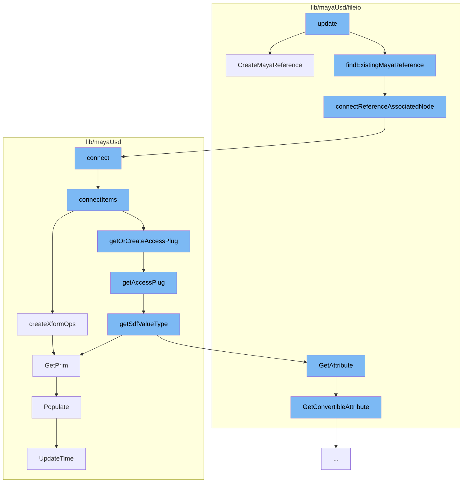

This document will cover the process of creating a Maya reference in the Maya-USD plugin, which includes:

1. Creating a new Maya reference
2. Connecting the reference to an associated node
3. Connecting items in the scene
4. Creating transform operations for the items
5. Getting or creating access plugs for the items
6. Getting the Sdf value type for the items
7. Getting the prim and attribute for the items
8. Populating the scene index
9. Updating the time in the scene index.



<SwmSnippet path="/lib/mayaUsd/fileio/translators/translatorMayaReference.cpp" line="294">

---

# Creating a new Maya reference

The function `CreateMayaReference` is used to create a new Maya reference. It takes in parameters such as the UsdPrim, parent object, Maya reference path, and namespace. It then creates a new reference node for each proxy, ensuring that edits to each copy of an asset are preserved separately.

```c++
MStatus UsdMayaTranslatorMayaReference::CreateMayaReference(
    const UsdPrim& prim,
    MObject&       parent,
    MString&       mayaReferencePath,
    MString&       rigNamespaceM,
    bool           mergeNamespacesOnClash)
{
    TF_DEBUG(PXRUSDMAYA_TRANSLATORS)
        .Msg("MayaReferenceLogic::CreateMayaReference prim=%s\n", prim.GetPath().GetText());
    MStatus status;

    MFnDagNode parentDag(parent, &status);
    CHECK_MSTATUS_AND_RETURN_IT(status);

    // Need to create new reference (initially unloaded).
    //
    // When we create reference nodes, we want a separate reference node to be
    // created for each proxy, even proxies that are duplicates of each other.
    // This is to ensure that edits to each copy of an asset are preserved
    // separately.  To this end, we must create a unique name for each proxy's
    // reference node.  Simply including namespace information (if any) from the
```

---

</SwmSnippet>

<SwmSnippet path="/lib/mayaUsd/fileio/translators/translatorMayaReference.cpp" line="413">

---

# Connecting the reference to an associated node

The function `connectReferenceAssociatedNode` is used to connect the newly created reference to an associated node. This ensures that the referenced nodes end up under the prim transform when loaded.

```c++
static MStatus connectReferenceAssociatedNode(MFnDagNode& dagNode, MFnReference& refNode)
{
    MPlug srcPlug(dagNode.object(), getMessageAttr());
    /*
       From the Maya docs:
       > This message attribute is used to connect specific nodes that may be
       > associated with this reference (i.e. group, locator, annotation). Use of
       > this connection indicates that the associated nodes have the same
       > lifespan as the reference, and will be deleted along with the reference
       > if it is removed.
     */
    MStatus      result;
    MPlug        destArrayPlug(refNode.object(), getAssociatedNodeAttr());
    bool         wasConnected = false;
    unsigned int destIndex = 0;
    result = connectedOrFirstAvailableIndex(srcPlug, destArrayPlug, destIndex, wasConnected);
    CHECK_MSTATUS_AND_RETURN_IT(result);
    if (wasConnected) {
        // If it's already connected, abort, we're done
        return result;
    }
```

---

</SwmSnippet>

<SwmSnippet path="/lib/mayaUsd/nodes/proxyAccessor.py" line="326">

---

# Connecting items in the scene

The function `connect` is used to connect items in the scene. It takes in an array of attributes to connect and checks if the correct number of objects are selected before proceeding.

```python
def connect(attrToConnect=[('translate','xformOp:translate'), ('rotate','xformOp:rotateXYZ')]):
    ufeSelection = ufe.GlobalSelection.get()
    if len(ufeSelection) != 2:
        print('Must select exactly two objects to connect')
        return

    ufeSelectionIter = iter(ufeSelection)

    ufeObjectSrc = next(ufeSelectionIter)
    ufeObjectDst = next(ufeSelectionIter)

    ufeSelectionIter = None

    connectItems(ufeObjectSrc,ufeObjectDst,attrToConnect)
```

---

</SwmSnippet>

<SwmSnippet path="/lib/mayaUsd/nodes/proxyAccessor.py" line="89">

---

# Creating transform operations for the items

The function `createXformOps` is used to create transform operations for the items. It sets up the necessary operations for translating, rotating, and scaling the items.

```python
def createXformOps(ufeObject):
    selDag, selPrim = getDagAndPrimFromUfe(ufeObject)
    stage = mayaUsdLib.GetPrim(selDag).GetStage()

    primPath = Sdf.Path(selPrim)
    prim = stage.GetPrimAtPath(primPath)

    xformAPI = UsdGeom.XformCommonAPI(prim)
    t, p, r, s, pInv = xformAPI.CreateXformOps(
                UsdGeom.XformCommonAPI.OpTranslate,
                UsdGeom.XformCommonAPI.OpRotate,
                UsdGeom.XformCommonAPI.OpScale)

    if not t.GetAttr().HasAuthoredValue():
        t.GetAttr().Set(Gf.Vec3d(0,0,0))
    if not r.GetAttr().HasAuthoredValue():
        r.GetAttr().Set(Gf.Vec3f(0,0,0))
    if not s.GetAttr().HasAuthoredValue():
        s.GetAttr().Set(Gf.Vec3f(1,1,1))
```

---

</SwmSnippet>

<SwmSnippet path="/lib/mayaUsd/nodes/proxyAccessor.py" line="174">

---

# Getting or creating access plugs for the items

The function `getAccessPlug` is used to get or create access plugs for the items. It checks if the attribute exists and if not, it creates a new one.

```python
def getAccessPlug(ufeObject, usdAttrName, sdfValueType=Sdf.ValueTypeNames.Matrix4d):
    selectedDagPath, selectedPrimPath = getDagAndPrimFromUfe(ufeObject)

    if selectedDagPath == None or selectedPrimPath == None:
        return None

    sdfPath = Sdf.Path(selectedPrimPath)

    if not usdAttrName == "":
        sdfPath = getPrimAttrPath(sdfPath, selectedPrimPath, usdAttrName)
        sdfValueType = getSdfValueType(ufeObject,usdAttrName)

    plugNameValueAttr = getAccessPlugName(sdfPath)

    exists = cmds.attributeQuery(plugNameValueAttr, node=selectedDagPath, exists=True)
    if not exists:
        return None

    return plugNameValueAttr
```

---

</SwmSnippet>

<SwmSnippet path="/lib/mayaUsd/nodes/proxyAccessor.py" line="146">

---

# Getting the Sdf value type for the items

The function `getSdfValueType` is used to get the Sdf value type for the items. It checks if the attribute is defined and if so, returns its type.

```python
def getSdfValueType(ufeObject, usdAttrName):
    # 'combinedVisibility' is not a usd prim property, so we define its type manually
    if usdAttrName == 'combinedVisibility':
        return Sdf.ValueTypeNames.Int

    proxyDagPath, usdPrimPath = getDagAndPrimFromUfe(ufeObject)

    stage = mayaUsdLib.GetPrim(proxyDagPath).GetStage()

    primPath = Sdf.Path(usdPrimPath)
    prim = stage.GetPrimAtPath(primPath)

    usdAttribute = prim.GetAttribute(usdAttrName)
    if usdAttribute.IsDefined():
        return usdAttribute.GetTypeName()
    else:
        return None
```

---

</SwmSnippet>

<SwmSnippet path="/lib/mayaUsd/fileio/schemaApiAdaptor.cpp" line="142">

---

# Getting the prim and attribute for the items

The function `GetConvertibleAttribute` is used to get the prim and attribute for the items. It checks if the attribute exists on the schema and if so, returns it.

```c++
UsdMayaAttributeAdaptor UsdMayaSchemaApiAdaptor::GetConvertibleAttribute(
    MObject        mayaObject,
    const MString& mayaAttribute,
    const TfToken& attrName) const
{
    if (mayaObject.isNull()) {
        // It is possible that the object got removed with RemoveSchema, making this call
        // impossible.
        TF_CODING_ERROR("Could not find object referenced in schema '%s'", _schemaName.GetText());
        return UsdMayaAttributeAdaptor();
    }

#if PXR_VERSION < 2308
    SdfAttributeSpecHandle attrDef = _schemaDef->GetSchemaAttributeSpec(attrName);
#else
    const UsdPrimDefinition::Attribute attrDef = _schemaDef->GetAttributeDefinition(attrName);
#endif

    if (!attrDef) {
        TF_CODING_ERROR("Attribute doesn't exist on schema '%s'", _schemaName.GetText());
        return UsdMayaAttributeAdaptor();
```

---

</SwmSnippet>

<SwmSnippet path="/lib/mayaUsd/sceneIndex/proxyShapeSceneIndexPlugin.cpp" line="356">

---

# Populating the scene index

The function `Populate` is used to populate the scene index. It checks if the pseudo-root has children and if so, populates the scene index.

```c++
void MayaUsdProxyShapeSceneIndex::Populate()
{
    if (!_populated) {
        auto stage = _proxyShape->getUsdStage();
        if (TF_VERIFY(stage, "Unable to fetch a valid USDStage.")) {
            _usdImagingStageSceneIndex->SetStage(stage);
            // Check whether the pseudo-root has children
            if (!stage->GetPseudoRoot().GetChildren().empty())
            // MAYA-126641: Upon first call to MayaUsdProxyShapeBase::getUsdStage, the stage may be
            // empty. Do not mark the scene index as _populated, until stage is full. This is taken
            // care of inside MayaUsdProxyShapeSceneIndex::_StageSet callback.
            {
#if PXR_VERSION < 2305
                // In most recent USD, Populate is called from within SetStage, so there is no need
                // to callsites to call it explicitly
                _usdImagingStageSceneIndex->Populate();
#endif
                _populated = true;
            }
            // Set the initial time
            UpdateTime();
```

---

</SwmSnippet>

<SwmSnippet path="/lib/mayaUsd/sceneIndex/proxyShapeSceneIndexPlugin.cpp" line="325">

---

# Updating the time in the scene index

The function `UpdateTime` is used to update the time in the scene index. It sets the time to the current time of the proxy shape.

```c++
void MayaUsdProxyShapeSceneIndex::UpdateTime()
{
    if (_usdImagingStageSceneIndex && _proxyShape && isProxyShapeValid()) {
        _usdImagingStageSceneIndex->SetTime(_proxyShape->getTime());
    }
}
```

---

</SwmSnippet>

&nbsp;

_This is an auto-generated document by Swimm AI 🌊 and has not yet been verified by a human_

<SwmMeta version="3.0.0" repo-id="Z2l0aHViJTNBJTNBbWF5YS11c2QlM0ElM0FnaWxhZG5hdm90" repo-name="maya-usd"><sup>Powered by [Swimm](/)</sup></SwmMeta>
