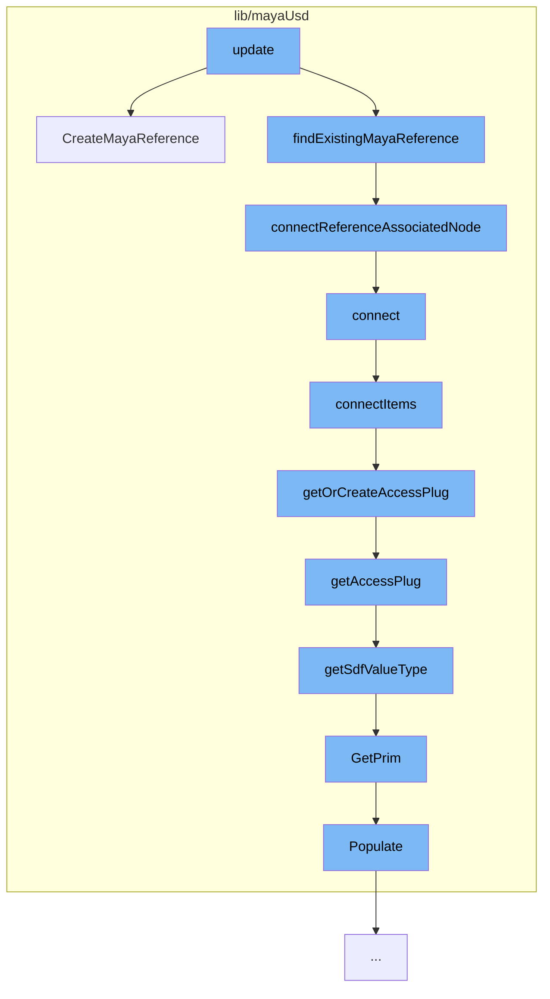

This document will cover the process of creating and connecting Maya references in the Maya-USD plugin. The process includes the following steps:

1. Creating a Maya reference
2. Finding an existing Maya reference
3. Connecting the reference to an associated node
4. Connecting items
5. Getting or creating an access plug
6. Getting an access plug
7. Getting the Sdf value type
8. Getting the prim
9. Populating the prim.



<SwmSnippet path="/lib/mayaUsd/fileio/translators/translatorMayaReference.cpp" line="294">

---

# Creating a Maya reference

The function `CreateMayaReference` is used to create a new Maya reference. It takes a UsdPrim and other parameters, and creates a new reference node for each proxy, ensuring that edits to each copy of an asset are preserved separately.

```c++
MStatus UsdMayaTranslatorMayaReference::CreateMayaReference(
    const UsdPrim& prim,
    MObject&       parent,
    MString&       mayaReferencePath,
    MString&       rigNamespaceM,
    bool           mergeNamespacesOnClash)
{
    TF_DEBUG(PXRUSDMAYA_TRANSLATORS)
        .Msg("MayaReferenceLogic::CreateMayaReference prim=%s\n", prim.GetPath().GetText());
    MStatus status;

    MFnDagNode parentDag(parent, &status);
    CHECK_MSTATUS_AND_RETURN_IT(status);

    // Need to create new reference (initially unloaded).
    //
    // When we create reference nodes, we want a separate reference node to be
    // created for each proxy, even proxies that are duplicates of each other.
    // This is to ensure that edits to each copy of an asset are preserved
    // separately.  To this end, we must create a unique name for each proxy's
    // reference node.  Simply including namespace information (if any) from the
```

---

</SwmSnippet>

<SwmSnippet path="/lib/mayaUsd/fileio/translators/translatorMayaReference.cpp" line="413">

---

# Finding an existing Maya reference

The function `connectReferenceAssociatedNode` is used to connect the reference to an associated node. This ensures that the referenced nodes end up under the prim transform when loaded.

```c++
static MStatus connectReferenceAssociatedNode(MFnDagNode& dagNode, MFnReference& refNode)
{
    MPlug srcPlug(dagNode.object(), getMessageAttr());
    /*
       From the Maya docs:
       > This message attribute is used to connect specific nodes that may be
       > associated with this reference (i.e. group, locator, annotation). Use of
       > this connection indicates that the associated nodes have the same
       > lifespan as the reference, and will be deleted along with the reference
       > if it is removed.
     */
    MStatus      result;
    MPlug        destArrayPlug(refNode.object(), getAssociatedNodeAttr());
    bool         wasConnected = false;
    unsigned int destIndex = 0;
    result = connectedOrFirstAvailableIndex(srcPlug, destArrayPlug, destIndex, wasConnected);
    CHECK_MSTATUS_AND_RETURN_IT(result);
    if (wasConnected) {
        // If it's already connected, abort, we're done
        return result;
    }
```

---

</SwmSnippet>

<SwmSnippet path="/lib/mayaUsd/nodes/proxyAccessor.py" line="326">

---

# Connecting the reference to an associated node

The function `connect` is used to connect two objects. It requires exactly two objects to be selected.

```python
def connect(attrToConnect=[('translate','xformOp:translate'), ('rotate','xformOp:rotateXYZ')]):
    ufeSelection = ufe.GlobalSelection.get()
    if len(ufeSelection) != 2:
        print('Must select exactly two objects to connect')
        return

    ufeSelectionIter = iter(ufeSelection)

    ufeObjectSrc = next(ufeSelectionIter)
    ufeObjectDst = next(ufeSelectionIter)

    ufeSelectionIter = None

    connectItems(ufeObjectSrc,ufeObjectDst,attrToConnect)
```

---

</SwmSnippet>

<SwmSnippet path="/lib/mayaUsd/nodes/proxyAccessor.py" line="298">

---

# Connecting items

The function `connectItems` is used to connect items between two objects. It checks if the source and destination are of mixed paths (DAG and USD), and creates XformOps if the destination is USD.

```python
def connectItems(ufeObjectSrc, ufeObjectDst, attrToConnect):
    connectMayaToUsd = isUfeUsdPath(ufeObjectDst)
    if connectMayaToUsd == isUfeUsdPath(ufeObjectSrc):
        print('Must provide two objects with mixed paths (DAG and USD)')
        return

    if connectMayaToUsd:
        #source is Maya
        #destination is USD
        createXformOps(ufeObjectDst)
        srcDagPath = getDagAndPrimFromUfe(ufeObjectSrc)[0]
        dstDagPath, dstUsdPrimPath = getDagAndPrimFromUfe(ufeObjectDst)
        for mayaAttr, usdAttr in attrToConnect:
            dstValueAttr = getOrCreateAccessPlug(ufeObjectDst, usdAttr)
            srcConnection = srcDagPath+'.'+mayaAttr
            dstConnection = dstDagPath+'.'+dstValueAttr
            cmds.connectAttr(srcConnection, dstConnection)
    else:
        #source is USD
        #destination is Maya
        srcDagPath, srcUsdPrimPath = getDagAndPrimFromUfe(ufeObjectSrc)
```

---

</SwmSnippet>

<SwmSnippet path="/lib/mayaUsd/nodes/proxyAccessor.py" line="194">

---

# Getting or creating an access plug

The function `getOrCreateAccessPlug` is used to get or create an access plug for a given attribute. If the plug doesn't exist, it creates one.

```python
def getOrCreateAccessPlug(ufeObject, usdAttrName, sdfValueType=Sdf.ValueTypeNames.Matrix4d):
    # Look for it first
    plugNameValueAttr = getAccessPlug(ufeObject,usdAttrName,sdfValueType)

    # Create if doesn't exist
    if plugNameValueAttr == None:
        selectedDagPath, selectedPrimPath = getDagAndPrimFromUfe(ufeObject)

        if selectedDagPath == None or selectedPrimPath == None:
            return None

        sdfPath = Sdf.Path(selectedPrimPath)
        if not usdAttrName == "":
            sdfPath = getPrimAttrPath(sdfPath, selectedPrimPath, usdAttrName)

        plugNameValueAttr = getAccessPlugName(sdfPath)

        if not usdAttrName == "":
            sdfValueType = getSdfValueType(ufeObject,usdAttrName)
            createAccessPlug(selectedDagPath, sdfPath, sdfValueType)
        else:
```

---

</SwmSnippet>

<SwmSnippet path="/lib/mayaUsd/nodes/proxyAccessor.py" line="174">

---

# Getting an access plug

The function `getAccessPlug` is used to get an access plug for a given attribute. If the plug doesn't exist, it returns None.

```python
def getAccessPlug(ufeObject, usdAttrName, sdfValueType=Sdf.ValueTypeNames.Matrix4d):
    selectedDagPath, selectedPrimPath = getDagAndPrimFromUfe(ufeObject)

    if selectedDagPath == None or selectedPrimPath == None:
        return None

    sdfPath = Sdf.Path(selectedPrimPath)

    if not usdAttrName == "":
        sdfPath = getPrimAttrPath(sdfPath, selectedPrimPath, usdAttrName)
        sdfValueType = getSdfValueType(ufeObject,usdAttrName)

    plugNameValueAttr = getAccessPlugName(sdfPath)

    exists = cmds.attributeQuery(plugNameValueAttr, node=selectedDagPath, exists=True)
    if not exists:
        return None

    return plugNameValueAttr
```

---

</SwmSnippet>

<SwmSnippet path="/lib/mayaUsd/nodes/proxyAccessor.py" line="146">

---

# Getting the Sdf value type

The function `getSdfValueType` is used to get the Sdf value type for a given attribute. If the attribute is not defined, it returns None.

```python
def getSdfValueType(ufeObject, usdAttrName):
    # 'combinedVisibility' is not a usd prim property, so we define its type manually
    if usdAttrName == 'combinedVisibility':
        return Sdf.ValueTypeNames.Int

    proxyDagPath, usdPrimPath = getDagAndPrimFromUfe(ufeObject)

    stage = mayaUsdLib.GetPrim(proxyDagPath).GetStage()

    primPath = Sdf.Path(usdPrimPath)
    prim = stage.GetPrimAtPath(primPath)

    usdAttribute = prim.GetAttribute(usdAttrName)
    if usdAttribute.IsDefined():
        return usdAttribute.GetTypeName()
    else:
        return None
```

---

</SwmSnippet>

<SwmSnippet path="/lib/mayaUsd/sceneIndex/proxyShapeSceneIndexPlugin.cpp" line="381">

---

# Getting the prim

The method `GetPrim` is used to get the prim for a given path. If the path is a special workaround path, it populates the scene index.

```c++
// satisfying HdSceneIndexBase
HdSceneIndexPrim MayaUsdProxyShapeSceneIndex::GetPrim(const SdfPath& primPath) const
{
    // MAYA-126790 TODO: properly resolve missing PrimsAdded notification issue
    // https://github.com/PixarAnimationStudios/USD/blob/dev/pxr/imaging/hd/sceneIndex.cpp#L38
    // Pixar has discussed adding a missing overridable virtual function when an observer is
    // registered For now GetPrim called with magic string populates the scene index
    static SdfPath maya126790Workaround("maya126790Workaround");
    if (primPath == maya126790Workaround) {
        auto nonConstThis = const_cast<MayaUsdProxyShapeSceneIndex*>(this);
        nonConstThis->Populate();
        return HdSceneIndexPrim();
    }

    return _GetInputSceneIndex()->GetPrim(primPath);
}
```

---

</SwmSnippet>

<SwmSnippet path="/lib/mayaUsd/sceneIndex/proxyShapeSceneIndexPlugin.cpp" line="356">

---

# Populating the prim

The method `Populate` is used to populate the prim if it hasn't been populated yet. It sets the stage and updates the time.

```c++
void MayaUsdProxyShapeSceneIndex::Populate()
{
    if (!_populated) {
        auto stage = _proxyShape->getUsdStage();
        if (TF_VERIFY(stage, "Unable to fetch a valid USDStage.")) {
            _usdImagingStageSceneIndex->SetStage(stage);
            // Check whether the pseudo-root has children
            if (!stage->GetPseudoRoot().GetChildren().empty())
            // MAYA-126641: Upon first call to MayaUsdProxyShapeBase::getUsdStage, the stage may be
            // empty. Do not mark the scene index as _populated, until stage is full. This is taken
            // care of inside MayaUsdProxyShapeSceneIndex::_StageSet callback.
            {
#if PXR_VERSION < 2305
                // In most recent USD, Populate is called from within SetStage, so there is no need
                // to callsites to call it explicitly
                _usdImagingStageSceneIndex->Populate();
#endif
                _populated = true;
            }
            // Set the initial time
            UpdateTime();
```

---

</SwmSnippet>

&nbsp;

_This is an auto-generated document by Swimm AI 🌊 and has not yet been verified by a human_

<SwmMeta version="3.0.0" repo-id="Z2l0aHViJTNBJTNBbWF5YS11c2QlM0ElM0FnaWxhZG5hdm90" repo-name="maya-usd"><sup>Powered by [Swimm](/)</sup></SwmMeta>
