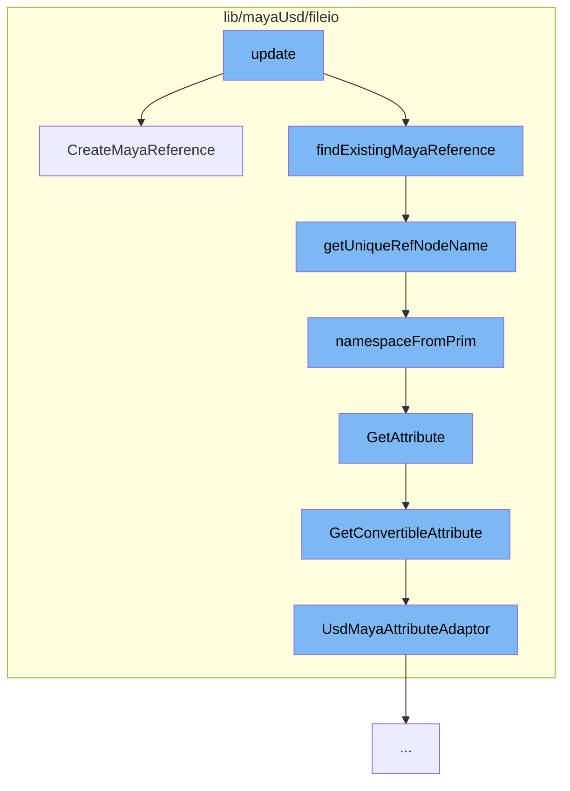

This document will cover the process of creating a Maya reference in the Maya-USD plugin, which includes:

1. The initiation of the process with the `CreateMayaReference` function.
2. The generation of a unique reference node name with `getUniqueRefNodeName`.
3. The extraction of the namespace from the USD prim with `namespaceFromPrim`.
4. The retrieval of the attribute from the schema with `GetAttribute`.
5. The conversion of the attribute with `GetConvertibleAttribute`.



<SwmSnippet path="/lib/mayaUsd/fileio/translators/translatorMayaReference.cpp" line="294">

---

# Initiation of the process with `CreateMayaReference`

The `CreateMayaReference` function is the entry point for creating a Maya reference. It takes in a USD prim and other parameters, and creates a new reference node for each proxy, ensuring that edits to each copy of an asset are preserved separately. The function also handles the loading of the reference to trigger the `kAfterReferenceLoad` callback.

```c++
MStatus UsdMayaTranslatorMayaReference::CreateMayaReference(
    const UsdPrim& prim,
    MObject&       parent,
    MString&       mayaReferencePath,
    MString&       rigNamespaceM,
    bool           mergeNamespacesOnClash)
{
    TF_DEBUG(PXRUSDMAYA_TRANSLATORS)
        .Msg("MayaReferenceLogic::CreateMayaReference prim=%s\n", prim.GetPath().GetText());
    MStatus status;

    MFnDagNode parentDag(parent, &status);
    CHECK_MSTATUS_AND_RETURN_IT(status);

    // Need to create new reference (initially unloaded).
    //
    // When we create reference nodes, we want a separate reference node to be
    // created for each proxy, even proxies that are duplicates of each other.
    // This is to ensure that edits to each copy of an asset are preserved
    // separately.  To this end, we must create a unique name for each proxy's
    // reference node.  Simply including namespace information (if any) from the
```

---

</SwmSnippet>

<SwmSnippet path="/lib/mayaUsd/fileio/translators/translatorMayaReference.cpp" line="258">

---

# Generation of a unique reference node name with `getUniqueRefNodeName`

The `getUniqueRefNodeName` function is used to generate a unique name for each proxy's reference node. It uses either the legacy naming convention for ALMayaReference or the new naming convention for MayaReference, based on the namespace of the referenced file name.

```c++
MString getUniqueRefNodeName(
    const UsdPrim&      prim,
    const MFnDagNode&   parentDag,
    const MFnReference& refDependNode)
{
    MString uniqueRefNodeName;
    if (useLegacyMayaRefNaming(prim)) {
        // Legacy behaviour for ALMayaReference
        //
        // We want a unique reference node name so that multiple copies
        // of a given prim can each have their own reference edits. We base the name
        // from the full path to the prim for which the reference is being created.
        uniqueRefNodeName = refNameFromPath(parentDag);
    } else {
        // New behaviour for MayaReference
        //
        // Name the reference node based on either the namespace of the referenced file name.
        // Append "RN" to the end of filename, to indicate it's a reference node.
        //
        uniqueRefNodeName = namespaceFromPrim(prim);

```

---

</SwmSnippet>

<SwmSnippet path="/lib/mayaUsd/fileio/translators/translatorMayaReference.cpp" line="234">

---

# Extraction of the namespace from the USD prim with `namespaceFromPrim`

The `namespaceFromPrim` function is used to extract the namespace attribute from the USD prim. If the namespace attribute is missing, it creates a default namespace from the prim path.

```c++
// Get the namespace attribute from prim
MString namespaceFromPrim(const UsdPrim& prim)
{
    std::string ns;
    if (UsdAttribute namespaceAttribute = prim.GetAttribute(kNamespaceNamePrimAttrName)) {
        TF_DEBUG(PXRUSDMAYA_TRANSLATORS)
            .Msg(
                "MayaReferenceLogic::update Checking namespace on prim \"%s\".\n",
                prim.GetPath().GetText());

        if (!namespaceAttribute.Get<std::string>(&ns)) {
            TF_DEBUG(PXRUSDMAYA_TRANSLATORS)
                .Msg(
                    "MayaReferenceLogic::update Missing namespace on prim \"%s\". Will create one "
                    "from prim path.\n",
                    prim.GetPath().GetText());
            // Creating default namespace from prim path. Converts /a/b/c to a_b_c.
            ns = prim.GetPath().GetString();
            std::replace(ns.begin() + 1, ns.end(), '/', '_');
        }
    }
```

---

</SwmSnippet>

<SwmSnippet path="/lib/mayaUsd/fileio/schemaApiAdaptor.cpp" line="65">

---

# Retrieval of the attribute from the schema with `GetAttribute`

The `GetAttribute` function is used to retrieve the attribute from the schema. It handles both translatable and untranslatable attributes, with the latter being handled with dynamic attributes.

```c++
UsdMayaAttributeAdaptor UsdMayaSchemaApiAdaptor::GetAttribute(const TfToken& attrName) const
{
    TfToken mayaAttribute = GetMayaNameForUsdAttrName(attrName);
    if (!mayaAttribute.IsEmpty()) {
        return GetConvertibleAttribute(GetMayaObjectForSchema(), mayaAttribute.GetText(), attrName);
    } else {
        // Untranslatable attributes are handled with dynamic attributes.
        MObjectHandle objectHandle(GetMayaObjectForSchema());
        if (!objectHandle.isValid()) {
            // It is possible that the object got removed with RemoveSchema, making this call
            // impossible.
            TF_CODING_ERROR(
                "Could not find object referenced in schema '%s'", _schemaName.GetText());
            return UsdMayaAttributeAdaptor();
        }
        UsdMayaSchemaAdaptor genericAdaptor { objectHandle, _schemaName, _schemaDef };
        return genericAdaptor.GetAttribute(attrName);
    }
}
```

---

</SwmSnippet>

<SwmSnippet path="/lib/mayaUsd/fileio/schemaApiAdaptor.cpp" line="142">

---

# Conversion of the attribute with `GetConvertibleAttribute`

The `GetConvertibleAttribute` function is used to convert the attribute. It checks if the object is valid and if the attribute exists on the schema before proceeding with the conversion.

```c++
UsdMayaAttributeAdaptor UsdMayaSchemaApiAdaptor::GetConvertibleAttribute(
    MObject        mayaObject,
    const MString& mayaAttribute,
    const TfToken& attrName) const
{
    if (mayaObject.isNull()) {
        // It is possible that the object got removed with RemoveSchema, making this call
        // impossible.
        TF_CODING_ERROR("Could not find object referenced in schema '%s'", _schemaName.GetText());
        return UsdMayaAttributeAdaptor();
    }

#if PXR_VERSION < 2308
    SdfAttributeSpecHandle attrDef = _schemaDef->GetSchemaAttributeSpec(attrName);
#else
    const UsdPrimDefinition::Attribute attrDef = _schemaDef->GetAttributeDefinition(attrName);
#endif

    if (!attrDef) {
        TF_CODING_ERROR("Attribute doesn't exist on schema '%s'", _schemaName.GetText());
        return UsdMayaAttributeAdaptor();
```

---

</SwmSnippet>

&nbsp;

*This is an auto-generated document by Swimm AI 🌊 and has not yet been verified by a human*

<SwmMeta version="3.0.0" repo-id="Z2l0aHViJTNBJTNBbWF5YS11c2QlM0ElM0FnaWxhZG5hdm90" repo-name="maya-usd" doc-type="flows"><sup>Powered by [Swimm](/)</sup></SwmMeta>
