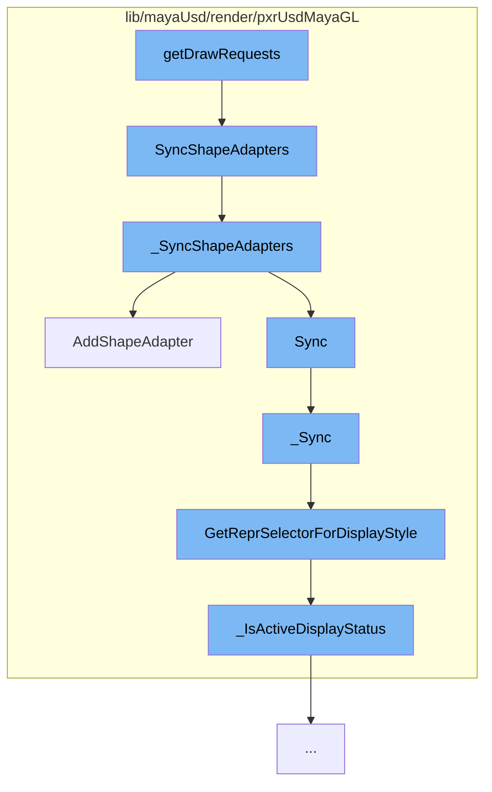

This document will cover the process of generating draw requests in the Maya USD plugin, which includes:

1. Synchronizing shape adapters
2. Adding shape adapters to the batch renderer
3. Synchronizing instancer shape adapters
4. Determining the representation selector for the display style
5. Checking the active display status.



<SwmSnippet path="/lib/mayaUsd/render/pxrUsdMayaGL/instancerImager.cpp" line="49">

---

# Synchronizing shape adapters

The function `SyncShapeAdapters` is used to synchronize shape adapters for Viewport 2.0. It calls the `_SyncShapeAdapters` function with the appropriate parameters.

```c++
void UsdMayaGL_InstancerImager::SyncShapeAdapters(const unsigned int displayStyle)
{
    // Viewport 2.0 sync.
    _SyncShapeAdapters(true, displayStyle, M3dView::DisplayStyle::kBoundingBox);
}
```

---

</SwmSnippet>

<SwmSnippet path="/lib/mayaUsd/render/pxrUsdMayaGL/instancerImager.cpp" line="61">

---

The function `_SyncShapeAdapters` is responsible for cleaning up any instancers scheduled for deletion, and removing their shape adapters. It also syncs all of the shape adapters, creating them if they don't yet exist.

```c++
void UsdMayaGL_InstancerImager::_SyncShapeAdapters(
    bool                        vp2,
    const unsigned int          vp2DisplayStyle,
    const M3dView::DisplayStyle legacyDisplayStyle)
{
    // Clean up any instancers scheduled for deletion, and remove their shape
    // adapters.
    for (const MObjectHandle& handle : _instancersToRemove) {
        _StopTrackingInstancer(handle);
    }
    _instancersToRemove.clear();

    // Sync all of the shape adapters.
    // This will create the shape adapters if they don't yet exist.
    UsdMayaUtil::MObjectHandleUnorderedSet& dirtyInstancers
        = vp2 ? _dirtyInstancersVp2 : _dirtyInstancersLegacy;
    for (const MObjectHandle& handle : dirtyInstancers) {
        auto iter = _instancers.find(handle);
        if (iter == _instancers.end()) {
            continue;
        }
```

---

</SwmSnippet>

<SwmSnippet path="/lib/mayaUsd/render/pxrUsdMayaGL/batchRenderer.cpp" line="122">

---

# Adding shape adapters to the batch renderer

The function `AddShapeAdapter` is used to add a shape adapter to the batch renderer. It verifies the shape adapter, adds it to the correct bucket based on its render parameters, and adds it to the secondary object handle map.

```c++
bool UsdMayaGLBatchRenderer::AddShapeAdapter(PxrMayaHdShapeAdapter* shapeAdapter)
{
    TRACE_FUNCTION();

    MProfilingScope profilingScope(
        ProfilerCategory, MProfiler::kColorE_L3, "Batch Renderer Adding Shape Adapter");

    if (!TF_VERIFY(shapeAdapter, "Cannot add invalid shape adapter")) {
        return false;
    }

    const bool isViewport2 = shapeAdapter->IsViewport2();

    // Add the shape adapter to the correct bucket based on its renderParams.
    _ShapeAdapterBucketsMap& bucketsMap
        = isViewport2 ? _shapeAdapterBuckets : _legacyShapeAdapterBuckets;

    const PxrMayaHdRenderParams& renderParams = shapeAdapter->GetRenderParams();
    const size_t                 renderParamsHash = renderParams.Hash();

    TF_DEBUG(PXRUSDMAYAGL_SHAPE_ADAPTER_BUCKETING)
```

---

</SwmSnippet>

<SwmSnippet path="/lib/mayaUsd/render/pxrUsdMayaGL/instancerShapeAdapter.cpp" line="202">

---

# Synchronizing instancer shape adapters

The function `_Sync` is used to synchronize instancer shape adapters. It checks for updates to the shape or changes in the batch renderer that require re-initialization of the shape adapter. It also sets the root transform and cull style fallback for the delegate.

```c++
/* virtual */
bool UsdMayaGL_InstancerShapeAdapter::_Sync(
    const MDagPath&    shapeDagPath,
    const unsigned int displayStyle,
    const MHWRender::DisplayStatus /* displayStatus */)
{
    MStatus               status;
    UsdPrim               usdPrim = _instancerStage->GetDefaultPrim();
    UsdGeomPointInstancer instancer(usdPrim);
    _SyncInstancer(instancer, shapeDagPath);

    // Check for updates to the shape or changes in the batch renderer that
    // require us to re-initialize the shape adapter.
    HdRenderIndex* renderIndex = UsdMayaGLBatchRenderer::GetInstance().GetRenderIndex();
    if (!(shapeDagPath == GetDagPath()) || !_delegate
        || renderIndex != &_delegate->GetRenderIndex()) {
        _SetDagPath(shapeDagPath);

        if (!_Init(renderIndex)) {
            return false;
        }
```

---

</SwmSnippet>

<SwmSnippet path="/lib/mayaUsd/render/pxrUsdMayaGL/shapeAdapter.cpp" line="195">

---

# Determining the representation selector for the display style

The function `GetReprSelectorForDisplayStyle` is used to determine the representation selector based on the display style. It checks various display styles and returns the appropriate representation selector.

```c++
HdReprSelector
PxrMayaHdShapeAdapter::GetReprSelectorForDisplayStyle(unsigned int displayStyle) const
{
    HdReprSelector reprSelector;

    const bool boundingBoxStyle
        = displayStyle & MHWRender::MFrameContext::DisplayStyle::kBoundingBox;

    if (boundingBoxStyle) {
        // We don't currently use Hydra to draw bounding boxes, so we return an
        // empty repr selector here. Also, Maya seems to ignore most other
        // DisplayStyle bits when the viewport is in the kBoundingBox display
        // style anyway, and it just changes the color of the bounding box on
        // selection rather than adding in the wireframe like it does for
        // shaded display styles. So if we eventually do end up using Hydra for
        // bounding boxes, we could just return the appropriate repr here.
        return reprSelector;
    }

    const MHWRender::DisplayStatus displayStatus
        = MHWRender::MGeometryUtilities::displayStatus(_shapeDagPath);
```

---

</SwmSnippet>

<SwmSnippet path="/lib/mayaUsd/render/pxrUsdMayaGL/shapeAdapter.cpp" line="85">

---

# Checking the active display status

The function `_IsActiveDisplayStatus` is used to check if the display status is active. It returns true if the display status is active, hilite, active template, active component, or lead.

```c++
static inline bool _IsActiveDisplayStatus(MHWRender::DisplayStatus displayStatus)
{
    return (displayStatus == MHWRender::DisplayStatus::kActive)
        || (displayStatus == MHWRender::DisplayStatus::kHilite)
        || (displayStatus == MHWRender::DisplayStatus::kActiveTemplate)
        || (displayStatus == MHWRender::DisplayStatus::kActiveComponent)
        || (displayStatus == MHWRender::DisplayStatus::kLead);
}
```

---

</SwmSnippet>

&nbsp;

*This is an auto-generated document by Swimm AI 🌊 and has not yet been verified by a human*

<SwmMeta version="3.0.0" repo-id="Z2l0aHViJTNBJTNBbWF5YS11c2QlM0ElM0FnaWxhZG5hdm90" repo-name="maya-usd" doc-type="flows"><sup>Powered by [Swimm](/)</sup></SwmMeta>
