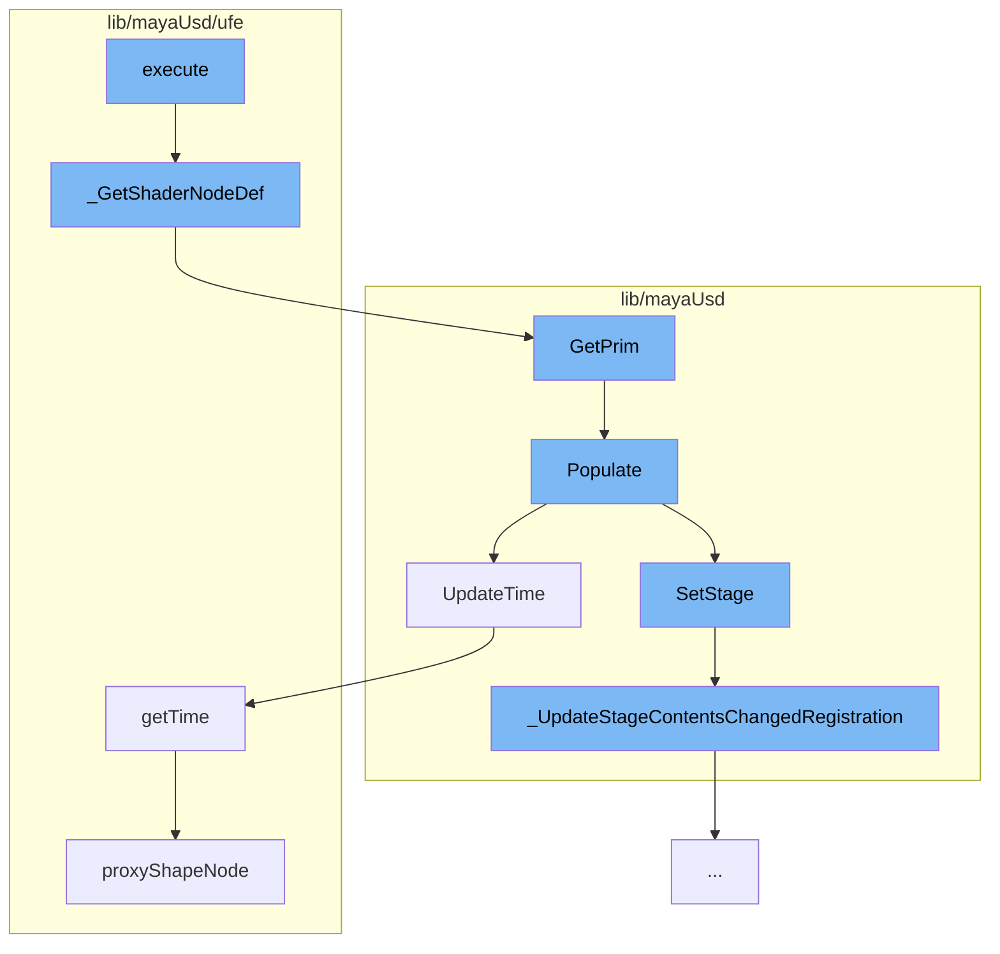

This document will cover the process of executing a connection command in the Maya-USD plugin, which includes:

1. Getting the shader node definition
2. Getting the primitive
3. Populating the scene index
4. Updating the time
5. Updating the stage contents registration.



<SwmSnippet path="/lib/mayaUsd/ufe/UsdUndoConnectionCommands.cpp" line="44">

---

# Getting the Shader Node Definition

The function `_GetShaderNodeDef` is used to get the shader node definition from a given primitive and attribute name. It traverses the node graph until it finds a shader, and then retrieves the shader node from the SdrRegistry.

```c++
PXR_NS::SdrShaderNodeConstPtr
_GetShaderNodeDef(const PXR_NS::UsdPrim& prim, const PXR_NS::TfToken& attrName)
{
    UsdPrim               targetPrim = prim;
    TfToken               targetName = attrName;
    UsdShadeAttributeType targetType = UsdShadeAttributeType::Output;
    UsdShadeNodeGraph     ngTarget(targetPrim);
    while (ngTarget) {
        // Dig inside, following the connection on targetName until we find a shader.
        PXR_NS::UsdAttribute targetAttr
            = targetPrim.GetAttribute(UsdShadeUtils::GetFullName(targetName, targetType));
        if (!targetAttr) {
            // Not a NodeGraph we recognize.
            return {};
        }
        UsdShadeConnectableAPI source;
        if (UsdShadeConnectableAPI::GetConnectedSource(
                targetAttr, &source, &targetName, &targetType)) {
            targetPrim = source.GetPrim();
            ngTarget = UsdShadeNodeGraph(targetPrim);
        } else {
```

---

</SwmSnippet>

<SwmSnippet path="/lib/mayaUsd/sceneIndex/proxyShapeSceneIndexPlugin.cpp" line="381">

---

# Getting the Primitive

The `GetPrim` method is used to get the primitive from the scene index. If the primitive path matches a specific workaround string, it triggers the population of the scene index.

```c++
// satisfying HdSceneIndexBase
HdSceneIndexPrim MayaUsdProxyShapeSceneIndex::GetPrim(const SdfPath& primPath) const
{
    // MAYA-126790 TODO: properly resolve missing PrimsAdded notification issue
    // https://github.com/PixarAnimationStudios/USD/blob/dev/pxr/imaging/hd/sceneIndex.cpp#L38
    // Pixar has discussed adding a missing overridable virtual function when an observer is
    // registered For now GetPrim called with magic string populates the scene index
    static SdfPath maya126790Workaround("maya126790Workaround");
    if (primPath == maya126790Workaround) {
        auto nonConstThis = const_cast<MayaUsdProxyShapeSceneIndex*>(this);
        nonConstThis->Populate();
        return HdSceneIndexPrim();
    }

    return _GetInputSceneIndex()->GetPrim(primPath);
}
```

---

</SwmSnippet>

<SwmSnippet path="/lib/mayaUsd/sceneIndex/proxyShapeSceneIndexPlugin.cpp" line="356">

---

# Populating the Scene Index

The `Populate` method is used to populate the scene index if it hasn't been populated yet. It sets the stage and updates the time.

```c++
void MayaUsdProxyShapeSceneIndex::Populate()
{
    if (!_populated) {
        auto stage = _proxyShape->getUsdStage();
        if (TF_VERIFY(stage, "Unable to fetch a valid USDStage.")) {
            _usdImagingStageSceneIndex->SetStage(stage);
            // Check whether the pseudo-root has children
            if (!stage->GetPseudoRoot().GetChildren().empty())
            // MAYA-126641: Upon first call to MayaUsdProxyShapeBase::getUsdStage, the stage may be
            // empty. Do not mark the scene index as _populated, until stage is full. This is taken
            // care of inside MayaUsdProxyShapeSceneIndex::_StageSet callback.
            {
#if PXR_VERSION < 2305
                // In most recent USD, Populate is called from within SetStage, so there is no need
                // to callsites to call it explicitly
                _usdImagingStageSceneIndex->Populate();
#endif
                _populated = true;
            }
            // Set the initial time
            UpdateTime();
```

---

</SwmSnippet>

<SwmSnippet path="/lib/mayaUsd/sceneIndex/proxyShapeSceneIndexPlugin.cpp" line="325">

---

# Updating the Time

The `UpdateTime` method is used to update the time in the scene index.

```c++
void MayaUsdProxyShapeSceneIndex::UpdateTime()
{
    if (_usdImagingStageSceneIndex && _proxyShape && isProxyShapeValid()) {
        _usdImagingStageSceneIndex->SetTime(_proxyShape->getTime());
    }
}
```

---

</SwmSnippet>

<SwmSnippet path="/lib/mayaUsd/listeners/stageNoticeListener.cpp" line="85">

---

# Updating the Stage Contents Registration

The `_UpdateStageContentsChangedRegistration` method is used to update the registration for stage contents changed notices. If the stage and the callback are valid, it registers for notices. Otherwise, it stops listening for notices.

```c++
void UsdMayaStageNoticeListener::_UpdateStageContentsChangedRegistration()
{
    if (_stage && _stageContentsChangedCallback) {
        // Register for notices if we're not already listening.
        if (!_stageContentsChangedKey.IsValid()) {
            _stageContentsChangedKey = TfNotice::Register(
                TfCreateWeakPtr(this), &UsdMayaStageNoticeListener::_OnStageContentsChanged);
        }
    } else {
        // Either the stage or the callback is invalid, so stop listening for
        // notices.
        if (_stageContentsChangedKey.IsValid()) {
            TfNotice::Revoke(_stageContentsChangedKey);
        }
    }

    if (_stage && _stageObjectsChangedCallback) {
        // Register for notices if we're not already listening.
        if (!_stageObjectsChangedKey.IsValid()) {
            _stageObjectsChangedKey = TfNotice::Register(
                TfCreateWeakPtr(this), &UsdMayaStageNoticeListener::_OnStageObjectsChanged, _stage);
```

---

</SwmSnippet>

&nbsp;

_This is an auto-generated document by Swimm AI 🌊 and has not yet been verified by a human_

<SwmMeta version="3.0.0" repo-id="Z2l0aHViJTNBJTNBbWF5YS11c2QlM0ElM0FnaWxhZG5hdm90" repo-name="maya-usd"><sup>Powered by [Swimm](/)</sup></SwmMeta>
