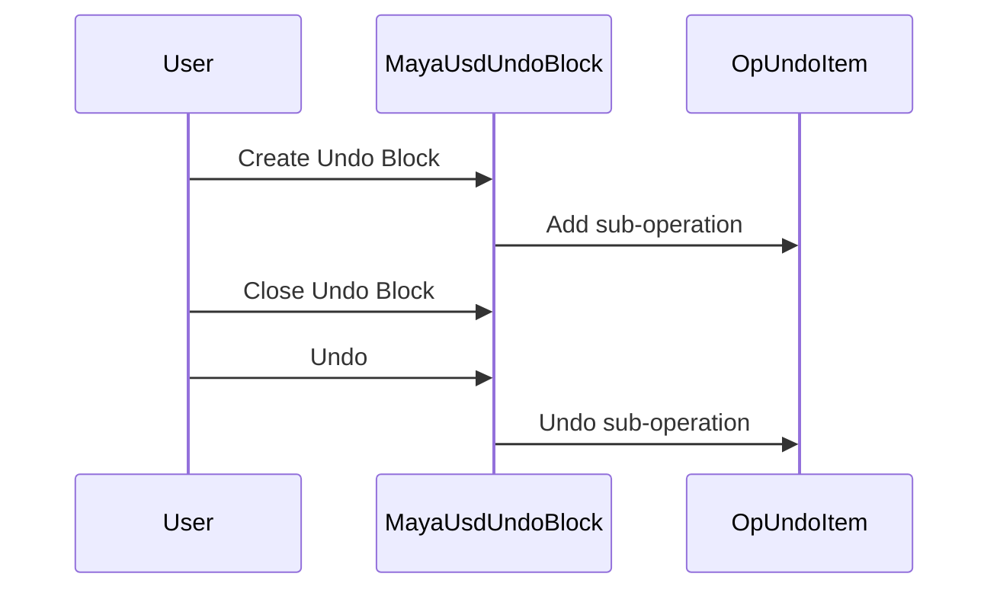

In the maya-usd repository, 'Undo' refers to a set of functionalities that allow the reversal of certain operations. This is implemented through various 'undo' methods in the 'OpUndoItems.cpp' file. These methods are designed to revert specific actions, such as the creation of a set or a change in selection. The 'undo' methods often return a boolean value indicating the success or failure of the operation. Additionally, there is a 'clear' method used in various contexts to reset or clear certain data structures or states. This method is often used in conjunction with 'undo' to ensure a clean state before or after an operation is undone.

<SwmSnippet path="/lib/mayaUsd/undo/OpUndoItems.cpp" line="275">

---

# Undo Item Execution

The `FunctionUndoItem::execute` method is used to execute an undo item. It takes a name, a redo function, an undo function, and an undo info list as parameters. The redo and undo functions are called when the undo or redo operations are performed.

```c++
bool FunctionUndoItem::execute(
    const std::string     name,
    std::function<bool()> redo,
    std::function<bool()> undo,
    OpUndoItemList&       undoInfo)
{
    auto item
        = std::make_unique<FunctionUndoItem>(std::move(name), std::move(redo), std::move(undo));
    return executeAndAdd(std::move(item), undoInfo);
}
```

---

</SwmSnippet>

<SwmSnippet path="/lib/mayaUsd/undo/OpUndoItems.cpp" line="477">

---

# Undo Item Creation

The `UfeCommandUndoItem::execute` method is used to create a new undo item. It takes a name and a command as parameters. The command is an instance of `Ufe::UndoableCommand`, which encapsulates the changes to be undone.

```c++
bool UfeCommandUndoItem::execute(
    const std::string&                           name,
    const std::shared_ptr<Ufe::UndoableCommand>& command,
    OpUndoItemList&                              undoInfo)
{
    auto item = std::make_unique<UfeCommandUndoItem>(name, command);
    return executeAndAdd(std::move(item), undoInfo);
}
```

---

</SwmSnippet>

<SwmSnippet path="/lib/mayaUsd/undo/OpUndoItems.cpp" line="302">

---

# Undo Operation

The `FunctionUndoItem::undo` method is used to perform the undo operation. It checks if the undo function is available, and if so, it calls the undo function.

```c++
bool FunctionUndoItem::undo()
{
    if (!_undo)
        return false;

    // During undo and redo the original command and its undo item list
    // no longer exist. All operations were already recorded (and are
    // in fact being undone!), so mute the undo item recording.
    OpUndoItemMuting muting;
    return _undo();
}
```

---

</SwmSnippet>

<SwmSnippet path="/lib/mayaUsd/undo/OpUndoItemList.cpp" line="113">

---

# Clearing Undo Items

The `OpUndoItemList::clear` method is used to clear the list of undo items. It iterates over the undo items and calls the `reset` method on each item, then clears the list of undo items.

```c++
void OpUndoItemList::clear()
{
    // Note: we need to destroy the undo items in reverse order
    //       since some items might depend on previous ones.
    if (_isUndone) {
        const auto end = _undoItems.rend();
        for (auto iter = _undoItems.rbegin(); iter != end; ++iter)
            iter->reset();
    } else {
        const auto end = _undoItems.end();
        for (auto iter = _undoItems.begin(); iter != end; ++iter)
            iter->reset();
    }

    _undoItems.clear();
    _isUndone = false;
}
```

---

</SwmSnippet>

# Undo Functionality

This section will cover the main functions related to the 'undo' functionality in the 'maya-usd' repository.

<SwmSnippet path="/lib/mayaUsd/undo/OpUndoItems.h" line="37">

---

## UndoItem Classes

The 'UndoItem' classes are the building blocks of the undo functionality. Each class represents a type of operation that can be undone, such as node deletion, Python command execution, or selection changes. Each 'UndoItem' class has an 'undo' method that reverts the operation and a 'redo' method that reapplies it.

```c
//------------------------------------------------------------------------------
// NodeDeletionUndoItem
//------------------------------------------------------------------------------

/// \class NodeDeletionUndoItem
/// \brief Record data needed to undo or redo a Maya DG sub-operation.
class NodeDeletionUndoItem : public OpUndoItem
{
public:
    /// \brief delete a node.
    MAYAUSD_CORE_PUBLIC
    static MStatus deleteNode(
        const std::string name,
        const MString&    nodeName,
        const MObject&    node,
        OpUndoItemList&   undoInfo);

    /// \brief delete a node and keep track of it in the global undo item list.
    MAYAUSD_CORE_PUBLIC
    static MStatus deleteNode(const std::string name, const MString& nodeName, const MObject& node);

```

---

</SwmSnippet>

<SwmSnippet path="/lib/mayaUsd/undo/OpUndoItems.cpp" line="210">

---

## Execute Methods

The 'execute' methods perform the actual operations that can be undone. These methods typically create an 'UndoItem' object, perform the operation, and add the 'UndoItem' to the undo stack. The 'execute' method in the 'PythonUndoItem' class, for example, executes a Python command and creates a 'PythonUndoItem' that can undo the command.

```c++
bool PythonUndoItem::execute(
    const std::string name,
    MString           pythonDo,
    MString           pythonUndo,
    OpUndoItemList&   undoInfo)
{
    auto item = std::make_unique<PythonUndoItem>(
        std::move(name), std::move(pythonDo), std::move(pythonUndo));
    return executeAndAdd(std::move(item), undoInfo);
}
```

---

</SwmSnippet>

<SwmSnippet path="/lib/mayaUsd/undo/OpUndoItems.cpp" line="256">

---

## Create Methods

The 'create' methods instantiate 'UndoItem' objects. These methods are typically static methods in the 'UndoItem' classes that take the parameters needed for the operation, create an 'UndoItem', and add it to the undo stack. The 'create' method in the 'FunctionUndoItem' class, for example, takes a function to be executed and a function to undo the operation, and creates a 'FunctionUndoItem' that can undo the function execution.

```c++
void FunctionUndoItem::create(
    const std::string     name,
    std::function<bool()> redo,
    std::function<bool()> undo,
    OpUndoItemList&       undoInfo)
{
    auto item
        = std::make_unique<FunctionUndoItem>(std::move(name), std::move(redo), std::move(undo));
    undoInfo.addItem(std::move(item));
}
```

---

</SwmSnippet>

# Undo Operations

Undo Functionality in Maya-USD

<SwmSnippet path="/lib/mayaUsd/undo/MayaUsdUndoBlock.h" line="29">

---

## MayaUsdUndoBlock

The `MayaUsdUndoBlock` class is used to collect multiple edits into a single undo operation. It is derived from `UsdUfe::UsdUndoBlock`.

```c
//! \brief MayaUsdUndoBlock collects multiple edits into a single undo operation.
/*!
 */
class MAYAUSD_CORE_PUBLIC MayaUsdUndoBlock : public UsdUfe::UsdUndoBlock
{
public:
    MayaUsdUndoBlock();
    ~MayaUsdUndoBlock() override;

    MAYAUSD_DISALLOW_COPY_MOVE_AND_ASSIGNMENT(MayaUsdUndoBlock);
};
```

---

</SwmSnippet>

<SwmSnippet path="/lib/mayaUsd/undo/OpUndoItemList.h" line="35">

---

## OpUndoItem

The `OpUndoItem` class represents a single undo sub-operation. It provides methods to execute, undo, and redo a sub-operation. It also provides a method to get the name of the undo item, which can be useful for debugging and logging.

```c
/// \class OpUndoItem
/// \brief Record data needed to undo or redo a single undo sub-operation.
///
/// See OpUndoItems.h for concrete implementations.

class OpUndoItem
{
public:
    typedef std::unique_ptr<OpUndoItem> Ptr;

    /// \brief construct a single named sub-operation.
    MAYAUSD_CORE_PUBLIC
    OpUndoItem(std::string name)
        : _name(std::move(name))
    {
    }

    MAYAUSD_CORE_PUBLIC
    virtual ~OpUndoItem() = default;

    /// \brief execute a single sub-operation. By default calls redo.
```

---

</SwmSnippet>



&nbsp;

_This is an auto-generated document by Swimm AI 🌊 and has not yet been verified by a human_

<SwmMeta version="3.0.0" repo-id="Z2l0aHViJTNBJTNBbWF5YS11c2QlM0ElM0FnaWxhZG5hdm90" repo-name="maya-usd"><sup>Powered by [Swimm](/)</sup></SwmMeta>
