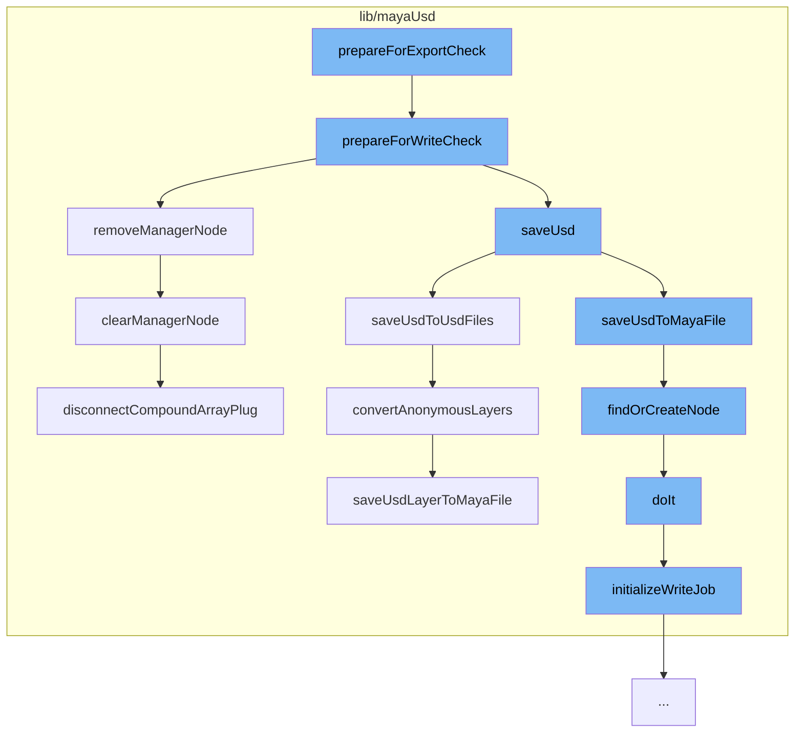

This document will cover the process of preparing for export check in the MayaUSD plugin, which includes:

1. Preparing for write check
2. Removing the manager node
3. Saving USD to USD files
4. Saving USD to Maya file
5. Finding or creating a node
6. Initializing the write job
7. Converting anonymous layers
8. Clearing the manager node.



<SwmSnippet path="/lib/mayaUsd/nodes/layerManager.cpp" line="411">

---

# Preparing for write check

The `prepareForWriteCheck` function is the first step in the process. It prepares the layer database for a write check, which is necessary before exporting. It also checks if there are any proxies to save and if so, it initiates the save process.

```c++
void LayerDatabase::prepareForWriteCheck(bool* retCode, bool isExport)
{
    _isSavingMayaFile = true;
    cleanUpNewScene(nullptr);

    LayerDatabase::instance().saveLayerManagerSelectedStage();

    bool hasAnyProxy = false;
    if (LayerDatabase::instance().getProxiesToSave(isExport, &hasAnyProxy)) {

        int dialogResult = true;

        if (!isCopyingSceneNodes()) {
            if (MGlobal::kInteractive == MGlobal::mayaState() && !isCrashing()
                && LayerDatabase::instance().saveInteractionRequired()) {
                MGlobal::executeCommand(kSaveOptionUICmd, dialogResult);
            }
        }

        if (dialogResult) {
            dialogResult = LayerDatabase::instance().saveUsd(isExport);
```

---

</SwmSnippet>

<SwmSnippet path="/lib/mayaUsd/nodes/layerManager.cpp" line="1221">

---

# Removing the manager node

The `removeManagerNode` function is called to remove the manager node from the layer database. This is done to ensure that the layer database is clean before the export process begins.

```c++
void LayerDatabase::removeManagerNode(MayaUsd::LayerManager* lm)
{
    if (!lm) {
        lm = findNode();
    }
    if (!lm) {
        return;
    }

    // This is called during a Maya notification callback, so no undo supported.
    OpUndoItemMuting muting;

    clearManagerNode(lm);

    MDGModifier& modifier = MDGModifierUndoItem::create("Manager node removal");
    modifier.deleteNode(lm->thisMObject());
    modifier.doIt();
}
```

---

</SwmSnippet>

<SwmSnippet path="/lib/mayaUsd/nodes/layerManager.cpp" line="875">

---

# Saving USD to USD files

The `saveUsdToUsdFiles` function is responsible for saving the USD data to USD files. It iterates over the proxies to save and saves each one to a USD file.

```c++
BatchSaveResult LayerDatabase::saveUsdToUsdFiles()
{
    MFnDependencyNode fn;
    for (size_t i = 0; i < _proxiesToSave.size() + _internalProxiesToSave.size(); i++) {
        const StageSavingInfo& info = i < _proxiesToSave.size()
            ? _proxiesToSave[i]
            : _internalProxiesToSave[i - _proxiesToSave.size()];

        MObject mobj = info.dagPath.node();
        fn.setObject(mobj);
        if (!fn.isFromReferencedFile()
            && LayerDatabase::instance().supportedNodeType(fn.typeId())) {
            MayaUsdProxyShapeBase* pShape = static_cast<MayaUsdProxyShapeBase*>(fn.userNode());

            // Unshared Composition Saves to MayaFile Always
            if (!info.shareable) {
                saveStageToMayaFile(mobj, info.stage);
            } else {
                // No need to save stages from external sources
                if (info.isIncoming) {
                    continue;
```

---

</SwmSnippet>

<SwmSnippet path="/lib/mayaUsd/nodes/layerManager.cpp" line="964">

---

# Saving USD to Maya file

The `saveUsdLayerToMayaFile` function saves the USD layer to a Maya file. This is done to ensure that the USD data can be accessed from within Maya.

```c++
void LayerDatabase::saveUsdLayerToMayaFile(SdfLayerRefPtr layer, bool asAnonymous)
{
    MayaUsd::LayerManager* lm = findOrCreateNode();
    if (!lm)
        return;

    MStatus           status;
    MDataBlock        dataBlock = lm->_forceCache();
    MArrayDataHandle  layersHandle = dataBlock.outputArrayValue(lm->layers, &status);
    MArrayDataBuilder builder(&dataBlock, lm->layers, 1 /*maybe nb stages?*/, &status);

    addLayerToBuilder(lm, builder, layer, asAnonymous);

    layersHandle.set(builder);

    layersHandle.setAllClean();
    dataBlock.setClean(lm->layers);
}
```

---

</SwmSnippet>

<SwmSnippet path="/lib/mayaUsd/nodes/layerManager.cpp" line="141">

---

# Finding or creating a node

The `findOrCreateNode` function is used to find or create a node in the layer manager. If the node does not exist, it is created.

```c++
MayaUsd::LayerManager* findOrCreateNode()
{
    MayaUsd::LayerManager* lm = findNode();
    if (!lm) {
        MDGModifier& modifier = MayaUsd::MDGModifierUndoItem::create("Node find or creation");
        MObject      manager = modifier.createNode(MayaUsd::LayerManager::typeId);
        modifier.doIt();

        lm = static_cast<MayaUsd::LayerManager*>(MFnDependencyNode(manager).userNode());
    }

    return lm;
}
```

---

</SwmSnippet>

<SwmSnippet path="/lib/mayaUsd/commands/baseExportCommand.cpp" line="281">

---

# Initializing the write job

The `initializeWriteJob` function is used to initialize the write job for the export process. It creates a new write job with the given arguments.

```c++
/* virtual */
std::unique_ptr<UsdMaya_WriteJob>
MayaUSDExportCommand::initializeWriteJob(const PXR_NS::UsdMayaJobExportArgs& args)
{
    return std::unique_ptr<UsdMaya_WriteJob>(new UsdMaya_WriteJob(args));
}
```

---

</SwmSnippet>

<SwmSnippet path="/lib/mayaUsd/nodes/layerManager.cpp" line="918">

---

# Converting anonymous layers

The `convertAnonymousLayers` function is used to convert anonymous layers to named layers. This is done to ensure that the layers can be saved to a file.

```c++
void LayerDatabase::convertAnonymousLayers(
    MayaUsdProxyShapeBase* pShape,
    const MObject&         proxyNode,
    UsdStageRefPtr         stage)
{
    SdfLayerHandle root = stage->GetRootLayer();
    std::string    proxyName(pShape->name().asChar());

    convertAnonymousLayersRecursive(root, proxyName, stage);

    // Note: retrieve root again since it may have been changed by the call
    //       to convertAnonymousLayersRecursive
    root = stage->GetRootLayer();
    if (root->IsAnonymous()) {
        const bool wasTargetLayer = (stage->GetEditTarget().GetLayer() == root);
        PXR_NS::SdfFileFormat::FileFormatArguments args;
        std::string newFileName = MayaUsd::utils::generateUniqueFileName(proxyName);
        if (UsdMayaUtilFileSystem::requireUsdPathsRelativeToMayaSceneFile()) {
            newFileName = UsdMayaUtilFileSystem::getPathRelativeToMayaSceneFile(newFileName);
        }
        if (!MayaUsd::utils::saveLayerWithFormat(root, newFileName)) {
```

---

</SwmSnippet>

<SwmSnippet path="/lib/mayaUsd/nodes/layerManager.cpp" line="1200">

---

# Clearing the manager node

The `clearManagerNode` function is used to clear the manager node from the layer database. This is done to ensure that the layer database is clean after the export process is completed.

```c++
void LayerDatabase::clearManagerNode(MayaUsd::LayerManager* lm)
{
    if (!lm)
        return;

    MStatus status;
    MPlug   arrayPlug(lm->thisMObject(), lm->layers);

    // First, disconnect any connected attributes
    disconnectCompoundArrayPlug(arrayPlug);

    // Then wipe the array attribute
    MDataBlock       dataBlock = lm->_forceCache();
    MArrayDataHandle layersArrayHandle = dataBlock.outputArrayValue(lm->layers, &status);

    MArrayDataBuilder builder(&dataBlock, lm->layers, 0, &status);
    layersArrayHandle.set(builder);
    layersArrayHandle.setAllClean();
    dataBlock.setClean(lm->layers);
}
```

---

</SwmSnippet>

&nbsp;

_This is an auto-generated document by Swimm AI 🌊 and has not yet been verified by a human_

<SwmMeta version="3.0.0" repo-id="Z2l0aHViJTNBJTNBbWF5YS11c2QlM0ElM0FnaWxhZG5hdm90" repo-name="maya-usd"><sup>Powered by [Swimm](/)</sup></SwmMeta>
