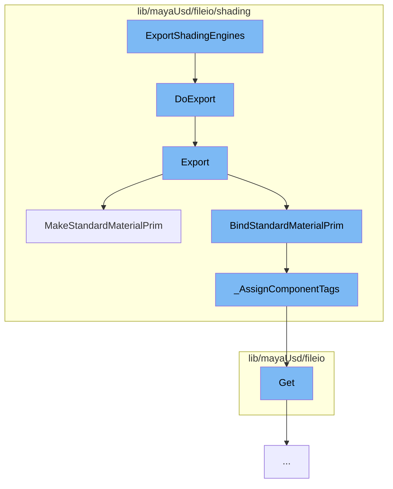

This document will cover the process of exporting shading engines in the Maya USD plugin, which includes:

1. Initiating the export process
2. Exporting the shading mode
3. Creating a standard material prim
4. Assigning component tags
5. Getting attribute values.



<SwmSnippet path="/lib/mayaUsd/fileio/shading/shadingModeExporter.cpp" line="81">

---

# Initiating the export process

The function `DoExport` in `shadingModeExporter.cpp` initiates the export process. It iterates over all shading engines in the scene and exports each one. It also handles the creation of material collections and their bindings.

```c++
void UsdMayaShadingModeExporter::DoExport(
    UsdMayaWriteJobContext&                  writeJobContext,
    const UsdMayaUtil::MDagPathMap<SdfPath>& dagPathToUsdMap)
{
    MayaUsd::ProgressBarScope progressBar(4);

    const UsdMayaJobExportArgs& exportArgs = writeJobContext.GetArgs();
    const UsdStageRefPtr&       stage = writeJobContext.GetUsdStage();

    const SdfPath& materialCollectionsPath = exportArgs.exportMaterialCollections
        ? exportArgs.materialCollectionsPath
        : SdfPath::EmptyPath();

    UsdPrim materialCollectionsPrim;
    if (!materialCollectionsPath.IsEmpty()) {
        materialCollectionsPrim = stage->OverridePrim(materialCollectionsPath);
        if (!materialCollectionsPrim) {
            TF_WARN(
                "Error: could not override prim at path <%s>. One of the "
                "ancestors of the path must be inactive or an instance root. "
                "Not exporting material collections!",
```

---

</SwmSnippet>

<SwmSnippet path="/lib/mayaUsd/fileio/shading/shadingModePxrRis.cpp" line="271">

---

# Exporting the shading mode

The `Export` function in `shadingModePxrRis.cpp` exports the shading mode. It creates a USD shade material and assigns surface, volume, and displacement shaders to it.

```c++
    void Export(
        const UsdMayaShadingModeExportContext& context,
        UsdShadeMaterial* const                mat,
        SdfPathSet* const                      boundPrimPaths) override
    {
        const UsdMayaShadingModeExportContext::AssignmentsInfo& assignments
            = context.GetAssignments();

        UsdPrim materialPrim = context.MakeStandardMaterialPrim(assignments);
        context.BindStandardMaterialPrim(materialPrim, assignments.assignments, boundPrimPaths);
        UsdShadeMaterial material(materialPrim);
        if (!material) {
            return;
        }

        if (mat != nullptr) {
            *mat = material;
        }

        UsdRiMaterialAPI riMaterialAPI(materialPrim);

```

---

</SwmSnippet>

<SwmSnippet path="/lib/mayaUsd/fileio/shading/shadingModeExporterContext.cpp" line="559">

---

# Creating a standard material prim

The `MakeStandardMaterialPrim` function in `shadingModeExporterContext.cpp` creates a standard material prim. It checks if the material should be exported and if so, it defines a new USD shade material at the appropriate path in the USD stage.

```c++
UsdPrim UsdMayaShadingModeExportContext::MakeStandardMaterialPrim(
    const AssignmentsInfo& assignmentsInfo,
    const std::string&     name) const
{
    const UsdMayaJobExportArgs& exportArgs = GetExportArgs();

    if (!shouldExportMaterial(assignmentsInfo, GetSurfaceShader(), exportArgs))
        return UsdPrim();

    const std::string materialName
        = UsdUfe::sanitizeName(getMaterialName(name, _shadingEngine, GetSurfaceShader()));
    if (materialName.empty())
        return UsdPrim();

    UsdStageRefPtr stage = GetUsdStage();
    UsdPrim        materialParent = exportArgs.legacyMaterialScope
        ? _GetLegacyMaterialParent(
            stage, exportArgs.materialsScopeName, assignmentsInfo.assignments)
        : _GetMaterialParent(stage, exportArgs.defaultPrim, exportArgs.materialsScopeName);
    if (!materialParent)
        return UsdPrim();
```

---

</SwmSnippet>

<SwmSnippet path="/lib/mayaUsd/fileio/shading/shadingModeExporterContext.cpp" line="844">

---

# Assigning component tags

The `_AssignComponentTags` function in `shadingModeExporterContext.cpp` assigns component tags to the material. It checks if there are any component tags that cover the set of faces and assigns them to those tags.

```c++
/// We might have one or more component tags that have roundtrip data that covers this
// set of faces. Assign them to those tags and return the remaining unhandled faces.
VtIntArray _AssignComponentTags(
    const UsdMayaShadingModeExportContext* ctx,
    const UsdShadeMaterial&                materialToBind,
    const MObjectHandle&                   geomHandle,
    const std::vector<UsdGeomSubset>&      currentGeomSubsets,
    const VtIntArray&                      faceIndices,
    SdfPathSet* const                      boundPrimPaths)
{
    if (currentGeomSubsets.empty() || faceIndices.empty() || !geomHandle.isValid()) {
        return faceIndices;
    }

    JsValue info;
    if (UsdMayaMeshReadUtils::getGeomSubsetInfo(geomHandle.object(), info) && info) {
        auto subsetInfoDict = info.GetJsObject();

        std::set<VtIntArray::ElementType> faceSet, handledSet;
        faceSet.insert(faceIndices.cbegin(), faceIndices.cend());

```

---

</SwmSnippet>

<SwmSnippet path="/lib/mayaUsd/fileio/utils/adaptor.cpp" line="1041">

---

# Getting attribute values

The `Get` function in `adaptor.cpp` retrieves the value of an attribute. It uses the `UsdMayaWriteUtil::GetVtValue` function to get the value of the attribute in the correct type.

```c++
bool UsdMayaAttributeAdaptor::Get(VtValue* value) const
{
    if (!*this) {
        return false;
    }

#if PXR_VERSION < 2308
    VtValue result = UsdMayaWriteUtil::GetVtValue(_plug, _attrDef->GetTypeName());
#else
    VtValue result = UsdMayaWriteUtil::GetVtValue(_plug, _attrDef.GetTypeName());
#endif
    if (result.IsEmpty()) {
        return false;
    }

    *value = result;
    return true;
}
```

---

</SwmSnippet>

&nbsp;

_This is an auto-generated document by Swimm AI 🌊 and has not yet been verified by a human_

<SwmMeta version="3.0.0" repo-id="Z2l0aHViJTNBJTNBbWF5YS11c2QlM0ElM0FnaWxhZG5hdm90" repo-name="maya-usd"><sup>Powered by [Swimm](/)</sup></SwmMeta>
