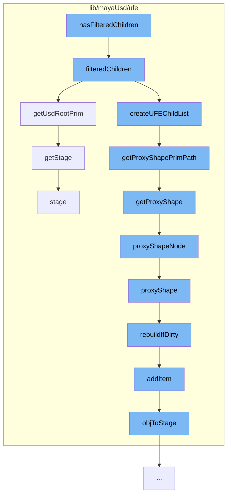

This document will cover the process of filtering children in the ProxyShapeHierarchy in the Maya-USD plugin. The process includes:

1. Checking if the children are filtered
2. Getting the USD root prim
3. Creating a UFE child list
4. Getting the proxy shape prim path
5. Getting the proxy shape
6. Getting the stage



<SwmSnippet path="/lib/mayaUsd/ufe/ProxyShapeHierarchy.cpp" line="182">

---

# Checking if the children are filtered

The function `hasFilteredChildren` is used to check if the children of the USD root are filtered. It calls the `filteredChildren` function to get the filtered children.

```c++
Ufe::SceneItemList ProxyShapeHierarchy::filteredChildren(const ChildFilter& childFilter) const
{
    // Return filtered children of the USD root.
    const UsdPrim& rootPrim = getUsdRootPrim();
    if (!rootPrim.IsValid())
        return Ufe::SceneItemList();

    // Note: for now the only child filter flag we support is "Inactive Prims".
    //       See UsdHierarchyHandler::childFilter()
    if ((childFilter.size() == 1) && (childFilter.front().name == "InactivePrims")) {
        // See uniqueChildName() for explanation of USD filter predicate.
        const bool             showInactive = childFilter.front().value;
        Usd_PrimFlagsPredicate flags
            = showInactive ? UsdPrimIsDefined && !UsdPrimIsAbstract : kMayaUsdPrimDefaultPredicate;
        return createUFEChildList(getUSDFilteredChildren(rootPrim, flags), !showInactive);
    }

    UFE_LOG("Unknown child filter");
    return Ufe::SceneItemList();
}
```

---

</SwmSnippet>

<SwmSnippet path="/lib/mayaUsd/ufe/ProxyShapeHierarchy.cpp" line="110">

---

# Getting the USD root prim

The `getUsdRootPrim` function is used to get the USD root prim. If the root prim is not valid, it gets the stage from the item's path.

```c++
const UsdPrim& ProxyShapeHierarchy::getUsdRootPrim() const
{
    if (!_usdRootPrim.IsValid()) {
        // FIXME During AL_usdmaya_ProxyShapeImport, nodes (both Maya
        // and USD) are being added (e.g. the proxy shape itself), but
        // there is no stage yet, and there is no way to detect that a
        // proxy shape import command is under way.  PPT, 28-Sep-2018.
        UsdStageWeakPtr stage = getStage(_item->path());
        if (stage) {
            _usdRootPrim = stage->GetPseudoRoot();
        }
    }
    return _usdRootPrim;
}
```

---

</SwmSnippet>

<SwmSnippet path="/lib/mayaUsd/ufe/ProxyShapeHierarchy.cpp" line="182">

---

# Creating a UFE child list

The `createUFEChildList` function is called within the `filteredChildren` function to create a UFE child list.

```c++
Ufe::SceneItemList ProxyShapeHierarchy::filteredChildren(const ChildFilter& childFilter) const
{
    // Return filtered children of the USD root.
    const UsdPrim& rootPrim = getUsdRootPrim();
    if (!rootPrim.IsValid())
        return Ufe::SceneItemList();

    // Note: for now the only child filter flag we support is "Inactive Prims".
    //       See UsdHierarchyHandler::childFilter()
    if ((childFilter.size() == 1) && (childFilter.front().name == "InactivePrims")) {
        // See uniqueChildName() for explanation of USD filter predicate.
        const bool             showInactive = childFilter.front().value;
        Usd_PrimFlagsPredicate flags
            = showInactive ? UsdPrimIsDefined && !UsdPrimIsAbstract : kMayaUsdPrimDefaultPredicate;
        return createUFEChildList(getUSDFilteredChildren(rootPrim, flags), !showInactive);
    }

    UFE_LOG("Unknown child filter");
    return Ufe::SceneItemList();
}
```

---

</SwmSnippet>

<SwmSnippet path="/lib/mayaUsd/ufe/Utils.cpp" line="273">

---

# Getting the proxy shape prim path

The `getProxyShapePrimPath` function is used to get the proxy shape prim path. It calls the `getProxyShape` function to get the proxy shape.

```c++
SdfPath getProxyShapePrimPath(const Ufe::Path& path)
{
    if (auto proxyShape = getProxyShape(path)) {
        return proxyShape->getPrimPath();
    }
    // No proxy shape.  Just default to the empty path.
    return SdfPath::AbsoluteRootPath();
}
```

---

</SwmSnippet>

<SwmSnippet path="/lib/mayaUsd/ufe/Utils.cpp" line="263">

---

# Getting the proxy shape

The `getProxyShape` function is used to get the proxy shape. It calls the `proxyShapeNode` function to get the proxy shape node.

```c++
MayaUsdProxyShapeBase* getProxyShape(const Ufe::Path& path)
{
    // Path should not be empty.
    if (!TF_VERIFY(!path.empty())) {
        return nullptr;
    }

    return UsdStageMap::getInstance().proxyShapeNode(path);
}
```

---

</SwmSnippet>

<SwmSnippet path="/lib/mayaUsd/ufe/Utils.cpp" line="90">

---

# Getting the stage

The `getStage` function is used to get the stage. It calls the `stage` function to get the stage.

```c++
//------------------------------------------------------------------------------
// Utility Functions
//------------------------------------------------------------------------------

UsdStageWeakPtr getStage(const Ufe::Path& path, bool rebuildCacheIfNeeded)
{
    return UsdStageMap::getInstance().stage(path, rebuildCacheIfNeeded);
}
```

---

</SwmSnippet>

&nbsp;

_This is an auto-generated document by Swimm AI 🌊 and has not yet been verified by a human_

<SwmMeta version="3.0.0" repo-id="Z2l0aHViJTNBJTNBbWF5YS11c2QlM0ElM0FnaWxhZG5hdm90" repo-name="maya-usd"><sup>Powered by [Swimm](/)</sup></SwmMeta>
