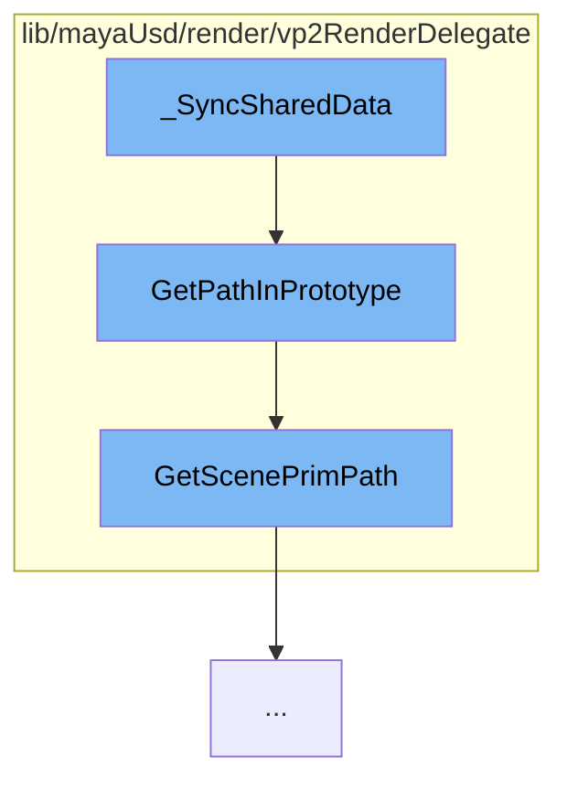

This document will explain the flow of the function `_SyncSharedData::lib/mayaUsd/render/vp2RenderDelegate/mayaPrimCommon.cpp` in the Maya USD plugin. The flow includes:

1. Calling `GetPathInPrototype` function
2. Calling `GetScenePrimPath` function.



<SwmSnippet path="/lib/mayaUsd/render/vp2RenderDelegate/proxyRenderDelegate.cpp" line="899">

---

# Calling GetPathInPrototype function

The function `GetPathInPrototype` is called first. It takes an `id` as an argument and returns an `InstancePrototypePath`. It uses the `GetScenePrimPath` function to get the `usdInstancePath`. Depending on the `instancerContext`, it returns either a point instancing path or a native instancing path.

```c++
InstancePrototypePath ProxyRenderDelegate::GetPathInPrototype(const SdfPath& id)
{
    HdInstancerContext instancerContext;
    auto               usdInstancePath = GetScenePrimPath(id, 0, &instancerContext);

    // In case of point instancer, we already have the path in prototype, return it.
    if (!instancerContext.empty()) {
        return InstancePrototypePath(usdInstancePath, kPointInstancing);
    }

    // In case of a native instance, obtain the path in prototype and return it.
    auto usdInstancePrim = _proxyShapeData->UsdStage()->GetPrimAtPath(usdInstancePath);
    auto usdPrototypePath = usdInstancePrim.GetPrimInPrototype().GetPath();
    return InstancePrototypePath(usdPrototypePath, kNativeInstancing);
}
```

---

</SwmSnippet>

<SwmSnippet path="/lib/mayaUsd/render/vp2RenderDelegate/proxyRenderDelegate.cpp" line="1304">

---

# Calling GetScenePrimPath function

The function `GetScenePrimPath` is called within `GetPathInPrototype`. It resolves an `rprimId` and `instanceIndex` back to the original USD gprim and instance index. Depending on the USD_IMAGING_API_VERSION, it uses different methods to get the `usdPath`.

```c++
// Resolves an rprimId and instanceIndex back to the original USD gprim and instance index.
// see UsdImagingDelegate::GetScenePrimPath.
// This version works against all the older versions of USD we care about. Once those old
// versions go away, and we only support USD_IMAGING_API_VERSION >= 14 then we can remove
// this function.
#if defined(USD_IMAGING_API_VERSION) && USD_IMAGING_API_VERSION >= 14
SdfPath ProxyRenderDelegate::GetScenePrimPath(
    const SdfPath&      rprimId,
    int                 instanceIndex,
    HdInstancerContext* instancerContext) const
#else
SdfPath ProxyRenderDelegate::GetScenePrimPath(const SdfPath& rprimId, int instanceIndex) const
#endif
{
#if defined(USD_IMAGING_API_VERSION) && USD_IMAGING_API_VERSION >= 16
    // Can no longer pass ALL_INSTANCES as the instanceIndex
    SdfPath usdPath = (instanceIndex == UsdImagingDelegate::ALL_INSTANCES)
        ? rprimId.ReplacePrefix(_sceneDelegate->GetDelegateID(), SdfPath::AbsoluteRootPath())
        : _sceneDelegate->GetScenePrimPath(rprimId, instanceIndex, instancerContext);
#elif defined(USD_IMAGING_API_VERSION) && USD_IMAGING_API_VERSION >= 14
    SdfPath usdPath = _sceneDelegate->GetScenePrimPath(rprimId, instanceIndex, instancerContext);
```

---

</SwmSnippet>

&nbsp;

*This is an auto-generated document by Swimm AI 🌊 and has not yet been verified by a human*

<SwmMeta version="3.0.0" repo-id="Z2l0aHViJTNBJTNBbWF5YS11c2QlM0ElM0FnaWxhZG5hdm90" repo-name="maya-usd" doc-type="flows"><sup>Powered by [Swimm](/)</sup></SwmMeta>
