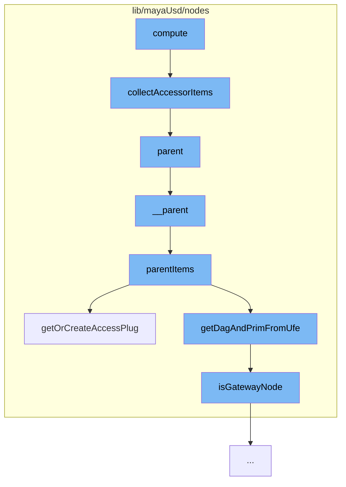

This document will cover the process of handling Proxy Accessors in the Maya-USD plugin, which includes:

1. Collecting Accessor Items
2. Parenting Items
3. Creating or Getting Access Plugs
4. Checking Gateway Nodes



<SwmSnippet path="/lib/mayaUsd/nodes/proxyAccessor.cpp" line="285">

---

# Collecting Accessor Items

The function `collectAccessorItems` is used to collect all accessor items for a given node. It clears any existing items, then iterates over the attributes of the node, filtering out child attributes and those not named as accessor plugs. For each valid attribute, it creates an item and adds it to the input or output items list, depending on whether it's an input or output plug.

```c++
void ProxyAccessor::collectAccessorItems(MObject node)
{
    if (_validAccessorItems)
        return;

    MProfilingScope profilingScope(
        kAccessorProfilerCategory, MProfiler::kColorB_L1, "Generate acceleration structure");

    _accessorInputItems.clear();
    _accessorOutputItems.clear();

    _validAccessorItems = true;

    auto stage = getUsdStage();
    if (!stage)
        return;

    ArResolverScopedCache resolverCache;

    MFnDependencyNode fnDep(node);
    unsigned          attrCount = fnDep.attributeCount();
```

---

</SwmSnippet>

<SwmSnippet path="/lib/mayaUsd/nodes/proxyAccessor.py" line="247">

---

# Parenting Items

The function `parentItems` is used to parent UFE children to a UFE parent. It first checks if the parent is a UFE-USD item, then gets or creates access plugs for the parent. It then iterates over the children, connecting parent-child attributes if the child is not a UFE-USD item.

```python
def parentItems(ufeChildren, ufeParent, connect=True):
    if not isUfeUsdPath(ufeParent):
        print("This method implements parenting under USD prim. Please provide UFE-USD item for ufeParent")
        return

    parentDagPath, parentUsdPrimPath = getDagAndPrimFromUfe(ufeParent)
    parentValueAttr = getOrCreateAccessPlug(ufeParent, '', Sdf.ValueTypeNames.Matrix4d )
    parentConnectionAttr = parentDagPath+'.'+parentValueAttr+'[0]' if parentValueAttr else None
    parentValueAttr = getOrCreateAccessPlug(ufeParent, 'combinedVisibility' )
    parentVisibilityAttr = parentDagPath+'.'+parentValueAttr if parentValueAttr else None

    for ufeChild in ufeChildren:
        if isUfeUsdPath(ufeChild):
            print("Parenting of USD to USD is NOT implemented here")
            continue

        childDagPath = getDagAndPrimFromUfe(ufeChild)[0]

        print('{} "{}" to "{}{}"'.format(
            ["Unparenting", "Parenting"][connect],
            childDagPath, parentDagPath, parentUsdPrimPath))
```

---

</SwmSnippet>

<SwmSnippet path="/lib/mayaUsd/nodes/proxyAccessor.py" line="194">

---

# Creating or Getting Access Plugs

The function `getOrCreateAccessPlug` is used to get or create an access plug for a given UFE object and USD attribute name. If the plug doesn't exist, it creates one using the DAG path and prim path from the UFE object, and the SDF path from the USD attribute name.

```python
def getOrCreateAccessPlug(ufeObject, usdAttrName, sdfValueType=Sdf.ValueTypeNames.Matrix4d):
    # Look for it first
    plugNameValueAttr = getAccessPlug(ufeObject,usdAttrName,sdfValueType)

    # Create if doesn't exist
    if plugNameValueAttr == None:
        selectedDagPath, selectedPrimPath = getDagAndPrimFromUfe(ufeObject)

        if selectedDagPath == None or selectedPrimPath == None:
            return None

        sdfPath = Sdf.Path(selectedPrimPath)
        if not usdAttrName == "":
            sdfPath = getPrimAttrPath(sdfPath, selectedPrimPath, usdAttrName)

        plugNameValueAttr = getAccessPlugName(sdfPath)

        if not usdAttrName == "":
            sdfValueType = getSdfValueType(ufeObject,usdAttrName)
            createAccessPlug(selectedDagPath, sdfPath, sdfValueType)
        else:
```

---

</SwmSnippet>

<SwmSnippet path="/lib/mayaUsd/nodes/proxyAccessor.py" line="34">

---

# Checking Gateway Nodes

The function `isGatewayNode` is used to check if a given DAG path is a gateway node. It does this by checking if the node type of the DAG path is inherited from 'mayaUsdProxyShapeBase'.

```python
def isGatewayNode(dagPath):
    baseProxyShape = 'mayaUsdProxyShapeBase'
    return baseProxyShape in cmds.nodeType(dagPath, inherited=True)
```

---

</SwmSnippet>

&nbsp;

_This is an auto-generated document by Swimm AI 🌊 and has not yet been verified by a human_

<SwmMeta version="3.0.0" repo-id="Z2l0aHViJTNBJTNBbWF5YS11c2QlM0ElM0FnaWxhZG5hdm90" repo-name="maya-usd"><sup>Powered by [Swimm](/)</sup></SwmMeta>
