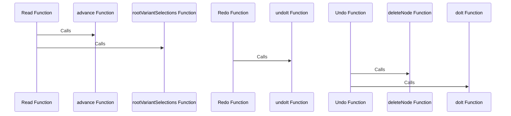

This document will cover the handling of undo and redo operations in the maya-usd repository. We'll cover:

1. How undo and redo operations are implemented in the codebase.
2. The functions and methods involved in these operations.
3. The flow of data during these operations.

<SwmSnippet path="/lib/mayaUsd/fileio/jobs/readJob.cpp" line="194">

---

# Undo and Redo Operations Implementation

The `Read` function in `readJob.cpp` is where the undo and redo operations are handled. It uses the `MayaUsd::OpUndoItemMuting` to mute the global undo info recording system, and handles all operations within the function itself.

```c++
bool UsdMaya_ReadJob::Read(std::vector<MDagPath>* addedDagPaths)
{
    // When we are called from PrimUpdaterManager we should already have
    // a computation scope. If we are called from elsewhere don't show any
    // progress bar here.
    MayaUsd::ProgressBarScope progressBar(16);

    // Do not use the global undo info recording system.
    // The read job Undo() / redo() functions will handle all operations.
    MayaUsd::OpUndoItemMuting undoMuting;

    MStatus status;

    if (!TF_VERIFY(!mImportData.empty())) {
        return false;
    }

    SdfLayerRefPtr rootLayer = SdfLayer::FindOrOpen(mImportData.filename());
    if (!rootLayer) {
        return false;
    }
```

---

</SwmSnippet>

<SwmSnippet path="/lib/mayaUsd/fileio/jobs/readJob.cpp" line="692">

---

The `Redo` function in `readJob.cpp` also mutes the global undo info recording system and handles all operations within the function. It calls the `undoIt` method to undo the undo operation and runs the `Redo` method for all chasers.

```c++
bool UsdMaya_ReadJob::Redo()
{
    // Do not use the global undo info recording system.
    // The read job Undo() / redo() functions will handle all operations.
    MayaUsd::OpUndoItemMuting undoMuting;

    // Undo the undo
    MStatus status = mDagModifierUndo.undoIt();

    // NOTE: (yliangsiew) All chasers need to have their Redo run as well.
    for (const UsdMayaImportChaserRefPtr& chaser : this->mImportChasers) {
        bool bStat = chaser->Redo();
        if (!bStat) {
            TF_WARN("Failed to execute import chaser's Redo()!");
            return false;
        }
    }

    return (status == MS::kSuccess);
}
```

---

</SwmSnippet>

<SwmSnippet path="/lib/mayaUsd/fileio/jobs/readJob.cpp" line="713">

---

The `Undo` function in `readJob.cpp` mutes the global undo info recording system and handles all operations within the function. It runs the `Undo` method for all chasers and deletes top level DAG nodes and any DG nodes.

```c++
bool UsdMaya_ReadJob::Undo()
{
    // Do not use the global undo info recording system.
    // The read job Undo() / redo() functions will handle all operations.
    MayaUsd::OpUndoItemMuting undoMuting;

    // NOTE: (yliangsiew) All chasers need to have their Undo run as well.
    for (const UsdMayaImportChaserRefPtr& chaser : this->mImportChasers) {
        bool bStat = chaser->Undo();
        if (!bStat) {
            TF_WARN("Failed to execute import chaser's Redo()!");
            return false;
        }
    }

    if (!mDagModifierSeeded) {
        mDagModifierSeeded = true;
        MStatus dagStatus;
        // Construct list of top level DAG nodes to delete and any DG nodes
        for (auto& it : mNewNodeRegistry) {
            if (it.second != mMayaRootDagPath.node()) { // if not the parent root node
```

---

</SwmSnippet>

# Functions and Methods Involved

The `advance` function in `progressBarScope.cpp` is called within the `Read` function to progress the progress bar.

<SwmSnippet path="/lib/mayaUsd/fileio/importData.cpp" line="117">

---

The `rootVariantSelections` function in `importData.cpp` is called within the `Read` function to get the root variant selections.

```c++
const SdfVariantSelectionMap& ImportData::rootVariantSelections() const { return _rootVariants; }
```

---

</SwmSnippet>

<SwmSnippet path="/lib/mayaUsd/commands/baseImportCommand.cpp" line="307">

---

The `undoIt` function in `baseImportCommand.cpp` is called within the `Redo` function to undo the undo operation.

```c++
/* virtual */
MStatus MayaUSDImportCommand::undoIt()
{
    if (!_readJob) {
        return MS::kFailure;
    }

    bool success = _readJob->Undo();

    return (success) ? MS::kSuccess : MS::kFailure;
}
```

---

</SwmSnippet>

<SwmSnippet path="/lib/mayaUsd/undo/OpUndoItems.cpp" line="76">

---

The `deleteNode` function in `OpUndoItems.cpp` is called within the `Undo` function to delete nodes.

```c++
MStatus NodeDeletionUndoItem::deleteNode(
    const std::string name,
    const MString&    nodeName,
    const MObject&    node,
    OpUndoItemList&   undoInfo)
{
    // Avoid deleting the same node twice.
    if (!MObjectHandle(node).isValid())
        return MS::kSuccess;

    const MString cmd = formatCommand("delete", node);

    std::string fullName
        = name + std::string(" \"") + std::string(cmd.asChar()) + std::string("\"");
    auto item = std::make_unique<NodeDeletionUndoItem>(std::move(fullName));

    MStatus status = item->_modifier.commandToExecute(cmd);
    if (status != MS::kSuccess)
        return status;

    status = item->_modifier.doIt();
```

---

</SwmSnippet>

<SwmSnippet path="/lib/mayaUsd/commands/baseExportCommand.cpp" line="288">

---

The `doIt` function in `baseExportCommand.cpp` is called within the `Undo` function to execute the undo operation.

```c++
MStatus MayaUSDExportCommand::doIt(const MArgList& args)
{
    try {
        MStatus status;

        MArgDatabase argData(syntax(), args, &status);

        // Check that all flags were valid
        if (status != MS::kSuccess) {
            return status;
        }

        if (argData.isFlagSet("shadingMode")) {
            MString stringVal;
            argData.getFlagArgument("shadingMode", 0, stringVal);
            TfToken shadingMode(stringVal.asChar());

            if (!shadingMode.IsEmpty()
                && UsdMayaShadingModeRegistry::GetInstance().GetExporter(shadingMode) == nullptr
                && shadingMode != UsdMayaShadingModeTokens->none) {
                MGlobal::displayError(
```

---

</SwmSnippet>

<SwmSnippet path="/lib/mayaUsd/undo/OpUndoItems.cpp" line="314">

---

The `redo` function in `OpUndoItems.cpp` is used to redo operations.

```c++
bool FunctionUndoItem::redo()
{
    if (!_redo)
        return false;

    // During undo and redo the original command and its undo item list
    // no longer exist. All operations were already recorded (and are
    // in fact being redone!), so mute the undo item recording.
    OpUndoItemMuting muting;
    return _redo();
}
```

---

</SwmSnippet>

<SwmSnippet path="/lib/mayaUsd/undo/OpUndoItems.cpp" line="522">

---

The `redo` function in `OpUndoItems.cpp` is used to redo operations.

```c++
bool UfeCommandUndoItem::redo()
{
    _command->redo();
    return true;
}
```

---

</SwmSnippet>

<SwmSnippet path="/lib/mayaUsd/fileio/utils/readUtil.cpp" line="974">

---

The `_CreateAnimCurveForPlug` function in `readUtil.cpp` is used to create an animation curve to be connected to a Maya MPlug, in order to represent an animated attribute.

```c++
// Create an animation curve to be connected to a Maya MPlug,
// in order to represent an animated attribute
static bool _CreateAnimCurveForPlug(
    MPlug                     plug,
    MTimeArray&               timeArray,
    MDoubleArray&             valueArray,
    UsdMayaPrimReaderContext* context)
{
    MFnAnimCurve animFn;
    MStatus      status;
    MObject      animObj = animFn.create(plug, nullptr, &status);
    CHECK_MSTATUS_AND_RETURN(status, false);

    status = animFn.addKeys(&timeArray, &valueArray);
    CHECK_MSTATUS_AND_RETURN(status, false);

    if (context) {
        // used for undo/redo
        context->RegisterNewMayaNode(animFn.name().asChar(), animObj);
    }

```

---

</SwmSnippet>

<SwmSnippet path="/lib/mayaUsd/fileio/primReaderContext.cpp" line="71">

---

The `RegisterNewMayaNode` function in `primReaderContext.cpp` is called within the `_CreateAnimCurveForPlug` function to register new Maya nodes for undo/redo.

```c++
void UsdMayaPrimReaderContext::RegisterNewMayaNode(const std::string& path, const MObject& mayaNode)
    const
{
    if (_pathNodeMap) {
        _pathNodeMap->insert(std::make_pair(path, mayaNode));
    }
    if (_trackedNewMayaNodes) {
        _trackedNewMayaNodes->push_back(mayaNode);
    }
}
```

---

</SwmSnippet>



<SwmSnippet path="/lib/mayaUsd/ufe/UsdCodeWrapperHandler.cpp" line="26">

---

# Data Flow During Operations

The `UsdEditRoutingCodeWrapper` class in `UsdCodeWrapperHandler.cpp` is a code wrapper that does edit routing for a command name by its operation. The edit routing decision is cached after the first sub-operation and is reused in subsequent sub-operations. This ensures the same edit routing is used during a command execution and during undo and redo.

```c++
// A code wrapper that does edit routing for a command name by its operation.
// The edit routing decision is cached after the first sub-operation and is
// reused in subsequent sub-operations. This ensures the same edit routing is
// used during a command execution and during undo and redo.
//
// Note: the code wrapper is the same for the command execute, undo and redo,
//       so we don't need the sub-operation name.
class UsdEditRoutingCodeWrapper : public Ufe::CodeWrapper
{
public:
    UsdEditRoutingCodeWrapper(const Ufe::Selection& selection, const std::string& operationName)
        : _prim(findPrimInSelection(selection))
        , _operationName(PXR_NS::TfToken(operationName))
    {
    }

    void prelude(const std::string& /* subOperation */) override
    {
        if (_alreadyRouted) {
            _editRouterContext
                = std::make_unique<UsdUfe::OperationEditRouterContext>(_stage, _layer);
```

---

</SwmSnippet>

<SwmSnippet path="/lib/usdUfe/ufe/UsdUndoableCommand.cpp" line="42">

---

The `UsdUndoCapture` class in `UsdUndoableCommand.cpp` is used to capture undo and redo operations in USD.

```c++
void UsdUndoCapture::undoUsdChanges() { _undoableItem.undo(); }

void UsdUndoCapture::redoUsdChanges() { _undoableItem.redo(); }

} // namespace USDUFE_NS_DEF
```

---

</SwmSnippet>

&nbsp;

*This is an auto-generated document by Swimm AI 🌊 and has not yet been verified by a human*

<SwmMeta version="3.0.0" repo-id="Z2l0aHViJTNBJTNBbWF5YS11c2QlM0ElM0FnaWxhZG5hdm90" repo-name="maya-usd" doc-type="follow-up"><sup>Powered by [Swimm](/)</sup></SwmMeta>
