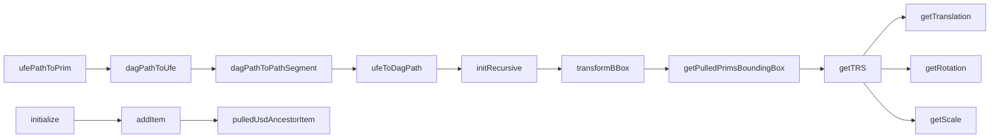

UFE, or Universal Front End, is a key component in the 'maya-usd' repository. It is a system that allows multiple runtimes to provide scene data in a common format, enabling a single user interface to support multiple runtimes. In the context of 'maya-usd', UFE is used to integrate and interact with Pixar's Universal Scene Description (USD) through Autodesk's Maya software. It provides a bridge between the USD data and the Maya interface, allowing developers to manipulate USD data using familiar Maya commands and tools.

<SwmSnippet path="/lib/mayaUsd/ufe/Global.cpp" line="182">

---

## UFE Initialization

The `initialize` function in `Global.cpp` is a key part of setting up UFE for use in the Maya-USD plugin. It sets up the necessary functions and handlers for the plugin to work correctly with UFE.

```c++
// Only intended to be called by the plugin initialization, to
// initialize the stage model.
MStatus initialize()
{
    // If we're already registered, do nothing.
    if (gRegistrationCount++ > 0)
        return MS::kSuccess;

    // Set the Maya specific functions required for the UsdUfe plugin to work correctly.
    UsdUfe::DCCFunctions dccFunctions;
    dccFunctions.stageAccessorFn = mayaGetStage;
    dccFunctions.stagePathAccessorFn = MayaUsd::ufe::stagePath;
    dccFunctions.ufePathToPrimFn = MayaUsd::ufe::ufePathToPrim;
    dccFunctions.timeAccessorFn = MayaUsd::ufe::getTime;
    dccFunctions.saveStageLoadRulesFn = MayaUsd::MayaUsdProxyShapeStageExtraData::saveLoadRules;
    dccFunctions.uniqueChildNameFn = MayaUsd::ufe::uniqueChildNameMayaStandard;
    dccFunctions.displayMessageFn[static_cast<int>(UsdUfe::MessageType::kInfo)]
        = displayInfoMessage;
    dccFunctions.displayMessageFn[static_cast<int>(UsdUfe::MessageType::kWarning)]
        = displayWarningMessage;
    dccFunctions.displayMessageFn[static_cast<int>(UsdUfe::MessageType::KError)]
```

---

</SwmSnippet>

<SwmSnippet path="/lib/mayaUsd/ufe/UsdScaleUndoableCommand.cpp" line="43">

---

## UFE Usage in Commands

UFE is used in various commands in the codebase. For example, in `UsdScaleUndoableCommand.cpp`, the `initialize` function is called within the `create` function to set up the command for execution.

```c++
    auto cmd = std::make_shared<MakeSharedEnabler<UsdScaleUndoableCommand>>(path, x, y, z);
    cmd->initialize();
    return cmd;
```

---

</SwmSnippet>

<SwmSnippet path="/lib/mayaUsd/ufe/UsdUIUfeObserver.h" line="27">

---

## UFE Observers

UFE observers, like `UsdUIUfeObserver`, are used to respond to UFE notifications by updating the UI. This allows for changes in the USD data to be reflected in Maya's interface.

```c
//! \brief Helper class used to receive UFE notifications and respond to them by updating UI.
class UsdUIUfeObserver : public Ufe::Observer
{
public:
    UsdUIUfeObserver() = default;

    MAYAUSD_DISALLOW_COPY_MOVE_AND_ASSIGNMENT(UsdUIUfeObserver);

    //! Create/Destroy a UsdUIUfeObserver.
    static void create();
    static void destroy();

    void operator()(const Ufe::Notification& notification) override;

private:
    static Ufe::Observer::Ptr ufeObserver;
};
```

---

</SwmSnippet>

<SwmSnippet path="/lib/mayaUsd/ufe/Utils.h" line="147">

---

## UFE and Transformations

UFE is also used for handling transformations. Functions like `toUfe` in `Utils.h` convert USD transformation data into a format that can be used by UFE.

```c
//! Copy the argument vector into the return vector.
inline Ufe::Vector3d toUfe(const PXR_NS::GfVec3d& src)
{
    return Ufe::Vector3d(src[0], src[1], src[2]);
}
```

---

</SwmSnippet>

This section covers the main functions used in the 'maya-usd' repository for transformation operations and UI interactions. These functions are implemented in various files and are central to the functionality of the repository.

<SwmSnippet path="/lib/mayaUsd/ufe/Utils.cpp" line="103">

---

## ufePathToPrim Function

The 'ufePathToPrim' function is used to convert a UFE path to a USD primitive. It takes a UFE path as input and returns a USD primitive. This function is used in various places in the codebase to perform operations on USD primitives using UFE paths.

```c++
UsdPrim ufePathToPrim(const Ufe::Path& path)
{
    // When called we do not make any assumption on whether or not the
    // input path is valid.

    const Ufe::Path ufePrimPath = UsdUfe::stripInstanceIndexFromUfePath(path);

    const Ufe::Path::Segments& segments = ufePrimPath.getSegments();
    if (!TF_VERIFY(!segments.empty(), kIllegalUFEPath, path.string().c_str())) {
        return UsdPrim();
    }
    auto stage = getStage(Ufe::Path(segments[0]));
    if (!stage) {
        // Do not output any TF message here (such as TF_WARN). A low-level function
        // like this should not be outputting any warnings messages. It is allowed to
        // call this method with a properly composed Ufe path, but one that doesn't
        // actually point to any valid prim.
        return UsdPrim();
    }

    // If there is only a single segment in the path, it must point to the
```

---

</SwmSnippet>

<SwmSnippet path="/lib/mayaUsd/ufe/Utils.cpp" line="211">

---

## dagPathToUfe Function

The 'dagPathToUfe' function is used to convert a DAG path to a UFE path. This function is used when a DAG path is available and a UFE path is required for further operations.

```c++
Ufe::Path dagPathToUfe(const MDagPath& dagPath)
{
    // This function can only create UFE Maya scene items with a single
    // segment, as it is only given a Dag path as input.
    return Ufe::Path(dagPathToPathSegment(dagPath));
}
```

---

</SwmSnippet>

<SwmSnippet path="/lib/mayaUsd/ufe/Utils.cpp" line="218">

---

## dagPathToPathSegment Function

The 'dagPathToPathSegment' function is used to convert a DAG path to a UFE path segment. This function is used when a DAG path is available and a UFE path segment is required for further operations.

```c++
Ufe::PathSegment dagPathToPathSegment(const MDagPath& dagPath)
{
    MStatus status;
    // The Ufe path includes a prepended "world" that the dag path doesn't have
    size_t                       numUfeComponents = dagPath.length(&status) + 1;
    Ufe::PathSegment::Components components;
    components.resize(numUfeComponents);
    components[0] = Ufe::PathComponent("world");
    MDagPath path = dagPath; // make an editable copy

    // Pop nodes off the path string one by one, adding them to the correct
    // position in the components vector as we go. Use i>0 as the stopping
    // condition because we've already written to element 0 of the components
    // vector.
    for (int i = numUfeComponents - 1; i > 0; i--) {
        MObject node = path.node(&status);

        if (MS::kSuccess != status)
            return Ufe::PathSegment("", g_MayaRtid, '|');

        std::string componentString(MFnDependencyNode(node).name(&status).asChar());
```

---

</SwmSnippet>

<SwmSnippet path="/lib/mayaUsd/ufe/Utils.cpp" line="250">

---

## ufeToDagPath Function

The 'ufeToDagPath' function is used to convert a UFE path to a DAG path. This function is used when a UFE path is available and a DAG path is required for further operations.

```c++
MDagPath ufeToDagPath(const Ufe::Path& ufePath)
{
    if (ufePath.runTimeId() != g_MayaRtid || ufePath.nbSegments() > 1) {
        return MDagPath();
    }
    return UsdMayaUtil::nameToDagPath(Ufe::PathString::string(ufePath));
}
```

---

</SwmSnippet>

<SwmSnippet path="/lib/mayaUsd/ufe/Utils.cpp" line="348">

---

## initRecursive Function

The 'initRecursive' function is used to initialize a UFE scene item recursively. This function is used to set up the UFE scene items for the USD stage.

```c++
void ReplicateExtrasFromUSD::initRecursive(Ufe::SceneItem::Ptr ufeItem) const
{
    auto hier = Ufe::Hierarchy::hierarchy(ufeItem);
    if (hier) {
        // Go through the entire hierarchy
        for (auto child : hier->children()) {
            initRecursive(child);
        }
    }

#ifdef MAYA_HAS_DISPLAY_LAYER_API
    MString displayLayerPath(Ufe::PathString::string(ufeItem->path()).c_str());
    handleDisplayLayer(displayLayerPath, [this, &ufeItem](const MFnDisplayLayer& displayLayer) {
        if (displayLayer.name() != "defaultLayer") {
            _displayLayerMap[ufeItem->path()] = displayLayer.object();
        }
    });
#endif
}
```

---

</SwmSnippet>

<SwmSnippet path="/lib/mayaUsd/ufe/Utils.cpp" line="473">

---

## transformBBox Function

The 'transformBBox' function is used to transform a bounding box using a given matrix. This function is used when a bounding box needs to be transformed according to a specific transformation matrix.

```c++
static Ufe::BBox3d transformBBox(const Ufe::Matrix4d& matrix, const Ufe::BBox3d& bbox)
{
    return transformBBox(toUsd(matrix), bbox);
}
```

---

</SwmSnippet>

<SwmSnippet path="/lib/mayaUsd/ufe/Utils.cpp" line="499">

---

## getPulledPrimsBoundingBox Function

The 'getPulledPrimsBoundingBox' function is used to get the bounding box of the pulled primitives for a given path. This function is used when the bounding box of the pulled primitives is required for further operations.

```c++
Ufe::BBox3d getPulledPrimsBoundingBox(const Ufe::Path& path)
{
    Ufe::BBox3d ufeBBox;

#ifdef HAS_ORPHANED_NODES_MANAGER
    const auto& updaterMgr = PXR_NS::PrimUpdaterManager::getInstance();
    PXR_NS::PrimUpdaterManager::PulledPrimPaths pulledPaths = updaterMgr.getPulledPrimPaths();
    for (const auto& paths : pulledPaths) {
        const Ufe::Path& pulledPath = paths.first;

        if (pulledPath == path)
            continue;

        if (!pulledPath.startsWith(path))
            continue;

        // Note: Maya implementation of the Object3d UFE interface does not
        //       implement the boundingBox() function. So we ask the DAG instead.
        const MDagPath& mayaPath = paths.second;
        Ufe::BBox3d     pulledBBox = getTransformedBBox(mayaPath);

```

---

</SwmSnippet>

<SwmSnippet path="/lib/mayaUsd/ufe/XformOpUtils.cpp" line="137">

---

## getTRS Function

The 'getTRS' function is used to decompose a matrix into translation, rotation, and scale components. This function is used when the individual components of a transformation matrix are required for further operations.

```c++
void getTRS(const Ufe::Matrix4d& m, Ufe::Vector3d* t, Ufe::Vector3d* r, Ufe::Vector3d* s)
{
    // Decompose new matrix to extract TRS.  Neither GfMatrix4d::Factor
    // nor GfTransform decomposition provide results that match Maya,
    // so use MTransformationMatrix.
    MMatrix mm;
    std::memcpy(mm[0], &m.matrix[0][0], sizeof(double) * 16);
    MTransformationMatrix xformM(mm);
    if (t) {
        auto tv = xformM.getTranslation(MSpace::kTransform);
        *t = Ufe::Vector3d(tv[0], tv[1], tv[2]);
    }
    if (r) {
        double rv[3];
        // We created the MTransformationMatrix with the default XYZ rotation
        // order, so rotOrder parameter is unused.
        MTransformationMatrix::RotationOrder rotOrder;
        xformM.getRotation(rv, rotOrder);
        constexpr double radToDeg = 57.295779506;
        *r = Ufe::Vector3d(rv[0] * radToDeg, rv[1] * radToDeg, rv[2] * radToDeg);
    }
```

---

</SwmSnippet>

<SwmSnippet path="/lib/mayaUsd/ufe/XformOpUtils.cpp" line="116">

---

## getTranslation Function

The 'getTranslation' function is used to get the translation component of a matrix. This function is used when the translation component of a transformation matrix is required for further operations.

```c++
Ufe::Vector3d getTranslation(const Ufe::Matrix4d& m)
{
    Ufe::Vector3d t;
    getTRS(m, &t, nullptr, nullptr);
    return t;
}
```

---

</SwmSnippet>

<SwmSnippet path="/lib/mayaUsd/ufe/XformOpUtils.cpp" line="123">

---

## getRotation Function

The 'getRotation' function is used to get the rotation component of a matrix. This function is used when the rotation component of a transformation matrix is required for further operations.

```c++
Ufe::Vector3d getRotation(const Ufe::Matrix4d& m)
{
    Ufe::Vector3d r;
    getTRS(m, nullptr, &r, nullptr);
    return r;
}
```

---

</SwmSnippet>

<SwmSnippet path="/lib/mayaUsd/ufe/XformOpUtils.cpp" line="130">

---

## getScale Function

The 'getScale' function is used to get the scale component of a matrix. This function is used when the scale component of a transformation matrix is required for further operations.

```c++
Ufe::Vector3d getScale(const Ufe::Matrix4d& m)
{
    Ufe::Vector3d s;
    getTRS(m, nullptr, nullptr, &s);
    return s;
}
```

---

</SwmSnippet>

<SwmSnippet path="/lib/mayaUsd/ufe/Global.cpp" line="184">

---

## initialize Function

The 'initialize' function is used to initialize the stage model. This function is called during the plugin initialization process.

```c++
MStatus initialize()
{
    // If we're already registered, do nothing.
    if (gRegistrationCount++ > 0)
        return MS::kSuccess;

    // Set the Maya specific functions required for the UsdUfe plugin to work correctly.
    UsdUfe::DCCFunctions dccFunctions;
    dccFunctions.stageAccessorFn = mayaGetStage;
    dccFunctions.stagePathAccessorFn = MayaUsd::ufe::stagePath;
    dccFunctions.ufePathToPrimFn = MayaUsd::ufe::ufePathToPrim;
    dccFunctions.timeAccessorFn = MayaUsd::ufe::getTime;
    dccFunctions.saveStageLoadRulesFn = MayaUsd::MayaUsdProxyShapeStageExtraData::saveLoadRules;
    dccFunctions.uniqueChildNameFn = MayaUsd::ufe::uniqueChildNameMayaStandard;
    dccFunctions.displayMessageFn[static_cast<int>(UsdUfe::MessageType::kInfo)]
        = displayInfoMessage;
    dccFunctions.displayMessageFn[static_cast<int>(UsdUfe::MessageType::kWarning)]
        = displayWarningMessage;
    dccFunctions.displayMessageFn[static_cast<int>(UsdUfe::MessageType::KError)]
        = displayErrorMessage;
    dccFunctions.startWaitCursorFn = mayaStartWaitCursor;
```

---

</SwmSnippet>

<SwmSnippet path="/lib/mayaUsd/ufe/UsdStageMap.cpp" line="133">

---

## addItem Function

The 'addItem' function is used to add an item to the stage map. This function is used when a new item needs to be added to the stage map for further operations.

```c++
void UsdStageMap::addItem(const Ufe::Path& path)
{
    // We expect a path to the proxy shape node, therefore a single segment.
    auto nbSegments = path.nbSegments();
    if (nbSegments != 1) {
        TF_CODING_ERROR(
            "A proxy shape node path can have only one segment, path '%s' has %lu",
            path.string().c_str(),
            nbSegments);
        return;
    }

    // Convert the UFE path to an MObjectHandle.
    auto proxyShape = nameLookup(path);
    if (!proxyShape.isValid()) {
        return;
    }

    // If a proxy shape doesn't yet have a stage, don't add it.
    // We will add it later, when the stage is initialized
    auto obj = proxyShape.object();
```

---

</SwmSnippet>

<SwmSnippet path="/lib/mayaUsd/ufe/MayaUIInfoHandler.cpp" line="34">

---

## pulledUsdAncestorItem Function

The 'pulledUsdAncestorItem' function is used to find a pulled Maya node's USD pulled ancestor by iterating up the Maya path. This function is used when the USD ancestor of a pulled Maya node is required for further operations.

```c++
// Find a pulled Maya node's USD pulled ancestor by iterating up the Maya
// path.  Iteration stops when a Maya node with pull information has been
// found, which can be for the initial path itself, when the Maya node is
// the root of the pulled sub-hierarchy.
//
// Note that if it exists, the USD pulled ancestor prim is inactive, which is
// done to avoid having that prim and its sub-hierarchy exist in the scene as
// stale USD duplicates of Maya pulled nodes.  If the USD pulled ancestor does
// not exist, the argument Maya node is orphaned.
UsdUfe::UsdSceneItem::Ptr pulledUsdAncestorItem(const Ufe::SceneItem::Ptr& mayaItem)
{
    // This function requires a Maya item to compute its USD ancestor.
    if (!TF_VERIFY(mayaItem->runTimeId() == MayaUsd::ufe::getMayaRunTimeId())) {
        return nullptr;
    }

    // Find the pulled ancestor by iterating up the Maya path.
    auto      mayaPath = mayaItem->path();
    bool      found { false };
    Ufe::Path usdItemPath;
    while (!found) {
```

---

</SwmSnippet>



&nbsp;

_This is an auto-generated document by Swimm AI 🌊 and has not yet been verified by a human_

<SwmMeta version="3.0.0" repo-id="Z2l0aHViJTNBJTNBbWF5YS11c2QlM0ElM0FnaWxhZG5hdm90" repo-name="maya-usd"><sup>Powered by [Swimm](/)</sup></SwmMeta>
