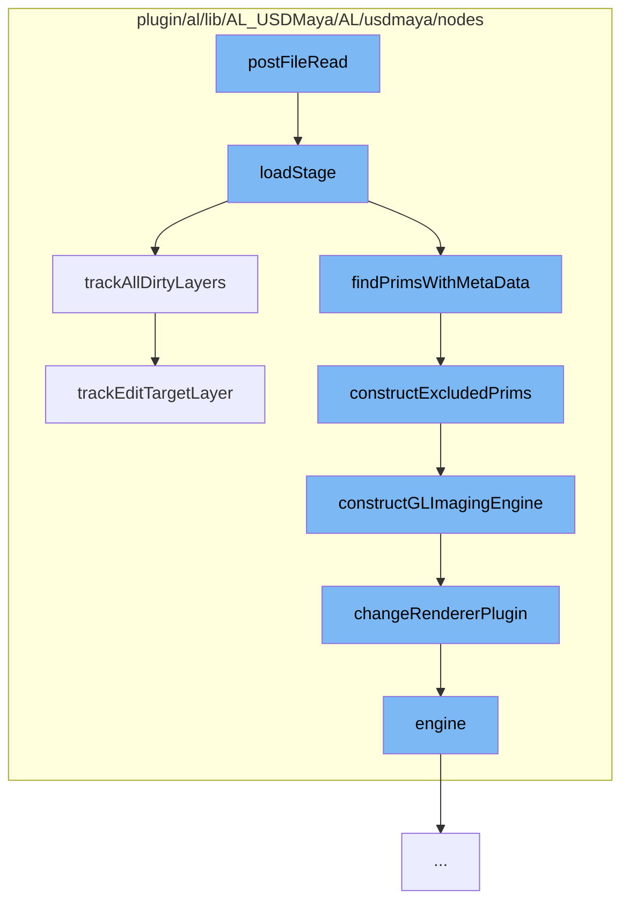

This document will cover the process of loading a USD stage in the Maya environment, which includes:

1. Reading the file and loading the stage
2. Tracking all dirty layers
3. Constructing excluded prims
4. Constructing the GL imaging engine
5. Changing the renderer plugin
6. Tracking the edit target layer.



<SwmSnippet path="/plugin/al/lib/AL_USDMaya/AL/usdmaya/nodes/ProxyShape.cpp" line="1199">

---

# Reading the file and loading the stage

The function `loadStage` is the entry point for loading a USD stage. It reads the file, loads the stage, and triggers events before and after the stage is loaded. It also handles the case where the stage is already loaded and the file path has changed.

```c++
//----------------------------------------------------------------------------------------------------------------------
void ProxyShape::loadStage()
{
    MProfilingScope profilerScope(_proxyShapeProfilerCategory, MProfiler::kColorE_L3, "Load stage");

    TF_DEBUG(ALUSDMAYA_EVALUATION).Msg("ProxyShape::loadStage\n");

    triggerEvent("PreStageLoaded");

    MDataBlock dataBlock = forceCache();

    const int         stageIdVal = inputInt32Value(dataBlock, stageCacheId());
    UsdStageCache::Id stageId = UsdStageCache::Id().FromLongInt(stageIdVal);
    MString           file = inputStringValue(dataBlock, filePath());

    if (m_stage) {
        // In case there was already a stage in m_stage, check to see if it's edit target has been
        // altered.
        trackEditTargetLayer();

        if (StageCache::Get().Contains(stageId)) {
```

---

</SwmSnippet>

<SwmSnippet path="/plugin/al/lib/AL_USDMaya/AL/usdmaya/nodes/ProxyShape.cpp" line="749">

---

# Tracking all dirty layers

The function `trackAllDirtyLayers` is used to track all the dirty layers in the stage. It checks if the edit target layer has been altered and adds it to the layer manager.

```c++
//----------------------------------------------------------------------------------------------------------------------
void ProxyShape::trackAllDirtyLayers(LayerManager* layerManager)
{
    trackEditTargetLayer(layerManager);
    if (!layerManager)
        layerManager = LayerManager::findOrCreateManager();
    auto usedLayer = m_stage->GetUsedLayers();
    for (auto& _layer : usedLayer) {
        if (_layer->IsDirty())
            layerManager->addLayer(_layer);
    }
}
```

---

</SwmSnippet>

<SwmSnippet path="/plugin/al/lib/AL_USDMaya/AL/usdmaya/nodes/proxy/ProxyShapeMetaData.cpp" line="120">

---

# Constructing excluded prims

The function `constructExcludedPrims` is used to construct the excluded prims. It gets the excluded prim paths and if they have changed, it updates them and constructs the GL imaging engine.

```c++
//----------------------------------------------------------------------------------------------------------------------
void ProxyShape::constructExcludedPrims()
{
    MProfilingScope profilerScope(
        _proxyShapeMetadataProfilerCategory, MProfiler::kColorE_L3, "Construct excluded prims");

    auto excludedPaths = getExcludePrimPaths();
    if (m_excludedGeometry != excludedPaths) {
        std::swap(m_excludedGeometry, excludedPaths);
        _IncreaseExcludePrimPathsVersion();
        constructGLImagingEngine();
    }
}
```

---

</SwmSnippet>

<SwmSnippet path="/plugin/al/lib/AL_USDMaya/AL/usdmaya/nodes/ProxyShape.cpp" line="351">

---

# Constructing the GL imaging engine

The function `constructGLImagingEngine` is used to construct the GL imaging engine. It creates a new engine instance and sets the renderer plugin based on the RendererManager setting.

```c++
//----------------------------------------------------------------------------------------------------------------------
void ProxyShape::constructGLImagingEngine()
{
    TF_DEBUG(ALUSDMAYA_EVALUATION).Msg("ProxyShape::constructGLImagingEngine\n");

    MProfilingScope profilerScope(
        _proxyShapeProfilerCategory, MProfiler::kColorE_L3, "Construct GL imaging engine");

    // kBatch does not cover mayapy use, we only need this in interactive mode:
    if (MGlobal::mayaState() == MGlobal::kInteractive) {
        if (m_stage) {
            // function prototype of callback we wish to register
            typedef void (*proxy_function_prototype)(void*, AL::usdmaya::nodes::ProxyShape*);

            // delete previous instance
            destroyGLImagingEngine();
            SdfPathVector excludedGeometryPaths = getExcludePrimPaths();

            m_engine = new Engine(m_path, excludedGeometryPaths);
            // set renderer plugin based on RendererManager setting
            RendererManager* manager = RendererManager::findManager();
```

---

</SwmSnippet>

<SwmSnippet path="/plugin/al/lib/AL_USDMaya/AL/usdmaya/nodes/RendererManager.cpp" line="211">

---

# Changing the renderer plugin

The function `changeRendererPlugin` is used to change the renderer plugin. It checks if the engine exists and then sets the renderer plugin based on the renderer plugin index.

```c++
//----------------------------------------------------------------------------------------------------------------------
void RendererManager::changeRendererPlugin(ProxyShape* proxy, bool creation)
{
    TF_DEBUG(ALUSDMAYA_RENDERER).Msg("RendererManager::changeRendererPlugin\n");
    assert(proxy);
    if (proxy->engine(false)) {
        int rendererId = getRendererPluginIndex();
        if (rendererId >= 0) {
            // Skip redundant renderer changes on ProxyShape creation
            if (rendererId == 0 && creation)
                return;

            assert(static_cast<size_t>(rendererId) < m_rendererPluginsTokens.size());
            TfToken plugin = m_rendererPluginsTokens[rendererId];
            if (!proxy->engine()->SetRendererPlugin(plugin)) {
                MString data(plugin.data());
                MGlobal::displayError(MString("Failed to set renderer plugin: ") + data);
            }
        } else {
            MPlug   plug(thisMObject(), m_rendererPluginName);
            MString pluginName = plug.asString();
```

---

</SwmSnippet>

<SwmSnippet path="/plugin/al/lib/AL_USDMaya/AL/usdmaya/nodes/ProxyShape.cpp" line="706">

---

# Tracking the edit target layer

The function `trackEditTargetLayer` is used to track the edit target layer. It checks if the current edit target layer is different from the previous one and if so, it adds the current layer to the layer manager and triggers an event.

```c++
//----------------------------------------------------------------------------------------------------------------------
void ProxyShape::trackEditTargetLayer(LayerManager* layerManager)
{
    MProfilingScope profilerScope(
        _proxyShapeProfilerCategory, MProfiler::kColorE_L3, "Track edit target layer");

    TF_DEBUG(ALUSDMAYA_LAYERS).Msg("ProxyShape::trackEditTargetLayer\n");
    auto stage = getUsdStage();

    if (!stage) {
        TF_DEBUG(ALUSDMAYA_LAYERS).Msg(" - no stage\n");
        return;
    }

    auto currTargetLayer = stage->GetEditTarget().GetLayer();

    TF_DEBUG(ALUSDMAYA_LAYERS)
        .Msg(" - curr target layer: %s\n", currTargetLayer->GetIdentifier().c_str());

    if (m_prevEditTarget != currTargetLayer) {
        if (!layerManager) {
```

---

</SwmSnippet>

&nbsp;

_This is an auto-generated document by Swimm AI 🌊 and has not yet been verified by a human_

<SwmMeta version="3.0.0" repo-id="Z2l0aHViJTNBJTNBbWF5YS11c2QlM0ElM0FnaWxhZG5hdm90" repo-name="maya-usd"><sup>Powered by [Swimm](/)</sup></SwmMeta>
