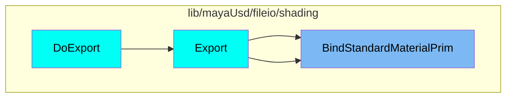
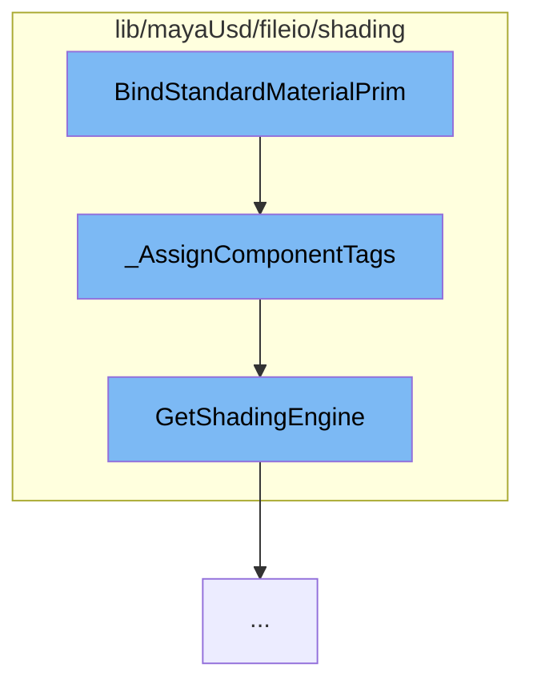

This document will cover the process of binding standard material primitives in the Maya USD plugin, which includes:

1. The function BindStandardMaterialPrim
2. The function \_AssignComponentTags
3. The function GetShadingEngine.

## Where is this flow used?

The flow starts with the function `BindStandardMaterialPrim`. It is called from multiple entry points as represented in the following diagram:



## The flow itself



# BindStandardMaterialPrim

The function `BindStandardMaterialPrim` is the starting point of the flow. It is responsible for binding a standard material primitive to a specific geometry in the scene. This is the first step in the process of exporting shading information from Maya to USD.

<SwmSnippet path="/lib/mayaUsd/fileio/shading/shadingModeExporterContext.cpp" line="844">

---

# \_AssignComponentTags

The function `_AssignComponentTags` is called by `BindStandardMaterialPrim`. It assigns component tags to a set of faces that have roundtrip data. It checks if the component tag is a subset of the material indices and if so, binds the material to the subset. If the component tag is out of sync with the material assignment, it does not attempt to reconcile the situation. This function is crucial in ensuring that the correct shading information is assigned to each face of the geometry.

```c++
/// We might have one or more component tags that have roundtrip data that covers this
// set of faces. Assign them to those tags and return the remaining unhandled faces.
VtIntArray _AssignComponentTags(
    const UsdMayaShadingModeExportContext* ctx,
    const UsdShadeMaterial&                materialToBind,
    const MObjectHandle&                   geomHandle,
    const std::vector<UsdGeomSubset>&      currentGeomSubsets,
    const VtIntArray&                      faceIndices,
    SdfPathSet* const                      boundPrimPaths)
{
    if (currentGeomSubsets.empty() || faceIndices.empty() || !geomHandle.isValid()) {
        return faceIndices;
    }

    JsValue info;
    if (UsdMayaMeshReadUtils::getGeomSubsetInfo(geomHandle.object(), info) && info) {
        auto subsetInfoDict = info.GetJsObject();

        std::set<VtIntArray::ElementType> faceSet, handledSet;
        faceSet.insert(faceIndices.cbegin(), faceIndices.cend());

```

---

</SwmSnippet>

<SwmSnippet path="/lib/mayaUsd/fileio/shading/shadingModeExporterContext.h" line="42">

---

# GetShadingEngine

The function `GetShadingEngine` is called by `_AssignComponentTags`. It retrieves the shading engine associated with the current context. The shading engine is a Maya object that contains information about the shading network for a material. This information is used to correctly bind the material to the geometry in the USD scene.

```c
public:
    void    SetShadingEngine(const MObject& shadingEngine) { _shadingEngine = shadingEngine; }
    MObject GetShadingEngine() const { return _shadingEngine; }

    const UsdStageRefPtr& GetUsdStage() const { return _stage; }
```

---

</SwmSnippet>

&nbsp;

*This is an auto-generated document by Swimm AI 🌊 and has not yet been verified by a human*

<SwmMeta version="3.0.0" repo-id="Z2l0aHViJTNBJTNBbWF5YS11c2QlM0ElM0FnaWxhZG5hdm90" repo-name="maya-usd" doc-type="flows"><sup>Powered by [Swimm](/)</sup></SwmMeta>
