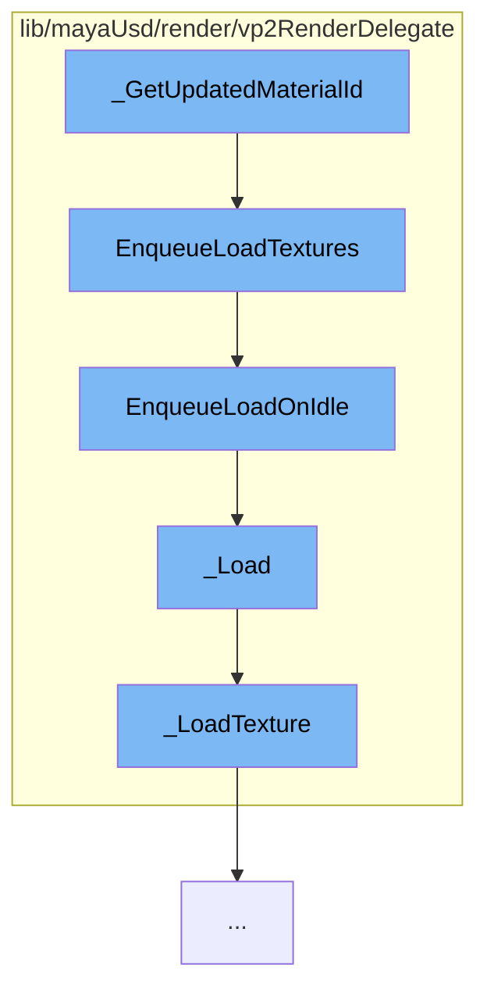

This document will cover the process of updating material ID in the Maya-USD plugin, which includes:

1. Getting the updated material ID
2. Enqueuing the loading of textures
3. Enqueuing the load on idle
4. Loading the texture
5. Loading the texture details



<SwmSnippet path="/lib/mayaUsd/render/vp2RenderDelegate/mayaPrimCommon.cpp" line="1">

---

# Getting the updated material ID

The function `_GetUpdatedMaterialId` is the starting point of this flow. It's responsible for getting the updated material ID which is used for rendering in the Maya viewport.

```c++
//
```

---

</SwmSnippet>

<SwmSnippet path="/lib/mayaUsd/render/vp2RenderDelegate/material.cpp" line="3565">

---

# Enqueuing the loading of textures

The function `EnqueueLoadTextures` is called next. It iterates over the texture loading tasks and enqueues them to be loaded on idle. This is done to optimize the performance by loading the textures when the system is idle.

```c++
void HdVP2Material::EnqueueLoadTextures()
{
    for (const auto& task : _textureLoadingTasks) {
        if (task.second->EnqueueLoadOnIdle()) {
            ++_runningTasksCounter;
        }
    }
}
```

---

</SwmSnippet>

<SwmSnippet path="/lib/mayaUsd/render/vp2RenderDelegate/material.cpp" line="1969">

---

# Enqueuing the load on idle

The function `EnqueueLoadOnIdle` is then called. It pushes the texture loading task to be executed when the system is idle. This is done using the `MGlobal::executeTaskOnIdle` function.

```c++
    bool EnqueueLoadOnIdle()
    {
        if (_started.exchange(true)) {
            return false;
        }
        // Push the texture loading on idle
        auto ret = MGlobal::executeTaskOnIdle(
            [](void* data) {
                auto* task = static_cast<HdVP2Material::TextureLoadingTask*>(data);
                task->_Load();
                // Once it is done, free the memory.
                delete task;
            },
            this);
        return ret == MStatus::kSuccess;
    }
```

---

</SwmSnippet>

<SwmSnippet path="/lib/mayaUsd/render/vp2RenderDelegate/material.cpp" line="1996">

---

# Loading the texture

The function `_Load` is called next. It checks if the task has been terminated, if not, it loads the texture using the `_LoadTexture` function and updates the loaded texture.

```c++
    void _Load()
    {
        if (_terminated) {
            return;
        }
        bool        isSRGB = false;
        MFloatArray uvScaleOffset;
        auto*       texture
            = _LoadTexture(_path, _hasFallbackColor, _fallbackColor, isSRGB, uvScaleOffset);
        if (_terminated) {
            return;
        }
        _parent->_UpdateLoadedTexture(_sceneDelegate, _path, texture, isSRGB, uvScaleOffset);
    }
```

---

</SwmSnippet>

<SwmSnippet path="/lib/mayaUsd/render/vp2RenderDelegate/material.cpp" line="1593">

---

# Loading the texture details

The function `_LoadTexture` is the final step in this flow. It loads the texture from the specified path and returns the texture. It handles different types of textures and formats.

```c++
//! Load texture from the specified path
MHWRender::MTexture* _LoadTexture(
    const std::string& path,
    bool               hasFallbackColor,
    const GfVec4f&     fallbackColor,
    bool&              isColorSpaceSRGB,
    MFloatArray&       uvScaleOffset)
{
    MProfilingScope profilingScope(
        HdVP2RenderDelegate::sProfilerCategory, MProfiler::kColorD_L2, "LoadTexture", path.c_str());

    // If it is a UDIM texture we need to modify the path before calling OpenForReading
    if (HdStIsSupportedUdimTexture(path))
        return _LoadUdimTexture(path, isColorSpaceSRGB, uvScaleOffset);

    MHWRender::MRenderer* const       renderer = MHWRender::MRenderer::theRenderer();
    MHWRender::MTextureManager* const textureMgr
        = renderer ? renderer->getTextureManager() : nullptr;
    if (!TF_VERIFY(textureMgr)) {
        return nullptr;
    }
```

---

</SwmSnippet>

&nbsp;

*This is an auto-generated document by Swimm AI 🌊 and has not yet been verified by a human*

<SwmMeta version="3.0.0" repo-id="Z2l0aHViJTNBJTNBbWF5YS11c2QlM0ElM0FnaWxhZG5hdm90" repo-name="maya-usd" doc-type="flows"><sup>Powered by [Swimm](/)</sup></SwmMeta>
