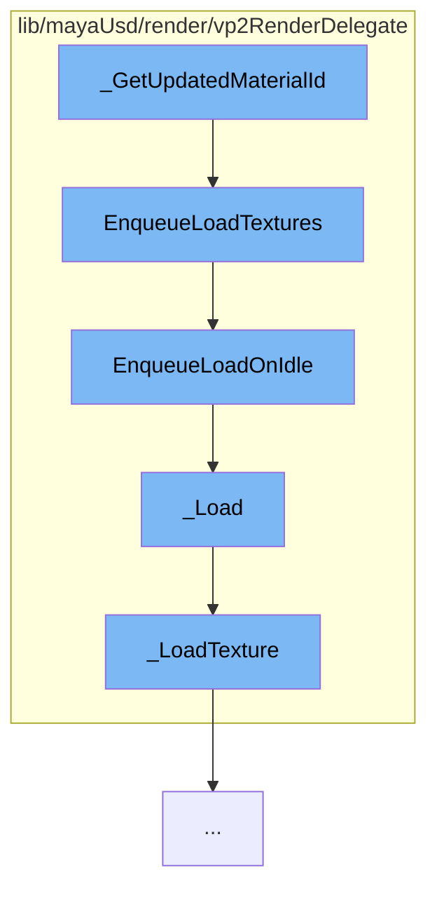

This document will cover the process of updating material ID in the Maya USD plugin, which includes:

1. Getting the updated material ID
2. Enqueueing the loading of textures
3. Enqueueing the load on idle
4. Loading the texture
5. Loading the specific texture.



<SwmSnippet path="/lib/mayaUsd/render/vp2RenderDelegate/mayaPrimCommon.cpp" line="1">

---

# Getting the updated material ID

The function `_GetUpdatedMaterialId` is the starting point of this flow. It is responsible for getting the updated material ID which is used in the rendering process.

```c++
//
```

---

</SwmSnippet>

<SwmSnippet path="/lib/mayaUsd/render/vp2RenderDelegate/material.cpp" line="3565">

---

# Enqueueing the loading of textures

The function `EnqueueLoadTextures` is called next. It enqueues the loading of textures that are needed for the material. This is done asynchronously to improve performance.

```c++
void HdVP2Material::EnqueueLoadTextures()
{
    for (const auto& task : _textureLoadingTasks) {
        if (task.second->EnqueueLoadOnIdle()) {
            ++_runningTasksCounter;
        }
    }
}
```

---

</SwmSnippet>

<SwmSnippet path="/lib/mayaUsd/render/vp2RenderDelegate/material.cpp" line="1969">

---

# Enqueueing the load on idle

The function `EnqueueLoadOnIdle` is then called. It enqueues the loading of textures to be performed when the system is idle. This is to ensure that the loading of textures does not interfere with other important tasks.

```c++
    bool EnqueueLoadOnIdle()
    {
        if (_started.exchange(true)) {
            return false;
        }
        // Push the texture loading on idle
        auto ret = MGlobal::executeTaskOnIdle(
            [](void* data) {
                auto* task = static_cast<HdVP2Material::TextureLoadingTask*>(data);
                task->_Load();
                // Once it is done, free the memory.
                delete task;
            },
            this);
        return ret == MStatus::kSuccess;
    }
```

---

</SwmSnippet>

<SwmSnippet path="/lib/mayaUsd/render/vp2RenderDelegate/material.cpp" line="1996">

---

# Loading the texture

The function `_Load` is called next. It is responsible for actually loading the texture. If the loading process is terminated, it will return early.

```c++
    void _Load()
    {
        if (_terminated) {
            return;
        }
        bool        isSRGB = false;
        MFloatArray uvScaleOffset;
        auto*       texture
            = _LoadTexture(_path, _hasFallbackColor, _fallbackColor, isSRGB, uvScaleOffset);
        if (_terminated) {
            return;
        }
        _parent->_UpdateLoadedTexture(_sceneDelegate, _path, texture, isSRGB, uvScaleOffset);
    }
```

---

</SwmSnippet>

<SwmSnippet path="/lib/mayaUsd/render/vp2RenderDelegate/material.cpp" line="1593">

---

# Loading the specific texture

Finally, the function `_LoadTexture` is called. It loads the specific texture from the specified path. It also handles different formats and color spaces.

```c++
//! Load texture from the specified path
MHWRender::MTexture* _LoadTexture(
    const std::string& path,
    bool               hasFallbackColor,
    const GfVec4f&     fallbackColor,
    bool&              isColorSpaceSRGB,
    MFloatArray&       uvScaleOffset)
{
    MProfilingScope profilingScope(
        HdVP2RenderDelegate::sProfilerCategory, MProfiler::kColorD_L2, "LoadTexture", path.c_str());

    // If it is a UDIM texture we need to modify the path before calling OpenForReading
    if (HdStIsSupportedUdimTexture(path))
        return _LoadUdimTexture(path, isColorSpaceSRGB, uvScaleOffset);

    MHWRender::MRenderer* const       renderer = MHWRender::MRenderer::theRenderer();
    MHWRender::MTextureManager* const textureMgr
        = renderer ? renderer->getTextureManager() : nullptr;
    if (!TF_VERIFY(textureMgr)) {
        return nullptr;
    }
```

---

</SwmSnippet>

&nbsp;

_This is an auto-generated document by Swimm AI 🌊 and has not yet been verified by a human_

<SwmMeta version="3.0.0" repo-id="Z2l0aHViJTNBJTNBbWF5YS11c2QlM0ElM0FnaWxhZG5hdm90" repo-name="maya-usd"><sup>Powered by [Swimm](/)</sup></SwmMeta>
