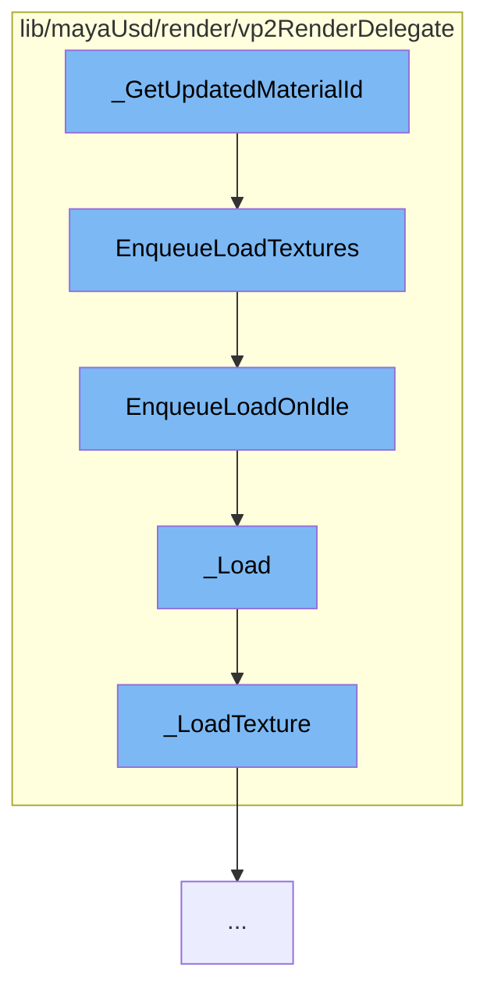

This document will cover the process of updating material IDs in the Maya-USD plugin, which includes:

1. Getting the updated material ID
2. Enqueueing the loading of textures
3. Enqueueing the loading on idle
4. Loading the texture
5. Loading the texture details.



<SwmSnippet path="/lib/mayaUsd/render/vp2RenderDelegate/mayaPrimCommon.cpp" line="1">

---

# Getting the updated material ID

The function `_GetUpdatedMaterialId` is the starting point of this process. It is responsible for getting the updated material ID which is then used to enqueue the loading of textures.

```c++
//
```

---

</SwmSnippet>

<SwmSnippet path="/lib/mayaUsd/render/vp2RenderDelegate/material.cpp" line="3565">

---

# Enqueueing the loading of textures

The function `EnqueueLoadTextures` is called next. It iterates over the texture loading tasks and enqueues them to be loaded on idle.

```c++
void HdVP2Material::EnqueueLoadTextures()
{
    for (const auto& task : _textureLoadingTasks) {
        if (task.second->EnqueueLoadOnIdle()) {
            ++_runningTasksCounter;
        }
    }
}
```

---

</SwmSnippet>

<SwmSnippet path="/lib/mayaUsd/render/vp2RenderDelegate/material.cpp" line="1969">

---

# Enqueueing the loading on idle

The function `EnqueueLoadOnIdle` is responsible for pushing the texture loading to be executed on idle. It uses the Maya's `MGlobal::executeTaskOnIdle` function to achieve this.

```c++
    bool EnqueueLoadOnIdle()
    {
        if (_started.exchange(true)) {
            return false;
        }
        // Push the texture loading on idle
        auto ret = MGlobal::executeTaskOnIdle(
            [](void* data) {
                auto* task = static_cast<HdVP2Material::TextureLoadingTask*>(data);
                task->_Load();
                // Once it is done, free the memory.
                delete task;
            },
            this);
        return ret == MStatus::kSuccess;
    }
```

---

</SwmSnippet>

<SwmSnippet path="/lib/mayaUsd/render/vp2RenderDelegate/material.cpp" line="1996">

---

# Loading the texture

The function `_Load` is called next. It checks if the task has been terminated, and if not, it calls the `_LoadTexture` function to load the texture.

```c++
    void _Load()
    {
        if (_terminated) {
            return;
        }
        bool        isSRGB = false;
        MFloatArray uvScaleOffset;
        auto*       texture
            = _LoadTexture(_path, _hasFallbackColor, _fallbackColor, isSRGB, uvScaleOffset);
        if (_terminated) {
            return;
        }
        _parent->_UpdateLoadedTexture(_sceneDelegate, _path, texture, isSRGB, uvScaleOffset);
    }
```

---

</SwmSnippet>

<SwmSnippet path="/lib/mayaUsd/render/vp2RenderDelegate/material.cpp" line="1593">

---

# Loading the texture details

The function `_LoadTexture` is responsible for loading the texture from the specified path. It handles different formats and cases, and uses the Maya's `MHWRender::MTextureManager` to manage the textures.

```c++
//! Load texture from the specified path
MHWRender::MTexture* _LoadTexture(
    const std::string& path,
    bool               hasFallbackColor,
    const GfVec4f&     fallbackColor,
    bool&              isColorSpaceSRGB,
    MFloatArray&       uvScaleOffset)
{
    MProfilingScope profilingScope(
        HdVP2RenderDelegate::sProfilerCategory, MProfiler::kColorD_L2, "LoadTexture", path.c_str());

    // If it is a UDIM texture we need to modify the path before calling OpenForReading
    if (HdStIsSupportedUdimTexture(path))
        return _LoadUdimTexture(path, isColorSpaceSRGB, uvScaleOffset);

    MHWRender::MRenderer* const       renderer = MHWRender::MRenderer::theRenderer();
    MHWRender::MTextureManager* const textureMgr
        = renderer ? renderer->getTextureManager() : nullptr;
    if (!TF_VERIFY(textureMgr)) {
        return nullptr;
    }
```

---

</SwmSnippet>

&nbsp;

*This is an auto-generated document by Swimm AI 🌊 and has not yet been verified by a human*

<SwmMeta version="3.0.0" repo-id="Z2l0aHViJTNBJTNBbWF5YS11c2QlM0ElM0FnaWxhZG5hdm90" repo-name="maya-usd" doc-type="flows"><sup>Powered by [Swimm](/)</sup></SwmMeta>
