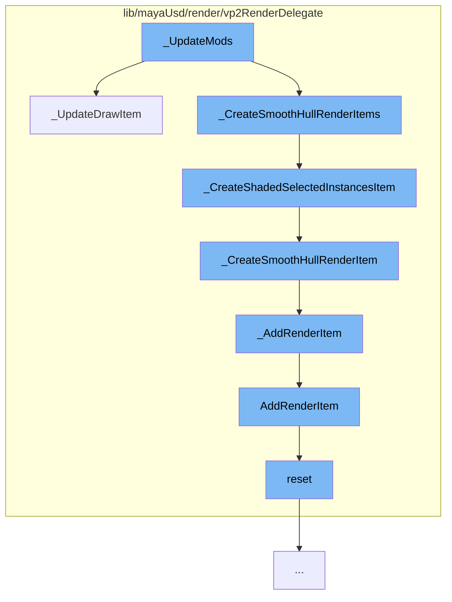

This document will cover the process of updating and rendering mesh items in the Maya viewport, which includes:

1. Updating the draw item
2. Creating shaded selected instances item
3. Creating smooth hull render item
4. Adding the render item
5. Resetting the viewport compute.



<SwmSnippet path="/lib/mayaUsd/render/vp2RenderDelegate/mesh.cpp" line="1589">

---

# Updating the draw item

The function `_UpdateDrawItem` is responsible for updating the render item data for a mesh. It checks the dirty bits of the item and updates the necessary data accordingly. This includes checking the selection mode, updating the selection highlight, and preparing the index buffer if required.

```c++
*/
void HdVP2Mesh::_UpdateDrawItem(
    HdSceneDelegate*               sceneDelegate,
    HdVP2DrawItem*                 drawItem,
    HdVP2DrawItem::RenderItemData& renderItemData,
    const HdMeshReprDesc&          desc,
    const TfToken&                 reprToken)
{
    HdDirtyBits itemDirtyBits = renderItemData.GetDirtyBits();

    auto* const          param = static_cast<HdVP2RenderParam*>(_delegate->GetRenderParam());
    ProxyRenderDelegate& drawScene = param->GetDrawScene();
#if !defined(USD_IMAGING_API_VERSION) || USD_IMAGING_API_VERSION < 18
    UsdImagingDelegate* usdImagingDelegate = drawScene.GetUsdImagingDelegate();
#endif

#ifdef MAYA_NEW_POINT_SNAPPING_SUPPORT
    // We don't need to update the shaded selected instance item when the selection mode is not
    // dirty.
    const bool isShadedSelectedInstanceItem = renderItemData._shadedSelectedInstances;
    const bool usingShadedSelectedInstanceItem
```

---

</SwmSnippet>

<SwmSnippet path="/lib/mayaUsd/render/vp2RenderDelegate/mesh.cpp" line="2705">

---

# Creating shaded selected instances item

The function `_CreateShadedSelectedInstancesItem` creates a new render item for shaded selected instances. It calls `_CreateSmoothHullRenderItem` to create the render item and marks it as a shaded selected instances item.

```c++
#ifdef MAYA_NEW_POINT_SNAPPING_SUPPORT
MHWRender::MRenderItem* HdVP2Mesh::_CreateShadedSelectedInstancesItem(
    const MString&      name,
    HdVP2DrawItem&      drawItem,
    const TfToken&      reprToken,
    MSubSceneContainer& subSceneContainer,
    const HdGeomSubset* geomSubset) const
{
    MString ssiName = name;
    ssiName += std::string(1, VP2_RENDER_DELEGATE_SEPARATOR).c_str();
    ssiName += "shadedSelectedInstances";
    HdVP2DrawItem::RenderItemData& renderItemData
        = _CreateSmoothHullRenderItem(ssiName, drawItem, reprToken, subSceneContainer, geomSubset);
    renderItemData._shadedSelectedInstances = true;

    return renderItemData._renderItem;
}
```

---

</SwmSnippet>

<SwmSnippet path="/lib/mayaUsd/render/vp2RenderDelegate/mesh.cpp" line="2726">

---

# Creating smooth hull render item

The function `_CreateSmoothHullRenderItem` creates a new render item for the smooth hull representation of the mesh. It sets up the render item with the necessary properties and adds it to the draw item.

```c++
HdVP2DrawItem::RenderItemData& HdVP2Mesh::_CreateSmoothHullRenderItem(
    const MString&      name,
    HdVP2DrawItem&      drawItem,
    const TfToken&      reprToken,
    MSubSceneContainer& subSceneContainer,
    const HdGeomSubset* geomSubset) const
{
    MString itemName = name;
    if (geomSubset) {
        itemName += std::string(1, VP2_RENDER_DELEGATE_SEPARATOR).c_str();
        itemName += geomSubset->id.GetString().c_str();
    }

    MHWRender::MRenderItem* const renderItem = MHWRender::MRenderItem::Create(
        itemName, MHWRender::MRenderItem::MaterialSceneItem, MHWRender::MGeometry::kTriangles);

    MHWRender::MGeometry::DrawMode drawMode = static_cast<MHWRender::MGeometry::DrawMode>(
        MHWRender::MGeometry::kShaded | MHWRender::MGeometry::kTextured);
    if (reprToken == HdReprTokens->smoothHull) {
        drawMode = MHWRender::MGeometry::kTextured;
    } else if (reprToken == HdVP2ReprTokens->smoothHullUntextured) {
```

---

</SwmSnippet>

<SwmSnippet path="/lib/mayaUsd/render/vp2RenderDelegate/mayaPrimCommon.cpp" line="447">

---

# Adding the render item

The function `_AddRenderItem` adds the render item to the subscene container. It also handles the representation override modes for the render item.

```c++
HdVP2DrawItem::RenderItemData& MayaUsdRPrim::_AddRenderItem(
    HdVP2DrawItem&          drawItem,
    MHWRender::MRenderItem* renderItem,
    MSubSceneContainer&     subSceneContainer,
    const HdGeomSubset*     geomSubset) const
{
    _delegate->GetVP2ResourceRegistry().EnqueueCommit(
        [&subSceneContainer, renderItem]() { subSceneContainer.add(renderItem); });

    auto& renderItemData = drawItem.AddRenderItem(renderItem, geomSubset);

    // Representation override modes require a special setup
    if (_reprOverride == kBBox) {
        if (renderItem->drawMode() & MHWRender::MGeometry::kBoundingBox) {
            renderItem->setDrawMode(MHWRender::MGeometry::kAll);
        } else {
            DisableRenderItem(renderItemData, _delegate);
        }
    } else if (_reprOverride == kWire) {
        if (renderItem->drawMode() & MHWRender::MGeometry::kBoundingBox) {
            // BBox mode is stronger than Wire mode so nothing to change here
```

---

</SwmSnippet>

<SwmSnippet path="/lib/mayaUsd/render/vp2RenderDelegate/meshViewportCompute.cpp" line="116">

---

# Resetting the viewport compute

The function `reset` is used to reset the viewport compute. It clears the executed flags, resets the consolidated compute and geometry index mapping, and deletes the UBO resource handle. It also resets the adjacency buffer and vertex buffer, and marks them as dirty for update.

```c++
void MeshViewportCompute::reset()
{
    /*  don't clear _meshSharedData, it's either an input from the external HdVP2Mesh
        or it has been created explicitly for this consolidated viewport compute.
    */
    _executed = false;
    _sourcesExecuted = false;

    _consolidatedCompute.reset();
    _geometryIndexMapping.reset();
    _vertexCount = 0;
    if (0 != _uboResourceHandle) {
        glDeleteBuffers(1, &_uboResourceHandle);
        _uboResourceHandle = 0;
    }

    _adjacencyBufferSize = 0;
    _adjacencyBufferCPU.reset();
    _adjacencyBufferGPU.reset();
    _renderingToSceneFaceVtxIdsGPU.reset();
    _sceneToRenderingFaceVtxIdsGPU.reset();
```

---

</SwmSnippet>

&nbsp;

_This is an auto-generated document by Swimm AI 🌊 and has not yet been verified by a human_

<SwmMeta version="3.0.0" repo-id="Z2l0aHViJTNBJTNBbWF5YS11c2QlM0ElM0FnaWxhZG5hdm90" repo-name="maya-usd"><sup>Powered by [Swimm](/)</sup></SwmMeta>
