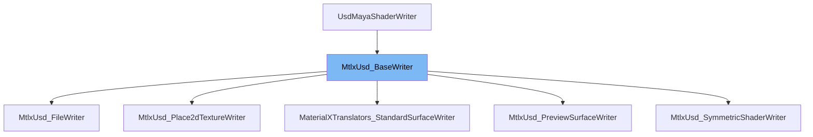

This document will cover the `MtlxUsd_BaseWriter` class. We will discuss:

1. What the `MtlxUsd_BaseWriter` class is.
2. The main variables and functions of the `MtlxUsd_BaseWriter` class.
3. An example of how to use the `MtlxUsd_BaseWriter` class.



# What is MtlxUsd_BaseWriter

`MtlxUsd_BaseWriter` is a shader writer class used for exporting Maya's material shading nodes to MaterialX. It is a part of the `UsdMayaShaderWriter` class and provides a set of utilities and functions to facilitate the translation process.

<SwmSnippet path="/lib/usd/translators/shading/mtlxBaseWriter.h" line="32">

---

# Variables and functions

`MtlxUsd_BaseWriter` constructor takes three parameters: `depNodeFn`, `usdPath`, and `jobCtx`. These are used to initialize the base writer with the dependency node, the USD path, and the job context respectively.

```c
    MtlxUsd_BaseWriter(
        const MFnDependencyNode& depNodeFn,
        const SdfPath&           usdPath,
        UsdMayaWriteJobContext&  jobCtx);
```

---

</SwmSnippet>

<SwmSnippet path="/lib/usd/translators/shading/mtlxBaseWriter.h" line="36">

---

The `CanExport` function is a static method that checks if the given `UsdMayaJobExportArgs` can be exported.

```c
    static ContextSupport CanExport(const UsdMayaJobExportArgs&);
```

---

</SwmSnippet>

<SwmSnippet path="/lib/usd/translators/shading/mtlxBaseWriter.h" line="39">

---

The `IsAuthoredPlace2dTexture` function is a utility to find out in advance if a `place2dTextureNode` will be exported or not.

```c
    static bool IsAuthoredPlace2dTexture(const MFnDependencyNode& p2dTxFn);
```

---

</SwmSnippet>

<SwmSnippet path="/lib/usd/translators/shading/mtlxBaseWriter.h" line="43">

---

The `GetNodeGraph` function returns the node graph where all ancillary nodes reside.

```c
    UsdPrim GetNodeGraph();
```

---

</SwmSnippet>

<SwmSnippet path="/lib/usd/translators/shading/mtlxBaseWriter.h" line="46">

---

The `AddSwizzle` function adds a swizzle node to extract a channel from a color output.

```c
    UsdAttribute AddSwizzle(const std::string& channel, int numChannels, UsdAttribute nodeOutput);
```

---

</SwmSnippet>

<SwmSnippet path="/lib/usd/translators/shading/mtlxBaseWriter.h" line="49">

---

The `ExtractChannel` function adds a swizzle node to extract a channel from any output.

```c
    UsdAttribute ExtractChannel(size_t channelIndex, UsdAttribute nodeOutput);
```

---

</SwmSnippet>

<SwmSnippet path="/lib/usd/translators/shading/mtlxBaseWriter.h" line="52">

---

The `AddConstructor` function adds a constructor node for subchannel connection on an input.

```c
    UsdAttribute AddConstructor(UsdAttribute nodeInput, size_t channelIndex, MPlug inputPlug);
```

---

</SwmSnippet>

<SwmSnippet path="/lib/usd/translators/shading/mtlxBaseWriter.h" line="55">

---

The `AddConversion` function adds a swizzle node that converts from the type found in `nodeOutput` to `destType`.

```c
    UsdAttribute AddConversion(const SdfValueTypeName& destType, UsdAttribute nodeOutput);
```

---

</SwmSnippet>

<SwmSnippet path="/lib/usd/translators/shading/mtlxBaseWriter.h" line="58">

---

The `AddLuminance` function adds a luminance node to the current node to get an alpha value from an RGB texture.

```c
    UsdAttribute AddLuminance(int numChannels, UsdAttribute nodeOutput);
```

---

</SwmSnippet>

<SwmSnippet path="/lib/usd/translators/shading/mtlxBaseWriter.h" line="61">

---

The `AddNormalMapping` function adds normal mapping functionality to a normal input.

```c
    UsdAttribute AddNormalMapping(UsdAttribute normalInput);
```

---

</SwmSnippet>

<SwmSnippet path="/lib/usd/translators/shading/mtlxBaseWriter.h" line="65">

---

The `PreserveNodegraphBoundaries` function ensures that a material-level input uses a nodegraph boundary port for connecting to subgraph nodes.

```c
    UsdAttribute PreserveNodegraphBoundaries(UsdAttribute input);
```

---

</SwmSnippet>

<SwmSnippet path="/lib/usd/translators/shading/mtlxBaseWriter.h" line="68">

---

The `_GetOutputName` function gets the official output name of a MaterialX node using Sdr information.

```c
    static TfToken _GetOutputName(const TfToken& nodeID);
```

---

</SwmSnippet>

<SwmSnippet path="/lib/usd/translators/shading/mtlxBaseWriter.h" line="71">

---

The `_GetVarnameName` function gets the global MaterialX name we use for primvar name inputs. It depends on `UsdPrimvarReader`.

```c
    static TfToken _GetVarnameName();
```

---

</SwmSnippet>

<SwmSnippet path="/lib/usd/translators/shading/mtlxBaseWriter.h" line="76">

---

The `AuthorShaderInputFromShadingNodeAttr` function adds a schema attribute to the schema `shaderSchema` if the Maya attribute `shadingNodeAttrName` in dependency node `depNodeFn` has been modified or has an incoming connection at `usdTime`.

```c
    bool AuthorShaderInputFromShadingNodeAttr(
        const MFnDependencyNode& depNodeFn,
        const TfToken&           shadingNodeAttrName,
        UsdShadeShader&          shaderSchema,
        const UsdTimeCode        usdTime,
        bool                     ignoreIfUnauthored = true);
```

---

</SwmSnippet>

# Usage example

The `MtlxUsd_BaseWriter` class is used as a base class for other shader writers. For example, the `MtlxUsd_SymmetricShaderWriter` class extends `MtlxUsd_BaseWriter` to provide specific functionality for symmetric shaders.

&nbsp;

*This is an auto-generated document by Swimm AI 🌊 and has not yet been verified by a human*

<SwmMeta version="3.0.0" repo-id="Z2l0aHViJTNBJTNBbWF5YS11c2QlM0ElM0FnaWxhZG5hdm90" repo-name="maya-usd" doc-type="class"><sup>Powered by [Swimm](/)</sup></SwmMeta>
