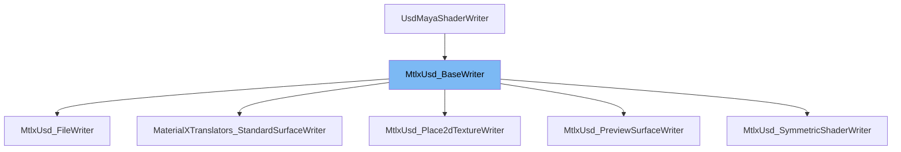

This document will cover the following aspects of the `MtlxUsd_BaseWriter` class:

1. What is `MtlxUsd_BaseWriter`.
2. The variables and functions defined in `MtlxUsd_BaseWriter`.
3. An example of how `MtlxUsd_BaseWriter` is used in `MtlxUsd_SymmetricShaderWriter`.



# What is MtlxUsd_BaseWriter

`MtlxUsd_BaseWriter` is a shader writer class used for exporting Maya's material shading nodes to MaterialX. It is part of the `maya-usd` plugin which is used for integrating Pixar's Universal Scene Description (USD) into Maya. The class provides a set of utility functions to facilitate the translation of shading nodes.

<SwmSnippet path="/lib/usd/translators/shading/mtlxBaseWriter.h" line="32">

---

# Variables and functions

The constructor of `MtlxUsd_BaseWriter` takes three parameters: `depNodeFn`, `usdPath`, and `jobCtx`. These parameters are used to initialize the base class `UsdMayaShaderWriter`.

```c
    MtlxUsd_BaseWriter(
        const MFnDependencyNode& depNodeFn,
        const SdfPath&           usdPath,
        UsdMayaWriteJobContext&  jobCtx);
```

---

</SwmSnippet>

<SwmSnippet path="/lib/usd/translators/shading/mtlxBaseWriter.h" line="36">

---

The static function `CanExport` is used to check if the given `UsdMayaJobExportArgs` can be exported.

```c
    static ContextSupport CanExport(const UsdMayaJobExportArgs&);
```

---

</SwmSnippet>

<SwmSnippet path="/lib/usd/translators/shading/mtlxBaseWriter.h" line="39">

---

The static function `IsAuthoredPlace2dTexture` is a utility function to check if a `place2dTextureNode` will be exported or not.

```c
    static bool IsAuthoredPlace2dTexture(const MFnDependencyNode& p2dTxFn);
```

---

</SwmSnippet>

<SwmSnippet path="/lib/usd/translators/shading/mtlxBaseWriter.h" line="43">

---

The protected function `GetNodeGraph` returns the node graph where all ancillary nodes reside.

```c
    UsdPrim GetNodeGraph();
```

---

</SwmSnippet>

<SwmSnippet path="/lib/usd/translators/shading/mtlxBaseWriter.h" line="46">

---

The function `AddSwizzle` adds a swizzle node to extract a channel from a color output.

```c
    UsdAttribute AddSwizzle(const std::string& channel, int numChannels, UsdAttribute nodeOutput);
```

---

</SwmSnippet>

<SwmSnippet path="/lib/usd/translators/shading/mtlxBaseWriter.h" line="49">

---

The function `ExtractChannel` adds a swizzle node to extract a channel from any output.

```c
    UsdAttribute ExtractChannel(size_t channelIndex, UsdAttribute nodeOutput);
```

---

</SwmSnippet>

<SwmSnippet path="/lib/usd/translators/shading/mtlxBaseWriter.h" line="52">

---

The function `AddConstructor` adds a constructor node for subchannel connection on an input.

```c
    UsdAttribute AddConstructor(UsdAttribute nodeInput, size_t channelIndex, MPlug inputPlug);
```

---

</SwmSnippet>

<SwmSnippet path="/lib/usd/translators/shading/mtlxBaseWriter.h" line="55">

---

The function `AddConversion` adds a swizzle node that converts from the type found in `nodeOutput` to `destType`.

```c
    UsdAttribute AddConversion(const SdfValueTypeName& destType, UsdAttribute nodeOutput);
```

---

</SwmSnippet>

<SwmSnippet path="/lib/usd/translators/shading/mtlxBaseWriter.h" line="58">

---

The function `AddLuminance` adds a luminance node to the current node to get an alpha value from an RGB texture.

```c
    UsdAttribute AddLuminance(int numChannels, UsdAttribute nodeOutput);
```

---

</SwmSnippet>

<SwmSnippet path="/lib/usd/translators/shading/mtlxBaseWriter.h" line="61">

---

The function `AddNormalMapping` adds normal mapping functionality to a normal input.

```c
    UsdAttribute AddNormalMapping(UsdAttribute normalInput);
```

---

</SwmSnippet>

<SwmSnippet path="/lib/usd/translators/shading/mtlxBaseWriter.h" line="64">

---

The function `PreserveNodegraphBoundaries` ensures that a material-level input uses a nodegraph boundary port for connecting to subgraph nodes.

```c
    // to subgraph nodes:
```

---

</SwmSnippet>

<SwmSnippet path="/lib/usd/translators/shading/mtlxBaseWriter.h" line="68">

---

The static function `_GetOutputName` gets the official output name of a MaterialX node using Sdr information.

```c
    static TfToken _GetOutputName(const TfToken& nodeID);
```

---

</SwmSnippet>

<SwmSnippet path="/lib/usd/translators/shading/mtlxBaseWriter.h" line="71">

---

The static function `_GetVarnameName` gets the global MaterialX name we use for primvar name inputs. It depends on `UsdPrimvarReader`.

```c
    static TfToken _GetVarnameName();
```

---

</SwmSnippet>

<SwmSnippet path="/lib/usd/translators/shading/mtlxBaseWriter.h" line="76">

---

The function `AuthorShaderInputFromShadingNodeAttr` adds a schema attribute to the schema `shaderSchema` if the Maya attribute `shadingNodeAttrName` in dependency node `depNodeFn` has been modified or has an incoming connection at `usdTime`.

```c
    bool AuthorShaderInputFromShadingNodeAttr(
        const MFnDependencyNode& depNodeFn,
        const TfToken&           shadingNodeAttrName,
        UsdShadeShader&          shaderSchema,
        const UsdTimeCode        usdTime,
        bool                     ignoreIfUnauthored = true);
```

---

</SwmSnippet>

<SwmSnippet path="/lib/usd/translators/shading/mtlxSymmetricShaderWriter.cpp" line="74">

---

# Usage example

`MtlxUsd_SymmetricShaderWriter` is a class that extends `MtlxUsd_BaseWriter`. It provides a literal translation of Maya shading nodes to USD Shader prims that are MaterialX-compatible. The class uses the functions provided by `MtlxUsd_BaseWriter` to facilitate the translation process.

```c++
class MtlxUsd_SymmetricShaderWriter : public MtlxUsd_BaseWriter
{
public:
    /// Register a shader writer to translate \p mayaNodeTypeName Maya nodes to
    /// USD shaders with ID \p usdShaderId.
    ///
    /// Note that this function should generally only be called inside a
    /// TF_REGISTRY_FUNCTION(UsdMayaShaderWriterRegistry) block.
    static void RegisterWriter(
        const TfToken& mayaNodeTypeName,
        const TfToken& usdShaderId,
        bool           inNodeGraph = true,
        bool           fromPython = false);

    static ContextSupport CanExport(const UsdMayaJobExportArgs& exportArgs);

    MtlxUsd_SymmetricShaderWriter(
        const MFnDependencyNode& depNodeFn,
        const SdfPath&           usdPath,
        UsdMayaWriteJobContext&  jobCtx,
        const TfToken&           usdShaderId,
```

---

</SwmSnippet>

&nbsp;

_This is an auto-generated document by Swimm AI 🌊 and has not yet been verified by a human_

<SwmMeta version="3.0.0" repo-id="Z2l0aHViJTNBJTNBbWF5YS11c2QlM0ElM0FnaWxhZG5hdm90" repo-name="maya-usd"><sup>Powered by [Swimm](/)</sup></SwmMeta>
