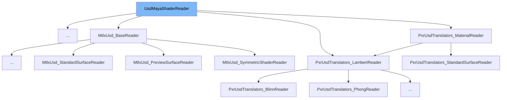

This document will cover the following topics related to the `UsdMayaShaderReader` class:

1. What is `UsdMayaShaderReader`.
2. Variables and functions of `UsdMayaShaderReader`.
3. Usage example of `UsdMayaShaderReader`.



# What is UsdMayaShaderReader

`UsdMayaShaderReader` is a base class for USD prim readers that import USD shader prims as Maya shading nodes. It is used to read and translate USD shader prims into Maya shading nodes during the import process.

<SwmSnippet path="/lib/mayaUsd/fileio/shaderReader.h" line="44">

---

# Variables and functions

The constructor `UsdMayaShaderReader` takes a `UsdMayaPrimReaderArgs` object as an argument. This object contains the arguments needed to read a USD prim.

```c
    UsdMayaShaderReader(const UsdMayaPrimReaderArgs&);

```

---

</SwmSnippet>

<SwmSnippet path="/lib/mayaUsd/fileio/shaderReader.h" line="49">

---

The static function `CanImport` is used to determine how well this class can support the current context. It takes a `UsdMayaJobImportArgs` object as an argument.

```c
    static ContextSupport CanImport(const UsdMayaJobImportArgs& importArgs);

```

---

</SwmSnippet>

<SwmSnippet path="/lib/mayaUsd/fileio/shaderReader.h" line="63">

---

The function `GetMayaPlugForUsdAttrName` is used to get the Maya shading plug that corresponds to the USD attribute named `usdAttrName`. It takes a `TfToken` and a `MObject` as arguments.

```c
    virtual MPlug
    GetMayaPlugForUsdAttrName(const TfToken& usdAttrName, const MObject& mayaObject) const;
```

---

</SwmSnippet>

<SwmSnippet path="/lib/mayaUsd/fileio/shaderReader.h" line="75">

---

The function `GetMayaNameForUsdAttrName` is used to get the name of the Maya shading attribute that corresponds to the USD attribute named `usdAttrName`. It takes a `TfToken` as an argument.

```c
    virtual TfToken GetMayaNameForUsdAttrName(const TfToken& usdAttrName) const;
```

---

</SwmSnippet>

<SwmSnippet path="/lib/mayaUsd/fileio/shaderReader.h" line="86">

---

The function `TraverseUnconnectableInput` is used to continue traversing on the given `shaderInput` even though it is not representable as a connectable Maya `MPlug`. It takes a `TfToken` as an argument.

```c
    virtual bool TraverseUnconnectableInput(const TfToken& usdAttrName);
```

---

</SwmSnippet>

<SwmSnippet path="/lib/mayaUsd/fileio/shaderReader.h" line="90">

---

The function `PostConnectSubtree` is a callback function that is called after the shading context reader is done connecting all inputs. It takes a `UsdMayaPrimReaderContext` pointer as an argument.

```c
    virtual void PostConnectSubtree(UsdMayaPrimReaderContext* context);
```

---

</SwmSnippet>

<SwmSnippet path="/lib/mayaUsd/fileio/shaderReader.h" line="108">

---

The function `IsConverter` is used to check if this is a converter importer. Converters do not create any Maya object.

```c
    virtual boost::optional<IsConverterResult> IsConverter();
```

---

</SwmSnippet>

<SwmSnippet path="/lib/mayaUsd/fileio/shaderReader.h" line="114">

---

The function `SetDownstreamReader` is used to set a downstream converter to use for caching calls to `GetCreatedObject` and `GetMayaPlugForUsdAttrName`. It takes a `std::shared_ptr<UsdMayaShaderReader>` as an argument.

```c
    virtual void SetDownstreamReader(std::shared_ptr<UsdMayaShaderReader> downstreamReader);
```

---

</SwmSnippet>

<SwmSnippet path="/lib/mayaUsd/fileio/shaderReader.h" line="123">

---

The function `GetCreatedObject` is used to get the Maya object that was created by this reader. It takes a `UsdMayaShadingModeImportContext` and a `UsdPrim` as arguments.

```c
    virtual MObject
    GetCreatedObject(const UsdMayaShadingModeImportContext&, const UsdPrim& prim) const;
```

---

</SwmSnippet>

<SwmSnippet path="/lib/usd/translators/shading/usdPrimvarReaderFloat3Reader.cpp" line="28">

---

# Usage example

`PxrMayaUsdPrimvarReader_float3_Reader` is an example of a class that extends `UsdMayaShaderReader`. It overrides the `Read` and `GetMayaNameForUsdAttrName` functions from the base class.

```c++
class PxrMayaUsdPrimvarReader_float3_Reader : public UsdMayaShaderReader
{
public:
    PxrMayaUsdPrimvarReader_float3_Reader(const UsdMayaPrimReaderArgs& readArgs);

    bool Read(UsdMayaPrimReaderContext& context) override;

    TfToken GetMayaNameForUsdAttrName(const TfToken& usdAttrName) const override;
};
```

---

</SwmSnippet>

&nbsp;

_This is an auto-generated document by Swimm AI 🌊 and has not yet been verified by a human_

<SwmMeta version="3.0.0" repo-id="Z2l0aHViJTNBJTNBbWF5YS11c2QlM0ElM0FnaWxhZG5hdm90" repo-name="maya-usd"><sup>Powered by [Swimm](/)</sup></SwmMeta>
