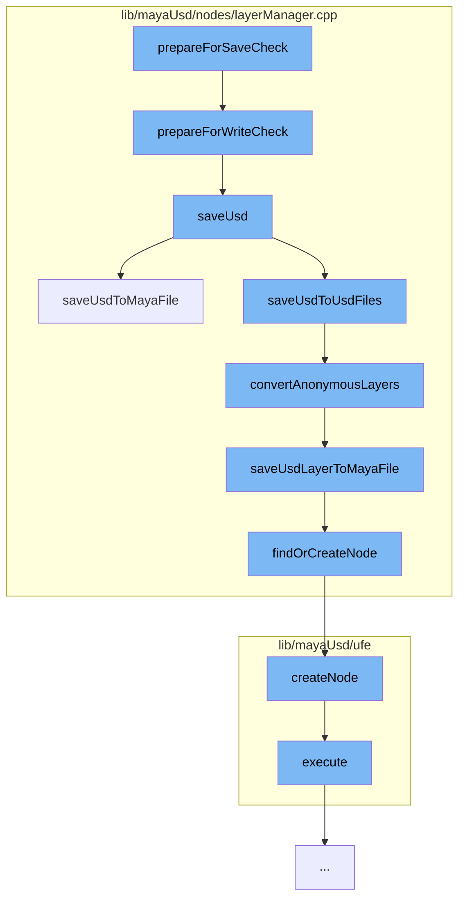

This document will cover the process of preparing and saving USD layers in the Maya-USD plugin. The process includes the following steps:

1. Preparing for save check
2. Preparing for write check
3. Saving USD
4. Saving USD to Maya file or USD files
5. Converting anonymous layers
6. Saving USD layer to Maya file
7. Finding or creating a node
8. Creating a node
9. Executing the command.



<SwmSnippet path="/lib/mayaUsd/nodes/layerManager.cpp" line="411">

---

# Preparing for save check

The function `prepareForSaveCheck` initiates the process of saving. It prepares the LayerDatabase for a write check, cleans up the new scene, and checks if there are any proxies to save.

```c++
void LayerDatabase::prepareForWriteCheck(bool* retCode, bool isExport)
{
    _isSavingMayaFile = true;
    cleanUpNewScene(nullptr);

    LayerDatabase::instance().saveLayerManagerSelectedStage();

    bool hasAnyProxy = false;
    if (LayerDatabase::instance().getProxiesToSave(isExport, &hasAnyProxy)) {

        int dialogResult = true;

        if (!isCopyingSceneNodes()) {
            if (MGlobal::kInteractive == MGlobal::mayaState() && !isCrashing()
                && LayerDatabase::instance().saveInteractionRequired()) {
                MGlobal::executeCommand(kSaveOptionUICmd, dialogResult);
            }
        }

        if (dialogResult) {
            dialogResult = LayerDatabase::instance().saveUsd(isExport);
```

---

</SwmSnippet>

<SwmSnippet path="/lib/mayaUsd/nodes/layerManager.cpp" line="411">

---

# Preparing for write check

The function `prepareForWriteCheck` continues the process by saving the selected stage of the LayerDatabase and checking if there are any proxies to save. If there are, it initiates a dialog for user interaction.

```c++
void LayerDatabase::prepareForWriteCheck(bool* retCode, bool isExport)
{
    _isSavingMayaFile = true;
    cleanUpNewScene(nullptr);

    LayerDatabase::instance().saveLayerManagerSelectedStage();

    bool hasAnyProxy = false;
    if (LayerDatabase::instance().getProxiesToSave(isExport, &hasAnyProxy)) {

        int dialogResult = true;

        if (!isCopyingSceneNodes()) {
            if (MGlobal::kInteractive == MGlobal::mayaState() && !isCrashing()
                && LayerDatabase::instance().saveInteractionRequired()) {
                MGlobal::executeCommand(kSaveOptionUICmd, dialogResult);
            }
        }

        if (dialogResult) {
            dialogResult = LayerDatabase::instance().saveUsd(isExport);
```

---

</SwmSnippet>

<SwmSnippet path="/lib/mayaUsd/nodes/layerManager.cpp" line="641">

---

# Saving USD

The function `saveUsd` handles the saving of USD data. It checks the serialization option and based on the option, it either saves the USD data inside the temporary crash recovery Maya file or saves the USD data to USD files.

```c++
bool LayerDatabase::saveUsd(bool isExport)
{
    BatchSaveResult result = MayaUsd::kNotHandled;

    auto opt = MayaUsd::utils::serializeUsdEditsLocationOption();

    if (MayaUsd::utils::kIgnoreUSDEdits != opt) {
        // When Maya is crashing or copying/cutting scene nodes, we don't want to
        // save the the USD file to avoid overwriting them with possibly unwanted
        // data. Instead, we will save the USD data inside the temporary crash recovery Maya file.
        if (isCrashing() || isCopyingSceneNodes()) {
            result = kPartiallyCompleted;
            opt = MayaUsd::utils::kSaveToMayaSceneFile;
        } else if (_batchSaveDelegate && _proxiesToSave.size() > 0) {
            result = _batchSaveDelegate(_proxiesToSave);
        }

        // kAbort: we should abort and return false, which Maya will take as
        // an indication to abort the file operation.
        //
        // kCompleted: the delegate has completely handled the save operation,
```

---

</SwmSnippet>

<SwmSnippet path="/lib/mayaUsd/nodes/layerManager.cpp" line="827">

---

# Saving USD to Maya file or USD files

The function `saveUsdToMayaFile` saves the USD data to a Maya file. It finds or creates a LayerManager node and adds the layer to the builder.

```c++
BatchSaveResult LayerDatabase::saveUsdToMayaFile()
{
    MayaUsd::LayerManager* lm = findOrCreateNode();
    if (!lm) {
        return MayaUsd::kNotHandled;
    }

    MStatus           status;
    MDataBlock        dataBlock = lm->_forceCache();
    MArrayDataHandle  layersHandle = dataBlock.outputArrayValue(lm->layers, &status);
    MArrayDataBuilder builder(&dataBlock, lm->layers, 1 /*maybe nb stages?*/, &status);

    bool atLeastOneDirty = false;

    MFnDependencyNode fn;
    for (size_t i = 0; i < _proxiesToSave.size() + _internalProxiesToSave.size(); i++) {
        const StageSavingInfo& info = i < _proxiesToSave.size()
            ? _proxiesToSave[i]
            : _internalProxiesToSave[i - _proxiesToSave.size()];
        MObject mobj = info.dagPath.node();
        fn.setObject(mobj);
```

---

</SwmSnippet>

<SwmSnippet path="/lib/mayaUsd/nodes/layerManager.cpp" line="918">

---

# Converting anonymous layers

The function `convertAnonymousLayers` converts anonymous layers to named layers. It recursively converts anonymous layers and saves the USD layer to a Maya file.

```c++
void LayerDatabase::convertAnonymousLayers(
    MayaUsdProxyShapeBase* pShape,
    const MObject&         proxyNode,
    UsdStageRefPtr         stage)
{
    SdfLayerHandle root = stage->GetRootLayer();
    std::string    proxyName(pShape->name().asChar());

    convertAnonymousLayersRecursive(root, proxyName, stage);

    // Note: retrieve root again since it may have been changed by the call
    //       to convertAnonymousLayersRecursive
    root = stage->GetRootLayer();
    if (root->IsAnonymous()) {
        const bool wasTargetLayer = (stage->GetEditTarget().GetLayer() == root);
        PXR_NS::SdfFileFormat::FileFormatArguments args;
        std::string newFileName = MayaUsd::utils::generateUniqueFileName(proxyName);
        if (UsdMayaUtilFileSystem::requireUsdPathsRelativeToMayaSceneFile()) {
            newFileName = UsdMayaUtilFileSystem::getPathRelativeToMayaSceneFile(newFileName);
        }
        if (!MayaUsd::utils::saveLayerWithFormat(root, newFileName)) {
```

---

</SwmSnippet>

<SwmSnippet path="/lib/mayaUsd/nodes/layerManager.cpp" line="964">

---

# Saving USD layer to Maya file

The function `saveUsdLayerToMayaFile` saves the USD layer to a Maya file. It finds or creates a LayerManager node and adds the layer to the builder.

```c++
void LayerDatabase::saveUsdLayerToMayaFile(SdfLayerRefPtr layer, bool asAnonymous)
{
    MayaUsd::LayerManager* lm = findOrCreateNode();
    if (!lm)
        return;

    MStatus           status;
    MDataBlock        dataBlock = lm->_forceCache();
    MArrayDataHandle  layersHandle = dataBlock.outputArrayValue(lm->layers, &status);
    MArrayDataBuilder builder(&dataBlock, lm->layers, 1 /*maybe nb stages?*/, &status);

    addLayerToBuilder(lm, builder, layer, asAnonymous);

    layersHandle.set(builder);

    layersHandle.setAllClean();
    dataBlock.setClean(lm->layers);
}
```

---

</SwmSnippet>

<SwmSnippet path="/lib/mayaUsd/nodes/layerManager.cpp" line="141">

---

# Finding or creating a node

The function `findOrCreateNode` finds or creates a LayerManager node. If a LayerManager node does not exist, it creates one.

```c++
MayaUsd::LayerManager* findOrCreateNode()
{
    MayaUsd::LayerManager* lm = findNode();
    if (!lm) {
        MDGModifier& modifier = MayaUsd::MDGModifierUndoItem::create("Node find or creation");
        MObject      manager = modifier.createNode(MayaUsd::LayerManager::typeId);
        modifier.doIt();

        lm = static_cast<MayaUsd::LayerManager*>(MFnDependencyNode(manager).userNode());
    }

    return lm;
}
```

---

</SwmSnippet>

<SwmSnippet path="/lib/mayaUsd/ufe/UsdShaderNodeDef.cpp" line="343">

---

# Creating a node

The function `createNode` creates a new node in the scene. It uses the `UsdUndoCreateFromNodeDefCommand` to create the node and execute the command.

```c++
Ufe::SceneItem::Ptr UsdShaderNodeDef::createNode(
    const Ufe::SceneItem::Ptr& parent,
    const Ufe::PathComponent& name) const
{
    TF_DEV_AXIOM(_shaderNodeDef);
    auto parentItem = downcast(parent);
    if (parentItem) {
        UsdUndoCreateFromNodeDefCommand::Ptr cmd
            = UsdUndoCreateFromNodeDefCommand::create(_shaderNodeDef, parentItem, name.string());
        if (cmd) {
            cmd->execute();
            return cmd->insertedChild();
        }
    }
    return {};
}
```

---

</SwmSnippet>

<SwmSnippet path="/lib/mayaUsd/ufe/EditAsMayaCommand.cpp" line="36">

---

# Executing the command

The function `execute` executes the command. It uses the `PrimUpdaterManager` to edit as Maya and undoes the operation if the status is false.

```c++
void EditAsMayaUfeCommand::execute()
{
    bool status = false;

    // Scope the undo item recording so we can undo on failure.
    {
        OpUndoItemRecorder undoRecorder(_undoItemList);

        auto& manager = PXR_NS::PrimUpdaterManager::getInstance();
        status = manager.editAsMaya(_path);
    }

    // Undo potentially partially-made edit-as-Maya on failure.
    if (!status)
        _undoItemList.undo();
}
```

---

</SwmSnippet>

&nbsp;

_This is an auto-generated document by Swimm AI 🌊 and has not yet been verified by a human_

<SwmMeta version="3.0.0" repo-id="Z2l0aHViJTNBJTNBbWF5YS11c2QlM0ElM0FnaWxhZG5hdm90" repo-name="maya-usd"><sup>Powered by [Swimm](/)</sup></SwmMeta>
