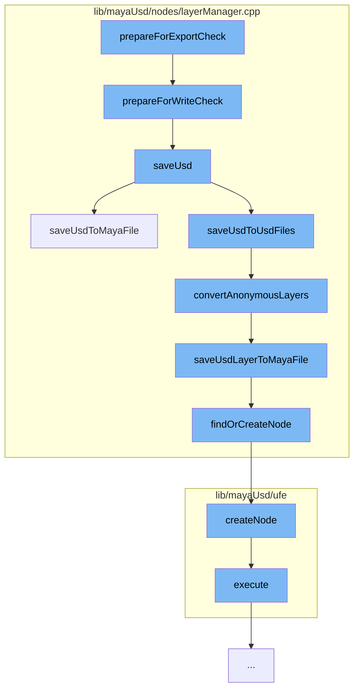

This document will cover the process of preparing for export check in the Maya-USD plugin, which includes:

1. Preparing for write check
2. Saving USD
3. Saving USD to Maya file
4. Converting anonymous layers
5. Saving USD layer to Maya file
6. Finding or creating node
7. Creating node
8. Executing the command.



<SwmSnippet path="/lib/mayaUsd/nodes/layerManager.cpp" line="411">

---

# Preparing for write check

The function `prepareForWriteCheck` is the initial step in the process. It prepares the system for a write check, which is necessary before exporting. It also saves the layer manager's selected stage.

```c++
void LayerDatabase::prepareForWriteCheck(bool* retCode, bool isExport)
{
    _isSavingMayaFile = true;
    cleanUpNewScene(nullptr);

    LayerDatabase::instance().saveLayerManagerSelectedStage();

    bool hasAnyProxy = false;
    if (LayerDatabase::instance().getProxiesToSave(isExport, &hasAnyProxy)) {

        int dialogResult = true;

        if (!isCopyingSceneNodes()) {
            if (MGlobal::kInteractive == MGlobal::mayaState() && !isCrashing()
                && LayerDatabase::instance().saveInteractionRequired()) {
                MGlobal::executeCommand(kSaveOptionUICmd, dialogResult);
            }
        }

        if (dialogResult) {
            dialogResult = LayerDatabase::instance().saveUsd(isExport);
```

---

</SwmSnippet>

<SwmSnippet path="/lib/mayaUsd/nodes/layerManager.cpp" line="641">

---

# Saving USD

The function `saveUsd` is responsible for saving the USD data. Depending on the situation, it may save the data to a USD file or a Maya file.

```c++
bool LayerDatabase::saveUsd(bool isExport)
{
    BatchSaveResult result = MayaUsd::kNotHandled;

    auto opt = MayaUsd::utils::serializeUsdEditsLocationOption();

    if (MayaUsd::utils::kIgnoreUSDEdits != opt) {
        // When Maya is crashing or copying/cutting scene nodes, we don't want to
        // save the the USD file to avoid overwriting them with possibly unwanted
        // data. Instead, we will save the USD data inside the temporary crash recovery Maya file.
        if (isCrashing() || isCopyingSceneNodes()) {
            result = kPartiallyCompleted;
            opt = MayaUsd::utils::kSaveToMayaSceneFile;
        } else if (_batchSaveDelegate && _proxiesToSave.size() > 0) {
            result = _batchSaveDelegate(_proxiesToSave);
        }

        // kAbort: we should abort and return false, which Maya will take as
        // an indication to abort the file operation.
        //
        // kCompleted: the delegate has completely handled the save operation,
```

---

</SwmSnippet>

<SwmSnippet path="/lib/mayaUsd/nodes/layerManager.cpp" line="827">

---

# Saving USD to Maya file

The function `saveUsdToMayaFile` saves the USD data to a Maya file. It first finds or creates a node, then saves the stage to the Maya file.

```c++
BatchSaveResult LayerDatabase::saveUsdToMayaFile()
{
    MayaUsd::LayerManager* lm = findOrCreateNode();
    if (!lm) {
        return MayaUsd::kNotHandled;
    }

    MStatus           status;
    MDataBlock        dataBlock = lm->_forceCache();
    MArrayDataHandle  layersHandle = dataBlock.outputArrayValue(lm->layers, &status);
    MArrayDataBuilder builder(&dataBlock, lm->layers, 1 /*maybe nb stages?*/, &status);

    bool atLeastOneDirty = false;

    MFnDependencyNode fn;
    for (size_t i = 0; i < _proxiesToSave.size() + _internalProxiesToSave.size(); i++) {
        const StageSavingInfo& info = i < _proxiesToSave.size()
            ? _proxiesToSave[i]
            : _internalProxiesToSave[i - _proxiesToSave.size()];
        MObject mobj = info.dagPath.node();
        fn.setObject(mobj);
```

---

</SwmSnippet>

<SwmSnippet path="/lib/mayaUsd/nodes/layerManager.cpp" line="918">

---

# Converting anonymous layers

The function `convertAnonymousLayers` converts anonymous layers to named layers. This is necessary because anonymous layers cannot be saved directly.

```c++
void LayerDatabase::convertAnonymousLayers(
    MayaUsdProxyShapeBase* pShape,
    const MObject&         proxyNode,
    UsdStageRefPtr         stage)
{
    SdfLayerHandle root = stage->GetRootLayer();
    std::string    proxyName(pShape->name().asChar());

    convertAnonymousLayersRecursive(root, proxyName, stage);

    // Note: retrieve root again since it may have been changed by the call
    //       to convertAnonymousLayersRecursive
    root = stage->GetRootLayer();
    if (root->IsAnonymous()) {
        const bool wasTargetLayer = (stage->GetEditTarget().GetLayer() == root);
        PXR_NS::SdfFileFormat::FileFormatArguments args;
        std::string newFileName = MayaUsd::utils::generateUniqueFileName(proxyName);
        if (UsdMayaUtilFileSystem::requireUsdPathsRelativeToMayaSceneFile()) {
            newFileName = UsdMayaUtilFileSystem::getPathRelativeToMayaSceneFile(newFileName);
        }
        if (!MayaUsd::utils::saveLayerWithFormat(root, newFileName)) {
```

---

</SwmSnippet>

<SwmSnippet path="/lib/mayaUsd/nodes/layerManager.cpp" line="964">

---

# Saving USD layer to Maya file

The function `saveUsdLayerToMayaFile` saves a USD layer to a Maya file. It first finds or creates a node, then adds the layer to the builder.

```c++
void LayerDatabase::saveUsdLayerToMayaFile(SdfLayerRefPtr layer, bool asAnonymous)
{
    MayaUsd::LayerManager* lm = findOrCreateNode();
    if (!lm)
        return;

    MStatus           status;
    MDataBlock        dataBlock = lm->_forceCache();
    MArrayDataHandle  layersHandle = dataBlock.outputArrayValue(lm->layers, &status);
    MArrayDataBuilder builder(&dataBlock, lm->layers, 1 /*maybe nb stages?*/, &status);

    addLayerToBuilder(lm, builder, layer, asAnonymous);

    layersHandle.set(builder);

    layersHandle.setAllClean();
    dataBlock.setClean(lm->layers);
}
```

---

</SwmSnippet>

<SwmSnippet path="/lib/mayaUsd/nodes/layerManager.cpp" line="141">

---

# Finding or creating node

The function `findOrCreateNode` either finds an existing node or creates a new one if none exists.

```c++
MayaUsd::LayerManager* findOrCreateNode()
{
    MayaUsd::LayerManager* lm = findNode();
    if (!lm) {
        MDGModifier& modifier = MayaUsd::MDGModifierUndoItem::create("Node find or creation");
        MObject      manager = modifier.createNode(MayaUsd::LayerManager::typeId);
        modifier.doIt();

        lm = static_cast<MayaUsd::LayerManager*>(MFnDependencyNode(manager).userNode());
    }

    return lm;
}
```

---

</SwmSnippet>

<SwmSnippet path="/lib/mayaUsd/ufe/UsdShaderNodeDef.cpp" line="343">

---

# Creating node

The function `createNode` creates a new node in the scene. It uses the shader node definition to create the node.

```c++
Ufe::SceneItem::Ptr UsdShaderNodeDef::createNode(
    const Ufe::SceneItem::Ptr& parent,
    const Ufe::PathComponent& name) const
{
    TF_DEV_AXIOM(_shaderNodeDef);
    auto parentItem = downcast(parent);
    if (parentItem) {
        UsdUndoCreateFromNodeDefCommand::Ptr cmd
            = UsdUndoCreateFromNodeDefCommand::create(_shaderNodeDef, parentItem, name.string());
        if (cmd) {
            cmd->execute();
            return cmd->insertedChild();
        }
    }
    return {};
}
```

---

</SwmSnippet>

<SwmSnippet path="/lib/mayaUsd/ufe/EditAsMayaCommand.cpp" line="36">

---

# Executing the command

The function `execute` executes the command. If the command fails, it undoes any changes made during the command.

```c++
void EditAsMayaUfeCommand::execute()
{
    bool status = false;

    // Scope the undo item recording so we can undo on failure.
    {
        OpUndoItemRecorder undoRecorder(_undoItemList);

        auto& manager = PXR_NS::PrimUpdaterManager::getInstance();
        status = manager.editAsMaya(_path);
    }

    // Undo potentially partially-made edit-as-Maya on failure.
    if (!status)
        _undoItemList.undo();
}
```

---

</SwmSnippet>

&nbsp;

_This is an auto-generated document by Swimm AI 🌊 and has not yet been verified by a human_

<SwmMeta version="3.0.0" repo-id="Z2l0aHViJTNBJTNBbWF5YS11c2QlM0ElM0FnaWxhZG5hdm90" repo-name="maya-usd"><sup>Powered by [Swimm](/)</sup></SwmMeta>
