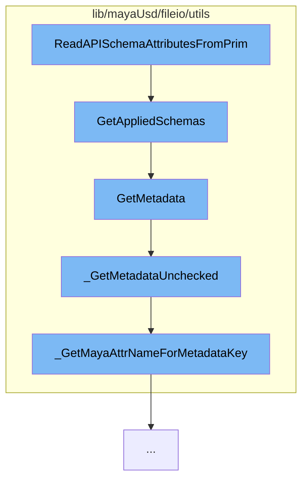

This document will cover the process of reading API schema attributes from a prim in the Maya USD plugin. The process includes:

1. Invoking the ReadAPISchemaAttributesFromPrim function
2. Getting applied schemas
3. Retrieving metadata
4. Checking metadata without validation
5. Getting Maya attribute name for metadata key.



# Invoking the ReadAPISchemaAttributesFromPrim function

The process begins with the invocation of the `ReadAPISchemaAttributesFromPrim` function. This function is responsible for reading API schema attributes from a prim.

<SwmSnippet path="/lib/mayaUsd/fileio/utils/adaptor.cpp" line="172">

---

# Getting applied schemas

The `GetAppliedSchemas` function is called next. This function retrieves the applied schemas for the current adaptor. It checks if there are any plugin adaptors that could be used and if so, it takes the first one that can adapt.

```c++
TfTokenVector UsdMayaAdaptor::GetAppliedSchemas() const
{
    if (!*this) {
        return TfTokenVector();
    }

    if (_jobImportArgs && !_handle.isValid()) {
        TF_CODING_ERROR("An importing adaptor should only use ApplySchema.");
        return TfTokenVector();
    }

    TfTokenVector result;

    // See if we have any plugin adaptors we could use:
    const MFnDependencyNode depNodeFn(_handle.object());
    const std::string       mayaTypeName(depNodeFn.typeName().asChar());
    for (auto&& adaptorEntry : UsdMayaSchemaApiAdaptorRegistry::Find(mayaTypeName)) {
        TfToken schemaName(adaptorEntry.first);
        if (_jobExportArgs
            && _jobExportArgs->includeAPINames.find(schemaName)
                == _jobExportArgs->includeAPINames.end()) {
```

---

</SwmSnippet>

<SwmSnippet path="/lib/mayaUsd/fileio/utils/adaptor.cpp" line="518">

---

# Retrieving metadata

The `GetMetadata` function is then called. This function retrieves the metadata for a given key. It checks if the key is registered and if so, it retrieves the metadata.

```c++
bool UsdMayaAdaptor::GetMetadata(const TfToken& key, VtValue* value) const
{
    if (!*this) {
        return false;
    }

    if (!SdfSchema::GetInstance().IsRegistered(key)) {
        TF_CODING_ERROR("Metadata key '%s' is not registered", key.GetText());
        return false;
    }

    MFnDependencyNode node(_handle.object());
    return _GetMetadataUnchecked(node, key, value);
}
```

---

</SwmSnippet>

<SwmSnippet path="/lib/mayaUsd/fileio/utils/adaptor.cpp" line="472">

---

# Checking metadata without validation

The `_GetMetadataUnchecked` function is called next. This function retrieves the metadata for a given key without validating the key. It checks if the key has a fallback value and if so, it retrieves the metadata.

```c++
static bool _GetMetadataUnchecked(const MFnDependencyNode& node, const TfToken& key, VtValue* value)
{
    VtValue fallback = SdfSchema::GetInstance().GetFallback(key);
    if (fallback.IsEmpty()) {
        return false;
    }

    std::string mayaAttrName = _GetMayaAttrNameForMetadataKey(key);
    MPlug       plug = node.findPlug(mayaAttrName.c_str());
    if (plug.isNull()) {
        return false;
    }

    TfType  ty = fallback.GetType();
    VtValue result = UsdMayaWriteUtil::GetVtValue(plug, ty, TfToken());
    if (result.IsEmpty()) {
        TF_RUNTIME_ERROR(
            "Cannot convert plug '%s' into metadata '%s' (%s)",
            plug.name().asChar(),
            key.GetText(),
            ty.GetTypeName().c_str());
```

---

</SwmSnippet>

<SwmSnippet path="/lib/mayaUsd/fileio/utils/adaptor.cpp" line="67">

---

# Getting Maya attribute name for metadata key

Finally, the `_GetMayaAttrNameForMetadataKey` function is called. This function retrieves the Maya attribute name for a given metadata key.

```c++
static std::string _GetMayaAttrNameForMetadataKey(const TfToken& key)
{
    return TfStringPrintf("USD_%s", TfMakeValidIdentifier(key.GetString()).c_str());
}
```

---

</SwmSnippet>

&nbsp;

_This is an auto-generated document by Swimm AI 🌊 and has not yet been verified by a human_

<SwmMeta version="3.0.0" repo-id="Z2l0aHViJTNBJTNBbWF5YS11c2QlM0ElM0FnaWxhZG5hdm90" repo-name="maya-usd"><sup>Powered by [Swimm](/)</sup></SwmMeta>
