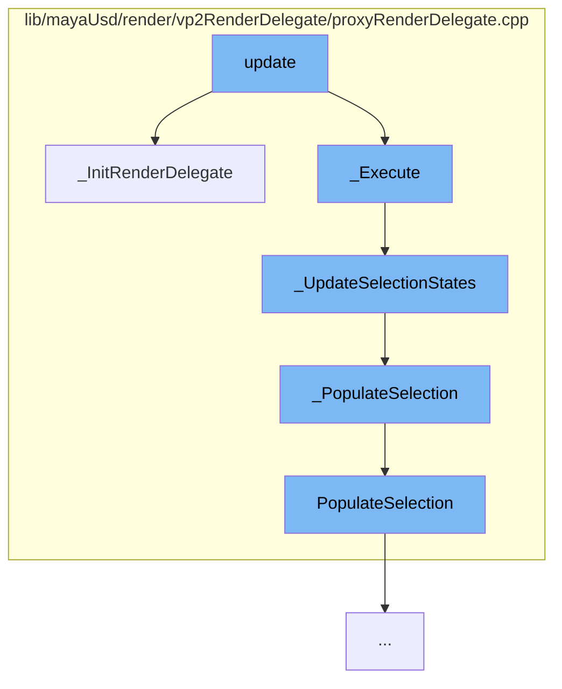

This document will cover the process of updating the render delegate in the Maya USD plugin, which includes:

1. Initializing the render delegate
2. Executing the render delegate
3. Updating selection states
4. Populating the selection
5. Finalizing the selection



<SwmSnippet path="/lib/mayaUsd/render/vp2RenderDelegate/proxyRenderDelegate.cpp" line="661">

---

# Initializing the render delegate

The function `_InitRenderDelegate` is used to initialize the render delegate. It verifies the proxy shape data, updates the USD stage, and allocates the render delegate, render index, and scene delegate. It also sets up observers, display layers, color preferences, and color management preferences.

```c++
//! \brief  Initialize the render delegate
void ProxyRenderDelegate::_InitRenderDelegate()
{
    TF_VERIFY(_proxyShapeData->ProxyShape());

    // Initialize the optionVar ShowDisplayColorTextureOff, which will decide if display color will
    // be used when untextured mode is selected
    const MString optionVarName(MayaUsdOptionVars->ShowDisplayColorTextureOff.GetText());
    if (!MGlobal::optionVarExists(optionVarName)) {
        MGlobal::setOptionVarValue(optionVarName, 0);
    }

    // No need to run all the checks if we got till the end
    if (_isInitialized())
        return;

    _proxyShapeData->UpdateUsdStage();
    _proxyShapeData->UsdStageUpdated();

    if (!_renderDelegate) {
        MProfilingScope subProfilingScope(
```

---

</SwmSnippet>

<SwmSnippet path="/lib/mayaUsd/render/vp2RenderDelegate/proxyRenderDelegate.cpp" line="0">

---

# Executing the render delegate

The function `_Execute` is called after `_InitRenderDelegate`. It is responsible for executing the render delegate. The implementation details are not provided in the context.

```c++
//
// Copyright 2020 Autodesk
//
// Licensed under the Apache License, Version 2.0 (the "License");
// you may not use this file except in compliance with the License.
// You may obtain a copy of the License at
//
//     http://www.apache.org/licenses/LICENSE-2.0
//
// Unless required by applicable law or agreed to in writing, software
// distributed under the License is distributed on an "AS IS" BASIS,
// WITHOUT WARRANTIES OR CONDITIONS OF ANY KIND, either express or implied.
// See the License for the specific language governing permissions and
// limitations under the License.
//
```

---

</SwmSnippet>

<SwmSnippet path="/lib/mayaUsd/render/vp2RenderDelegate/proxyRenderDelegate.cpp" line="1806">

---

# Updating selection states

The function `_UpdateSelectionStates` is used to update the selection states. It checks the display status and updates the lead and active selection accordingly. It also marks the rprims as dirty and triggers a sync to update them.

```c++
/*! \brief  Notify selection change to rprims.
 */
void ProxyRenderDelegate::_UpdateSelectionStates()
{
    const MHWRender::DisplayStatus previousStatus = _displayStatus;
    _displayStatus = MHWRender::MGeometryUtilities::displayStatus(_proxyShapeData->ProxyDagPath());

    SdfPathVector        rootPaths;
    const SdfPathVector* dirtyPaths = nullptr;

    if (_displayStatus == MHWRender::kLead || _displayStatus == MHWRender::kActive) {
        if (_displayStatus != previousStatus) {
            rootPaths.push_back(SdfPath::AbsoluteRootPath());
            dirtyPaths = &_renderIndex->GetRprimIds();
        }
    } else if (previousStatus == MHWRender::kLead || previousStatus == MHWRender::kActive) {
        rootPaths.push_back(SdfPath::AbsoluteRootPath());
        dirtyPaths = &_renderIndex->GetRprimIds();
        _PopulateSelection();
    } else {
        // Append pre-update lead and active selection.
```

---

</SwmSnippet>

<SwmSnippet path="/lib/mayaUsd/render/vp2RenderDelegate/proxyRenderDelegate.cpp" line="1780">

---

# Populating the selection

The function `_PopulateSelection` is used to populate the lead and active selection for Rprims under the proxy shape. It checks if the proxy shape data is null and updates the lead and active selection.

```c++
//! \brief  Populate lead and active selection for Rprims under the proxy shape.
void ProxyRenderDelegate::_PopulateSelection()
{
    if (_proxyShapeData->ProxyShape() == nullptr) {
        return;
    }

    _leadSelection.reset(new HdSelection);
    _activeSelection.reset(new HdSelection);

    const auto proxyPath = _proxyShapeData->ProxyShape()->ufePath();
    const auto globalSelection = Ufe::GlobalSelection::get();

    // Populate lead selection from the last item in UFE global selection.
    auto it = globalSelection->crbegin();
    if (it != globalSelection->crend()) {
        PopulateSelection(*it, proxyPath, *_sceneDelegate, _leadSelection);

        // Start reverse iteration from the second last item in UFE global
        // selection and populate active selection.
        for (it++; it != globalSelection->crend(); it++) {
```

---

</SwmSnippet>

<SwmSnippet path="/lib/mayaUsd/render/vp2RenderDelegate/proxyRenderDelegate.cpp" line="205">

---

# Finalizing the selection

The function `PopulateSelection` is used to finalize the selection. It filters out items which are not under the current proxy shape and non-USD items. Then it populates the selection in the Hydra selection.

```c++
//! \brief  Populate Rprims into the Hydra selection from the UFE scene item.
void PopulateSelection(
    const Ufe::SceneItem::Ptr&  item,
    const Ufe::Path&            proxyPath,
    UsdImagingDelegate&         sceneDelegate,
    const HdSelectionSharedPtr& result)
{
    // Filter out items which are not under the current proxy shape.
    if (!item->path().startsWith(proxyPath)) {
        return;
    }

    // Filter out non-USD items.
    auto usdItem = UsdUfe::downcast(item);
    if (!usdItem) {
        return;
    }

    SdfPath   usdPath = usdItem->prim().GetPath();
    const int instanceIndex = usdItem->instanceIndex();

```

---

</SwmSnippet>

&nbsp;

_This is an auto-generated document by Swimm AI 🌊 and has not yet been verified by a human_

<SwmMeta version="3.0.0" repo-id="Z2l0aHViJTNBJTNBbWF5YS11c2QlM0ElM0FnaWxhZG5hdm90" repo-name="maya-usd"><sup>Powered by [Swimm](/)</sup></SwmMeta>
