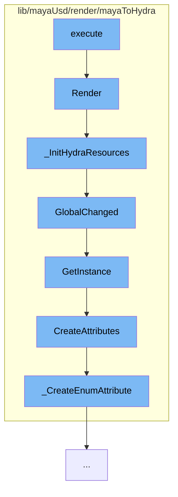

This document will cover the process of rendering in the Maya to Hydra plugin, which includes:

1. Executing the render
2. Initializing Hydra resources
3. Handling changes in global settings
4. Creating attributes for global settings
5. Creating enum attributes for global settings.



<SwmSnippet path="/lib/mayaUsd/render/mayaToHydra/renderOverride.cpp" line="435">

---

# Executing the render

The `Render` function is the entry point for the rendering process. It sets up the rendering tasks, executes them, and handles the results. It also manages the state of the render, such as whether it's playblasting, converged, or needs to be cleared.

```c++
MStatus MtohRenderOverride::Render(const MHWRender::MDrawContext& drawContext)
{
    // It would be good to clear the resources of the overrides that are
    // not in active use, but I'm not sure if we have a better way than
    // the idle time we use currently. The approach below would break if
    // two render overrides were used at the same time.
    // for (auto* override: _allInstances) {
    //     if (override != this) {
    //         override->ClearHydraResources();
    //     }
    // }
    TF_DEBUG(HDMAYA_RENDEROVERRIDE_RENDER).Msg("MtohRenderOverride::Render()\n");
    auto renderFrame = [&](bool markTime = false) {
        HdTaskSharedPtrVector tasks = _taskController->GetRenderingTasks();

        // For playblasting, a glReadPixels is going to occur sometime after we return.
        // But if we call Execute on all of the tasks, then z-buffer fighting may occur
        // because every colorize/present task is going to be drawing a full-screen quad
        // with 'unconverged' depth.
        //
        // To work arround this (for not Storm) we pull the first task, (render/synch)
```

---

</SwmSnippet>

<SwmSnippet path="/lib/mayaUsd/render/mayaToHydra/renderOverride.cpp" line="692">

---

# Initializing Hydra resources

The `_InitHydraResources` function is responsible for setting up the necessary resources for Hydra. This includes creating the render delegate, render index, task controller, and delegates. It also sets up the selection tracker and applies any global settings.

```c++
void MtohRenderOverride::_InitHydraResources()
{
    TF_DEBUG(HDMAYA_RENDEROVERRIDE_RESOURCES)
        .Msg("MtohRenderOverride::_InitHydraResources(%s)\n", _rendererDesc.rendererName.GetText());

    _initializationAttempted = true;

    GlfContextCaps::InitInstance();
    _rendererPlugin
        = HdRendererPluginRegistry::GetInstance().GetRendererPlugin(_rendererDesc.rendererName);
    if (!_rendererPlugin)
        return;

    auto* renderDelegate = _rendererPlugin->CreateRenderDelegate();
    if (!renderDelegate)
        return;

    _renderIndex = HdRenderIndex::New(renderDelegate, { &_hgiDriver });
    if (!_renderIndex)
        return;

```

---

</SwmSnippet>

<SwmSnippet path="/lib/mayaUsd/render/mayaToHydra/renderGlobals.cpp" line="1146">

---

# Handling changes in global settings

The `GlobalChanged` function is called when there are changes in the global settings. It retrieves the instance of `MtohRenderGlobals` with the updated settings.

```c++
const MtohRenderGlobals&
MtohRenderGlobals::GlobalChanged(const GlobalParams& params, bool storeUserSetting)
{
    return GetInstance(params, storeUserSetting);
}
```

---

</SwmSnippet>

<SwmSnippet path="/lib/mayaUsd/render/mayaToHydra/renderGlobals.cpp" line="789">

---

# Creating attributes for global settings

The `CreateAttributes` function is responsible for creating the necessary attributes for the global settings. It creates attributes for motion samples, texture memory, shadow map resolution, and selection highlights among others.

```c++
// TODO : MtohRenderGlobals::CreateNode && MtohRenderGlobals::GetInstance
//        are extrmely redundant in logic, with most divergance occurring
//        at the leaf operation (_CreatXXXAttr vs. _GetAttribute)
//
MObject MtohRenderGlobals::CreateAttributes(const GlobalParams& params)
{
    MSelectionList slist;
    slist.add(_tokens->defaultRenderGlobals.GetText());

    MObject mayaObject;
    if (slist.length() == 0 || !slist.getDependNode(0, mayaObject)) {
        return mayaObject;
    }

    MStatus           status;
    MFnDependencyNode node(mayaObject, &status);
    if (!status) {
        return MObject();
    }

    // This static is used to setup the default values
```

---

</SwmSnippet>

<SwmSnippet path="/lib/mayaUsd/render/mayaToHydra/renderGlobals.cpp" line="175">

---

# Creating enum attributes for global settings

The `_CreateEnumAttribute` function is used to create enum attributes for the global settings. It creates an enum attribute and sets its default value.

```c++
void _CreateEnumAttribute(
    MFnDependencyNode&   node,
    const MString&       attrName,
    const TfTokenVector& values,
    const TfToken&       defValue,
    bool                 useUserOptions)
{
    const auto attr = node.attribute(attrName);
    const bool existed = !attr.isNull();
    if (existed) {
        const auto sameOrder = [&attr, &values]() -> bool {
            MStatus          status;
            MFnEnumAttribute eAttr(attr, &status);
            if (!status) {
                return false;
            }
            short id = 0;
            for (const auto& v : values) {
                if (eAttr.fieldName(id++) != v.GetText()) {
                    return false;
                }
```

---

</SwmSnippet>

&nbsp;

*This is an auto-generated document by Swimm AI 🌊 and has not yet been verified by a human*

<SwmMeta version="3.0.0" repo-id="Z2l0aHViJTNBJTNBbWF5YS11c2QlM0ElM0FnaWxhZG5hdm90" repo-name="maya-usd" doc-type="flows"><sup>Powered by [Swimm](/)</sup></SwmMeta>
