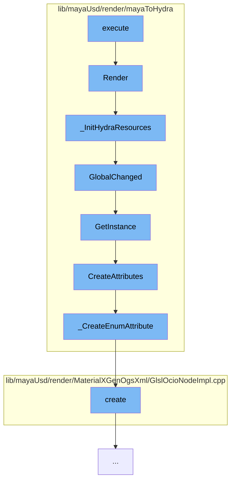

This document will cover the process of rendering in Maya using the Universal Scene Description (USD) plugin. The process includes:

1. Executing the render
2. Initializing Hydra resources
3. Handling changes in global settings
4. Creating attributes for the render
5. Creating an enumeration attribute
6. Creating a new instance of the GlslOcioNodeData class.



<SwmSnippet path="/lib/mayaUsd/render/mayaToHydra/renderOverride.cpp" line="435">

---

# Executing the render

The `Render` function in `renderOverride.cpp` is the entry point for the rendering process. It sets up the render tasks, executes them, and handles the rendering parameters such as lighting, camera, and selection color.

```c++
MStatus MtohRenderOverride::Render(const MHWRender::MDrawContext& drawContext)
{
    // It would be good to clear the resources of the overrides that are
    // not in active use, but I'm not sure if we have a better way than
    // the idle time we use currently. The approach below would break if
    // two render overrides were used at the same time.
    // for (auto* override: _allInstances) {
    //     if (override != this) {
    //         override->ClearHydraResources();
    //     }
    // }
    TF_DEBUG(HDMAYA_RENDEROVERRIDE_RENDER).Msg("MtohRenderOverride::Render()\n");
    auto renderFrame = [&](bool markTime = false) {
        HdTaskSharedPtrVector tasks = _taskController->GetRenderingTasks();

        // For playblasting, a glReadPixels is going to occur sometime after we return.
        // But if we call Execute on all of the tasks, then z-buffer fighting may occur
        // because every colorize/present task is going to be drawing a full-screen quad
        // with 'unconverged' depth.
        //
        // To work arround this (for not Storm) we pull the first task, (render/synch)
```

---

</SwmSnippet>

<SwmSnippet path="/lib/mayaUsd/render/mayaToHydra/renderOverride.cpp" line="692">

---

# Initializing Hydra resources

The `_InitHydraResources` function initializes the resources required for Hydra, the rendering engine. It creates the render delegate, render index, and task controller, and populates the scene delegates.

```c++
void MtohRenderOverride::_InitHydraResources()
{
    TF_DEBUG(HDMAYA_RENDEROVERRIDE_RESOURCES)
        .Msg("MtohRenderOverride::_InitHydraResources(%s)\n", _rendererDesc.rendererName.GetText());

    _initializationAttempted = true;

    GlfContextCaps::InitInstance();
    _rendererPlugin
        = HdRendererPluginRegistry::GetInstance().GetRendererPlugin(_rendererDesc.rendererName);
    if (!_rendererPlugin)
        return;

    auto* renderDelegate = _rendererPlugin->CreateRenderDelegate();
    if (!renderDelegate)
        return;

    _renderIndex = HdRenderIndex::New(renderDelegate, { &_hgiDriver });
    if (!_renderIndex)
        return;

```

---

</SwmSnippet>

<SwmSnippet path="/lib/mayaUsd/render/mayaToHydra/renderGlobals.cpp" line="1146">

---

# Handling changes in global settings

The `GlobalChanged` function is called when there are changes in the global settings. It retrieves the instance of `MtohRenderGlobals` which holds the global settings.

```c++
const MtohRenderGlobals&
MtohRenderGlobals::GlobalChanged(const GlobalParams& params, bool storeUserSetting)
{
    return GetInstance(params, storeUserSetting);
}
```

---

</SwmSnippet>

<SwmSnippet path="/lib/mayaUsd/render/mayaToHydra/renderGlobals.cpp" line="992">

---

# Creating attributes for the render

The `GetInstance` function retrieves the instance of `MtohRenderGlobals` and creates the necessary attributes for the render based on the global settings.

```c++
const MtohRenderGlobals&
MtohRenderGlobals::GetInstance(const GlobalParams& params, bool storeUserSetting)
{
    static MtohRenderGlobals globals;
    const auto               obj = CreateAttributes(params);
    if (obj.isNull()) {
        return globals;
    }

    MStatus           status;
    MFnDependencyNode node(obj, &status);
    if (!status) {
        return globals;
    }

    MtohSettingFilter filter(params);

    if (filter(_tokens->mtohTextureMemoryPerTexture)
        && _GetAttribute(
            node,
            filter.mayaString(),
```

---

</SwmSnippet>

<SwmSnippet path="/lib/mayaUsd/render/mayaToHydra/renderGlobals.cpp" line="175">

---

# Creating an enumeration attribute

The `_CreateEnumAttribute` function creates an enumeration attribute for the render. This is used for settings that have a predefined set of valid values.

```c++
void _CreateEnumAttribute(
    MFnDependencyNode&   node,
    const MString&       attrName,
    const TfTokenVector& values,
    const TfToken&       defValue,
    bool                 useUserOptions)
{
    const auto attr = node.attribute(attrName);
    const bool existed = !attr.isNull();
    if (existed) {
        const auto sameOrder = [&attr, &values]() -> bool {
            MStatus          status;
            MFnEnumAttribute eAttr(attr, &status);
            if (!status) {
                return false;
            }
            short id = 0;
            for (const auto& v : values) {
                if (eAttr.fieldName(id++) != v.GetText()) {
                    return false;
                }
```

---

</SwmSnippet>

<SwmSnippet path="/lib/mayaUsd/render/MaterialXGenOgsXml/GlslOcioNodeImpl.cpp" line="133">

---

# Creating a new instance of the GlslOcioNodeData class

The `create` function creates a new instance of the `GlslOcioNodeData` class. This class is used for handling OpenColorIO (OCIO) nodes in the MaterialX shader generation for OpenGL Shading Language (GLSL).

```c++
    }

    /// Create and return a new instance.
    static GlslOcioNodeDataPtr create() { return std::make_shared<GlslOcioNodeData>(); }
```

---

</SwmSnippet>

&nbsp;

_This is an auto-generated document by Swimm AI 🌊 and has not yet been verified by a human_

<SwmMeta version="3.0.0" repo-id="Z2l0aHViJTNBJTNBbWF5YS11c2QlM0ElM0FnaWxhZG5hdm90" repo-name="maya-usd"><sup>Powered by [Swimm](/)</sup></SwmMeta>
