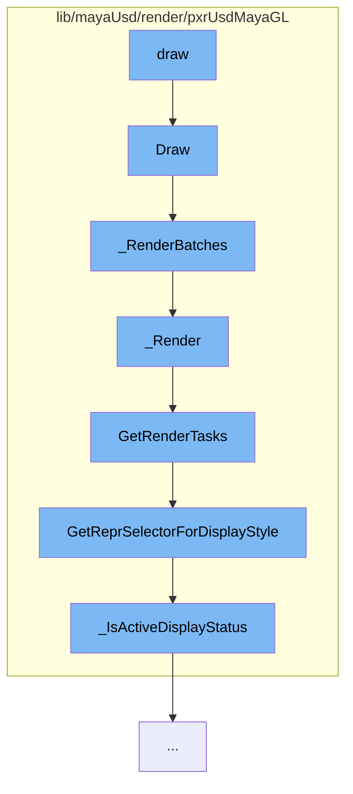

This document will cover the process of rendering in the Maya-USD plugin, which includes:

1. Drawing the scene
2. Rendering batches
3. Rendering the scene
4. Getting render tasks
5. Getting representation selector for display style
6. Checking if the display status is active.



<SwmSnippet path="/lib/mayaUsd/render/pxrUsdMayaGL/batchRenderer.cpp" line="521">

---

# Drawing the scene

The `Draw` function is the entry point for the rendering process. It prepares the necessary data and calls the `_RenderBatches` function to start the rendering of batches.

```c++
void UsdMayaGLBatchRenderer::Draw(const MDrawRequest& request, M3dView& view)
{
    // Legacy viewport implementation.

    TRACE_FUNCTION();

    MProfilingScope profilingScope(
        ProfilerCategory, MProfiler::kColorC_L2, "Batch Renderer Draw() (Legacy Viewport)");

    MDrawData drawData = request.drawData();

    const PxrMayaHdUserData* hdUserData
        = static_cast<const PxrMayaHdUserData*>(drawData.geometry());
    if (!hdUserData) {
        return;
    }

    GfMatrix4d worldToViewMatrix;
    _GetWorldToViewMatrix(view, &worldToViewMatrix);

    MMatrix projectionMat;
```

---

</SwmSnippet>

<SwmSnippet path="/lib/mayaUsd/render/pxrUsdMayaGL/batchRenderer.cpp" line="1208">

---

# Rendering batches

The `_RenderBatches` function is responsible for rendering the batches. It iterates over the shape adapter buckets and for each bucket, it updates the visibility and pushes the shape adapter to the prim filters. Then it calls the `_Render` function to render the scene.

```c++
void UsdMayaGLBatchRenderer::_RenderBatches(
    const MHWRender::MDrawContext* vp2Context,
    const M3dView*                 view3d,
    const GfMatrix4d&              worldToViewMatrix,
    const GfMatrix4d&              projectionMatrix,
    const GfVec4d&                 viewport)
{
    TRACE_FUNCTION();

    MProfilingScope profilingScope(
        ProfilerCategory, MProfiler::kColorC_L2, "Batch Renderer Rendering Batches");

    _ShapeAdapterBucketsMap& bucketsMap
        = bool(vp2Context) ? _shapeAdapterBuckets : _legacyShapeAdapterBuckets;

    if (bucketsMap.empty()) {
        return;
    }

    if (TfDebug::IsEnabled(PXRUSDMAYAGL_BATCHED_DRAWING)) {
        TF_DEBUG(PXRUSDMAYAGL_BATCHED_DRAWING)
```

---

</SwmSnippet>

<SwmSnippet path="/lib/mayaUsd/render/pxrUsdMayaGL/batchRenderer.cpp" line="1128">

---

# Rendering the scene

The `_Render` function is responsible for rendering the scene. It sets up the camera state, saves the current GL states, and executes the Hydra tasks.

```c++
void UsdMayaGLBatchRenderer::_Render(
    const GfMatrix4d&               worldToViewMatrix,
    const GfMatrix4d&               projectionMatrix,
    const GfVec4d&                  viewport,
    unsigned int                    displayStyle,
    const std::vector<_RenderItem>& items)
{
    TRACE_FUNCTION();

    MProfilingScope profilingScope(
        ProfilerCategory, MProfiler::kColorC_L2, "Batch Renderer Rendering Batch");

    _taskDelegate->SetCameraState(worldToViewMatrix, projectionMatrix, viewport);

    // save the current GL states which hydra may reset to default
    glPushAttrib(
        GL_LIGHTING_BIT | GL_ENABLE_BIT | GL_POLYGON_BIT | GL_DEPTH_BUFFER_BIT | GL_VIEWPORT_BIT);

    GLUniformBufferBindingsSaver bindingsSaver;

    // hydra orients all geometry during topological processing so that
```

---

</SwmSnippet>

<SwmSnippet path="/lib/mayaUsd/render/pxrUsdMayaGL/sceneDelegate.cpp" line="538">

---

# Getting render tasks

The `GetRenderTasks` function is responsible for getting the render tasks for the scene. It creates a new render setup task if one does not exist for the current hash and updates the render setup task params if necessary.

```c++
HdTaskSharedPtrVector PxrMayaHdSceneDelegate::GetRenderTasks(
    const size_t                     hash,
    const PxrMayaHdRenderParams&     renderParams,
    unsigned int                     displayStyle,
    const PxrMayaHdPrimFilterVector& primFilters)
{
    HdTaskSharedPtrVector taskList;
    HdRenderIndex&        renderIndex = GetRenderIndex();

    // Task List Consist of:
    //  Render Setup Task
    //  Render Task Per Shape Adapter/Collection
    //  Selection Task
    taskList.reserve(2 + primFilters.size());

    SdfPath renderSetupTaskId;
    if (!TfMapLookup(_renderSetupTaskIdMap, hash, &renderSetupTaskId)) {
        // Create a new render setup task if one does not exist for this hash.
        renderSetupTaskId = _rootId.AppendChild(
            TfToken(TfStringPrintf("%s_%zx", HdxPrimitiveTokens->renderSetupTask.GetText(), hash)));

```

---

</SwmSnippet>

<SwmSnippet path="/lib/mayaUsd/render/pxrUsdMayaGL/shapeAdapter.cpp" line="195">

---

# Getting representation selector for display style

The `GetReprSelectorForDisplayStyle` function is responsible for getting the representation selector based on the display style. It checks the display style and returns the appropriate representation selector.

```c++
HdReprSelector
PxrMayaHdShapeAdapter::GetReprSelectorForDisplayStyle(unsigned int displayStyle) const
{
    HdReprSelector reprSelector;

    const bool boundingBoxStyle
        = displayStyle & MHWRender::MFrameContext::DisplayStyle::kBoundingBox;

    if (boundingBoxStyle) {
        // We don't currently use Hydra to draw bounding boxes, so we return an
        // empty repr selector here. Also, Maya seems to ignore most other
        // DisplayStyle bits when the viewport is in the kBoundingBox display
        // style anyway, and it just changes the color of the bounding box on
        // selection rather than adding in the wireframe like it does for
        // shaded display styles. So if we eventually do end up using Hydra for
        // bounding boxes, we could just return the appropriate repr here.
        return reprSelector;
    }

    const MHWRender::DisplayStatus displayStatus
        = MHWRender::MGeometryUtilities::displayStatus(_shapeDagPath);
```

---

</SwmSnippet>

<SwmSnippet path="/lib/mayaUsd/render/pxrUsdMayaGL/shapeAdapter.cpp" line="85">

---

# Checking if the display status is active

The `_IsActiveDisplayStatus` function checks if the display status is active. It returns true if the display status is active, hilite, active template, active component, or lead.

```c++
static inline bool _IsActiveDisplayStatus(MHWRender::DisplayStatus displayStatus)
{
    return (displayStatus == MHWRender::DisplayStatus::kActive)
        || (displayStatus == MHWRender::DisplayStatus::kHilite)
        || (displayStatus == MHWRender::DisplayStatus::kActiveTemplate)
        || (displayStatus == MHWRender::DisplayStatus::kActiveComponent)
        || (displayStatus == MHWRender::DisplayStatus::kLead);
}
```

---

</SwmSnippet>

&nbsp;

*This is an auto-generated document by Swimm AI 🌊 and has not yet been verified by a human*

<SwmMeta version="3.0.0" repo-id="Z2l0aHViJTNBJTNBbWF5YS11c2QlM0ElM0FnaWxhZG5hdm90" repo-name="maya-usd" doc-type="flows"><sup>Powered by [Swimm](/)</sup></SwmMeta>
