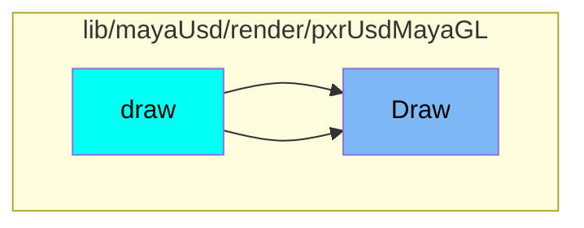
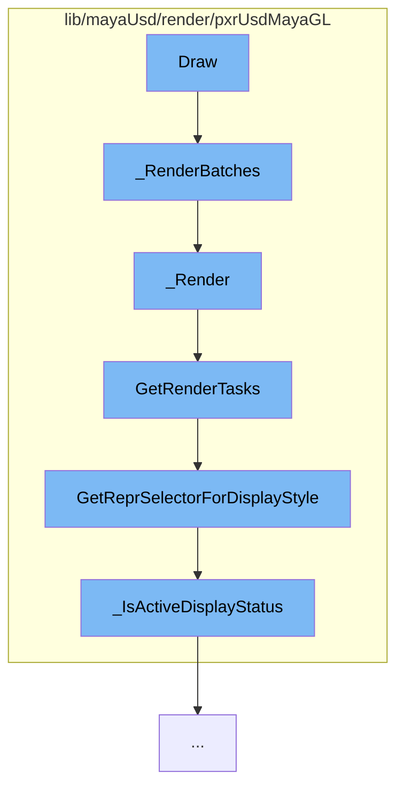

This document will cover the process of rendering in the Maya-USD plugin, which includes:

1. Rendering batches
2. Rendering individual items
3. Getting render tasks
4. Getting representation for display style
5. Checking active display status.

## Where is this flow used?

The flow starts with the function `Draw`. It is called from multiple entry points as represented in the following diagram:



## The flow itself



<SwmSnippet path="/lib/mayaUsd/render/pxrUsdMayaGL/batchRenderer.cpp" line="1208">

---

# Rendering Batches

The function `_RenderBatches` is the starting point of the rendering process. It prepares the rendering environment, checks the visibility of objects, and calls the `_Render` function for actual rendering.

```c++
void UsdMayaGLBatchRenderer::_RenderBatches(
    const MHWRender::MDrawContext* vp2Context,
    const M3dView*                 view3d,
    const GfMatrix4d&              worldToViewMatrix,
    const GfMatrix4d&              projectionMatrix,
    const GfVec4d&                 viewport)
{
    TRACE_FUNCTION();

    MProfilingScope profilingScope(
        ProfilerCategory, MProfiler::kColorC_L2, "Batch Renderer Rendering Batches");

    _ShapeAdapterBucketsMap& bucketsMap
        = bool(vp2Context) ? _shapeAdapterBuckets : _legacyShapeAdapterBuckets;

    if (bucketsMap.empty()) {
        return;
    }

    if (TfDebug::IsEnabled(PXRUSDMAYAGL_BATCHED_DRAWING)) {
        TF_DEBUG(PXRUSDMAYAGL_BATCHED_DRAWING)
```

---

</SwmSnippet>

<SwmSnippet path="/lib/mayaUsd/render/pxrUsdMayaGL/batchRenderer.cpp" line="1128">

---

# Rendering Individual Items

The function `_Render` is responsible for rendering individual items. It sets up the camera state, lighting, and other GL states, and then executes the Hydra tasks for rendering.

```c++
void UsdMayaGLBatchRenderer::_Render(
    const GfMatrix4d&               worldToViewMatrix,
    const GfMatrix4d&               projectionMatrix,
    const GfVec4d&                  viewport,
    unsigned int                    displayStyle,
    const std::vector<_RenderItem>& items)
{
    TRACE_FUNCTION();

    MProfilingScope profilingScope(
        ProfilerCategory, MProfiler::kColorC_L2, "Batch Renderer Rendering Batch");

    _taskDelegate->SetCameraState(worldToViewMatrix, projectionMatrix, viewport);

    // save the current GL states which hydra may reset to default
    glPushAttrib(
        GL_LIGHTING_BIT | GL_ENABLE_BIT | GL_POLYGON_BIT | GL_DEPTH_BUFFER_BIT | GL_VIEWPORT_BIT);

    GLUniformBufferBindingsSaver bindingsSaver;

    // hydra orients all geometry during topological processing so that
```

---

</SwmSnippet>

<SwmSnippet path="/lib/mayaUsd/render/pxrUsdMayaGL/sceneDelegate.cpp" line="538">

---

# Getting Render Tasks

The function `GetRenderTasks` is used to get the render tasks for the scene. It creates and updates the render setup task and the render tasks for each shape adapter.

```c++
HdTaskSharedPtrVector PxrMayaHdSceneDelegate::GetRenderTasks(
    const size_t                     hash,
    const PxrMayaHdRenderParams&     renderParams,
    unsigned int                     displayStyle,
    const PxrMayaHdPrimFilterVector& primFilters)
{
    HdTaskSharedPtrVector taskList;
    HdRenderIndex&        renderIndex = GetRenderIndex();

    // Task List Consist of:
    //  Render Setup Task
    //  Render Task Per Shape Adapter/Collection
    //  Selection Task
    taskList.reserve(2 + primFilters.size());

    SdfPath renderSetupTaskId;
    if (!TfMapLookup(_renderSetupTaskIdMap, hash, &renderSetupTaskId)) {
        // Create a new render setup task if one does not exist for this hash.
        renderSetupTaskId = _rootId.AppendChild(
            TfToken(TfStringPrintf("%s_%zx", HdxPrimitiveTokens->renderSetupTask.GetText(), hash)));

```

---

</SwmSnippet>

<SwmSnippet path="/lib/mayaUsd/render/pxrUsdMayaGL/shapeAdapter.cpp" line="195">

---

# Getting Representation for Display Style

The function `GetReprSelectorForDisplayStyle` determines the representation for the given display style. It checks various display styles and returns the appropriate representation.

```c++
HdReprSelector
PxrMayaHdShapeAdapter::GetReprSelectorForDisplayStyle(unsigned int displayStyle) const
{
    HdReprSelector reprSelector;

    const bool boundingBoxStyle
        = displayStyle & MHWRender::MFrameContext::DisplayStyle::kBoundingBox;

    if (boundingBoxStyle) {
        // We don't currently use Hydra to draw bounding boxes, so we return an
        // empty repr selector here. Also, Maya seems to ignore most other
        // DisplayStyle bits when the viewport is in the kBoundingBox display
        // style anyway, and it just changes the color of the bounding box on
        // selection rather than adding in the wireframe like it does for
        // shaded display styles. So if we eventually do end up using Hydra for
        // bounding boxes, we could just return the appropriate repr here.
        return reprSelector;
    }

    const MHWRender::DisplayStatus displayStatus
        = MHWRender::MGeometryUtilities::displayStatus(_shapeDagPath);
```

---

</SwmSnippet>

<SwmSnippet path="/lib/mayaUsd/render/pxrUsdMayaGL/shapeAdapter.cpp" line="85">

---

# Checking Active Display Status

The function `_IsActiveDisplayStatus` checks whether the given display status is active. It is used to determine whether a shape should be rendered or not.

```c++
static inline bool _IsActiveDisplayStatus(MHWRender::DisplayStatus displayStatus)
{
    return (displayStatus == MHWRender::DisplayStatus::kActive)
        || (displayStatus == MHWRender::DisplayStatus::kHilite)
        || (displayStatus == MHWRender::DisplayStatus::kActiveTemplate)
        || (displayStatus == MHWRender::DisplayStatus::kActiveComponent)
        || (displayStatus == MHWRender::DisplayStatus::kLead);
}
```

---

</SwmSnippet>

&nbsp;

*This is an auto-generated document by Swimm AI 🌊 and has not yet been verified by a human*

<SwmMeta version="3.0.0" repo-id="Z2l0aHViJTNBJTNBbWF5YS11c2QlM0ElM0FnaWxhZG5hdm90" repo-name="maya-usd" doc-type="flows"><sup>Powered by [Swimm](/)</sup></SwmMeta>
