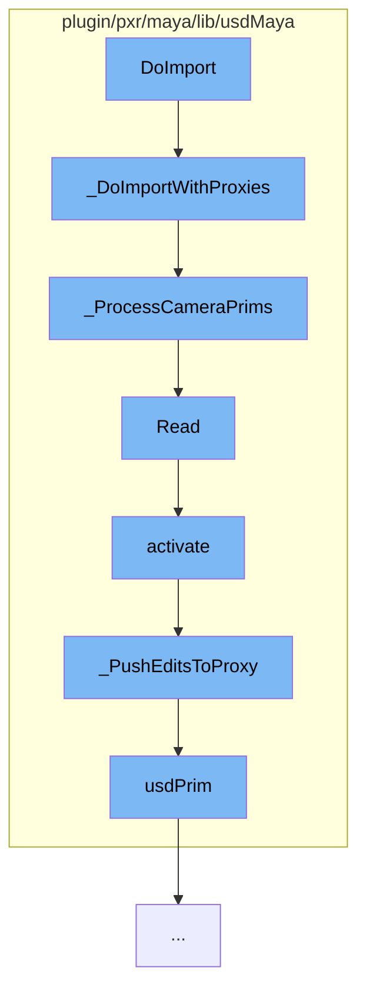

This document will cover the process of importing a scene in Maya using the USD plugin, which includes:

1. Initiating the import process
2. Processing camera primitives
3. Reading the model assembly
4. Activating the assembly
5. Pushing edits to the proxy
6. Accessing the USD prim.



<SwmSnippet path="/plugin/pxr/maya/lib/usdMaya/readJob_ImportWithProxies.cpp" line="292">

---

# Initiating the import process

The function `_DoImportWithProxies` initiates the import process. It iterates through the prims and collects the various types we're interested in. The creation of Maya nodes is deferred until we've finished iterating.

```c++
bool UsdMaya_ReadJobWithSceneAssembly::_DoImportWithProxies(UsdPrimRange& range)
{
    MStatus status;

    // We'll iterate through the prims collecting the various types we're
    // interested in, but we defer creating any Maya nodes until we've finished
    // iterating. This way we'll know all the paths we'll need to re-create in
    // Maya, and we can create only the transforms necessary to produce those
    // paths.
    std::vector<UsdPrim> cameraPrims;
    std::vector<UsdPrim> subAssemblyPrims;
    std::vector<UsdPrim> proxyPrims;

    UsdPrim          pxrGeomRoot;
    CollapsePointMap collapsePointMap;

    for (auto primIt = range.begin(); primIt != range.end(); ++primIt) {
        const UsdPrim& prim = *primIt;

        if (prim.IsA<UsdGeomCamera>()) {
            cameraPrims.push_back(prim);
```

---

</SwmSnippet>

<SwmSnippet path="/plugin/pxr/maya/lib/usdMaya/readJob_ImportWithProxies.cpp" line="250">

---

# Processing camera primitives

The function `_ProcessCameraPrims` is used to process camera primitives. It creates parent transform nodes for each camera primitive.

```c++
bool UsdMaya_ReadJobWithSceneAssembly::_ProcessCameraPrims(const std::vector<UsdPrim>& cameraPrims)
{
    TF_FOR_ALL(iter, cameraPrims)
    {
        const UsdPrim            cameraPrim = *iter;
        UsdMayaPrimReaderArgs    args(cameraPrim, mArgs);
        UsdMayaPrimReaderContext ctx(&mNewNodeRegistry);

        if (!_CreateParentTransformNodes(cameraPrim, args, &ctx)) {
            return false;
        }

        if (UsdMayaPrimReaderRegistry::ReaderFactoryFn factoryFn
            = UsdMayaPrimReaderRegistry::Find(cameraPrim.GetTypeName(), mArgs, cameraPrim)) {
            UsdMayaPrimReaderSharedPtr primReader = factoryFn(args);
            if (primReader) {
                primReader->Read(ctx);
            }
        }
    }

```

---

</SwmSnippet>

<SwmSnippet path="/plugin/pxr/maya/lib/usdMaya/translatorModelAssembly.cpp" line="362">

---

# Reading the model assembly

The function `Read` is used to read the model assembly. It opens the USD stage, finds the model prim, and creates a new assembly node with the assembly command.

```c++
/* static */
bool UsdMayaTranslatorModelAssembly::Read(
    const UsdPrim&               prim,
    const std::string&           assetIdentifier,
    const SdfPath&               assetPrimPath,
    const MObject&               parentNode,
    const UsdMayaPrimReaderArgs& args,
    UsdMayaPrimReaderContext*    context,
    const TfToken&               assemblyRep)
{
    // This translator does not apply if assemblyRep == "Import".
    if (assemblyRep == UsdMayaJobImportArgsTokens->Import) {
        return false;
    }

    UsdStageCacheContext stageCacheContext(UsdMayaStageCache::Get(
        UsdStage::InitialLoadSet::LoadAll, UsdMayaStageCache::ShareMode::Shared));
    UsdStageRefPtr       usdStage = UsdStage::Open(assetIdentifier);
    if (!usdStage) {
        TF_RUNTIME_ERROR("Cannot open USD file %s", assetIdentifier.c_str());
        return false;
```

---

</SwmSnippet>

<SwmSnippet path="/plugin/pxr/maya/lib/usdMaya/referenceAssembly.cpp" line="1134">

---

# Activating the assembly

The function `activate` is used to activate the assembly. It creates a new node of type `UsdMayaProxyShape` and connects it to the assembly node.

```c++
bool UsdMayaRepresentationProxyBase::activate()
{
    // Get original selection list
    MSelectionList origSelList;
    MGlobal::getActiveSelectionList(origSelList, true);

    MDagModifier dagMod;
    MObject shapeObj = dagMod.createNode(UsdMayaProxyShape::typeName, getAssembly()->thisMObject());
    dagMod.renameNode(shapeObj, "CollapsedProxy");
    dagMod.doIt();

    MDGModifier       dgMod;
    MFnDependencyNode shapeFn(shapeObj);
    MFnAssembly       assemblyFn(getAssembly()->thisMObject());
    dgMod.connect(
        assemblyFn.findPlug(UsdMayaReferenceAssembly::filePathAttr, true),
        shapeFn.findPlug(UsdMayaProxyShape::filePathAttr, true));
    dgMod.connect(
        assemblyFn.findPlug(UsdMayaReferenceAssembly::primPathAttr, true),
        shapeFn.findPlug(UsdMayaProxyShape::primPathAttr, true));
    dgMod.connect(
```

---

</SwmSnippet>

<SwmSnippet path="/plugin/pxr/maya/lib/usdMaya/referenceAssembly.cpp" line="1178">

---

# Pushing edits to the proxy

The function `_PushEditsToProxy` is used to push edits to the proxy. It applies the assembly edits to the proxy root prim.

```c++
void UsdMayaRepresentationProxyBase::_PushEditsToProxy()
{
    // The following logic is all currently only supported for the "default"
    // unvarying time.

    MObject                   assemObj = getAssembly()->thisMObject();
    UsdMayaReferenceAssembly* usdAssem = dynamic_cast<UsdMayaReferenceAssembly*>(getAssembly());
    const MFnAssembly         assemblyFn(assemObj);
    MItEdits                  itAssemEdits(_GetEdits(assemObj));
    const bool                hasEdits = !itAssemEdits.isDone();
    if (usdAssem->HasEdits() != hasEdits) {
        usdAssem->SetHasEdits(hasEdits);

        // If we now have edits but previous did not, or vice versa, make sure
        // we invalidate our UsdStage so that we are not sharing with other
        // model instances that do not have edits.
        MGlobal::executeCommand("dgdirty " + assemblyFn.partialPathName());
    }

    const UsdPrim proxyRootPrim = usdAssem->usdPrim();
    if (!proxyRootPrim) {
```

---

</SwmSnippet>

<SwmSnippet path="/plugin/pxr/maya/lib/usdMaya/referenceAssembly.cpp" line="978">

---

# Accessing the USD prim

The function `usdPrim` is used to access the USD prim. It returns the USD prim associated with the assembly.

```c++
UsdPrim UsdMayaReferenceAssembly::usdPrim() const
{
    MStatus status;
    UsdPrim usdPrim;

    UsdMayaReferenceAssembly* nonConstThis = const_cast<UsdMayaReferenceAssembly*>(this);
    MDataBlock                dataBlock = nonConstThis->forceCache();

    MDataHandle outDataHandle = dataBlock.inputValue(outStageDataAttr, &status);
    CHECK_MSTATUS_AND_RETURN(status, usdPrim);

    MayaUsdStageData* outData = dynamic_cast<MayaUsdStageData*>(outDataHandle.asPluginData());
    if (!outData) {
        return usdPrim; // empty UsdPrim
    }

    if (!outData->stage) {
        return usdPrim; // empty UsdPrim
    }

    usdPrim = outData->primPath.IsEmpty()
```

---

</SwmSnippet>

&nbsp;

_This is an auto-generated document by Swimm AI 🌊 and has not yet been verified by a human_

<SwmMeta version="3.0.0" repo-id="Z2l0aHViJTNBJTNBbWF5YS11c2QlM0ElM0FnaWxhZG5hdm90" repo-name="maya-usd"><sup>Powered by [Swimm](/)</sup></SwmMeta>
