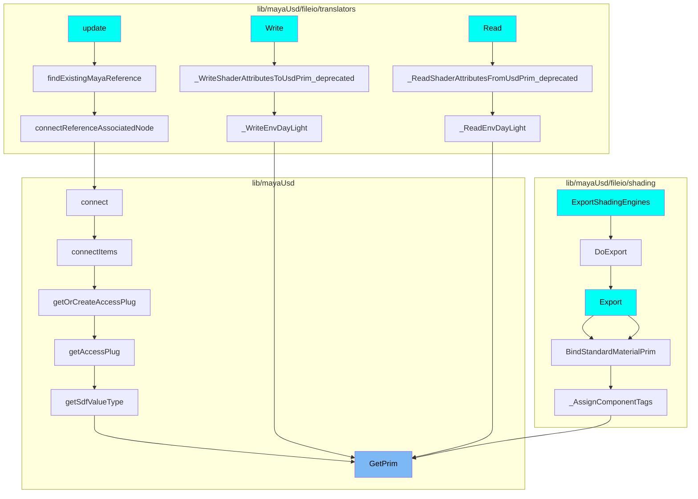
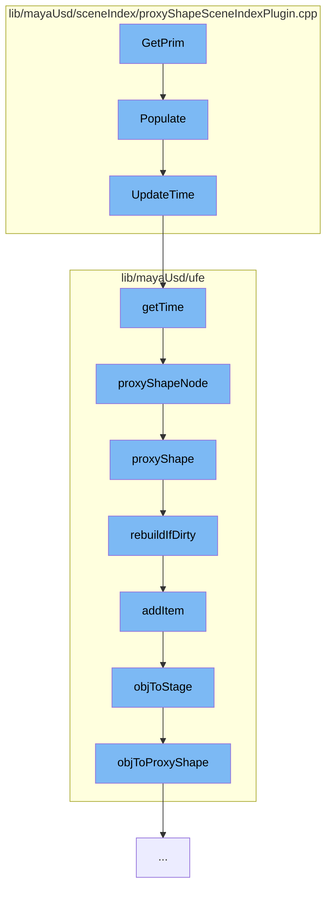

This document will cover the process of updating the scene index in the MayaUsd plugin. The process includes the following steps:

1.  Getting the primitive
2.  Populating the scene index
3.  Updating the time
4.  Getting the time
5.  Getting the proxy shape node
6.  Getting the proxy shape
7.  Rebuilding if dirty
8.  Adding an item
9.  Getting the stage from the object
10. Getting the proxy shape from the object.

## Where is this flow used?

The flow starts with the function `GetPrim`. It is called from multiple entry points as represented in the following diagram: (Note - these are only some of the entry points of this flow)



## The flow itself



<SwmSnippet path="/lib/mayaUsd/sceneIndex/proxyShapeSceneIndexPlugin.cpp" line="1">

---

# Getting the Primitive

The process starts with the `GetPrim` function. This function is the entry point for the process of updating the scene index.

```c++
//
```

---

</SwmSnippet>

<SwmSnippet path="/lib/mayaUsd/sceneIndex/proxyShapeSceneIndexPlugin.cpp" line="356">

---

# Populating the Scene Index

`Populate` function is called next. This function checks if the scene index has been populated. If not, it fetches the USD stage and sets it in the scene index. It also checks if the pseudo-root has children and if so, it marks the scene index as populated.

```c++
void MayaUsdProxyShapeSceneIndex::Populate()
{
    if (!_populated) {
        auto stage = _proxyShape->getUsdStage();
        if (TF_VERIFY(stage, "Unable to fetch a valid USDStage.")) {
            _usdImagingStageSceneIndex->SetStage(stage);
            // Check whether the pseudo-root has children
            if (!stage->GetPseudoRoot().GetChildren().empty())
            // MAYA-126641: Upon first call to MayaUsdProxyShapeBase::getUsdStage, the stage may be
            // empty. Do not mark the scene index as _populated, until stage is full. This is taken
            // care of inside MayaUsdProxyShapeSceneIndex::_StageSet callback.
            {
#if PXR_VERSION < 2305
                // In most recent USD, Populate is called from within SetStage, so there is no need
                // to callsites to call it explicitly
                _usdImagingStageSceneIndex->Populate();
#endif
                _populated = true;
            }
            // Set the initial time
            UpdateTime();
```

---

</SwmSnippet>

<SwmSnippet path="/lib/mayaUsd/sceneIndex/proxyShapeSceneIndexPlugin.cpp" line="325">

---

# Updating the Time

The `UpdateTime` function is called to update the time in the scene index. It checks if the proxy shape is valid and if so, it sets the time in the scene index.

```c++
void MayaUsdProxyShapeSceneIndex::UpdateTime()
{
    if (_usdImagingStageSceneIndex && _proxyShape && isProxyShapeValid()) {
        _usdImagingStageSceneIndex->SetTime(_proxyShape->getTime());
    }
}
```

---

</SwmSnippet>

<SwmSnippet path="/lib/mayaUsd/ufe/Utils.cpp" line="282">

---

# Getting the Time

The `getTime` function is called to get the time from the proxy shape node. It verifies if the path is not empty and if the proxy shape node is not null. If both conditions are met, it returns the time from the proxy shape node.

```c++
UsdTimeCode getTime(const Ufe::Path& path)
{
    // Path should not be empty.
    if (!TF_VERIFY(!path.empty())) {
        return UsdTimeCode::Default();
    }

    // Proxy shape node should not be null.
    auto proxyShape = UsdStageMap::getInstance().proxyShapeNode(path);
    if (!TF_VERIFY(proxyShape)) {
        return UsdTimeCode::Default();
    }

    return proxyShape->getTime();
}
```

---

</SwmSnippet>

<SwmSnippet path="/lib/mayaUsd/ufe/UsdStageMap.cpp" line="235">

---

# Getting the Proxy Shape Node

The `proxyShapeNode` function is called to get the proxy shape node from the path. It calls the `proxyShape` function and if the returned object is not null, it returns the proxy shape from the object.

```c++
MayaUsdProxyShapeBase* UsdStageMap::proxyShapeNode(const Ufe::Path& path, bool rebuildCacheIfNeeded)
{
    auto obj = proxyShape(path, rebuildCacheIfNeeded);
    if (obj.isNull()) {
        return nullptr;
    }

    return objToProxyShape(obj);
}
```

---

</SwmSnippet>

<SwmSnippet path="/lib/mayaUsd/ufe/UsdStageMap.cpp" line="170">

---

# Getting the Proxy Shape

The `proxyShape` function is called to get the proxy shape from the path. It checks if the proxy shape instances are not empty and if so, it rebuilds the cache if needed and returns the proxy shape object.

```c++
MObject UsdStageMap::proxyShape(const Ufe::Path& path, bool rebuildCacheIfNeeded)
{
    // Optimization: if there are not proxy shape instances,
    // there is nothing that can be mapped.
    if (MayaUsdProxyShapeBase::countProxyShapeInstances() == 0)
        return MObject();

    const bool wasRebuilt = rebuildIfDirty();

    const auto& singleSegmentPath
        = path.nbSegments() == 1 ? path : Ufe::Path(path.getSegments()[0]);

    auto iter = _pathToObject.find(singleSegmentPath);

    if (rebuildCacheIfNeeded && !wasRebuilt) {
        if (iter == std::end(_pathToObject)) {
            for (const auto& psn : ProxyShapeHandler::getAllNames()) {
                auto psPath = toPath(psn);
                if (_pathToObject.find(psPath) == std::end(_pathToObject)) {
                    addItem(psPath);
                }
```

---

</SwmSnippet>

<SwmSnippet path="/lib/mayaUsd/ufe/UsdStageMap.cpp" line="286">

---

# Rebuilding if Dirty

The `rebuildIfDirty` function is called to rebuild the cache if it's dirty. If the cache is not dirty, it returns false. If it's dirty, it rebuilds the cache and returns true.

```c++
bool UsdStageMap::rebuildIfDirty()
{
    if (!_dirty)
        return false;

    for (const auto& psn : ProxyShapeHandler::getAllNames()) {
        addItem(toPath(psn));
    }

    TF_DEBUG(MAYAUSD_STAGEMAP)
        .Msg("Rebuilt stage map, found %d proxy shapes\n", int(_stageToObject.size()));
    _dirty = false;
    return true;
}
```

---

</SwmSnippet>

<SwmSnippet path="/lib/mayaUsd/ufe/UsdStageMap.cpp" line="133">

---

# Adding an Item

The `addItem` function is called to add an item to the cache. It checks if the path has only one segment and if the proxy shape is valid. If both conditions are met, it adds the proxy shape to the cache.

```c++
void UsdStageMap::addItem(const Ufe::Path& path)
{
    // We expect a path to the proxy shape node, therefore a single segment.
    auto nbSegments = path.nbSegments();
    if (nbSegments != 1) {
        TF_CODING_ERROR(
            "A proxy shape node path can have only one segment, path '%s' has %lu",
            path.string().c_str(),
            nbSegments);
        return;
    }

    // Convert the UFE path to an MObjectHandle.
    auto proxyShape = nameLookup(path);
    if (!proxyShape.isValid()) {
        return;
    }

    // If a proxy shape doesn't yet have a stage, don't add it.
    // We will add it later, when the stage is initialized
    auto obj = proxyShape.object();
```

---

</SwmSnippet>

<SwmSnippet path="/lib/mayaUsd/ufe/UsdStageMap.cpp" line="76">

---

# Getting the Stage from the Object

The `objToStage` function is called to get the stage from the object. It calls the `objToProxyShape` function and if the returned proxy shape is not null, it returns the stage from the proxy shape.

```c++
UsdStageWeakPtr objToStage(MObject& obj)
{
    MayaUsdProxyShapeBase* ps = objToProxyShape(obj);
    if (!ps)
        return {};

    return ps->getUsdStage();
}
```

---

</SwmSnippet>

<SwmSnippet path="/lib/mayaUsd/ufe/UsdStageMap.cpp" line="65">

---

# Getting the Proxy Shape from the Object

The `objToProxyShape` function is called to get the proxy shape from the object. It checks if the object is not null and if so, it returns the proxy shape from the object.

```c++
MayaUsdProxyShapeBase* objToProxyShape(MObject& obj)
{
    if (obj.isNull()) {
        return nullptr;
    }

    // Get the stage from the proxy shape.
    MFnDependencyNode fn(obj);
    return dynamic_cast<MayaUsdProxyShapeBase*>(fn.userNode());
}
```

---

</SwmSnippet>

&nbsp;

_This is an auto-generated document by Swimm AI 🌊 and has not yet been verified by a human_

<SwmMeta version="3.0.0" repo-id="Z2l0aHViJTNBJTNBbWF5YS11c2QlM0ElM0FnaWxhZG5hdm90" repo-name="maya-usd"><sup>Powered by [Swimm](/)</sup></SwmMeta>
