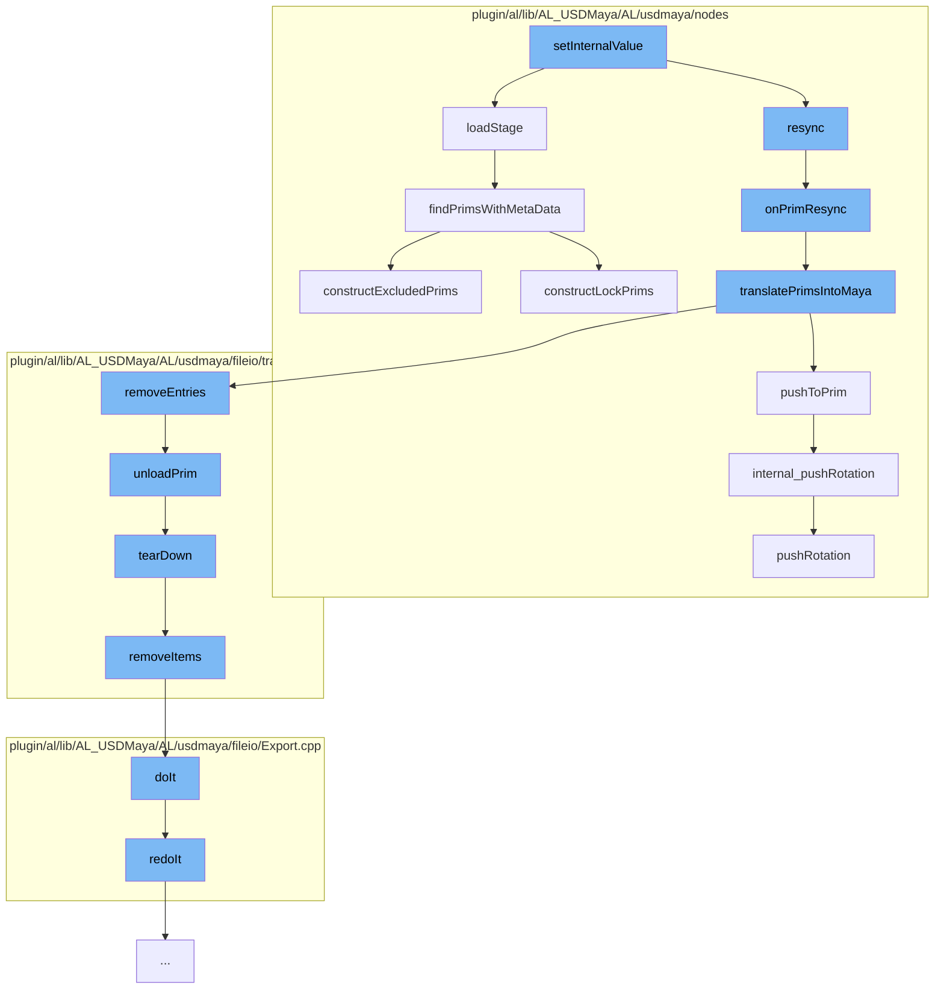

This document will cover the process of setting internal values in the ProxyShape.cpp file of the Maya-USD plugin. The process includes:

1.  Loading the stage
2.  Resyncing the prim
3.  Translating prims into Maya
4.  Pushing to prim
5.  Unloading the prim
6.  Tearing down the translator
7.  Removing items from the translator context
8.  Executing the export command
9.  Redoing the export command
10. Pushing rotation to the transformation matrix
11. Finding prims with metadata
12. Constructing excluded prims.



<SwmSnippet path="/plugin/al/lib/AL_USDMaya/AL/usdmaya/nodes/ProxyShape.cpp" line="1199">

---

# Loading the stage

The `loadStage` function is responsible for loading the USD stage. It checks if there's an existing stage and if its edit target has been altered. If the stage is valid, it loads the stage from the cache. If not, it creates a new stage. It also handles the case of anonymous root layers and resolves file paths.

```c++
//----------------------------------------------------------------------------------------------------------------------
void ProxyShape::loadStage()
{
    MProfilingScope profilerScope(_proxyShapeProfilerCategory, MProfiler::kColorE_L3, "Load stage");

    TF_DEBUG(ALUSDMAYA_EVALUATION).Msg("ProxyShape::loadStage\n");

    triggerEvent("PreStageLoaded");

    MDataBlock dataBlock = forceCache();

    const int         stageIdVal = inputInt32Value(dataBlock, stageCacheId());
    UsdStageCache::Id stageId = UsdStageCache::Id().FromLongInt(stageIdVal);
    MString           file = inputStringValue(dataBlock, filePath());

    if (m_stage) {
        // In case there was already a stage in m_stage, check to see if it's edit target has been
        // altered.
        trackEditTargetLayer();

        if (StageCache::Get().Contains(stageId)) {
```

---

</SwmSnippet>

<SwmSnippet path="/plugin/al/lib/AL_USDMaya/AL/usdmaya/nodes/ProxyShape.cpp" line="762">

---

# Resyncing the prim

The `onPrimResync` function is called when a prim needs to be resynced. It checks if the prim is valid and then updates the set of prims.

```c++
//----------------------------------------------------------------------------------------------------------------------
void ProxyShape::onPrimResync(SdfPath primPath, SdfPathVector& previousPrims)
{
    MProfilingScope profilerScope(
        _proxyShapeProfilerCategory, MProfiler::kColorE_L3, "Run onPrimResync");

    TF_DEBUG(ALUSDMAYA_TRANSLATORS)
        .Msg("ProxyShape::onPrimResync checking %s\n", primPath.GetText());

    UsdPrim resyncPrim = m_stage->GetPrimAtPath(primPath);
    if (!resyncPrim.IsValid()) {
        return;
    }

    TF_DEBUG(ALUSDMAYA_TRANSLATORS)
        .Msg("ProxyShape::onPrimResync begin:\n%s\n", context()->serialise().asChar());

    MFnDagNode fn(thisMObject());
    MDagPath   proxyTransformPath;
    fn.getPath(proxyTransformPath);
    proxyTransformPath.pop();
```

---

</SwmSnippet>

<SwmSnippet path="/plugin/al/lib/AL_USDMaya/AL/usdmaya/nodes/ProxyShape.cpp" line="225">

---

# Translating prims into Maya

The `translatePrimsIntoMaya` function is responsible for translating prims into Maya. It first removes prims that have disappeared and then translates new prims into Maya. It also updates the prim types if the geometry is excluded.

```c++
//----------------------------------------------------------------------------------------------------------------------
void ProxyShape::translatePrimsIntoMaya(
    const UsdPrimVector&                             importPrims,
    const SdfPathVector&                             teardownPrims,
    const fileio::translators::TranslatorParameters& param,
    const SdfPathSet&                                affectedPaths)
{
    MProfilingScope profilerScope(
        _proxyShapeProfilerCategory, MProfiler::kColorE_L3, "Translate prims into Maya");

    TF_DEBUG(ALUSDMAYA_EVALUATION)
        .Msg(
            "ProxyShape:translatePrimsIntoMaya ImportSize='%zd' TearDownSize='%zd' \n",
            importPrims.size(),
            teardownPrims.size());

    proxy::PrimFilter filter(teardownPrims, importPrims, this, param.forceTranslatorImport());

    if (TfDebug::IsEnabled(ALUSDMAYA_TRANSLATORS)) {
        std::cout << "new prims" << std::endl;
        for (auto it : filter.newPrimSet()) {
```

---

</SwmSnippet>

<SwmSnippet path="/plugin/al/lib/AL_USDMaya/AL/usdmaya/nodes/TransformationMatrix.cpp" line="2121">

---

# Pushing to prim

The `pushToPrim` function pushes the transformation matrix to the prim. It iterates over the ordered operations and pushes the corresponding values to the prim.

```c++
//----------------------------------------------------------------------------------------------------------------------
void TransformationMatrix::pushToPrim()
{
    // if not yet intiaialised, do not execute this code! (It will crash!).
    if (!m_prim)
        return;
    TF_DEBUG(ALUSDMAYA_TRANSFORM_MATRIX).Msg("TransformationMatrix::pushToPrim\n");

    GfMatrix4d oldMatrix;
    bool       oldResetsStack;
    m_xform.GetLocalTransformation(&oldMatrix, &oldResetsStack, getTimeCode());

    auto opIt = m_orderedOps.begin();
    for (std::vector<UsdGeomXformOp>::iterator it = m_xformops.begin(), e = m_xformops.end();
         it != e;
         ++it, ++opIt) {
        UsdGeomXformOp& op = *it;
        switch (*opIt) {
        case kTranslate: {
            internal_pushVector(MPxTransformationMatrix::translationValue, op);
            m_translationFromUsd = MPxTransformationMatrix::translationValue;
```

---

</SwmSnippet>

<SwmSnippet path="/plugin/al/lib/AL_USDMaya/AL/usdmaya/fileio/translators/TranslatorContext.cpp" line="741">

---

# Unloading the prim

The `unloadPrim` function unloads a prim from the stage. It finds the translator for the prim and calls the `tearDown` function on it.

```c++
//----------------------------------------------------------------------------------------------------------------------
void TranslatorContext::unloadPrim(const SdfPath& path, const MObject& primObj)
{
    MProfilingScope profilerScope(
        _translatorContextProfilerCategory, MProfiler::kColorE_L3, "Unload prim");

    TF_DEBUG(ALUSDMAYA_TRANSLATORS).Msg("TranslatorContext::unloadPrim\n");
    assert(m_proxyShape);
    auto stage = m_proxyShape->usdStage();
    if (stage) {
        std::string translatorId = m_proxyShape->context()->getTranslatorIdForPath(path);

        fileio::translators::TranslatorRefPtr translator
            = m_proxyShape->translatorManufacture().getTranslatorFromId(translatorId);
        if (translator) {
            TF_DEBUG(ALUSDMAYA_TRANSLATORS)
                .Msg("TranslatorContext::unloadPrim [tearDown] prim=%s\n", path.GetText());

            UsdPrim prim = stage->GetPrimAtPath(path);
            if (prim) {
                // run through the extra data plugins to apply to this prim
```

---

</SwmSnippet>

<SwmSnippet path="/plugin/al/lib/AL_USDMaya/AL/usdmaya/fileio/translators/TranslatorTestPlugin.cpp" line="46">

---

# Tearing down the translator

The `tearDown` function is called to tear down the translator. It removes items from the translator context.

```c++
//----------------------------------------------------------------------------------------------------------------------
MStatus TranslatorTestPlugin::tearDown(const SdfPath& path)
{
    context()->removeItems(path);
    return MStatus::kSuccess;
}
```

---

</SwmSnippet>

<SwmSnippet path="/plugin/al/lib/AL_USDMaya/AL/usdmaya/fileio/translators/TranslatorContext.cpp" line="330">

---

# Removing items from the translator context

The `removeItems` function removes items from the translator context. It first reparents nodes to avoid transform deletion and then deletes the nodes.

```c++
//----------------------------------------------------------------------------------------------------------------------
void TranslatorContext::removeItems(const SdfPath& path)
{
    MProfilingScope profilerScope(
        _translatorContextProfilerCategory, MProfiler::kColorE_L3, "Remove items");

    TF_DEBUG(ALUSDMAYA_TRANSLATORS)
        .Msg("TranslatorContext::removeItems remove under primPath=%s\n", path.GetText());
    auto it = find(path);
    if (it != m_primMapping.end() && it->path() == path) {
        TF_DEBUG(ALUSDMAYA_TRANSLATORS)
            .Msg("TranslatorContext::removeItems removing path=%s\n", it->path().GetText());
        MDGModifier        modifier1;
        MDagModifier       modifier2;
        MObjectHandleArray tempXforms;
        MStatus            status;

        // Store the DAG nodes to delete in a vector which we will sort via their path length
        std::vector<std::pair<int, MObject>> dagNodesToDelete;

        auto& nodes = it->createdNodes();
```

---

</SwmSnippet>

<SwmSnippet path="/plugin/al/lib/AL_USDMaya/AL/usdmaya/fileio/Export.cpp" line="1019">

---

# Executing the export command

The `doIt` function executes the export command. It parses the arguments and sets the parameters for the export. If animation is enabled, it creates an animation translator.

```c++
//----------------------------------------------------------------------------------------------------------------------
MStatus ExportCommand::doIt(const MArgList& args)
{
    maya::utils::OptionsParser parser;
    ExportTranslator::options().initParser(parser);
    m_params.m_parser = &parser;
    PluginTranslatorOptionsInstance pluginInstance(ExportTranslator::pluginContext());
    parser.setPluginOptionsContext(&pluginInstance);

    MStatus      status;
    MArgDatabase argData(syntax(), args, &status);
    AL_MAYA_CHECK_ERROR(status, "ALUSDExport: failed to match arguments");
    AL_MAYA_COMMAND_HELP(argData, g_helpText);

    // fetch filename and ensure it's valid
    if (!argData.isFlagSet("f", &status)) {
        MGlobal::displayError("ALUSDExport: \"file\" argument must be set");
        return MS::kFailure;
    }
    AL_MAYA_CHECK_ERROR(
        argData.getFlagArgument("f", 0, m_params.m_fileName),
```

---

</SwmSnippet>

<SwmSnippet path="/plugin/al/lib/AL_USDMaya/AL/usdmaya/fileio/Export.cpp" line="1179">

---

# Redoing the export command

The `redoIt` function redoes the export command. It creates an Export object and deletes the animation translator.

```c++
//----------------------------------------------------------------------------------------------------------------------
MStatus ExportCommand::redoIt()
{
    static const std::unordered_set<std::string> ignoredNodes { "persp", "front", "top", "side" };

    if (m_params.m_selected) {
        MGlobal::getActiveSelectionList(m_params.m_nodes);
    } else {
        MDagPath path;
        MItDag   it(MItDag::kDepthFirst, MFn::kTransform);
        while (!it.isDone()) {
            it.getPath(path);
            const MString     name = path.partialPathName();
            const std::string s(name.asChar(), name.length());
            if (ignoredNodes.find(s) == ignoredNodes.end()) {
                m_params.m_nodes.add(path);
            }
            it.prune();
            it.next();
        }
    }
```

---

</SwmSnippet>

<SwmSnippet path="/plugin/al/lib/AL_USDMaya/AL/usdmaya/nodes/TransformationMatrix.cpp" line="858">

---

# Pushing rotation to the transformation matrix

The `pushRotation` function pushes the rotation to the transformation matrix. It checks the operation type and pushes the corresponding rotation value to the operation.

```c++
//----------------------------------------------------------------------------------------------------------------------
bool TransformationMatrix::pushRotation(
    const MEulerRotation& value,
    UsdGeomXformOp&       op,
    UsdTimeCode           timeCode)
{
    TF_DEBUG(ALUSDMAYA_TRANSFORM_MATRIX)
        .Msg(
            "TransformationMatrix::pushRotation %f %f %f\n%s\n",
            value.x,
            value.y,
            value.z,
            op.GetOpName().GetText());

    if (timeCode.IsDefault() && op.GetNumTimeSamples()) {
        if (!hasEmptyDefaultValue(op, timeCode)) {
            return false;
        }
    }

    const double radToDeg = 180.0 / M_PI;
```

---

</SwmSnippet>

<SwmSnippet path="/plugin/al/lib/AL_USDMaya/AL/usdmaya/nodes/proxy/ProxyShapeMetaData.cpp" line="199">

---

# Finding prims with metadata

The `findPrimsWithMetaData` function finds prims with metadata. It iterates over the prims and checks if they have the `excludeFromProxyShape` metadata. If they do, it adds them to the excluded tagged geometry.

```c++
//----------------------------------------------------------------------------------------------------------------------
void ProxyShape::findPrimsWithMetaData()
{
    MProfilingScope profilerScope(
        _proxyShapeMetadataProfilerCategory, MProfiler::kColorE_L3, "Find prims with metadata");

    TF_DEBUG(ALUSDMAYA_EVALUATION).Msg("ProxyShape::findPrimsWithMetaData\n");
    if (!m_stage)
        return;

    for (fileio::TransformIterator it(m_stage, parentTransform(), true); !it.done(); it.next()) {
        const auto& prim = it.prim();
        bool        excludeGeo = false;
        if (prim.GetMetadata(Metadata::excludeFromProxyShape, &excludeGeo)) {
            if (excludeGeo) {
                m_excludedTaggedGeometry.push_back(prim.GetPrimPath());
            }
        }
    }

    constructLockPrims();
```

---

</SwmSnippet>

<SwmSnippet path="/plugin/al/lib/AL_USDMaya/AL/usdmaya/nodes/proxy/ProxyShapeMetaData.cpp" line="120">

---

# Constructing excluded prims

The `constructExcludedPrims` function constructs excluded prims. It gets the exclude prim paths and if they have changed, it increases the exclude prim paths version and constructs the GL imaging engine.

```c++
//----------------------------------------------------------------------------------------------------------------------
void ProxyShape::constructExcludedPrims()
{
    MProfilingScope profilerScope(
        _proxyShapeMetadataProfilerCategory, MProfiler::kColorE_L3, "Construct excluded prims");

    auto excludedPaths = getExcludePrimPaths();
    if (m_excludedGeometry != excludedPaths) {
        std::swap(m_excludedGeometry, excludedPaths);
        _IncreaseExcludePrimPathsVersion();
        constructGLImagingEngine();
    }
}
```

---

</SwmSnippet>

&nbsp;

_This is an auto-generated document by Swimm AI 🌊 and has not yet been verified by a human_

<SwmMeta version="3.0.0" repo-id="Z2l0aHViJTNBJTNBbWF5YS11c2QlM0ElM0FnaWxhZG5hdm90" repo-name="maya-usd"><sup>Powered by [Swimm](/)</sup></SwmMeta>
