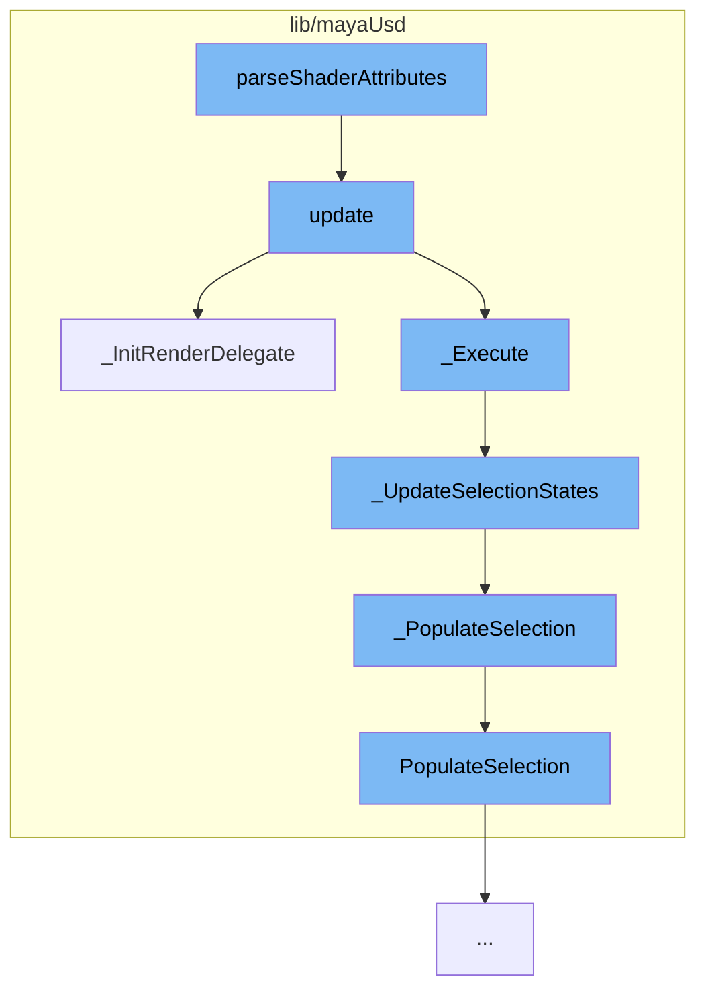

This document will cover the process of parsing shader attributes and updating the render delegate in the Maya USD plugin. The steps include:

1. Parsing shader attributes
2. Updating the render delegate
3. Initializing the render delegate
4. Updating selection states
5. Populating selection



<SwmSnippet path="/lib/mayaUsd/resources/ae/usdschemabase/ae_template.py" line="1">

---

# Parsing Shader Attributes

The function `parseShaderAttributes` in `ae_template.py` is the starting point of this flow. It is responsible for parsing shader attributes in the Maya USD plugin.

```python
# Copyright 2021 Autodesk
```

---

</SwmSnippet>

<SwmSnippet path="/lib/mayaUsd/render/vp2RenderDelegate/proxyRenderDelegate.cpp" line="1215">

---

# Updating the Render Delegate

The `update` function in `proxyRenderDelegate.cpp` is called by `parseShaderAttributes`. It is responsible for updating the render delegate, which is a key component in the rendering process.

```c++
//! \brief  Main update entry from subscene override.
void ProxyRenderDelegate::update(MSubSceneContainer& container, const MFrameContext& frameContext)
{
    MProfilingScope profilingScope(
        HdVP2RenderDelegate::sProfilerCategory,
        MProfiler::kColorD_L1,
        "ProxyRenderDelegate::update");

    // Without a proxy shape we can't do anything
    if (_proxyShapeData->ProxyShape() == nullptr)
        return;

    // If the rendering was flagged as possibly taking a long time,
    // show the wait cursor.
    //
    // Note: using the wait cursor sets the long duration flag,
    //       so reset the flag after setting up the cursor, otherwise
    //       once one rendering would be long-duration, all of them
    //       would be flagged afterward.
    UsdUfe::WaitCursor waitCursor(_longDurationRendering);
    _longDurationRendering = false;
```

---

</SwmSnippet>

<SwmSnippet path="/lib/mayaUsd/render/vp2RenderDelegate/proxyRenderDelegate.cpp" line="661">

---

# Initializing the Render Delegate

The `_InitRenderDelegate` function is called by `update`. It initializes the render delegate, preparing it for the rendering process.

```c++
//! \brief  Initialize the render delegate
void ProxyRenderDelegate::_InitRenderDelegate()
{
    TF_VERIFY(_proxyShapeData->ProxyShape());

    // Initialize the optionVar ShowDisplayColorTextureOff, which will decide if display color will
    // be used when untextured mode is selected
    const MString optionVarName(MayaUsdOptionVars->ShowDisplayColorTextureOff.GetText());
    if (!MGlobal::optionVarExists(optionVarName)) {
        MGlobal::setOptionVarValue(optionVarName, 0);
    }

    // No need to run all the checks if we got till the end
    if (_isInitialized())
        return;

    _proxyShapeData->UpdateUsdStage();
    _proxyShapeData->UsdStageUpdated();

    if (!_renderDelegate) {
        MProfilingScope subProfilingScope(
```

---

</SwmSnippet>

<SwmSnippet path="/lib/mayaUsd/render/vp2RenderDelegate/proxyRenderDelegate.cpp" line="1806">

---

# Updating Selection States

The `_UpdateSelectionStates` function is called by `_Execute`. It updates the selection states, which are important for determining what parts of the scene to render.

```c++
/*! \brief  Notify selection change to rprims.
 */
void ProxyRenderDelegate::_UpdateSelectionStates()
{
    const MHWRender::DisplayStatus previousStatus = _displayStatus;
    _displayStatus = MHWRender::MGeometryUtilities::displayStatus(_proxyShapeData->ProxyDagPath());

    SdfPathVector        rootPaths;
    const SdfPathVector* dirtyPaths = nullptr;

    if (_displayStatus == MHWRender::kLead || _displayStatus == MHWRender::kActive) {
        if (_displayStatus != previousStatus) {
            rootPaths.push_back(SdfPath::AbsoluteRootPath());
            dirtyPaths = &_renderIndex->GetRprimIds();
        }
    } else if (previousStatus == MHWRender::kLead || previousStatus == MHWRender::kActive) {
        rootPaths.push_back(SdfPath::AbsoluteRootPath());
        dirtyPaths = &_renderIndex->GetRprimIds();
        _PopulateSelection();
    } else {
        // Append pre-update lead and active selection.
```

---

</SwmSnippet>

<SwmSnippet path="/lib/mayaUsd/render/vp2RenderDelegate/proxyRenderDelegate.cpp" line="1780">

---

# Populating Selection

The `_PopulateSelection` function is called by `_UpdateSelectionStates`. It populates the selection, which is a list of items to be rendered.

```c++
//! \brief  Populate lead and active selection for Rprims under the proxy shape.
void ProxyRenderDelegate::_PopulateSelection()
{
    if (_proxyShapeData->ProxyShape() == nullptr) {
        return;
    }

    _leadSelection.reset(new HdSelection);
    _activeSelection.reset(new HdSelection);

    const auto proxyPath = _proxyShapeData->ProxyShape()->ufePath();
    const auto globalSelection = Ufe::GlobalSelection::get();

    // Populate lead selection from the last item in UFE global selection.
    auto it = globalSelection->crbegin();
    if (it != globalSelection->crend()) {
        PopulateSelection(*it, proxyPath, *_sceneDelegate, _leadSelection);

        // Start reverse iteration from the second last item in UFE global
        // selection and populate active selection.
        for (it++; it != globalSelection->crend(); it++) {
```

---

</SwmSnippet>

<SwmSnippet path="/lib/mayaUsd/render/vp2RenderDelegate/proxyRenderDelegate.cpp" line="205">

---

# Finalizing Selection

The `PopulateSelection` function is called by `_PopulateSelection`. It finalizes the selection, preparing it for the rendering process.

```c++
//! \brief  Populate Rprims into the Hydra selection from the UFE scene item.
void PopulateSelection(
    const Ufe::SceneItem::Ptr&  item,
    const Ufe::Path&            proxyPath,
    UsdImagingDelegate&         sceneDelegate,
    const HdSelectionSharedPtr& result)
{
    // Filter out items which are not under the current proxy shape.
    if (!item->path().startsWith(proxyPath)) {
        return;
    }

    // Filter out non-USD items.
    auto usdItem = UsdUfe::downcast(item);
    if (!usdItem) {
        return;
    }

    SdfPath   usdPath = usdItem->prim().GetPath();
    const int instanceIndex = usdItem->instanceIndex();

```

---

</SwmSnippet>

&nbsp;

_This is an auto-generated document by Swimm AI 🌊 and has not yet been verified by a human_

<SwmMeta version="3.0.0" repo-id="Z2l0aHViJTNBJTNBbWF5YS11c2QlM0ElM0FnaWxhZG5hdm90" repo-name="maya-usd"><sup>Powered by [Swimm](/)</sup></SwmMeta>
