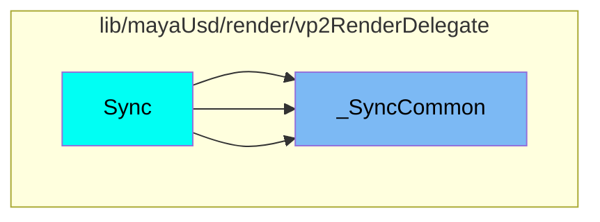
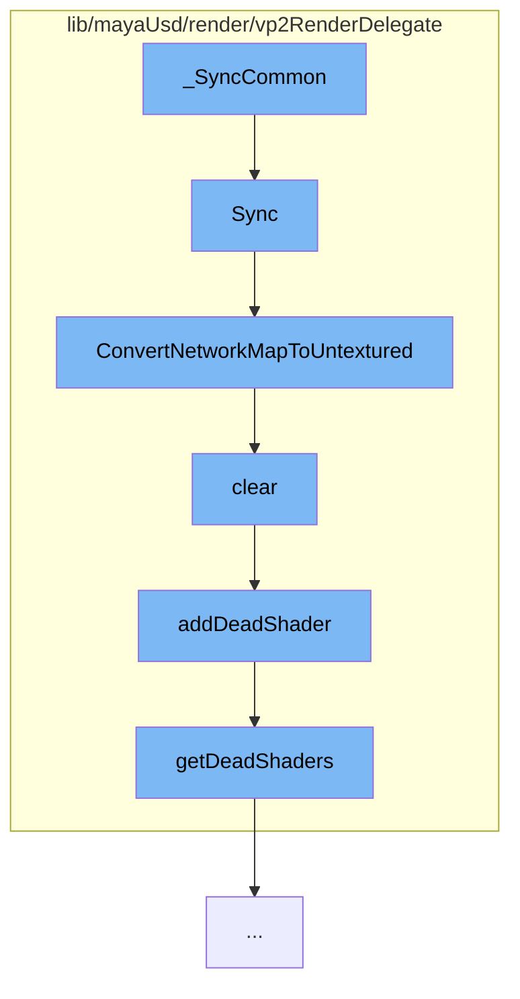

This document will cover the process of synchronizing and managing shaders in the Maya USD plugin, which includes:

1. Synchronizing VP2 state with scene delegate state
2. Converting network map to untextured
3. Clearing shader instances
4. Adding dead shaders to the dead shaders list

## Where is this flow used?

The flow starts with the function `_SyncCommon`. It is called from multiple entry points as represented in the following diagram:



## The flow itself



<SwmSnippet path="/lib/mayaUsd/render/vp2RenderDelegate/material.cpp" line="2082">

---

# Synchronizing VP2 state with scene delegate state

The function `HdVP2Material::Sync` is used to synchronize VP2 state with scene delegate state based on dirty bits. It checks if the material resource holds a `HdMaterialNetworkMap` and syncs the untextured and full network maps accordingly.

```c++
/*! \brief  Synchronize VP2 state with scene delegate state based on dirty bits
 */
void HdVP2Material::Sync(
    HdSceneDelegate* sceneDelegate,
    HdRenderParam* /*renderParam*/,
    HdDirtyBits* dirtyBits)
{
    if (*dirtyBits & (HdMaterial::DirtyResource | HdMaterial::DirtyParams)) {
        const SdfPath& id = GetId();

        MProfilingScope profilingScope(
            HdVP2RenderDelegate::sProfilerCategory,
            MProfiler::kColorC_L2,
            "HdVP2Material::Sync",
            id.GetText());

        VtValue vtMatResource = sceneDelegate->GetMaterialResource(id);

        if (vtMatResource.IsHolding<HdMaterialNetworkMap>()) {
            const HdMaterialNetworkMap& fullNetworkMap
                = vtMatResource.UncheckedGet<HdMaterialNetworkMap>();
```

---

</SwmSnippet>

<SwmSnippet path="/lib/mayaUsd/render/vp2RenderDelegate/material.cpp" line="2057">

---

# Converting network map to untextured

The function `ConvertNetworkMapToUntextured` is used to convert the network map to untextured. It removes input nodes and clears relationships in the network map.

```c++
void ConvertNetworkMapToUntextured(HdMaterialNetworkMap& networkMap)
{
    for (auto& item : networkMap.map) {
        auto& network = item.second;
        auto  isInputNode = [&networkMap](const HdMaterialNode& node) {
            return std::find(networkMap.terminals.begin(), networkMap.terminals.end(), node.path)
                == networkMap.terminals.end();
        };

        auto eraseBegin = std::remove_if(network.nodes.begin(), network.nodes.end(), isInputNode);
        network.nodes.erase(eraseBegin, network.nodes.end());
        network.relationships.clear();
#ifdef WANT_MATERIALX_BUILD
        // Raw MaterialX surface constructor node does not render. Replace with default
        // standard_surface:
        for (auto& node : network.nodes) {
            if (node.identifier == _mtlxTokens->ND_surface) {
                node.identifier = _mtlxTokens->ND_standard_surface_surfaceshader;
                node.parameters.clear();
            }
        }
```

---

</SwmSnippet>

<SwmSnippet path="/lib/mayaUsd/render/vp2RenderDelegate/shader.cpp" line="148">

---

# Clearing shader instances

The method `HdVP2ShaderUniquePtr::clear` is used to clear shader instances. It decreases the count of the shader data and if it's the last reference, it adds the shader to the dead shaders list and deletes the data.

```c++
void HdVP2ShaderUniquePtr::clear()
{
    if (!_data)
        return;

    const int prevCount = _data->_count.fetch_sub(1);
    if (prevCount != 1)
        return;

    MHWRender::MShaderInstance* shader = _data->_shader;
    addDeadShader(shader);

    _data->_shader = nullptr;
    delete _data;
    _data = nullptr;
}
```

---

</SwmSnippet>

<SwmSnippet path="/lib/mayaUsd/render/vp2RenderDelegate/shader.cpp" line="36">

---

# Adding dead shaders to the dead shaders list

The function `addDeadShader` is used to add dead shaders to the dead shaders list. It locks the dead shaders list and inserts the shader into it.

```c++
void addDeadShader(MHWRender::MShaderInstance* shader)
{
    if (!shader)
        return;

    std::lock_guard<std::mutex> mutexGuard(deadShaderMutex);
    getDeadShaders().insert(shader);
}
```

---

</SwmSnippet>

&nbsp;

*This is an auto-generated document by Swimm AI 🌊 and has not yet been verified by a human*

<SwmMeta version="3.0.0" repo-id="Z2l0aHViJTNBJTNBbWF5YS11c2QlM0ElM0FnaWxhZG5hdm90" repo-name="maya-usd" doc-type="flows"><sup>Powered by [Swimm](/)</sup></SwmMeta>
