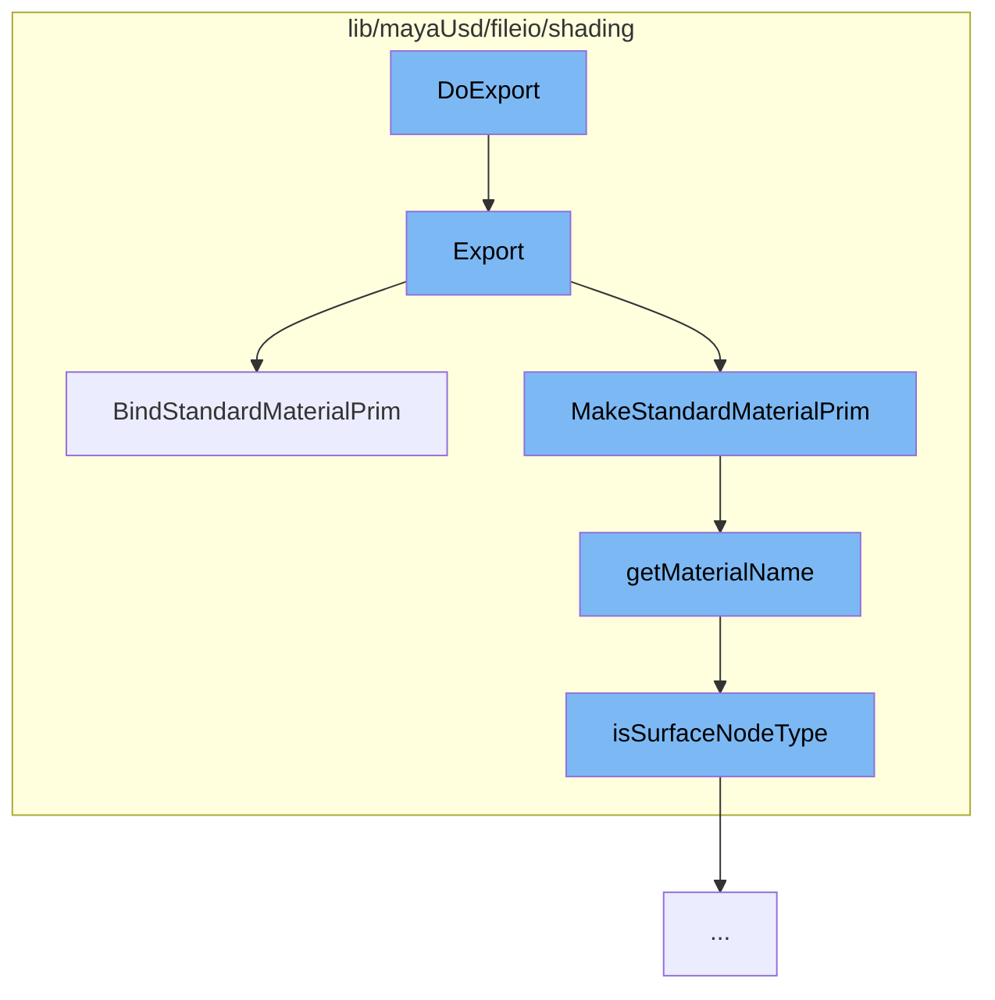

This document will cover the process of exporting shading modes in the Maya USD plugin, which includes:

1. Initiating the export process
2. Creating and binding the material prim
3. Retrieving the material name
4. Checking the surface node type.



<SwmSnippet path="/lib/mayaUsd/fileio/shading/shadingModePxrRis.cpp" line="271">

---

# Initiating the export process

The `Export` function initiates the process of exporting shading modes. It takes in the shading mode export context, a pointer to a UsdShadeMaterial, and a pointer to a set of bound prim paths. It retrieves the assignments from the context, creates a material prim, and binds it.

```c++
    void Export(
        const UsdMayaShadingModeExportContext& context,
        UsdShadeMaterial* const                mat,
        SdfPathSet* const                      boundPrimPaths) override
    {
        const UsdMayaShadingModeExportContext::AssignmentsInfo& assignments
            = context.GetAssignments();

        UsdPrim materialPrim = context.MakeStandardMaterialPrim(assignments);
        context.BindStandardMaterialPrim(materialPrim, assignments.assignments, boundPrimPaths);
        UsdShadeMaterial material(materialPrim);
        if (!material) {
            return;
        }

        if (mat != nullptr) {
            *mat = material;
        }

        UsdRiMaterialAPI riMaterialAPI(materialPrim);

```

---

</SwmSnippet>

<SwmSnippet path="/lib/mayaUsd/fileio/shading/shadingModeExporterContext.cpp" line="948">

---

# Creating and binding the material prim

The `BindStandardMaterialPrim` function is used to bind the material prim to the shading mode export context. It takes in the material prim, a vector of assignments to bind, and a pointer to a set of bound prim paths. It checks if the material is valid, creates a UV mapping manager, and binds the material to the prim.

```c++
void UsdMayaShadingModeExportContext::BindStandardMaterialPrim(
    const UsdPrim&          materialPrim,
    const AssignmentVector& assignmentsToBind,
    SdfPathSet* const       boundPrimPaths) const
{
    UsdShadeMaterial material(materialPrim);
    if (!material) {
        TF_RUNTIME_ERROR("Invalid material prim.");
        return;
    }

    _UVMappingManager uvMappingManager(material, assignmentsToBind, GetExportArgs());

    UsdStageRefPtr stage = GetUsdStage();
    TfToken        materialNameToken(materialPrim.GetName());
    for (const auto& iter : assignmentsToBind) {
        const SdfPath&    boundPrimPath = iter.boundPrimPath;
        const VtIntArray& faceIndices = iter.faceIndices;
        const TfToken&    shapeName = iter.shapeName;

        const UsdShadeMaterial& materialToBind = uvMappingManager.getMaterial(shapeName);
```

---

</SwmSnippet>

<SwmSnippet path="/lib/mayaUsd/fileio/shading/shadingModeExporterContext.cpp" line="488">

---

# Retrieving the material name

The `getMaterialName` function retrieves the name of the material. It takes in the material name, a shading engine, and a surface shader. If the material name is not empty, it returns the material name. Otherwise, it checks if the shading engine and surface shader follow the standard Maya naming protocol for a known surface node type.

```c++
std::string getMaterialName(
    const std::string& materialName,
    const MObject&     shadingEngine,
    const MObject&     surfaceShader)
{
    if (!materialName.empty())
        return materialName;

    MFnDependencyNode fnDepNode;
    if (fnDepNode.setObject(shadingEngine) != MS::kSuccess)
        return materialName;

    std::string sgName = fnDepNode.name().asChar();
    std::smatch sgMatch;
    // Is the SG name following the standard Maya naming protocol for a known surface nodeType?
    if (!std::regex_match(sgName, sgMatch, kTemplatedRegex))
        return sgName;

    if (!isSurfaceNodeType(sgMatch[1].str()))
        return sgName;

```

---

</SwmSnippet>

<SwmSnippet path="/lib/mayaUsd/fileio/shading/shadingModeExporterContext.cpp" line="472">

---

# Checking the surface node type

The `isSurfaceNodeType` function checks if the node type is a surface node type. It takes in the node type as a string and returns a boolean indicating whether the node type is a surface node type.

```c++
bool isSurfaceNodeType(const std::string& nodeType)
{
    static std::vector<std::string> sKnownSurfaces;

    if (sKnownSurfaces.empty()) {
        MString     listSurfCmd("stringArrayToString(`listNodeTypes \"shader/surface\"`, \" \");");
        std::string cmdResult = MGlobal::executeCommandStringResult(listSurfCmd).asChar();
        sKnownSurfaces = TfStringTokenize(cmdResult);
        // O(logN) will be close to O(N) for searches since N will usually be small, but with enough
        // plugin surface nodes added it could start to matter, so let's sort the vector.
        std::sort(sKnownSurfaces.begin(), sKnownSurfaces.end());
    }

    return std::binary_search(sKnownSurfaces.cbegin(), sKnownSurfaces.cend(), nodeType);
}
```

---

</SwmSnippet>

&nbsp;

_This is an auto-generated document by Swimm AI 🌊 and has not yet been verified by a human_

<SwmMeta version="3.0.0" repo-id="Z2l0aHViJTNBJTNBbWF5YS11c2QlM0ElM0FnaWxhZG5hdm90" repo-name="maya-usd"><sup>Powered by [Swimm](/)</sup></SwmMeta>
