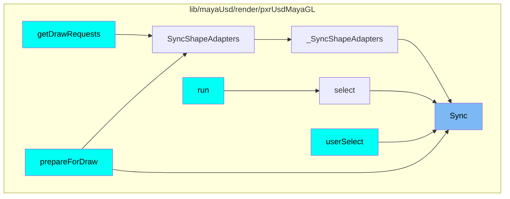
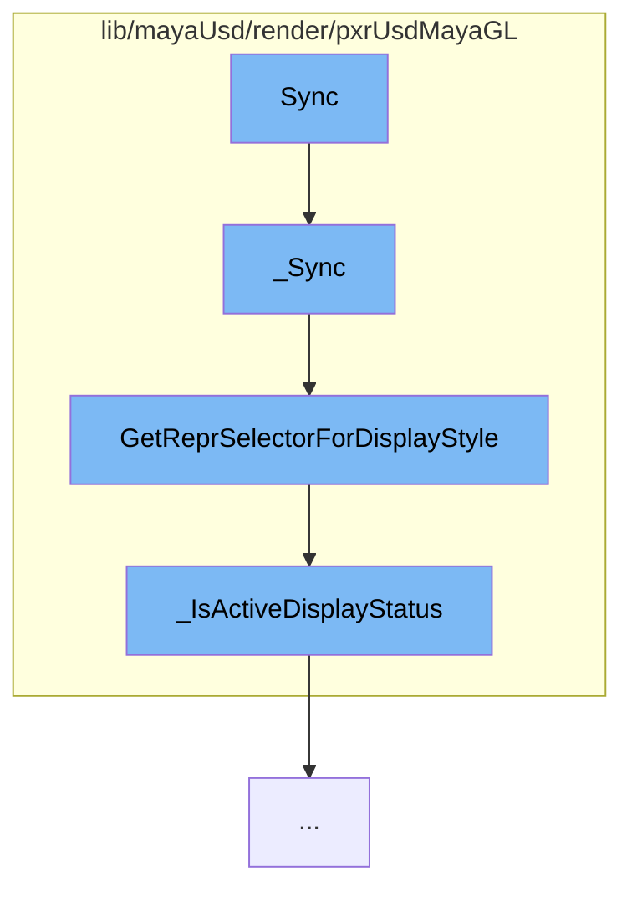

This document will cover the process of rendering a shape in Maya using the USD plugin, which includes:

1. Synchronizing the shape data
2. Determining the display style
3. Checking the active display status.

## Where is this flow used?

The flow starts with the function `Sync`. It is called from multiple entry points as represented in the following diagram: (Note - these are only some of the entry points of this flow)



## The flow itself



<SwmSnippet path="/lib/mayaUsd/render/pxrUsdMayaGL/instancerShapeAdapter.cpp" line="202">

---

# Synchronizing the shape data

The `_Sync` function is responsible for synchronizing the shape data. It retrieves the default prim from the instancer stage and syncs it with the shape data. It also checks for updates to the shape or changes in the batch renderer that require re-initialization of the shape adapter.

```c++
/* virtual */
bool UsdMayaGL_InstancerShapeAdapter::_Sync(
    const MDagPath&    shapeDagPath,
    const unsigned int displayStyle,
    const MHWRender::DisplayStatus /* displayStatus */)
{
    MStatus               status;
    UsdPrim               usdPrim = _instancerStage->GetDefaultPrim();
    UsdGeomPointInstancer instancer(usdPrim);
    _SyncInstancer(instancer, shapeDagPath);

    // Check for updates to the shape or changes in the batch renderer that
    // require us to re-initialize the shape adapter.
    HdRenderIndex* renderIndex = UsdMayaGLBatchRenderer::GetInstance().GetRenderIndex();
    if (!(shapeDagPath == GetDagPath()) || !_delegate
        || renderIndex != &_delegate->GetRenderIndex()) {
        _SetDagPath(shapeDagPath);

        if (!_Init(renderIndex)) {
            return false;
        }
```

---

</SwmSnippet>

<SwmSnippet path="/lib/mayaUsd/render/pxrUsdMayaGL/shapeAdapter.cpp" line="195">

---

# Determining the display style

The `GetReprSelectorForDisplayStyle` function is used to determine the display style for the shape. It checks various display style flags and returns a representation selector accordingly.

```c++
HdReprSelector
PxrMayaHdShapeAdapter::GetReprSelectorForDisplayStyle(unsigned int displayStyle) const
{
    HdReprSelector reprSelector;

    const bool boundingBoxStyle
        = displayStyle & MHWRender::MFrameContext::DisplayStyle::kBoundingBox;

    if (boundingBoxStyle) {
        // We don't currently use Hydra to draw bounding boxes, so we return an
        // empty repr selector here. Also, Maya seems to ignore most other
        // DisplayStyle bits when the viewport is in the kBoundingBox display
        // style anyway, and it just changes the color of the bounding box on
        // selection rather than adding in the wireframe like it does for
        // shaded display styles. So if we eventually do end up using Hydra for
        // bounding boxes, we could just return the appropriate repr here.
        return reprSelector;
    }

    const MHWRender::DisplayStatus displayStatus
        = MHWRender::MGeometryUtilities::displayStatus(_shapeDagPath);
```

---

</SwmSnippet>

<SwmSnippet path="/lib/mayaUsd/render/pxrUsdMayaGL/shapeAdapter.cpp" line="85">

---

# Checking the active display status

The `_IsActiveDisplayStatus` function checks if the display status is active. It returns true if the display status is one of the active statuses.

```c++
static inline bool _IsActiveDisplayStatus(MHWRender::DisplayStatus displayStatus)
{
    return (displayStatus == MHWRender::DisplayStatus::kActive)
        || (displayStatus == MHWRender::DisplayStatus::kHilite)
        || (displayStatus == MHWRender::DisplayStatus::kActiveTemplate)
        || (displayStatus == MHWRender::DisplayStatus::kActiveComponent)
        || (displayStatus == MHWRender::DisplayStatus::kLead);
}
```

---

</SwmSnippet>

&nbsp;

_This is an auto-generated document by Swimm AI 🌊 and has not yet been verified by a human_

<SwmMeta version="3.0.0" repo-id="Z2l0aHViJTNBJTNBbWF5YS11c2QlM0ElM0FnaWxhZG5hdm90" repo-name="maya-usd"><sup>Powered by [Swimm](/)</sup></SwmMeta>
