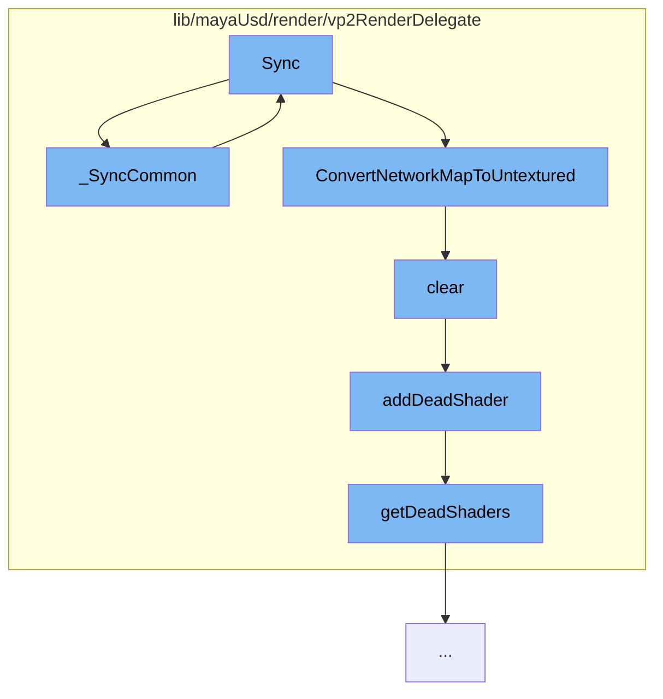

This document will cover the process of synchronizing the VP2 state with the scene delegate state in the Maya USD plugin. The process includes the following steps:

1. The initial synchronization of common properties
2. Synchronization of material properties
3. Conversion of the material network map to an untextured format
4. Clearing of the shader instance
5. Adding the shader instance to the list of dead shaders



<SwmSnippet path="/lib/mayaUsd/render/vp2RenderDelegate/mayaPrimCommon.cpp" line="915">

---

# Initial Synchronization of Common Properties

The function `_SyncCommon` is the starting point of the synchronization process. It checks if there is a representation override and if so, it calls the `Sync` function for the representation override instead. It also updates the selection status if it has changed and checks if the repr is hidden by the render tags of the `ProxyRenderDelegate`.

```c++
bool MayaUsdRPrim::_SyncCommon(
    HdRprim&               refThis,
    HdSceneDelegate*       delegate,
    HdRenderParam*         renderParam,
    HdDirtyBits*           dirtyBits,
    HdReprSharedPtr const& curRepr,
    TfToken const&         reprToken)
{
    // In representation override mode call Sync for the representation override instead.
    if (_reprOverride != kNone) {
        TfToken overrideToken = _GetOverrideToken(reprToken);
        if (!overrideToken.IsEmpty() && (overrideToken != reprToken)) {
            refThis.Sync(delegate, renderParam, dirtyBits, overrideToken);
            return false;
        }
    }

    const SdfPath&       id = refThis.GetId();
    auto* const          param = static_cast<HdVP2RenderParam*>(_delegate->GetRenderParam());
    ProxyRenderDelegate& drawScene = param->GetDrawScene();

```

---

</SwmSnippet>

<SwmSnippet path="/lib/mayaUsd/render/vp2RenderDelegate/material.cpp" line="2082">

---

# Synchronization of Material Properties

The `Sync` function in `material.cpp` is responsible for synchronizing the VP2 state with the scene delegate state based on dirty bits. It checks if the material resource is holding a `HdMaterialNetworkMap` and if so, it syncs the untextured and full network maps.

```c++
/*! \brief  Synchronize VP2 state with scene delegate state based on dirty bits
 */
void HdVP2Material::Sync(
    HdSceneDelegate* sceneDelegate,
    HdRenderParam* /*renderParam*/,
    HdDirtyBits* dirtyBits)
{
    if (*dirtyBits & (HdMaterial::DirtyResource | HdMaterial::DirtyParams)) {
        const SdfPath& id = GetId();

        MProfilingScope profilingScope(
            HdVP2RenderDelegate::sProfilerCategory,
            MProfiler::kColorC_L2,
            "HdVP2Material::Sync",
            id.GetText());

        VtValue vtMatResource = sceneDelegate->GetMaterialResource(id);

        if (vtMatResource.IsHolding<HdMaterialNetworkMap>()) {
            const HdMaterialNetworkMap& fullNetworkMap
                = vtMatResource.UncheckedGet<HdMaterialNetworkMap>();
```

---

</SwmSnippet>

<SwmSnippet path="/lib/mayaUsd/render/vp2RenderDelegate/material.cpp" line="2057">

---

# Conversion of Material Network Map to Untextured Format

The function `ConvertNetworkMapToUntextured` is used to convert the material network map to an untextured format. It removes input nodes and clears relationships in the network.

```c++
void ConvertNetworkMapToUntextured(HdMaterialNetworkMap& networkMap)
{
    for (auto& item : networkMap.map) {
        auto& network = item.second;
        auto  isInputNode = [&networkMap](const HdMaterialNode& node) {
            return std::find(networkMap.terminals.begin(), networkMap.terminals.end(), node.path)
                == networkMap.terminals.end();
        };

        auto eraseBegin = std::remove_if(network.nodes.begin(), network.nodes.end(), isInputNode);
        network.nodes.erase(eraseBegin, network.nodes.end());
        network.relationships.clear();
#ifdef WANT_MATERIALX_BUILD
        // Raw MaterialX surface constructor node does not render. Replace with default
        // standard_surface:
        for (auto& node : network.nodes) {
            if (node.identifier == _mtlxTokens->ND_surface) {
                node.identifier = _mtlxTokens->ND_standard_surface_surfaceshader;
                node.parameters.clear();
            }
        }
```

---

</SwmSnippet>

<SwmSnippet path="/lib/mayaUsd/render/vp2RenderDelegate/shader.cpp" line="148">

---

# Clearing of Shader Instance

The `clear` function in `shader.cpp` is used to clear the shader instance. If the shader instance is not null, it is added to the list of dead shaders.

```c++
void HdVP2ShaderUniquePtr::clear()
{
    if (!_data)
        return;

    const int prevCount = _data->_count.fetch_sub(1);
    if (prevCount != 1)
        return;

    MHWRender::MShaderInstance* shader = _data->_shader;
    addDeadShader(shader);

    _data->_shader = nullptr;
    delete _data;
    _data = nullptr;
}
```

---

</SwmSnippet>

<SwmSnippet path="/lib/mayaUsd/render/vp2RenderDelegate/shader.cpp" line="36">

---

# Adding Shader Instance to Dead Shaders

The function `addDeadShader` is used to add the shader instance to the list of dead shaders. It locks the `deadShaderMutex` to ensure thread safety while updating the list of dead shaders.

```c++
void addDeadShader(MHWRender::MShaderInstance* shader)
{
    if (!shader)
        return;

    std::lock_guard<std::mutex> mutexGuard(deadShaderMutex);
    getDeadShaders().insert(shader);
}
```

---

</SwmSnippet>

&nbsp;

_This is an auto-generated document by Swimm AI 🌊 and has not yet been verified by a human_

<SwmMeta version="3.0.0" repo-id="Z2l0aHViJTNBJTNBbWF5YS11c2QlM0ElM0FnaWxhZG5hdm90" repo-name="maya-usd"><sup>Powered by [Swimm](/)</sup></SwmMeta>
