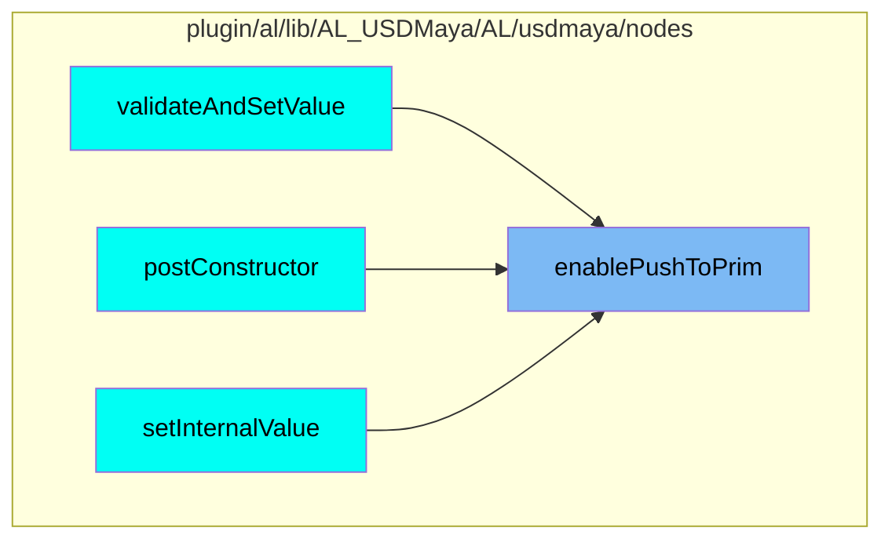
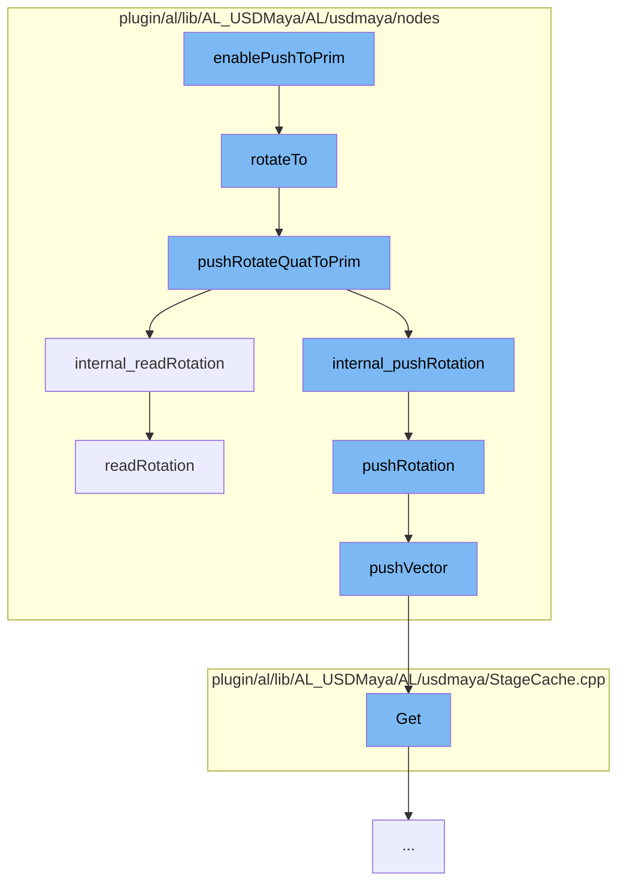

This document will cover the process of enabling the push to prim operation in the Maya-USD plugin, which includes:

1. The initial call to enablePushToPrim
2. The rotation to a specific quaternion
3. Pushing the rotation quaternion to the prim
4. Reading and pushing the rotation internally
5. Pushing the rotation and vector to the prim
6. Getting the stage cache
7. Reading the rotation from the prim.

## Where is this flow used?

The flow starts with the function `enablePushToPrim`. It is called from multiple entry points as represented in the following diagram:



## The flow itself



<SwmSnippet path="/plugin/al/lib/AL_USDMaya/AL/usdmaya/nodes/TransformationMatrix.cpp" line="1635">

---

# The initial call to enablePushToPrim

The function `enablePushToPrim` initiates the process. It checks if rotation is locked and if push to prim is available. If conditions are met, it calls `rotateTo` to rotate to a specific quaternion.

```c++
MStatus TransformationMatrix::rotateTo(const MQuaternion& q, MSpace::Space space)
{
    TF_DEBUG(ALUSDMAYA_TRANSFORM_MATRIX)
        .Msg("TransformationMatrix::rotateTo %f %f %f %f\n", q.x, q.y, q.z, q.w);
    if (isRotateLocked())
        return MPxTransformationMatrix::rotateTo(q, space);
    ;
    MStatus status = MPxTransformationMatrix::rotateTo(q, space);
    if (status) {
        m_rotationTweak.x = MPxTransformationMatrix::rotationValue.x - m_rotationFromUsd.x;
        m_rotationTweak.y = MPxTransformationMatrix::rotationValue.y - m_rotationFromUsd.y;
        m_rotationTweak.z = MPxTransformationMatrix::rotationValue.z - m_rotationFromUsd.z;
    }
    if (pushToPrimAvailable()) {
        if (primHasRotation()) {
        } else if (!pushPrimToMatrix() && q != MQuaternion(0.0, 0.0, 0.0, 1.0)) {
            insertRotateOp();
        }
        if (m_enableUsdWriteback) {
            // Push new value to prim, but only if it's changing.
            if (!MPxTransformationMatrix::rotationValue.isEquivalent(m_rotationFromUsd)) {
```

---

</SwmSnippet>

<SwmSnippet path="/plugin/al/lib/AL_USDMaya/AL/usdmaya/nodes/TransformationMatrix.cpp" line="1635">

---

# The rotation to a specific quaternion

`rotateTo` is responsible for rotating to a specific quaternion. If the rotation is not locked and the push to prim is available, it calculates the rotation tweak and calls `pushRotateQuatToPrim` to push the rotation quaternion to the prim.

```c++
MStatus TransformationMatrix::rotateTo(const MQuaternion& q, MSpace::Space space)
{
    TF_DEBUG(ALUSDMAYA_TRANSFORM_MATRIX)
        .Msg("TransformationMatrix::rotateTo %f %f %f %f\n", q.x, q.y, q.z, q.w);
    if (isRotateLocked())
        return MPxTransformationMatrix::rotateTo(q, space);
    ;
    MStatus status = MPxTransformationMatrix::rotateTo(q, space);
    if (status) {
        m_rotationTweak.x = MPxTransformationMatrix::rotationValue.x - m_rotationFromUsd.x;
        m_rotationTweak.y = MPxTransformationMatrix::rotationValue.y - m_rotationFromUsd.y;
        m_rotationTweak.z = MPxTransformationMatrix::rotationValue.z - m_rotationFromUsd.z;
    }
    if (pushToPrimAvailable()) {
        if (primHasRotation()) {
        } else if (!pushPrimToMatrix() && q != MQuaternion(0.0, 0.0, 0.0, 1.0)) {
            insertRotateOp();
        }
        if (m_enableUsdWriteback) {
            // Push new value to prim, but only if it's changing.
            if (!MPxTransformationMatrix::rotationValue.isEquivalent(m_rotationFromUsd)) {
```

---

</SwmSnippet>

<SwmSnippet path="/plugin/al/lib/AL_USDMaya/AL/usdmaya/nodes/TransformationMatrix.cpp" line="1942">

---

# Pushing the rotation quaternion to the prim

`pushRotateQuatToPrim` iterates over the transformation operations and when it finds a rotation operation, it reads the rotation from the operation and if it has changed significantly, it pushes the new rotation to the operation.

```c++
//----------------------------------------------------------------------------------------------------------------------
void TransformationMatrix::pushRotateQuatToPrim()
{
    TF_DEBUG(ALUSDMAYA_TRANSFORM_MATRIX).Msg("TransformationMatrix::pushRotateQuatToPrim\n");
    auto opIt = m_orderedOps.begin();
    for (std::vector<UsdGeomXformOp>::iterator it = m_xformops.begin(), e = m_xformops.end();
         it != e;
         ++it, ++opIt) {
        if (*opIt == kRotate) {
            UsdGeomXformOp& op = *it;
            MEulerRotation  tempRotate;
            internal_readRotation(tempRotate, op);

            // only write back if data has changed significantly
            if (!tempRotate.asQuaternion().isEquivalent(
                    MPxTransformationMatrix::rotationValue.asQuaternion())) {
                internal_pushRotation(MPxTransformationMatrix::rotationValue, op);
                m_rotationFromUsd = MPxTransformationMatrix::rotationValue;
                m_rotationTweak = MEulerRotation(0, 0, 0);
            }
            return;
```

---

</SwmSnippet>

<SwmSnippet path="/plugin/al/lib/AL_USDMaya/AL/usdmaya/nodes/TransformationMatrix.h" line="169">

---

# Reading and pushing the rotation internally

`internal_readRotation` reads the rotation from the operation at a specific time code. This is used by `pushRotateQuatToPrim` to get the current rotation.

```c
    bool internal_readRotation(MEulerRotation& result, const UsdGeomXformOp& op)
    {
        return readRotation(result, op, getTimeCode());
    }
```

---

</SwmSnippet>

<SwmSnippet path="/plugin/al/lib/AL_USDMaya/AL/usdmaya/nodes/TransformationMatrix.cpp" line="858">

---

# Pushing the rotation and vector to the prim

`pushRotation` pushes the rotation to the operation. Depending on the operation type, it may push a single rotation value or a vector of rotation values. It calls `pushVector` to push a vector of rotation values.

```c++
//----------------------------------------------------------------------------------------------------------------------
bool TransformationMatrix::pushRotation(
    const MEulerRotation& value,
    UsdGeomXformOp&       op,
    UsdTimeCode           timeCode)
{
    TF_DEBUG(ALUSDMAYA_TRANSFORM_MATRIX)
        .Msg(
            "TransformationMatrix::pushRotation %f %f %f\n%s\n",
            value.x,
            value.y,
            value.z,
            op.GetOpName().GetText());

    if (timeCode.IsDefault() && op.GetNumTimeSamples()) {
        if (!hasEmptyDefaultValue(op, timeCode)) {
            return false;
        }
    }

    const double radToDeg = 180.0 / M_PI;
```

---

</SwmSnippet>

<SwmSnippet path="/plugin/al/lib/AL_USDMaya/AL/usdmaya/nodes/TransformationMatrix.cpp" line="284">

---

# Pushing the vector to the prim

`pushVector` pushes a vector to the operation. It checks the attribute type of the operation and pushes the vector accordingly.

```c++
//----------------------------------------------------------------------------------------------------------------------
bool TransformationMatrix::pushVector(
    const MVector&  result,
    UsdGeomXformOp& op,
    UsdTimeCode     timeCode)
{
    TF_DEBUG(ALUSDMAYA_TRANSFORM_MATRIX)
        .Msg(
            "TransformationMatrix::pushVector %f %f %f [@%f]\n%s\n",
            result.x,
            result.y,
            result.z,
            timeCode.GetValue(),
            op.GetOpName().GetText());
    auto attr = op.GetAttr();
    if (!attr) {
        return false;
    }

    if (timeCode.IsDefault() && op.GetNumTimeSamples()) {
        if (!hasEmptyDefaultValue(op, timeCode)) {
```

---

</SwmSnippet>

<SwmSnippet path="/plugin/al/lib/AL_USDMaya/AL/usdmaya/StageCache.cpp" line="42">

---

# Getting the stage cache

`Get` function is used to get the USD stage cache. This is used by `pushVector` to get the time code for the operation.

```c++
//----------------------------------------------------------------------------------------------------------------------
UsdStageCache& StageCache::Get()
{

    // IMPORTANT: At every NEW scene in Maya we clear the USD stage cache.
    if (g_beforeNewCallbackId == 0) {
        g_beforeNewCallbackId = AL::maya::event::MayaEventManager::instance().registerCallback(
            onMayaSceneUpdateCallback, "BeforeNew", "ClearStageCacheOnFileNew", 0x10000);
        g_beforeLoadCallbackId = AL::maya::event::MayaEventManager::instance().registerCallback(
            onMayaSceneUpdateCallback, "BeforeOpen", "ClearStageCacheOnFileOpen", 0x10000);

        g_stageCacheCleared = AL::event::EventScheduler::getScheduler().registerEvent(
            "OnUsdStageCacheCleared", AL::event::kUSDMayaEventType);
    }
    return UsdUtilsStageCache::Get();
}
```

---

</SwmSnippet>

<SwmSnippet path="/plugin/al/lib/AL_USDMaya/AL/usdmaya/nodes/TransformationMatrix.cpp" line="751">

---

# Reading the rotation from the prim

`readRotation` reads the rotation from the operation at a specific time code. This is used by `pushRotateQuatToPrim` to check if the rotation has changed significantly.

```c++
//----------------------------------------------------------------------------------------------------------------------
bool TransformationMatrix::readRotation(
    MEulerRotation&       result,
    const UsdGeomXformOp& op,
    UsdTimeCode           timeCode)
{
    TF_DEBUG(ALUSDMAYA_TRANSFORM_MATRIX)
        .Msg(
            "TransformationMatrix::readRotation %f %f %f\n%s\n",
            result.x,
            result.y,
            result.z,
            op.GetOpName().GetText());
    const double degToRad = M_PI / 180.0;
    switch (op.GetOpType()) {
    case UsdGeomXformOp::TypeRotateX: {
        result.x = readDouble(op, timeCode) * degToRad;
        result.y = 0.0;
        result.z = 0.0;
        result.order = MEulerRotation::kXYZ;
    } break;
```

---

</SwmSnippet>

&nbsp;

_This is an auto-generated document by Swimm AI 🌊 and has not yet been verified by a human_

<SwmMeta version="3.0.0" repo-id="Z2l0aHViJTNBJTNBbWF5YS11c2QlM0ElM0FnaWxhZG5hdm90" repo-name="maya-usd"><sup>Powered by [Swimm](/)</sup></SwmMeta>
