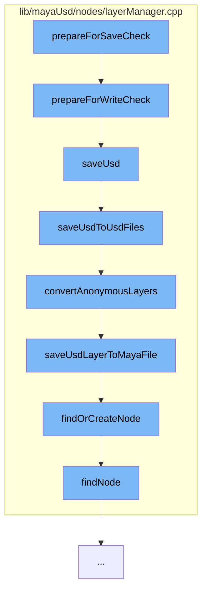

This document will cover the process of preparing for a save check in the Maya USD plugin, which includes:

1. Preparing for write check
2. Saving USD
3. Saving USD to USD files
4. Converting anonymous layers
5. Saving USD layer to Maya file
6. Finding or creating a node
7. Finding a node.



<SwmSnippet path="/lib/mayaUsd/nodes/layerManager.cpp" line="411">

---

# Preparing for write check

The function `prepareForWriteCheck` is the initial step in the save check process. It sets up the environment for the save operation, cleans up the new scene, and saves the layer manager selected stage.

```c++
void LayerDatabase::prepareForWriteCheck(bool* retCode, bool isExport)
{
    _isSavingMayaFile = true;
    cleanUpNewScene(nullptr);

    LayerDatabase::instance().saveLayerManagerSelectedStage();

    bool hasAnyProxy = false;
    if (LayerDatabase::instance().getProxiesToSave(isExport, &hasAnyProxy)) {

        int dialogResult = true;

        if (!isCopyingSceneNodes()) {
            if (MGlobal::kInteractive == MGlobal::mayaState() && !isCrashing()
                && LayerDatabase::instance().saveInteractionRequired()) {
                MGlobal::executeCommand(kSaveOptionUICmd, dialogResult);
            }
        }

        if (dialogResult) {
            dialogResult = LayerDatabase::instance().saveUsd(isExport);
```

---

</SwmSnippet>

<SwmSnippet path="/lib/mayaUsd/nodes/layerManager.cpp" line="641">

---

# Saving USD

The `saveUsd` function is responsible for saving the USD data. Depending on the situation, it may save the data to the USD file or to the temporary crash recovery Maya file.

```c++
bool LayerDatabase::saveUsd(bool isExport)
{
    BatchSaveResult result = MayaUsd::kNotHandled;

    auto opt = MayaUsd::utils::serializeUsdEditsLocationOption();

    if (MayaUsd::utils::kIgnoreUSDEdits != opt) {
        // When Maya is crashing or copying/cutting scene nodes, we don't want to
        // save the the USD file to avoid overwriting them with possibly unwanted
        // data. Instead, we will save the USD data inside the temporary crash recovery Maya file.
        if (isCrashing() || isCopyingSceneNodes()) {
            result = kPartiallyCompleted;
            opt = MayaUsd::utils::kSaveToMayaSceneFile;
        } else if (_batchSaveDelegate && _proxiesToSave.size() > 0) {
            result = _batchSaveDelegate(_proxiesToSave);
        }

        // kAbort: we should abort and return false, which Maya will take as
        // an indication to abort the file operation.
        //
        // kCompleted: the delegate has completely handled the save operation,
```

---

</SwmSnippet>

<SwmSnippet path="/lib/mayaUsd/nodes/layerManager.cpp" line="875">

---

# Saving USD to USD files

The `saveUsdToUsdFiles` function saves the USD data to USD files. It iterates over the proxies to save and saves each stage to a USD file.

```c++
BatchSaveResult LayerDatabase::saveUsdToUsdFiles()
{
    MFnDependencyNode fn;
    for (size_t i = 0; i < _proxiesToSave.size() + _internalProxiesToSave.size(); i++) {
        const StageSavingInfo& info = i < _proxiesToSave.size()
            ? _proxiesToSave[i]
            : _internalProxiesToSave[i - _proxiesToSave.size()];

        MObject mobj = info.dagPath.node();
        fn.setObject(mobj);
        if (!fn.isFromReferencedFile()
            && LayerDatabase::instance().supportedNodeType(fn.typeId())) {
            MayaUsdProxyShapeBase* pShape = static_cast<MayaUsdProxyShapeBase*>(fn.userNode());

            // Unshared Composition Saves to MayaFile Always
            if (!info.shareable) {
                saveStageToMayaFile(mobj, info.stage);
            } else {
                // No need to save stages from external sources
                if (info.isIncoming) {
                    continue;
```

---

</SwmSnippet>

<SwmSnippet path="/lib/mayaUsd/nodes/layerManager.cpp" line="918">

---

# Converting anonymous layers

The `convertAnonymousLayers` function converts anonymous layers to named layers. It recursively converts anonymous layers and saves the USD layer to the Maya file.

```c++
void LayerDatabase::convertAnonymousLayers(
    MayaUsdProxyShapeBase* pShape,
    const MObject&         proxyNode,
    UsdStageRefPtr         stage)
{
    SdfLayerHandle root = stage->GetRootLayer();
    std::string    proxyName(pShape->name().asChar());

    convertAnonymousLayersRecursive(root, proxyName, stage);

    // Note: retrieve root again since it may have been changed by the call
    //       to convertAnonymousLayersRecursive
    root = stage->GetRootLayer();
    if (root->IsAnonymous()) {
        const bool wasTargetLayer = (stage->GetEditTarget().GetLayer() == root);
        PXR_NS::SdfFileFormat::FileFormatArguments args;
        std::string newFileName = MayaUsd::utils::generateUniqueFileName(proxyName);
        if (UsdMayaUtilFileSystem::requireUsdPathsRelativeToMayaSceneFile()) {
            newFileName = UsdMayaUtilFileSystem::getPathRelativeToMayaSceneFile(newFileName);
        }
        if (!MayaUsd::utils::saveLayerWithFormat(root, newFileName)) {
```

---

</SwmSnippet>

<SwmSnippet path="/lib/mayaUsd/nodes/layerManager.cpp" line="964">

---

# Saving USD layer to Maya file

The `saveUsdLayerToMayaFile` function saves the USD layer to the Maya file. It finds or creates a node and adds the layer to the builder.

```c++
void LayerDatabase::saveUsdLayerToMayaFile(SdfLayerRefPtr layer, bool asAnonymous)
{
    MayaUsd::LayerManager* lm = findOrCreateNode();
    if (!lm)
        return;

    MStatus           status;
    MDataBlock        dataBlock = lm->_forceCache();
    MArrayDataHandle  layersHandle = dataBlock.outputArrayValue(lm->layers, &status);
    MArrayDataBuilder builder(&dataBlock, lm->layers, 1 /*maybe nb stages?*/, &status);

    addLayerToBuilder(lm, builder, layer, asAnonymous);

    layersHandle.set(builder);

    layersHandle.setAllClean();
    dataBlock.setClean(lm->layers);
}
```

---

</SwmSnippet>

<SwmSnippet path="/lib/mayaUsd/nodes/layerManager.cpp" line="141">

---

# Finding or creating a node

The `findOrCreateNode` function finds an existing node or creates a new one if it doesn't exist.

```c++
MayaUsd::LayerManager* findOrCreateNode()
{
    MayaUsd::LayerManager* lm = findNode();
    if (!lm) {
        MDGModifier& modifier = MayaUsd::MDGModifierUndoItem::create("Node find or creation");
        MObject      manager = modifier.createNode(MayaUsd::LayerManager::typeId);
        modifier.doIt();

        lm = static_cast<MayaUsd::LayerManager*>(MFnDependencyNode(manager).userNode());
    }

    return lm;
}
```

---

</SwmSnippet>

<SwmSnippet path="/lib/mayaUsd/nodes/layerManager.cpp" line="117">

---

# Finding a node

The `findNode` function finds an existing node. It checks for a cached layer manager before searching.

```c++
MayaUsd::LayerManager* findNode()
{
    // Check for cached layer manager before searching
    MFnDependencyNode fn;
    if (layerManagerHandle.isValid() && layerManagerHandle.isAlive()) {
        MObject mobj { layerManagerHandle.object() };
        if (!mobj.isNull()) {
            fn.setObject(mobj);
            return static_cast<MayaUsd::LayerManager*>(fn.userNode());
        }
    }

    MItDependencyNodes iter(MFn::kPluginDependNode);
    for (; !iter.isDone(); iter.next()) {
        MObject mobj = iter.item();
        fn.setObject(mobj);
        if (fn.typeId() == MayaUsd::LayerManager::typeId && !fn.isFromReferencedFile()) {
            layerManagerHandle = mobj;
            return static_cast<MayaUsd::LayerManager*>(fn.userNode());
        }
    }
```

---

</SwmSnippet>

&nbsp;

_This is an auto-generated document by Swimm AI 🌊 and has not yet been verified by a human_

<SwmMeta version="3.0.0" repo-id="Z2l0aHViJTNBJTNBbWF5YS11c2QlM0ElM0FnaWxhZG5hdm90" repo-name="maya-usd"><sup>Powered by [Swimm](/)</sup></SwmMeta>
