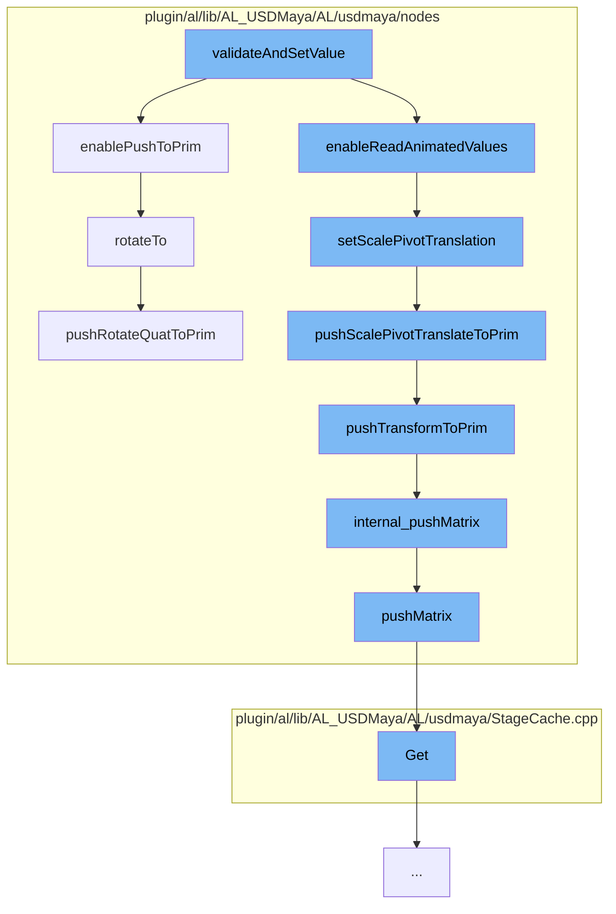

This document will cover the process of updating transformation matrices in the Maya-USD plugin, which includes:

1. Validating and setting the value
2. Enabling push to prim
3. Setting scale pivot translation
4. Pushing scale pivot translation to prim
5. Pushing transform to prim
6. Internally pushing matrix
7. Pushing matrix
8. Rotating to
9. Pushing rotate quat to prim.



<SwmSnippet path="/plugin/al/lib/AL_USDMaya/AL/usdmaya/nodes/Transform.cpp" line="1">

---

# Validating and setting the value

The process begins with the `validateAndSetValue` function in `Transform.cpp`. This function is responsible for validating the input values and setting them accordingly.

```c++
//
// Copyright 2017 Animal Logic
//
// Licensed under the Apache License, Version 2.0 (the "License");
// you may not use this file except in compliance with the License.
// You may obtain a copy of the License at
//
//     http://www.apache.org/licenses/LICENSE-2.0
//
// Unless required by applicable law or agreed to in writing, software
```

---

</SwmSnippet>

<SwmSnippet path="/plugin/al/lib/AL_USDMaya/AL/usdmaya/nodes/TransformationMatrix.cpp" line="2331">

---

# Enabling push to prim

`enablePushToPrim` function is called next. This function enables the push of transformation data to the prim. If the push is enabled, it checks if any transformation attribute has changed since the last sync and makes necessary adjustments.

```c++
//----------------------------------------------------------------------------------------------------------------------
void TransformationMatrix::enablePushToPrim(bool enabled)
{
    TF_DEBUG(ALUSDMAYA_TRANSFORM_MATRIX)
        .Msg("TransformationMatrix::enablePushToPrim %d\n", enabled);
    if (enabled)
        m_flags |= kPushToPrimEnabled;
    else
        m_flags &= ~kPushToPrimEnabled;

    // if not yet intiaialised, do not execute this code! (It will crash!).
    if (!m_prim)
        return;

    // if we are enabling push to prim, we need to see if anything has changed on the transform
    // since the last time the values were synced. I'm assuming that if a given transform attribute
    // is not the same as the default, or the prim already has a transform op for that attribute,
    // then just call a method to make a minor adjustment of nothing. This will call my code that
    // will magically construct the transform ops in the right order.
    if (enabled && getTimeCode() == UsdTimeCode::Default()) {
        const MVector     nullVec(0, 0, 0);
```

---

</SwmSnippet>

<SwmSnippet path="/plugin/al/lib/AL_USDMaya/AL/usdmaya/nodes/TransformationMatrix.cpp" line="1468">

---

# Setting scale pivot translation

`setScalePivotTranslation` function is called to set the scale pivot translation. If the push to prim is available and the scale pivot translation is not equivalent to the one from USD, it pushes the new scale pivot translation to the prim.

```c++
//----------------------------------------------------------------------------------------------------------------------
MStatus TransformationMatrix::setScalePivotTranslation(const MVector& sp, MSpace::Space space)
{
    TF_DEBUG(ALUSDMAYA_TRANSFORM_MATRIX)
        .Msg("TransformationMatrix::setScalePivotTranslation %f %f %f\n", sp.x, sp.y, sp.z);
    MStatus status = MPxTransformationMatrix::setScalePivotTranslation(sp, space);
    if (status) {
        m_scalePivotTranslationTweak
            = MPxTransformationMatrix::scalePivotTranslationValue - m_scalePivotTranslationFromUsd;
    }
    if (pushToPrimAvailable()) {
        if (primHasScalePivotTranslate()) {
        } else if (!pushPrimToMatrix() && sp != MVector(0.0, 0.0, 0.0)) {
            insertScalePivotTranslationOp();
        }
        // Push new value to prim, but only if it's changing.
        if (!sp.isEquivalent(m_scalePivotTranslationFromUsd)) {
            pushScalePivotTranslateToPrim();
        }
    }
    return status;
```

---

</SwmSnippet>

<SwmSnippet path="/plugin/al/lib/AL_USDMaya/AL/usdmaya/nodes/TransformationMatrix.cpp" line="2001">

---

# Pushing scale pivot translation to prim

`pushScalePivotTranslateToPrim` function pushes the scale pivot translation to the prim if the data has changed significantly.

```c++
//----------------------------------------------------------------------------------------------------------------------
void TransformationMatrix::pushScalePivotTranslateToPrim()
{
    TF_DEBUG(ALUSDMAYA_TRANSFORM_MATRIX)
        .Msg("TransformationMatrix::pushScalePivotTranslateToPrim\n");
    auto opIt = m_orderedOps.begin();
    for (std::vector<UsdGeomXformOp>::iterator it = m_xformops.begin(), e = m_xformops.end();
         it != e;
         ++it, ++opIt) {
        if (*opIt == kScalePivotTranslate) {
            UsdGeomXformOp& op = *it;
            MVector         tempPivotTranslation;
            internal_readVector(tempPivotTranslation, op);
            // only write back if data has changed significantly
            if (!tempPivotTranslation.isEquivalent(
                    MPxTransformationMatrix::scalePivotTranslationValue)) {
                internal_pushVector(MPxTransformationMatrix::scalePivotTranslationValue, op);
                m_scalePivotTranslationFromUsd
                    = MPxTransformationMatrix::scalePivotTranslationValue;
                m_scalePivotTranslationTweak = MVector(0, 0, 0);
            }
```

---

</SwmSnippet>

<SwmSnippet path="/plugin/al/lib/AL_USDMaya/AL/usdmaya/nodes/TransformationMatrix.cpp" line="2103">

---

# Pushing transform to prim

`pushTransformToPrim` function is called to push the transformation to the prim.

```c++
//----------------------------------------------------------------------------------------------------------------------
void TransformationMatrix::pushTransformToPrim()
{
    TF_DEBUG(ALUSDMAYA_TRANSFORM_MATRIX).Msg("TransformationMatrix::pushTransformToPrim\n");
    auto opIt = m_orderedOps.begin();
    for (std::vector<UsdGeomXformOp>::iterator it = m_xformops.begin(), e = m_xformops.end();
         it != e;
         ++it, ++opIt) {
        if (*opIt == kTransform) {
            UsdGeomXformOp& op = *it;
            if (pushPrimToMatrix()) {
                internal_pushMatrix(asMatrix(), op);
            }
            return;
        }
    }
}
```

---

</SwmSnippet>

<SwmSnippet path="/plugin/al/lib/AL_USDMaya/AL/usdmaya/nodes/TransformationMatrix.h" line="199">

---

# Internally pushing matrix

`internal_pushMatrix` function is called to push the matrix internally.

```c
    bool internal_pushMatrix(const MMatrix& result, UsdGeomXformOp& op)
    {
        return pushMatrix(result, op, getTimeCode());
    }
```

---

</SwmSnippet>

<SwmSnippet path="/plugin/al/lib/AL_USDMaya/AL/usdmaya/nodes/TransformationMatrix.cpp" line="533">

---

# Pushing matrix

`pushMatrix` function is called to push the matrix to the prim if the data has changed significantly.

```c++
//----------------------------------------------------------------------------------------------------------------------
bool TransformationMatrix::pushMatrix(
    const MMatrix&  result,
    UsdGeomXformOp& op,
    UsdTimeCode     timeCode)
{
    TF_DEBUG(ALUSDMAYA_TRANSFORM_MATRIX).Msg("TransformationMatrix::pushMatrix\n");
    if (timeCode.IsDefault() && op.GetNumTimeSamples()) {
        if (!hasEmptyDefaultValue(op, timeCode)) {
            return false;
        }
    }

    const SdfValueTypeName vtn = op.GetTypeName();
    UsdDataType            attr_type = AL::usdmaya::utils::getAttributeType(vtn);
    switch (attr_type) {
    case UsdDataType::kMatrix4d: {
        const GfMatrix4d& value = *(const GfMatrix4d*)(&result);
        GfMatrix4d        oldValue;
        oldValue.SetIdentity();
        op.Get(&oldValue, timeCode);
```

---

</SwmSnippet>

<SwmSnippet path="/plugin/al/lib/AL_USDMaya/AL/usdmaya/nodes/TransformationMatrix.cpp" line="1634">

---

# Rotating to

`rotateTo` function is called to rotate the transformation to a specific quaternion.

```c++
//----------------------------------------------------------------------------------------------------------------------
MStatus TransformationMatrix::rotateTo(const MQuaternion& q, MSpace::Space space)
{
    TF_DEBUG(ALUSDMAYA_TRANSFORM_MATRIX)
        .Msg("TransformationMatrix::rotateTo %f %f %f %f\n", q.x, q.y, q.z, q.w);
    if (isRotateLocked())
        return MPxTransformationMatrix::rotateTo(q, space);
    ;
    MStatus status = MPxTransformationMatrix::rotateTo(q, space);
    if (status) {
        m_rotationTweak.x = MPxTransformationMatrix::rotationValue.x - m_rotationFromUsd.x;
        m_rotationTweak.y = MPxTransformationMatrix::rotationValue.y - m_rotationFromUsd.y;
        m_rotationTweak.z = MPxTransformationMatrix::rotationValue.z - m_rotationFromUsd.z;
    }
    if (pushToPrimAvailable()) {
        if (primHasRotation()) {
        } else if (!pushPrimToMatrix() && q != MQuaternion(0.0, 0.0, 0.0, 1.0)) {
            insertRotateOp();
        }
        if (m_enableUsdWriteback) {
            // Push new value to prim, but only if it's changing.
```

---

</SwmSnippet>

<SwmSnippet path="/plugin/al/lib/AL_USDMaya/AL/usdmaya/nodes/TransformationMatrix.cpp" line="1942">

---

# Pushing rotate quat to prim

Finally, `pushRotateQuatToPrim` function pushes the rotation quaternion to the prim if the data has changed significantly.

```c++
//----------------------------------------------------------------------------------------------------------------------
void TransformationMatrix::pushRotateQuatToPrim()
{
    TF_DEBUG(ALUSDMAYA_TRANSFORM_MATRIX).Msg("TransformationMatrix::pushRotateQuatToPrim\n");
    auto opIt = m_orderedOps.begin();
    for (std::vector<UsdGeomXformOp>::iterator it = m_xformops.begin(), e = m_xformops.end();
         it != e;
         ++it, ++opIt) {
        if (*opIt == kRotate) {
            UsdGeomXformOp& op = *it;
            MEulerRotation  tempRotate;
            internal_readRotation(tempRotate, op);

            // only write back if data has changed significantly
            if (!tempRotate.asQuaternion().isEquivalent(
                    MPxTransformationMatrix::rotationValue.asQuaternion())) {
                internal_pushRotation(MPxTransformationMatrix::rotationValue, op);
                m_rotationFromUsd = MPxTransformationMatrix::rotationValue;
                m_rotationTweak = MEulerRotation(0, 0, 0);
            }
            return;
```

---

</SwmSnippet>

&nbsp;

_This is an auto-generated document by Swimm AI 🌊 and has not yet been verified by a human_

<SwmMeta version="3.0.0" repo-id="Z2l0aHViJTNBJTNBbWF5YS11c2QlM0ElM0FnaWxhZG5hdm90" repo-name="maya-usd"><sup>Powered by [Swimm](/)</sup></SwmMeta>
