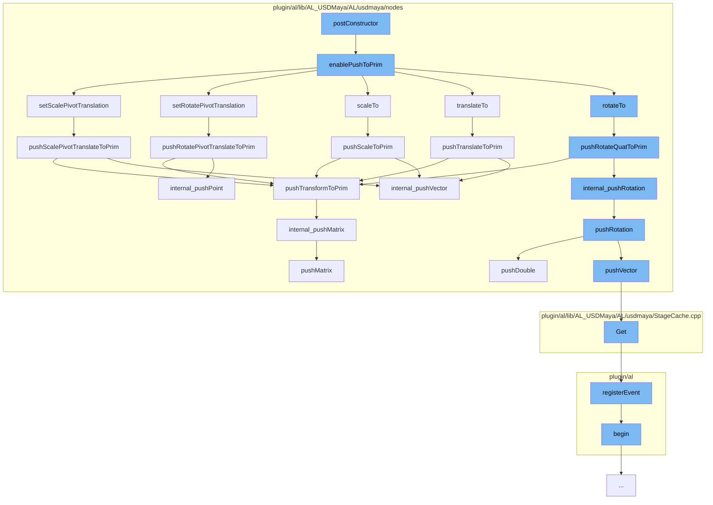

This document will cover the process of Transformations in the Maya-USD plugin, which includes:

1.  Enabling Push to Prim
2.  Setting Scale Pivot Translation
3.  Pushing Rotate Quaternion to Prim
4.  Pushing Transform to Prim
5.  Pushing Rotation
6.  Pushing Double
7.  Getting Stage Cache
8.  Registering Event
9.  Beginning Animation Translation
10. Pushing Translate to Prim
11. Pushing Scale to Prim
12. Pushing Rotate Pivot Translate to Prim
13. Pushing Scale Pivot Translate to Prim
14. Internal Push Matrix
15. Pushing Matrix



<SwmSnippet path="/plugin/al/lib/AL_USDMaya/AL/usdmaya/nodes/TransformationMatrix.cpp" line="2331">

---

# Enabling Push to Prim

The function `enablePushToPrim` is used to enable or disable the push to prim flag. If enabled, it checks if anything has changed on the transform since the last time the values were synced. If changes are detected, it calls the appropriate methods to adjust the transform ops in the correct order.

```c++
//----------------------------------------------------------------------------------------------------------------------
void TransformationMatrix::enablePushToPrim(bool enabled)
{
    TF_DEBUG(ALUSDMAYA_TRANSFORM_MATRIX)
        .Msg("TransformationMatrix::enablePushToPrim %d\n", enabled);
    if (enabled)
        m_flags |= kPushToPrimEnabled;
    else
        m_flags &= ~kPushToPrimEnabled;

    // if not yet intiaialised, do not execute this code! (It will crash!).
    if (!m_prim)
        return;

    // if we are enabling push to prim, we need to see if anything has changed on the transform
    // since the last time the values were synced. I'm assuming that if a given transform attribute
    // is not the same as the default, or the prim already has a transform op for that attribute,
    // then just call a method to make a minor adjustment of nothing. This will call my code that
    // will magically construct the transform ops in the right order.
    if (enabled && getTimeCode() == UsdTimeCode::Default()) {
        const MVector     nullVec(0, 0, 0);
```

---

</SwmSnippet>

<SwmSnippet path="/plugin/al/lib/AL_USDMaya/AL/usdmaya/nodes/TransformationMatrix.cpp" line="1468">

---

# Setting Scale Pivot Translation

The function `setScalePivotTranslation` is used to set the scale pivot translation. If the push to prim is available and the prim has scale pivot translate, it pushes the new value to the prim.

```c++
//----------------------------------------------------------------------------------------------------------------------
MStatus TransformationMatrix::setScalePivotTranslation(const MVector& sp, MSpace::Space space)
{
    TF_DEBUG(ALUSDMAYA_TRANSFORM_MATRIX)
        .Msg("TransformationMatrix::setScalePivotTranslation %f %f %f\n", sp.x, sp.y, sp.z);
    MStatus status = MPxTransformationMatrix::setScalePivotTranslation(sp, space);
    if (status) {
        m_scalePivotTranslationTweak
            = MPxTransformationMatrix::scalePivotTranslationValue - m_scalePivotTranslationFromUsd;
    }
    if (pushToPrimAvailable()) {
        if (primHasScalePivotTranslate()) {
        } else if (!pushPrimToMatrix() && sp != MVector(0.0, 0.0, 0.0)) {
            insertScalePivotTranslationOp();
        }
        // Push new value to prim, but only if it's changing.
        if (!sp.isEquivalent(m_scalePivotTranslationFromUsd)) {
            pushScalePivotTranslateToPrim();
        }
    }
    return status;
```

---

</SwmSnippet>

<SwmSnippet path="/plugin/al/lib/AL_USDMaya/AL/usdmaya/nodes/TransformationMatrix.cpp" line="1942">

---

# Pushing Rotate Quaternion to Prim

The function `pushRotateQuatToPrim` is used to push the rotate quaternion to the prim. If the prim has a transform, it pushes the matrix to the prim.

```c++
//----------------------------------------------------------------------------------------------------------------------
void TransformationMatrix::pushRotateQuatToPrim()
{
    TF_DEBUG(ALUSDMAYA_TRANSFORM_MATRIX).Msg("TransformationMatrix::pushRotateQuatToPrim\n");
    auto opIt = m_orderedOps.begin();
    for (std::vector<UsdGeomXformOp>::iterator it = m_xformops.begin(), e = m_xformops.end();
         it != e;
         ++it, ++opIt) {
        if (*opIt == kRotate) {
            UsdGeomXformOp& op = *it;
            MEulerRotation  tempRotate;
            internal_readRotation(tempRotate, op);

            // only write back if data has changed significantly
            if (!tempRotate.asQuaternion().isEquivalent(
                    MPxTransformationMatrix::rotationValue.asQuaternion())) {
                internal_pushRotation(MPxTransformationMatrix::rotationValue, op);
                m_rotationFromUsd = MPxTransformationMatrix::rotationValue;
                m_rotationTweak = MEulerRotation(0, 0, 0);
            }
            return;
```

---

</SwmSnippet>

<SwmSnippet path="/plugin/al/lib/AL_USDMaya/AL/usdmaya/nodes/TransformationMatrix.cpp" line="2103">

---

# Pushing Transform to Prim

The function `pushTransformToPrim` is used to push the transform to the prim. If the prim has a transform, it pushes the matrix to the prim.

```c++
//----------------------------------------------------------------------------------------------------------------------
void TransformationMatrix::pushTransformToPrim()
{
    TF_DEBUG(ALUSDMAYA_TRANSFORM_MATRIX).Msg("TransformationMatrix::pushTransformToPrim\n");
    auto opIt = m_orderedOps.begin();
    for (std::vector<UsdGeomXformOp>::iterator it = m_xformops.begin(), e = m_xformops.end();
         it != e;
         ++it, ++opIt) {
        if (*opIt == kTransform) {
            UsdGeomXformOp& op = *it;
            if (pushPrimToMatrix()) {
                internal_pushMatrix(asMatrix(), op);
            }
            return;
        }
    }
}
```

---

</SwmSnippet>

<SwmSnippet path="/plugin/al/lib/AL_USDMaya/AL/usdmaya/nodes/TransformationMatrix.cpp" line="858">

---

# Pushing Rotation

The function `pushRotation` is used to push the rotation to the prim. Depending on the operation type, it pushes the appropriate rotation value to the prim.

```c++
//----------------------------------------------------------------------------------------------------------------------
bool TransformationMatrix::pushRotation(
    const MEulerRotation& value,
    UsdGeomXformOp&       op,
    UsdTimeCode           timeCode)
{
    TF_DEBUG(ALUSDMAYA_TRANSFORM_MATRIX)
        .Msg(
            "TransformationMatrix::pushRotation %f %f %f\n%s\n",
            value.x,
            value.y,
            value.z,
            op.GetOpName().GetText());

    if (timeCode.IsDefault() && op.GetNumTimeSamples()) {
        if (!hasEmptyDefaultValue(op, timeCode)) {
            return false;
        }
    }

    const double radToDeg = 180.0 / M_PI;
```

---

</SwmSnippet>

<SwmSnippet path="/plugin/al/lib/AL_USDMaya/AL/usdmaya/nodes/TransformationMatrix.cpp" line="705">

---

# Pushing Double

The function `pushDouble` is used to push a double value to the prim. Depending on the attribute type, it pushes the appropriate double value to the prim.

```c++
//----------------------------------------------------------------------------------------------------------------------
void TransformationMatrix::pushDouble(const double value, UsdGeomXformOp& op, UsdTimeCode timeCode)
{
    TF_DEBUG(ALUSDMAYA_TRANSFORM_MATRIX)
        .Msg("TransformationMatrix::pushDouble %f\n%s\n", value, op.GetOpName().GetText());

    if (timeCode.IsDefault() && op.GetNumTimeSamples()) {
        if (!hasEmptyDefaultValue(op, timeCode)) {
            return;
        }
    }

    UsdDataType attr_type = AL::usdmaya::utils::getAttributeType(op.GetTypeName());
    switch (attr_type) {
    case UsdDataType::kHalf: {
        GfHalf oldValue { 0.f };
        op.Get(&oldValue);
        if (!isClose(oldValue, GfHalf(value)))
            op.Set(GfHalf(value), getTimeCodeForOp(op, timeCode));
    } break;

```

---

</SwmSnippet>

<SwmSnippet path="/plugin/al/lib/AL_USDMaya/AL/usdmaya/StageCache.cpp" line="42">

---

# Getting Stage Cache

The function `Get` is used to get the USD stage cache. It registers callbacks to clear the USD stage cache whenever a new scene is created in Maya.

```c++
//----------------------------------------------------------------------------------------------------------------------
UsdStageCache& StageCache::Get()
{

    // IMPORTANT: At every NEW scene in Maya we clear the USD stage cache.
    if (g_beforeNewCallbackId == 0) {
        g_beforeNewCallbackId = AL::maya::event::MayaEventManager::instance().registerCallback(
            onMayaSceneUpdateCallback, "BeforeNew", "ClearStageCacheOnFileNew", 0x10000);
        g_beforeLoadCallbackId = AL::maya::event::MayaEventManager::instance().registerCallback(
            onMayaSceneUpdateCallback, "BeforeOpen", "ClearStageCacheOnFileOpen", 0x10000);

        g_stageCacheCleared = AL::event::EventScheduler::getScheduler().registerEvent(
            "OnUsdStageCacheCleared", AL::event::kUSDMayaEventType);
    }
    return UsdUtilsStageCache::Get();
}
```

---

</SwmSnippet>

<SwmSnippet path="/plugin/al/utils/AL/event/EventHandler.cpp" line="218">

---

# Registering Event

The function `registerEvent` is used to register an event. If the event is already registered, it returns the event id. Otherwise, it registers the event and returns the new event id.

```c++
//----------------------------------------------------------------------------------------------------------------------
EventId EventScheduler::registerEvent(
    const char* eventName,
    EventType   eventType,
    const void* associatedData,
    CallbackId  parentCallback)
{
    auto    insertLocation = m_registeredEvents.end();
    EventId unusedId = 1;
    for (auto& it : m_registeredEvents) {
        if (it.name() == eventName) {
            if (it.eventType() == kUnknownEventType) {
                it.m_eventType = eventType;
                it.m_associatedData = associatedData;
                it.m_parentCallback = parentCallback;
                return it.eventId();
            } else if (
                it.parentCallbackId() == parentCallback && it.associatedData() == associatedData) {
                m_system->error("The event \"%s\" has already been registered", eventName);
                return 0;
            }
```

---

</SwmSnippet>

<SwmSnippet path="/plugin/al/usdmayautils/AL/usdmaya/utils/AnimationTranslator.h" line="318">

---

# Beginning Animation Translation

The function `begin` is used to get an iterator to the beginning of the common transform attributes.

```c
    inline std::array<MObject, transformAttributesCount>::const_iterator begin() const
    {
        return m_commonTransformAttributes.cbegin();
    }
```

---

</SwmSnippet>

<SwmSnippet path="/plugin/al/lib/AL_USDMaya/AL/usdmaya/nodes/TransformationMatrix.cpp" line="1798">

---

# Pushing Translate to Prim

The function `pushTranslateToPrim` is used to push the translate to the prim. If the prim has a translate, it pushes the vector to the prim.

```c++
//----------------------------------------------------------------------------------------------------------------------
void TransformationMatrix::pushTranslateToPrim()
{
    TF_DEBUG(ALUSDMAYA_TRANSFORM_MATRIX).Msg("TransformationMatrix::pushTranslateToPrim\n");
    auto opIt = m_orderedOps.begin();
    for (std::vector<UsdGeomXformOp>::iterator it = m_xformops.begin(), e = m_xformops.end();
         it != e;
         ++it, ++opIt) {
        if (*opIt == kTranslate) {
            UsdGeomXformOp& op = *it;
            MVector         tempTranslation;
            internal_readVector(tempTranslation, op);
            // only write back if data has changed significantly
            if (!tempTranslation.isEquivalent(MPxTransformationMatrix::translationValue)) {
                internal_pushVector(MPxTransformationMatrix::translationValue, op);
                m_translationFromUsd = MPxTransformationMatrix::translationValue;
                m_translationTweak = MVector(0, 0, 0);
            }
            return;
        }
    }
```

---

</SwmSnippet>

<SwmSnippet path="/plugin/al/lib/AL_USDMaya/AL/usdmaya/nodes/TransformationMatrix.cpp" line="2056">

---

# Pushing Scale to Prim

The function `pushScaleToPrim` is used to push the scale to the prim. If the prim has a scale, it pushes the vector to the prim.

```c++
//----------------------------------------------------------------------------------------------------------------------
void TransformationMatrix::pushScaleToPrim()
{
    TF_DEBUG(ALUSDMAYA_TRANSFORM_MATRIX).Msg("TransformationMatrix::pushScaleToPrim\n");
    auto opIt = m_orderedOps.begin();
    for (std::vector<UsdGeomXformOp>::iterator it = m_xformops.begin(), e = m_xformops.end();
         it != e;
         ++it, ++opIt) {
        if (*opIt == kScale) {
            UsdGeomXformOp& op = *it;
            MVector         tempScale(1.0, 1.0, 1.0);
            internal_readVector(tempScale, op);
            // only write back if data has changed significantly
            if (!tempScale.isEquivalent(MPxTransformationMatrix::scaleValue)) {
                internal_pushVector(MPxTransformationMatrix::scaleValue, op);
                m_scaleFromUsd = MPxTransformationMatrix::scaleValue;
                m_scaleTweak = MVector(0, 0, 0);
            }
            return;
        }
    }
```

---

</SwmSnippet>

<SwmSnippet path="/plugin/al/lib/AL_USDMaya/AL/usdmaya/nodes/TransformationMatrix.cpp" line="1879">

---

# Pushing Rotate Pivot Translate to Prim

The function `pushRotatePivotTranslateToPrim` is used to push the rotate pivot translate to the prim. If the prim has a rotate pivot translate, it pushes the point to the prim.

```c++
//----------------------------------------------------------------------------------------------------------------------
void TransformationMatrix::pushRotatePivotTranslateToPrim()
{
    TF_DEBUG(ALUSDMAYA_TRANSFORM_MATRIX)
        .Msg("TransformationMatrix::pushRotatePivotTranslateToPrim\n");
    auto opIt = m_orderedOps.begin();
    for (std::vector<UsdGeomXformOp>::iterator it = m_xformops.begin(), e = m_xformops.end();
         it != e;
         ++it, ++opIt) {
        if (*opIt == kRotatePivotTranslate) {
            UsdGeomXformOp& op = *it;
            MVector         tempPivotTranslation;
            internal_readVector(tempPivotTranslation, op);
            // only write back if data has changed significantly
            if (!tempPivotTranslation.isEquivalent(
                    MPxTransformationMatrix::rotatePivotTranslationValue)) {
                internal_pushPoint(MPxTransformationMatrix::rotatePivotTranslationValue, op);
                m_rotatePivotTranslationFromUsd
                    = MPxTransformationMatrix::rotatePivotTranslationValue;
                m_rotatePivotTranslationTweak = MVector(0, 0, 0);
            }
```

---

</SwmSnippet>

<SwmSnippet path="/plugin/al/lib/AL_USDMaya/AL/usdmaya/nodes/TransformationMatrix.cpp" line="2001">

---

# Pushing Scale Pivot Translate to Prim

The function `pushScalePivotTranslateToPrim` is used to push the scale pivot translate to the prim. If the prim has a scale pivot translate, it pushes the vector to the prim.

```c++
//----------------------------------------------------------------------------------------------------------------------
void TransformationMatrix::pushScalePivotTranslateToPrim()
{
    TF_DEBUG(ALUSDMAYA_TRANSFORM_MATRIX)
        .Msg("TransformationMatrix::pushScalePivotTranslateToPrim\n");
    auto opIt = m_orderedOps.begin();
    for (std::vector<UsdGeomXformOp>::iterator it = m_xformops.begin(), e = m_xformops.end();
         it != e;
         ++it, ++opIt) {
        if (*opIt == kScalePivotTranslate) {
            UsdGeomXformOp& op = *it;
            MVector         tempPivotTranslation;
            internal_readVector(tempPivotTranslation, op);
            // only write back if data has changed significantly
            if (!tempPivotTranslation.isEquivalent(
                    MPxTransformationMatrix::scalePivotTranslationValue)) {
                internal_pushVector(MPxTransformationMatrix::scalePivotTranslationValue, op);
                m_scalePivotTranslationFromUsd
                    = MPxTransformationMatrix::scalePivotTranslationValue;
                m_scalePivotTranslationTweak = MVector(0, 0, 0);
            }
```

---

</SwmSnippet>

<SwmSnippet path="/plugin/al/lib/AL_USDMaya/AL/usdmaya/nodes/TransformationMatrix.h" line="199">

---

# Internal Push Matrix

The function `internal_pushMatrix` is used to push the matrix to the prim. It calls the `pushMatrix` function to push the matrix to the prim.

```c
    bool internal_pushMatrix(const MMatrix& result, UsdGeomXformOp& op)
    {
        return pushMatrix(result, op, getTimeCode());
    }
```

---

</SwmSnippet>

<SwmSnippet path="/plugin/al/lib/AL_USDMaya/AL/usdmaya/nodes/TransformationMatrix.cpp" line="533">

---

# Pushing Matrix

The function `pushMatrix` is used to push the matrix to the prim. Depending on the attribute type, it pushes the appropriate matrix to the prim.

```c++
//----------------------------------------------------------------------------------------------------------------------
bool TransformationMatrix::pushMatrix(
    const MMatrix&  result,
    UsdGeomXformOp& op,
    UsdTimeCode     timeCode)
{
    TF_DEBUG(ALUSDMAYA_TRANSFORM_MATRIX).Msg("TransformationMatrix::pushMatrix\n");
    if (timeCode.IsDefault() && op.GetNumTimeSamples()) {
        if (!hasEmptyDefaultValue(op, timeCode)) {
            return false;
        }
    }

    const SdfValueTypeName vtn = op.GetTypeName();
    UsdDataType            attr_type = AL::usdmaya::utils::getAttributeType(vtn);
    switch (attr_type) {
    case UsdDataType::kMatrix4d: {
        const GfMatrix4d& value = *(const GfMatrix4d*)(&result);
        GfMatrix4d        oldValue;
        oldValue.SetIdentity();
        op.Get(&oldValue, timeCode);
```

---

</SwmSnippet>

&nbsp;

_This is an auto-generated document by Swimm AI 🌊 and has not yet been verified by a human_

<SwmMeta version="3.0.0" repo-id="Z2l0aHViJTNBJTNBbWF5YS11c2QlM0ElM0FnaWxhZG5hdm90" repo-name="maya-usd"><sup>Powered by [Swimm](/)</sup></SwmMeta>
