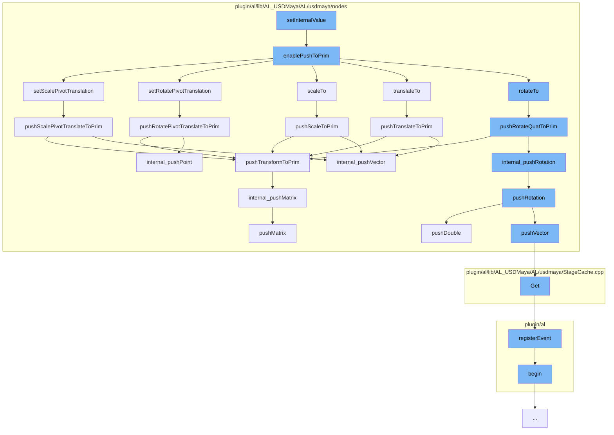

This document will cover the process of Transformations in the Maya-USD plugin, which includes:

1. Setting internal values
2. Enabling push to prim
3. Setting scale pivot translation
4. Pushing rotation to prim
5. Pushing translation to prim
6. Pushing scale to prim
7. Pushing rotate pivot translation to prim
8. Pushing scale pivot translation to prim.



<SwmSnippet path="/plugin/al/lib/AL_USDMaya/AL/usdmaya/nodes/Transform.cpp" line="1">

---

# Setting internal values

The function `setInternalValue` is the starting point of the transformation process. It is responsible for setting the internal values of the transformation.

```c++
//
// Copyright 2017 Animal Logic
//
// Licensed under the Apache License, Version 2.0 (the "License");
// you may not use this file except in compliance with the License.
// You may obtain a copy of the License at
//
//     http://www.apache.org/licenses/LICENSE-2.0
//
// Unless required by applicable law or agreed to in writing, software
```

---

</SwmSnippet>

<SwmSnippet path="/plugin/al/lib/AL_USDMaya/AL/usdmaya/nodes/TransformationMatrix.cpp" line="2331">

---

# Enabling push to prim

The function `enablePushToPrim` is called next. It enables the push to prim functionality, which is necessary for the transformation process to proceed.

```c++
//----------------------------------------------------------------------------------------------------------------------
void TransformationMatrix::enablePushToPrim(bool enabled)
{
    TF_DEBUG(ALUSDMAYA_TRANSFORM_MATRIX)
        .Msg("TransformationMatrix::enablePushToPrim %d\n", enabled);
    if (enabled)
        m_flags |= kPushToPrimEnabled;
    else
        m_flags &= ~kPushToPrimEnabled;

    // if not yet intiaialised, do not execute this code! (It will crash!).
    if (!m_prim)
        return;

    // if we are enabling push to prim, we need to see if anything has changed on the transform
    // since the last time the values were synced. I'm assuming that if a given transform attribute
    // is not the same as the default, or the prim already has a transform op for that attribute,
    // then just call a method to make a minor adjustment of nothing. This will call my code that
    // will magically construct the transform ops in the right order.
    if (enabled && getTimeCode() == UsdTimeCode::Default()) {
        const MVector     nullVec(0, 0, 0);
```

---

</SwmSnippet>

<SwmSnippet path="/plugin/al/lib/AL_USDMaya/AL/usdmaya/nodes/TransformationMatrix.cpp" line="1468">

---

# Setting scale pivot translation

The function `setScalePivotTranslation` is responsible for setting the scale pivot translation. This is a crucial step in the transformation process.

```c++
//----------------------------------------------------------------------------------------------------------------------
MStatus TransformationMatrix::setScalePivotTranslation(const MVector& sp, MSpace::Space space)
{
    TF_DEBUG(ALUSDMAYA_TRANSFORM_MATRIX)
        .Msg("TransformationMatrix::setScalePivotTranslation %f %f %f\n", sp.x, sp.y, sp.z);
    MStatus status = MPxTransformationMatrix::setScalePivotTranslation(sp, space);
    if (status) {
        m_scalePivotTranslationTweak
            = MPxTransformationMatrix::scalePivotTranslationValue - m_scalePivotTranslationFromUsd;
    }
    if (pushToPrimAvailable()) {
        if (primHasScalePivotTranslate()) {
        } else if (!pushPrimToMatrix() && sp != MVector(0.0, 0.0, 0.0)) {
            insertScalePivotTranslationOp();
        }
        // Push new value to prim, but only if it's changing.
        if (!sp.isEquivalent(m_scalePivotTranslationFromUsd)) {
            pushScalePivotTranslateToPrim();
        }
    }
    return status;
```

---

</SwmSnippet>

<SwmSnippet path="/plugin/al/lib/AL_USDMaya/AL/usdmaya/nodes/TransformationMatrix.cpp" line="1942">

---

# Pushing rotation to prim

The function `pushRotateQuatToPrim` is responsible for pushing the rotation to the prim. This is a key step in the transformation process.

```c++
//----------------------------------------------------------------------------------------------------------------------
void TransformationMatrix::pushRotateQuatToPrim()
{
    TF_DEBUG(ALUSDMAYA_TRANSFORM_MATRIX).Msg("TransformationMatrix::pushRotateQuatToPrim\n");
    auto opIt = m_orderedOps.begin();
    for (std::vector<UsdGeomXformOp>::iterator it = m_xformops.begin(), e = m_xformops.end();
         it != e;
         ++it, ++opIt) {
        if (*opIt == kRotate) {
            UsdGeomXformOp& op = *it;
            MEulerRotation  tempRotate;
            internal_readRotation(tempRotate, op);

            // only write back if data has changed significantly
            if (!tempRotate.asQuaternion().isEquivalent(
                    MPxTransformationMatrix::rotationValue.asQuaternion())) {
                internal_pushRotation(MPxTransformationMatrix::rotationValue, op);
                m_rotationFromUsd = MPxTransformationMatrix::rotationValue;
                m_rotationTweak = MEulerRotation(0, 0, 0);
            }
            return;
```

---

</SwmSnippet>

<SwmSnippet path="/plugin/al/lib/AL_USDMaya/AL/usdmaya/nodes/TransformationMatrix.cpp" line="1798">

---

# Pushing translation to prim

The function `pushTranslateToPrim` is responsible for pushing the translation to the prim. This is a key step in the transformation process.

```c++
//----------------------------------------------------------------------------------------------------------------------
void TransformationMatrix::pushTranslateToPrim()
{
    TF_DEBUG(ALUSDMAYA_TRANSFORM_MATRIX).Msg("TransformationMatrix::pushTranslateToPrim\n");
    auto opIt = m_orderedOps.begin();
    for (std::vector<UsdGeomXformOp>::iterator it = m_xformops.begin(), e = m_xformops.end();
         it != e;
         ++it, ++opIt) {
        if (*opIt == kTranslate) {
            UsdGeomXformOp& op = *it;
            MVector         tempTranslation;
            internal_readVector(tempTranslation, op);
            // only write back if data has changed significantly
            if (!tempTranslation.isEquivalent(MPxTransformationMatrix::translationValue)) {
                internal_pushVector(MPxTransformationMatrix::translationValue, op);
                m_translationFromUsd = MPxTransformationMatrix::translationValue;
                m_translationTweak = MVector(0, 0, 0);
            }
            return;
        }
    }
```

---

</SwmSnippet>

<SwmSnippet path="/plugin/al/lib/AL_USDMaya/AL/usdmaya/nodes/TransformationMatrix.cpp" line="2056">

---

# Pushing scale to prim

The function `pushScaleToPrim` is responsible for pushing the scale to the prim. This is a key step in the transformation process.

```c++
//----------------------------------------------------------------------------------------------------------------------
void TransformationMatrix::pushScaleToPrim()
{
    TF_DEBUG(ALUSDMAYA_TRANSFORM_MATRIX).Msg("TransformationMatrix::pushScaleToPrim\n");
    auto opIt = m_orderedOps.begin();
    for (std::vector<UsdGeomXformOp>::iterator it = m_xformops.begin(), e = m_xformops.end();
         it != e;
         ++it, ++opIt) {
        if (*opIt == kScale) {
            UsdGeomXformOp& op = *it;
            MVector         tempScale(1.0, 1.0, 1.0);
            internal_readVector(tempScale, op);
            // only write back if data has changed significantly
            if (!tempScale.isEquivalent(MPxTransformationMatrix::scaleValue)) {
                internal_pushVector(MPxTransformationMatrix::scaleValue, op);
                m_scaleFromUsd = MPxTransformationMatrix::scaleValue;
                m_scaleTweak = MVector(0, 0, 0);
            }
            return;
        }
    }
```

---

</SwmSnippet>

<SwmSnippet path="/plugin/al/lib/AL_USDMaya/AL/usdmaya/nodes/TransformationMatrix.cpp" line="1879">

---

# Pushing rotate pivot translation to prim

The function `pushRotatePivotTranslateToPrim` is responsible for pushing the rotate pivot translation to the prim. This is a key step in the transformation process.

```c++
//----------------------------------------------------------------------------------------------------------------------
void TransformationMatrix::pushRotatePivotTranslateToPrim()
{
    TF_DEBUG(ALUSDMAYA_TRANSFORM_MATRIX)
        .Msg("TransformationMatrix::pushRotatePivotTranslateToPrim\n");
    auto opIt = m_orderedOps.begin();
    for (std::vector<UsdGeomXformOp>::iterator it = m_xformops.begin(), e = m_xformops.end();
         it != e;
         ++it, ++opIt) {
        if (*opIt == kRotatePivotTranslate) {
            UsdGeomXformOp& op = *it;
            MVector         tempPivotTranslation;
            internal_readVector(tempPivotTranslation, op);
            // only write back if data has changed significantly
            if (!tempPivotTranslation.isEquivalent(
                    MPxTransformationMatrix::rotatePivotTranslationValue)) {
                internal_pushPoint(MPxTransformationMatrix::rotatePivotTranslationValue, op);
                m_rotatePivotTranslationFromUsd
                    = MPxTransformationMatrix::rotatePivotTranslationValue;
                m_rotatePivotTranslationTweak = MVector(0, 0, 0);
            }
```

---

</SwmSnippet>

<SwmSnippet path="/plugin/al/lib/AL_USDMaya/AL/usdmaya/nodes/TransformationMatrix.cpp" line="2001">

---

# Pushing scale pivot translation to prim

The function `pushScalePivotTranslateToPrim` is responsible for pushing the scale pivot translation to the prim. This is the final step in the transformation process.

```c++
//----------------------------------------------------------------------------------------------------------------------
void TransformationMatrix::pushScalePivotTranslateToPrim()
{
    TF_DEBUG(ALUSDMAYA_TRANSFORM_MATRIX)
        .Msg("TransformationMatrix::pushScalePivotTranslateToPrim\n");
    auto opIt = m_orderedOps.begin();
    for (std::vector<UsdGeomXformOp>::iterator it = m_xformops.begin(), e = m_xformops.end();
         it != e;
         ++it, ++opIt) {
        if (*opIt == kScalePivotTranslate) {
            UsdGeomXformOp& op = *it;
            MVector         tempPivotTranslation;
            internal_readVector(tempPivotTranslation, op);
            // only write back if data has changed significantly
            if (!tempPivotTranslation.isEquivalent(
                    MPxTransformationMatrix::scalePivotTranslationValue)) {
                internal_pushVector(MPxTransformationMatrix::scalePivotTranslationValue, op);
                m_scalePivotTranslationFromUsd
                    = MPxTransformationMatrix::scalePivotTranslationValue;
                m_scalePivotTranslationTweak = MVector(0, 0, 0);
            }
```

---

</SwmSnippet>

&nbsp;

_This is an auto-generated document by Swimm AI 🌊 and has not yet been verified by a human_

<SwmMeta version="3.0.0" repo-id="Z2l0aHViJTNBJTNBbWF5YS11c2QlM0ElM0FnaWxhZG5hdm90" repo-name="maya-usd"><sup>Powered by [Swimm](/)</sup></SwmMeta>
