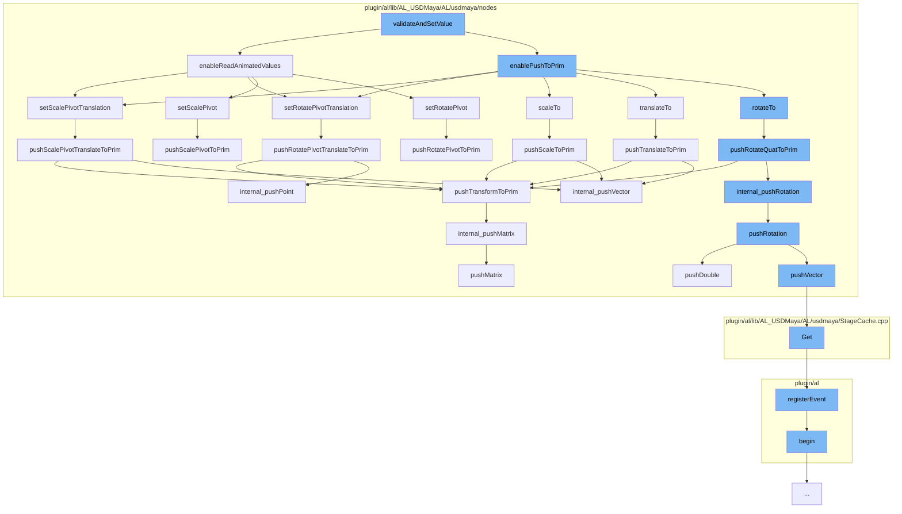

This document will cover the process of Transformations in Maya-USD, which includes:

1. Validating and setting the value
2. Enabling read of animated values
3. Enabling push to prim
4. Setting scale pivot translation
5. Pushing rotation to prim
6. Pushing translation to prim
7. Pushing scale to prim
8. Pushing transform to prim.



<SwmSnippet path="/plugin/al/lib/AL_USDMaya/AL/usdmaya/nodes/Transform.cpp" line="2270">

---

# Validating and setting the value

The function `validateAndSetValue` is the starting point of the transformation process. It enables the reading of animated values and the push to prim if the transformation is valid.

```c++

```

---

</SwmSnippet>

<SwmSnippet path="/plugin/al/lib/AL_USDMaya/AL/usdmaya/nodes/TransformationMatrix.cpp" line="2270">

---

# Enabling read of animated values

The function `enableReadAnimatedValues` checks if the transformation is animated. If it is, it sets the scale pivot and rotate pivot translations.

```c++
//----------------------------------------------------------------------------------------------------------------------
void TransformationMatrix::enableReadAnimatedValues(bool enabled)
{
    TF_DEBUG(ALUSDMAYA_TRANSFORM_MATRIX).Msg("TransformationMatrix::enableReadAnimatedValues\n");
    if (enabled)
        m_flags |= kReadAnimatedValues;
    else
        m_flags &= ~kReadAnimatedValues;

    // if not yet intiaialised, do not execute this code! (It will crash!).
    if (!m_prim)
        return;

    // if we are enabling push to prim, we need to see if anything has changed on the transform
    // since the last time the values were synced. I'm assuming that if a given transform attribute
    // is not the same as the default, or the prim already has a transform op for that attribute,
    // then just call a method to make a minor adjustment of nothing. This will call my code that
    // will magically construct the transform ops in the right order.
    if (enabled) {
        const MVector     nullVec(0, 0, 0);
        const MVector     oneVec(1.0, 1.0, 1.0);
```

---

</SwmSnippet>

<SwmSnippet path="/plugin/al/lib/AL_USDMaya/AL/usdmaya/nodes/TransformationMatrix.cpp" line="2270">

---

# Enabling push to prim

The function `enablePushToPrim` sets the scale pivot translation, rotate pivot translation, scale, translation, and rotation to the prim.

```c++
//----------------------------------------------------------------------------------------------------------------------
void TransformationMatrix::enableReadAnimatedValues(bool enabled)
{
    TF_DEBUG(ALUSDMAYA_TRANSFORM_MATRIX).Msg("TransformationMatrix::enableReadAnimatedValues\n");
    if (enabled)
        m_flags |= kReadAnimatedValues;
    else
        m_flags &= ~kReadAnimatedValues;

    // if not yet intiaialised, do not execute this code! (It will crash!).
    if (!m_prim)
        return;

    // if we are enabling push to prim, we need to see if anything has changed on the transform
    // since the last time the values were synced. I'm assuming that if a given transform attribute
    // is not the same as the default, or the prim already has a transform op for that attribute,
    // then just call a method to make a minor adjustment of nothing. This will call my code that
    // will magically construct the transform ops in the right order.
    if (enabled) {
        const MVector     nullVec(0, 0, 0);
        const MVector     oneVec(1.0, 1.0, 1.0);
```

---

</SwmSnippet>

<SwmSnippet path="/plugin/al/lib/AL_USDMaya/AL/usdmaya/nodes/TransformationMatrix.cpp" line="1468">

---

# Setting scale pivot translation

The function `setScalePivotTranslation` sets the scale pivot translation of the transformation matrix. If the push to prim is available, it pushes the scale pivot translation to the prim.

```c++
//----------------------------------------------------------------------------------------------------------------------
MStatus TransformationMatrix::setScalePivotTranslation(const MVector& sp, MSpace::Space space)
{
    TF_DEBUG(ALUSDMAYA_TRANSFORM_MATRIX)
        .Msg("TransformationMatrix::setScalePivotTranslation %f %f %f\n", sp.x, sp.y, sp.z);
    MStatus status = MPxTransformationMatrix::setScalePivotTranslation(sp, space);
    if (status) {
        m_scalePivotTranslationTweak
            = MPxTransformationMatrix::scalePivotTranslationValue - m_scalePivotTranslationFromUsd;
    }
    if (pushToPrimAvailable()) {
        if (primHasScalePivotTranslate()) {
        } else if (!pushPrimToMatrix() && sp != MVector(0.0, 0.0, 0.0)) {
            insertScalePivotTranslationOp();
        }
        // Push new value to prim, but only if it's changing.
        if (!sp.isEquivalent(m_scalePivotTranslationFromUsd)) {
            pushScalePivotTranslateToPrim();
        }
    }
    return status;
```

---

</SwmSnippet>

<SwmSnippet path="/plugin/al/lib/AL_USDMaya/AL/usdmaya/nodes/TransformationMatrix.cpp" line="1942">

---

# Pushing rotation to prim

The function `pushRotateQuatToPrim` pushes the rotation quaternion to the prim. If the prim has a transform, it pushes the matrix to the prim.

```c++
//----------------------------------------------------------------------------------------------------------------------
void TransformationMatrix::pushRotateQuatToPrim()
{
    TF_DEBUG(ALUSDMAYA_TRANSFORM_MATRIX).Msg("TransformationMatrix::pushRotateQuatToPrim\n");
    auto opIt = m_orderedOps.begin();
    for (std::vector<UsdGeomXformOp>::iterator it = m_xformops.begin(), e = m_xformops.end();
         it != e;
         ++it, ++opIt) {
        if (*opIt == kRotate) {
            UsdGeomXformOp& op = *it;
            MEulerRotation  tempRotate;
            internal_readRotation(tempRotate, op);

            // only write back if data has changed significantly
            if (!tempRotate.asQuaternion().isEquivalent(
                    MPxTransformationMatrix::rotationValue.asQuaternion())) {
                internal_pushRotation(MPxTransformationMatrix::rotationValue, op);
                m_rotationFromUsd = MPxTransformationMatrix::rotationValue;
                m_rotationTweak = MEulerRotation(0, 0, 0);
            }
            return;
```

---

</SwmSnippet>

<SwmSnippet path="/plugin/al/lib/AL_USDMaya/AL/usdmaya/nodes/TransformationMatrix.cpp" line="1798">

---

# Pushing translation to prim

The function `pushTranslateToPrim` pushes the translation to the prim. If the prim has a transform, it pushes the matrix to the prim.

```c++
//----------------------------------------------------------------------------------------------------------------------
void TransformationMatrix::pushTranslateToPrim()
{
    TF_DEBUG(ALUSDMAYA_TRANSFORM_MATRIX).Msg("TransformationMatrix::pushTranslateToPrim\n");
    auto opIt = m_orderedOps.begin();
    for (std::vector<UsdGeomXformOp>::iterator it = m_xformops.begin(), e = m_xformops.end();
         it != e;
         ++it, ++opIt) {
        if (*opIt == kTranslate) {
            UsdGeomXformOp& op = *it;
            MVector         tempTranslation;
            internal_readVector(tempTranslation, op);
            // only write back if data has changed significantly
            if (!tempTranslation.isEquivalent(MPxTransformationMatrix::translationValue)) {
                internal_pushVector(MPxTransformationMatrix::translationValue, op);
                m_translationFromUsd = MPxTransformationMatrix::translationValue;
                m_translationTweak = MVector(0, 0, 0);
            }
            return;
        }
    }
```

---

</SwmSnippet>

<SwmSnippet path="/plugin/al/lib/AL_USDMaya/AL/usdmaya/nodes/TransformationMatrix.cpp" line="2056">

---

# Pushing scale to prim

The function `pushScaleToPrim` pushes the scale to the prim. If the prim has a transform, it pushes the matrix to the prim.

```c++
//----------------------------------------------------------------------------------------------------------------------
void TransformationMatrix::pushScaleToPrim()
{
    TF_DEBUG(ALUSDMAYA_TRANSFORM_MATRIX).Msg("TransformationMatrix::pushScaleToPrim\n");
    auto opIt = m_orderedOps.begin();
    for (std::vector<UsdGeomXformOp>::iterator it = m_xformops.begin(), e = m_xformops.end();
         it != e;
         ++it, ++opIt) {
        if (*opIt == kScale) {
            UsdGeomXformOp& op = *it;
            MVector         tempScale(1.0, 1.0, 1.0);
            internal_readVector(tempScale, op);
            // only write back if data has changed significantly
            if (!tempScale.isEquivalent(MPxTransformationMatrix::scaleValue)) {
                internal_pushVector(MPxTransformationMatrix::scaleValue, op);
                m_scaleFromUsd = MPxTransformationMatrix::scaleValue;
                m_scaleTweak = MVector(0, 0, 0);
            }
            return;
        }
    }
```

---

</SwmSnippet>

<SwmSnippet path="/plugin/al/lib/AL_USDMaya/AL/usdmaya/nodes/TransformationMatrix.cpp" line="2103">

---

# Pushing transform to prim

The function `pushTransformToPrim` pushes the transformation matrix to the prim.

```c++
//----------------------------------------------------------------------------------------------------------------------
void TransformationMatrix::pushTransformToPrim()
{
    TF_DEBUG(ALUSDMAYA_TRANSFORM_MATRIX).Msg("TransformationMatrix::pushTransformToPrim\n");
    auto opIt = m_orderedOps.begin();
    for (std::vector<UsdGeomXformOp>::iterator it = m_xformops.begin(), e = m_xformops.end();
         it != e;
         ++it, ++opIt) {
        if (*opIt == kTransform) {
            UsdGeomXformOp& op = *it;
            if (pushPrimToMatrix()) {
                internal_pushMatrix(asMatrix(), op);
            }
            return;
        }
    }
}
```

---

</SwmSnippet>

&nbsp;

_This is an auto-generated document by Swimm AI 🌊 and has not yet been verified by a human_

<SwmMeta version="3.0.0" repo-id="Z2l0aHViJTNBJTNBbWF5YS11c2QlM0ElM0FnaWxhZG5hdm90" repo-name="maya-usd"><sup>Powered by [Swimm](/)</sup></SwmMeta>
