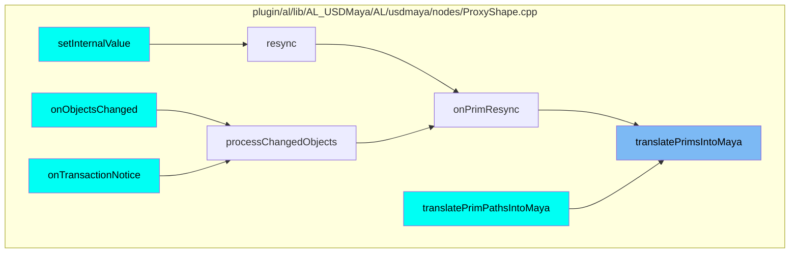
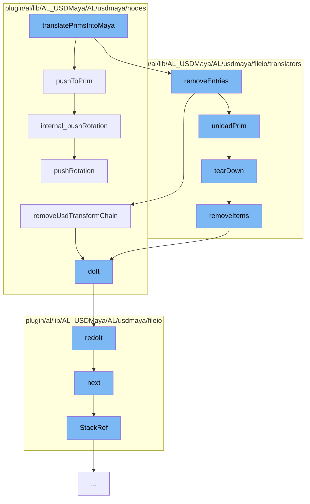

This document will cover the process of translating prims into Maya, which includes:

1. Pushing transformations to the prim
2. Removing entries from the translator context
3. Unloading the prim
4. Tearing down the translator test plugin
5. Removing items from the translator context
6. Exporting the data
7. Iterating over the transformations
8. Removing USD transform chains
9. Pushing rotation to the prim.

## Where is this flow used?

The flow starts with the function `translatePrimsIntoMaya`. It is called from multiple entry points as represented in the following diagram:



## The flow itself



<SwmSnippet path="/plugin/al/lib/AL_USDMaya/AL/usdmaya/nodes/TransformationMatrix.cpp" line="2121">

---

# Pushing transformations to the prim

The function `pushToPrim` is used to push transformations to the prim. It iterates over the transformation operations and applies the corresponding transformation to the prim.

```c++
//----------------------------------------------------------------------------------------------------------------------
void TransformationMatrix::pushToPrim()
{
    // if not yet intiaialised, do not execute this code! (It will crash!).
    if (!m_prim)
        return;
    TF_DEBUG(ALUSDMAYA_TRANSFORM_MATRIX).Msg("TransformationMatrix::pushToPrim\n");

    GfMatrix4d oldMatrix;
    bool       oldResetsStack;
    m_xform.GetLocalTransformation(&oldMatrix, &oldResetsStack, getTimeCode());

    auto opIt = m_orderedOps.begin();
    for (std::vector<UsdGeomXformOp>::iterator it = m_xformops.begin(), e = m_xformops.end();
         it != e;
         ++it, ++opIt) {
        UsdGeomXformOp& op = *it;
        switch (*opIt) {
        case kTranslate: {
            internal_pushVector(MPxTransformationMatrix::translationValue, op);
            m_translationFromUsd = MPxTransformationMatrix::translationValue;
```

---

</SwmSnippet>

<SwmSnippet path="/plugin/al/lib/AL_USDMaya/AL/usdmaya/fileio/translators/TranslatorContext.cpp" line="330">

---

# Removing entries from the translator context

The function `removeItems` is used to remove entries from the translator context. It iterates over the created nodes and deletes them.

```c++
//----------------------------------------------------------------------------------------------------------------------
void TranslatorContext::removeItems(const SdfPath& path)
{
    MProfilingScope profilerScope(
        _translatorContextProfilerCategory, MProfiler::kColorE_L3, "Remove items");

    TF_DEBUG(ALUSDMAYA_TRANSLATORS)
        .Msg("TranslatorContext::removeItems remove under primPath=%s\n", path.GetText());
    auto it = find(path);
    if (it != m_primMapping.end() && it->path() == path) {
        TF_DEBUG(ALUSDMAYA_TRANSLATORS)
            .Msg("TranslatorContext::removeItems removing path=%s\n", it->path().GetText());
        MDGModifier        modifier1;
        MDagModifier       modifier2;
        MObjectHandleArray tempXforms;
        MStatus            status;

        // Store the DAG nodes to delete in a vector which we will sort via their path length
        std::vector<std::pair<int, MObject>> dagNodesToDelete;

        auto& nodes = it->createdNodes();
```

---

</SwmSnippet>

<SwmSnippet path="/plugin/al/lib/AL_USDMaya/AL/usdmaya/fileio/translators/TranslatorTestPlugin.cpp" line="46">

---

# Unloading the prim

The function `tearDown` is used to unload the prim. It calls `removeItems` to remove items from the translator context.

```c++
//----------------------------------------------------------------------------------------------------------------------
MStatus TranslatorTestPlugin::tearDown(const SdfPath& path)
{
    context()->removeItems(path);
    return MStatus::kSuccess;
}
```

---

</SwmSnippet>

<SwmSnippet path="/plugin/al/lib/AL_USDMaya/AL/usdmaya/fileio/translators/TranslatorTestPlugin.cpp" line="46">

---

# Tearing down the translator test plugin

The function `tearDown` is used to tear down the translator test plugin. It calls `removeItems` to remove items from the translator context.

```c++
//----------------------------------------------------------------------------------------------------------------------
MStatus TranslatorTestPlugin::tearDown(const SdfPath& path)
{
    context()->removeItems(path);
    return MStatus::kSuccess;
}
```

---

</SwmSnippet>

<SwmSnippet path="/plugin/al/lib/AL_USDMaya/AL/usdmaya/fileio/translators/TranslatorContext.cpp" line="330">

---

# Removing items from the translator context

The function `removeItems` is used to remove items from the translator context. It iterates over the created nodes and deletes them.

```c++
//----------------------------------------------------------------------------------------------------------------------
void TranslatorContext::removeItems(const SdfPath& path)
{
    MProfilingScope profilerScope(
        _translatorContextProfilerCategory, MProfiler::kColorE_L3, "Remove items");

    TF_DEBUG(ALUSDMAYA_TRANSLATORS)
        .Msg("TranslatorContext::removeItems remove under primPath=%s\n", path.GetText());
    auto it = find(path);
    if (it != m_primMapping.end() && it->path() == path) {
        TF_DEBUG(ALUSDMAYA_TRANSLATORS)
            .Msg("TranslatorContext::removeItems removing path=%s\n", it->path().GetText());
        MDGModifier        modifier1;
        MDagModifier       modifier2;
        MObjectHandleArray tempXforms;
        MStatus            status;

        // Store the DAG nodes to delete in a vector which we will sort via their path length
        std::vector<std::pair<int, MObject>> dagNodesToDelete;

        auto& nodes = it->createdNodes();
```

---

</SwmSnippet>

<SwmSnippet path="/plugin/al/lib/AL_USDMaya/AL/usdmaya/fileio/Export.cpp" line="1019">

---

# Exporting the data

The function `doIt` is used to export the data. It sets up the parameters for the export and then calls `redoIt` to perform the export.

```c++
//----------------------------------------------------------------------------------------------------------------------
MStatus ExportCommand::doIt(const MArgList& args)
{
    maya::utils::OptionsParser parser;
    ExportTranslator::options().initParser(parser);
    m_params.m_parser = &parser;
    PluginTranslatorOptionsInstance pluginInstance(ExportTranslator::pluginContext());
    parser.setPluginOptionsContext(&pluginInstance);

    MStatus      status;
    MArgDatabase argData(syntax(), args, &status);
    AL_MAYA_CHECK_ERROR(status, "ALUSDExport: failed to match arguments");
    AL_MAYA_COMMAND_HELP(argData, g_helpText);

    // fetch filename and ensure it's valid
    if (!argData.isFlagSet("f", &status)) {
        MGlobal::displayError("ALUSDExport: \"file\" argument must be set");
        return MS::kFailure;
    }
    AL_MAYA_CHECK_ERROR(
        argData.getFlagArgument("f", 0, m_params.m_fileName),
```

---

</SwmSnippet>

<SwmSnippet path="/plugin/al/lib/AL_USDMaya/AL/usdmaya/fileio/TransformIterator.cpp" line="93">

---

# Iterating over the transformations

The function `next` is used to iterate over the transformations. It checks if the current prim is an instance and if not, it pushes the next child to the stack.

```c++
//----------------------------------------------------------------------------------------------------------------------
bool TransformIterator::next()
{
    if (done()) {
        return false;
    }
    do {
        StackRef& r = *(m_primStack.end() - 1);
        if (r.m_prim.IsInstance() && !m_stopOnInstance) {
            if (!m_stopOnInstance) {
                UsdPrim prototype = r.m_prim.GetPrototype();
                m_primStack.push_back(StackRef(prototype));
                m_visitedPrototypePrimPaths.insert(prototype.GetPath());
                StackRef& p = *(m_primStack.end() - 2);
                StackRef& c = *(m_primStack.end() - 1);
                c.m_object = p.m_object;
                next();
            }
            return !done();
        } else if (r.m_begin == r.m_end) {
            m_primStack.pop_back();
```

---

</SwmSnippet>

<SwmSnippet path="/plugin/al/lib/AL_USDMaya/AL/usdmaya/nodes/wrapProxyShape.cpp" line="341">

---

# Removing USD transform chains

The function `removeUsdTransformChain` is used to remove USD transform chains. It calls `removeUsdTransformChain` on the proxy shape and then performs the modifications.

```c++
    //------------------------------------------------------------------------------------------------------------------
    /// \brief  Python-wrappable version of ProxyShape::removeUsdTransformChain (that takes a
    /// UsdPrim object) \param  proxyShape the ProxyShape we're removing transforms from \param
    /// usdPrim the leaf node in the chain of transforms we wish to remove (same as for
    ///         ProxyShape::removeUsdTransformChain)
    /// \param  reason  the reason why this path is being removed. (same as for
    /// ProxyShape::removeUsdTransformChain)
    static void removeUsdTransformChain(
        ProxyShape&                 proxyShape,
        const UsdPrim&              usdPrim,
        ProxyShape::TransformReason reason = ProxyShape::kRequested)
    {
        MDagModifier modifier;
        proxyShape.removeUsdTransformChain(usdPrim, modifier, reason);
        modifier.doIt();
    }
```

---

</SwmSnippet>

<SwmSnippet path="/plugin/al/lib/AL_USDMaya/AL/usdmaya/nodes/TransformationMatrix.cpp" line="858">

---

# Pushing rotation to the prim

The function `pushRotation` is used to push rotation to the prim. It checks the type of the operation and applies the corresponding rotation to the prim.

```c++
//----------------------------------------------------------------------------------------------------------------------
bool TransformationMatrix::pushRotation(
    const MEulerRotation& value,
    UsdGeomXformOp&       op,
    UsdTimeCode           timeCode)
{
    TF_DEBUG(ALUSDMAYA_TRANSFORM_MATRIX)
        .Msg(
            "TransformationMatrix::pushRotation %f %f %f\n%s\n",
            value.x,
            value.y,
            value.z,
            op.GetOpName().GetText());

    if (timeCode.IsDefault() && op.GetNumTimeSamples()) {
        if (!hasEmptyDefaultValue(op, timeCode)) {
            return false;
        }
    }

    const double radToDeg = 180.0 / M_PI;
```

---

</SwmSnippet>

&nbsp;

_This is an auto-generated document by Swimm AI 🌊 and has not yet been verified by a human_

<SwmMeta version="3.0.0" repo-id="Z2l0aHViJTNBJTNBbWF5YS11c2QlM0ElM0FnaWxhZG5hdm90" repo-name="maya-usd"><sup>Powered by [Swimm](/)</sup></SwmMeta>
